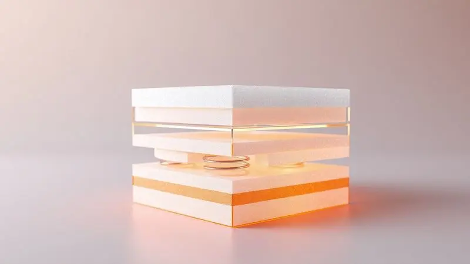
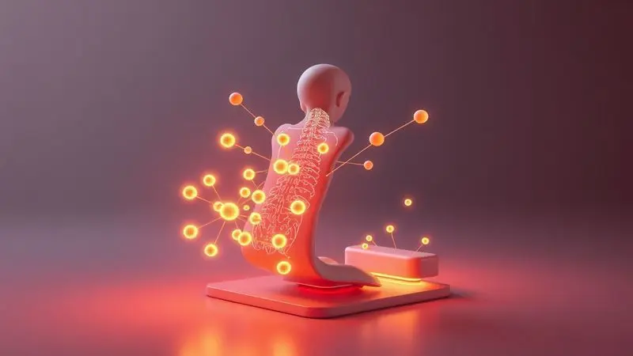
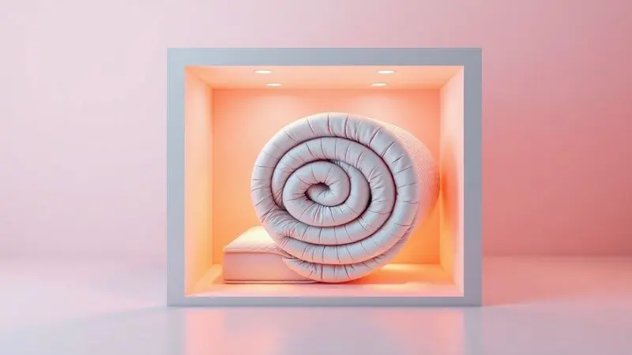

Escolher um colchão novo é como escolher um parceiro para suas noites nos próximos oito anos. Você quer alguém (ou algo) que entenda quando você chega cansado, que apoie nos dias difíceis e que não faça barulho quando você se mexe.

No mercado brasileiro, a BF Colchões emergiu com uma proposta ousada: tecnologia de ponta como as entregas a vácuo, aliada a preços que fazem você pensar duas vezes. Mas será que por trás do marketing existe um colchão que realmente transforma seu sono?

Nesta análise, vamos além das especificações técnicas - vamos sentir o que seria dormir em cada modelo, checar as certificações que garantem sua segurança e investigar a reputação real da marca.

Para que sua decisão seja baseada não apenas no que você lê, mas no que você pode realmente esperar sentir ao se deitar.

<SummaryList products={frontmatter.top_products} />

## Colchão BF é bom? Análise completa

Imagine comprar um colchão e descobrir que ele realmente entrega o que promete. Essa parece ser a experiência de muitos que optam pela BF.

Não se trata apenas de espumas de alta densidade ou de certificações técnicas - é sobre acordar sem aquela dor no lombar que acompanhava você há meses. É sobre deitar ao lado de alguém e não sentir seu movimento.

É sobre respirar durante a noite sem que alergias te acordem. A variedade de modelos não é apenas um catálogo, é um convite para encontrar a combinação exata de firmeza e maciez que seu corpo pede.

Sim, pode levar alguns dias para se adaptar - seu corpo está acostumado com velhos hábitos - mas quando a adaptação vem, ela transforma sua relação com o sono. É como se você finalmente descobrisse como realmente é dormir bem.

## Comparativo 2026 dos Colchões BF

Em 2026, a BF Colchões deixou de oferecer apenas produtos para oferecer soluções específicas para problemas reais. Não existe mais "o colchão BF", existem experiências diferentes para corpos diferentes, rotinas diferentes, necessidades diferentes.

É uma linha que parece entender que dormir bem é mais do que fechar os olhos - é recuperar energias, alinhar a postura, dissipar o estresse acumulado. E cada modelo nesta lista foi pensado como uma resposta personalizada.

### Colchão Infinity BF

<ProductBox 
  title={frontmatter.top_products[0].title} 
  image={frontmatter.top_products[0].image} 
  link={frontmatter.top_products[0].link} 
/>

Dividir a cama não precisa significar dividir seu sono. O Infinity Premium nasceu exatamente para casais que cansam de acordar toda vez que o parceiro se mexe para pegar um copo d'água.

Suas molas ensacadas trabalham de forma tão independente que você poderia pular de um lado da cama sem que o outro lado percebesse.

E quando falamos em conforto, imagine duas camadas de inteligência: a espuma viscoelástica da NASA que reconhece seu calor corporal e se molda como uma segunda pele, e a Max Flowing que responde instantaneamente ao seu peso, aliviando pontos de pressão em ombros e quadris como se dissesse "eu cuido de você".

O lado a considerar? Ele foi feito para ser apreciado apenas de um lado, como um bom vinho que você não quer misturar.

Mas se trocar o colchão de posição todo mês nunca fez parte da sua rotina, ele compensa essa "limitação" com um abraço que parece desenhado só para você.

<CaixaProsContras>

**Prós:**

- Ótimo conforto para diferentes posições de dormir.

- Molas ensacadas que reduzem movimentação.

- Espumas que aliviam pontos de pressão.

- Tecido hipoalergênico.

**Contras:**

- Uso de apenas um lado pode ser limitante.

- Não é ideal para quem prefere colchões firmes.

</CaixaProsContras>

### Colchão Sport Pro

<ProductBox 
  title={frontmatter.top_products[1].title} 
  image={frontmatter.top_products[1].image} 
  link={frontmatter.top_products[1].link} 
/>

Você treina duro. Seu corpo merece recuperar ainda mais. O Sport Pro não é apenas um colchão, é um parceiro de recuperação muscular.

Suas molas ensacadas PHP agem como terapeutas individuais para cada parte do seu corpo, enquanto a espuma HR D40 certificada oferece aquele suporte firme que atletas e pessoas ativas sabem valorizar.

Mas o verdadeiro diferencial está na tecnologia DeepZen®, que dissipa a eletricidade estática que nosso corpo acumula durante o dia - a mesma que pode sabotar seu sono profundo.

O revestimento em malha belga com fibras de carbono não é um detalhe estético, é um sistema que ajuda seu sangue a circular melhor enquanto você descansa, entregando oxigênio para músculos cansados.

Se seu objetivo é acordar pronto para outro round, este pode ser seu aliado secreto.

<CaixaProsContras>

**Prós:**

- Conforto ergonômico que alivia pontos de pressão.

- Tecnologia que auxilia na recuperação muscular.

- Materiais de alta qualidade garantindo durabilidade.

- Hipoalergênico, adequado para alérgicos.

**Contras:**

- O preço pode ser mais elevado em comparação com opções básicas.

- Não é tão macio quanto alguns usuários podem preferir.

</CaixaProsContras>

### Colchão Light Antistress

<ProductBox 
  title={frontmatter.top_products[2].title} 
  image={frontmatter.top_products[2].image} 
  link={frontmatter.top_products[2].link} 
/>

Quando o estresse do trabalho ou das responsabilidades parece grudar na sua pele e seguir você até a cama, o Light Antistress chega como um reset noturno. Ele não apenas dissipa eletricidade estática, ele parece dissipar a tensão acumulada nas suas costas e ombros.

As diferentes camadas de espuma trabalham em harmonia - algumas para suporte, outras para acolhimento, criando uma sensação de flutuação controlada.

Os tecidos com fios de carbono e a tecnologia Celliant® têm um propósito claro: melhorar sua circulação sanguínea enquanto você dorme, acelerando a recuperação não apenas física, mas mental.

É para quem sente que o descanso precisa ser mais do que horas de sono, precisa ser uma experiência reparadora que começa quando você fecha os olhos e só termina quando acorda revigorado.

<CaixaProsContras>

**Prós:**

- Tecnologias que promovem relaxamento e alívio do estresse.

- Melhora na circulação sanguínea.

- Conforto com diversas camadas de espuma.

- Opções de ventilação para um sono fresco.

**Contras:**

- Pode ter um custo mais elevado em comparação a colchões convencionais.

- A variedade de modelos pode gerar confusão na escolha.

</CaixaProsContras>

### Colchão Sensation

<ProductBox 
  title={frontmatter.top_products[3].title} 
  image={frontmatter.top_products[3].image} 
  link={frontmatter.top_products[3].link} 
/>

Algumas experiências são feitas para serem luxuosas. O Sensation entende isso e por isso oferece o que poucos colchões fazem: um pillow top que parece um abraço macio antes mesmo das espumas começarem seu trabalho.

Suas molas ensacadas garantem que cada movimento seja só seu, uma independência preciosa quando se divide a cama.

E sob essa primeira camada de suavidade, duas espumas trabalham em dueto perfeito: a HiperSoft® oferece conforto imediato que faz você suspirar ao deitar, e a Viscoelástica molda-se ao seu corpo, aliviando áreas críticas como ombros e quadril.

O tratamento hipoalergênico é a cereja do bolo, criando um ambiente onde você pode respirar livre, sem ácaros ou bactérias como convidados indesejados na sua noite de sono.

<CaixaProsContras>

**Prós:**

- Molas ensacadas que garantem independência de movimentos.

- Camadas de espuma de alta qualidade para conforto e suporte.

- Tratamento hipoalergênico, ideal para alérgicos.

- Disponível em diversos tamanhos, atendendo diferentes necessidades.

**Contras:**

- Uso em apenas um lado pode limitar a rotatividade.

- Não é embalado a vácuo, o que pode dificultar o transporte.

</CaixaProsContras>

### Colchão Power Sleep

<ProductBox 
  title={frontmatter.top_products[4].title} 
  image={frontmatter.top_products[4].image} 
  link={frontmatter.top_products[4].link} 
/>

Algumas pessoas buscam o equilíbrio perfeito: firmeza suficiente para apoiar, maciez suficiente para afundar. O Power Sleep domina essa arte.

Sua combinação de molas ensacadas com espuma D33 é como encontrar o ponto ideal onde seu corpo sente-se apoiado sem sentir-se sobre uma tábua.

Esta harmonia o tornou um dos mais vendidos da marca - as pessoas reconhecem quando um colchão não força uma escolha entre conforto e suporte.

Disponível em praticamente todos os tamanhos que você pode precisar, ele se adapta ao seu espaço, mas principalmente às suas expectativas. A ressalva fica para quem busca uma cama que abrace com intensidade: sua proposta é equilibrada, não exageradamente macia.

<CaixaProsContras>

**Prós:**

- Boa combinação de firmeza e conforto.

- Disponível em diversos tamanhos.

- Confeccionado com materiais de qualidade.

- Um dos modelos mais populares da BF Colchões.

**Contras:**

- Pode ser muito firme para quem prefere colchões macios.

- Sem opções de personalização de firmeza.

</CaixaProsContras>

### Colchão Astronasa

<ProductBox 
  title={frontmatter.top_products[5].title} 
  image={frontmatter.top_products[5].image} 
  link={frontmatter.top_products[5].link} 
/>

O nome já entrega a inspiração: tecnologia que parece saída de um laboratório espacial, aplicada ao seu descanso terrestre.

O Astronasa combina a precisão das molas ensacadas - que mantêm sua coluna alinhada como se estivesse sob orientação de um fisioterapeuta noturno - com o conforto da espuma viscoelástica que forma um pillow top generoso.

Para quem pesa até 130 kg, ele oferece suporte que não cede, uma firmeza intermediária que muitos descrevem como "confortavelmente firme".

O tratamento hipoalergênico transforma o colchão em um santuário para quem sofre com alergias, permitindo que você se concentre apenas em dormir, não em espirrar.

É para quem acredita que tecnologia avançada deve servir para melhorar até mesmo as horas em que estamos desconectados do mundo.

<CaixaProsContras>

**Prós:**

- Conforto com espuma viscoelástica que se adapta ao corpo.

- Molas ensacadas que garantem bom suporte e minimizam movimento.

- Disponível em diversos tamanhos, atendendo diferentes necessidades.

- Tratamento hipoalergênico, ideal para pessoas com alergias.

**Contras:**

- A firmeza pode não ser adequada para todos.

- Garantia de apenas 1 ano pode ser uma limitação em termos de durabilidade.

</CaixaProsContras>

### Colchão de espuma D33 e D45 a Vácuo

<ProductBox 
  title={frontmatter.top_products[6].title} 
  image={frontmatter.top_products[6].image} 
  link={frontmatter.top_products[6].link} 
/>

Imagine receber um colchão premium que chega numa caixa do tamanho de uma mala. É essa a magia da tecnologia a vácuo, que a BF domina com maestria.

Mas a mágica real está nas escolhas: o D33 (33 kg/m³) é seu aliado se você pesa até 100 kg, oferecendo um equilíbrio que nem sempre se encontra - maciez que acolhe, firmeza que sustenta.

Se você precisa de mais resistência ou prefere uma base mais sólida, o D45 (45 kg/m³) chega como um suporte extra que não cede, recomendado para quem passa dos 100 kg ou valoriza uma superfície mais determinada.

Ambos despertam da compactação como se nunca tivessem sido embalados, prontos para anos de serviço leal. A praticidade do transporte é apenas o começo da conveniência.

<CaixaProsContras>

**Prós:**

- Praticidade no transporte e armazenamento.

- Retorno rápido à forma original após desembrulho.

- Durabilidade superior do modelo D45.

- Variedade de densidades para diferentes perfis de peso.

**Contras:**

- O D45 pode ser considerado rígido demais para alguns usuários.

- O conforto do D33 pode não ser suficiente para quem prefere superfícies mais firmes.

</CaixaProsContras>

### Colchão Casal Espuma D28 a Vácuo Ortopédica Certificada

<ProductBox 
  title={frontmatter.top_products[7].title} 
  image={frontmatter.top_products[7].image} 
  link={frontmatter.top_products[7].link} 
/>

Há uma certa segurança em saber que seu colchão carrega uma certificação ortopédica. É como ter um aval de que sua coluna será cuidada enquanto você sonha.

Com densidade de 28 kg/m³, este modelo foi calibrado para pessoas até 90 kg, encontrando aquele ponto ideal onde firmeza e maciez se apertam as mãos e concordam em trabalhar juntas.

A embalagem a vácuo não é apenas uma facilidade logística, é uma solução para apartamentos com escadas estreitas ou para quem prefere a praticidade de montar seu próprio espaço de descanso.

E o tratamento antimicrobiano transforma cada noite em um ambiente limpo, onde ácaros e fungos não recebem convite para sua rotina de sono.

<CaixaProsContras>

**Prós:**

- Boa densidade que equilibra conforto e suporte.

- Facilita o transporte devido à embalagem a vácuo.

- Certificação ortopédica para melhor alinhamento da coluna.

- Tratamento antimicrobiano para um sono mais saudável.

**Contras:**

- Não é uma opção de baixo custo.

- Pode não ser ideal para pessoas acima de 90 kg.

</CaixaProsContras>

### Colchão Casal Molas Ensacadas Espuma Nasa Viscoelástica Ortopédico D33

<ProductBox 
  title={frontmatter.top_products[8].title} 
  image={frontmatter.top_products[8].image} 
  link={frontmatter.top_products[8].link} 
/>

Quando a NASA desenvolveu a espuma viscoelástica para amortecer o impacto dos astronautas durante as aterrissagens, provavelmente não imaginou que um dia ela abraçaria pessoas comuns em suas camas.

Este colchão leva essa herança a sério, combinando-a com molas ensacadas que funcionam como uma orquestra - cada instrumento toca sua parte, sem atrapalhar os outros. O resultado? Você vira para um lado, seu parceiro continua imóvel do outro.

A espuna não apenas se adapta ao calor do seu corpo, ela parece memorizar seus contornos, aliviando pontos de pressão que você nem sabia que existiam.

A certificação D33 não é um selo qualquer, é a garantia de que esse suporte ortopédico vai durar tanto quanto sua necessidade por boas noites de sono.

<CaixaProsContras>

**Prós:**

- Molas ensacadas que oferecem independência de movimento.

- Espuma viscoelástica que se adapta ao corpo.

- Suporte ortopédico e alívio de pressão.

- Certificações que garantem qualidade e segurança.

**Contras:**

- Pode não ser adequado para quem prefere colchões muito macios.

- A variedade de modelos pode ser confusa na hora da escolha.

</CaixaProsContras>

### Colchão Casal Ortopédico Sleep Extra Firme

<ProductBox 
  title={frontmatter.top_products[9].title} 
  image={frontmatter.top_products[9].image} 
  link={frontmatter.top_products[9].link} 
/>

Há quem não queja negociar quando o assunto é firmeza. Para essas pessoas, o Sleep Extra Firme não é uma opção, é a resposta.

Com densidades D28 ou D45, ele não faz concessões ao conforto excessivo - ele entrega exatamente o que promete: uma base sólida que mantém sua coluna alinhada como se estivesse sob vigilância constante.

Suportando até 130 kg na versão D45, ele é feito para quem sabe que manter a postura correta durante o sono não é um luxo, é uma necessidade. O tecido tratado contra ácaros e bactérias completa o pacote, oferecendo higiene que combina com a determinação do suporte.

Se você procura algo que não ceda nem sob pressão, encontrou seu candidato.

<CaixaProsContras>

**Prós:**

- Suporte ortopédico ideal para alinhamento da coluna.

- Opções de densidade D28 e D45 que atendem diferentes necessidades.

- Tecido tratado, hipoalergênico e antiácaro para maior higiene.

- Durabilidade garantida pela qualidade da marca BF Colchões.

**Contras:**

- Pode ser rígido demais para quem prefere um colchão mais macio.

- O peso máximo permitido pode ser um limite para algumas pessoas.

</CaixaProsContras>

## Por que o colchão BF é confiável? O segredo revelado

A confiança em uma marca de colchões não nasce de campanhas publicitárias, mas de decisões materiais que você sente toda noite. A BF constrói essa confiança camada por camada, começando por materiais que entendem que um colchão deve ser um aliado da sua saúde postural.

Mas vai além: tecnologias que regulam a temperatura não são apenas "bom ter", são a diferença entre uma noite de sono contínuo e acordar suando. Investir em sistemas antiácaro e antibacterianos não é um detalhe técnico, é um compromisso com sua saúde respiratória.

Quando os usuários falam em durabilidade, estão falando de um produto que não abandona suas responsabilidades depois de alguns anos, que continua oferecendo suporte quando seu corpo mais precisa.

Essa consistência é o verdadeiro segredo, aquele que não cabe em um slogan, mas que cabe perfeitamente em anos de noites bem dormidas.

## Certificações e Qualidade da BF Colchões

Um selo de certificação em um colchão é mais do que um adesivo, é uma promessa em forma de documento. A BF Colchões entende que essas certificações são a tradução técnica da segurança que você procura quando se deita.

Testes de resistência não são realizados apenas para cumprir normas, mas para garantir que o colchão suportará não apenas seu peso, mas seus momentos de tensão, seus dias difíceis, seus anos de uso constante.

Materiais não tóxicos significam que você pode respirar fundo em todos os sentuntos - literalmente. Essa obsessão por padrões não aparece nas propagandas como um grande diferencial, porque para a BF não é um diferencial, é o mínimo.

É a base sobre a qual constroem algo em que você possa realmente confitar seus oito anos de noites.

## BF Colchões no Reclame Aqui

Pesquisar uma marca no Reclame Aqui é como ler o diário de seus relacionamentos anteriores. As reclamações mostram como a empresa reage sob pressão, e as respostas revelam seu caráter institucional.

No caso da BF, o que se destaca não é a ausência de problemas - toda empresa que vende milhares de unidades terá casos pontuais - mas a consistência nas soluções.

Um índice de resposta elevado não é apenas uma estatística, é um compromisso de que sua voz será ouvida caso algo não saia como planejado. Analisar essas interações oferece algo raro: transparência.

Você vê não apenas o produto final, mas a estrutura que o sustenta quando as coisas dão certo e, mais importante, quando precisam ser ajustadas.

## FAQ: Perguntas frequentes sobre a BF Colchões

As dúvidas que surgem quando estamos prestes a investir em um colchão são quase universais. Elas misturam medos práticos ("vai durar?") com expectativas emocionais ("vou me sentir bem?").

Essa seção existe para traduzir as especificações técnicas em respostas humanas, para que você tome sua decisão não apenas com dados, mas com compreensão.

### Colchão BF é bom para coluna?

Um colchão bom para a coluna é aquele que desaparece. Soa estranho, mas pense: quando a dor aparece, você percebe o colchão. Quando a dor some, você percebe apenas o descanso.

Os colchões BF são projetados para esse desaparecimento ativo - suas camadas de espuma se distribuem sob seu peso de forma inteligente, aliviando pontos de pressão que podem se transformar em dores matinais.

Quando combinado com um travesseiro que complemente esse trabalho, o resultado é um alinhamento que seu corpo registra não como uma conquista, mas como um estado natural.

É claro que cada corpo tem suas preferências, por isso a experiência pessoal continua sendo o melhor teste - seu corpo sabe o que parece certo antes mesmo que sua mente possa explicar.

### Quanto tempo dura um colchão BF?

Imagine comprar algo hoje que ainda terá um lugar em sua vida daqui a uma década. Os colchões BF são projetados para essa jornada longa, com uma expectativa de vida entre 8 e 10 anos. Mas esses números são apenas o quadro - o preenchimento depende de você.

Seu peso, seus cuidados (ou a falta deles), até mesmo como você se move durante o sono influenciam nessa equação.

O sinal mais claro de que está na hora de considerar uma troca não é um rasgo no tecido, mas uma sensação sutil: o conforto que antes era automático agora requer ajustes, o suporte que antes era certo agora parece negociar.

Seguir as orientações de limpeza e uso não é apenas seguir um manual, é prolongar um relacionamento que vale a pena manter.

### BF Colchões tem garantia?

Sim, e essa garantia funciona como um testemunho silencioso da confiança da marca em seus próprios produtos.

Geralmente estendendo-se por até 10 anos dependendo do modelo, ela não é apenas um protocolo de atendimento, é um compromisso de que o investimento que você faz hoje terá retorno por anos.

Verificar as especificações da garantia antes da compra é como ler as regras de um jogo que você vai jogar por muito tempo - você quer saber que tem suporte caso encontre uma situação inesperada.

É a promessa de que a BF não termina sua relação com você na entrega, ela continua enquanto o colchão cumpre seu propósito em sua vida.

### Colchão à vácuo BF é bom?

A pergunta mais interessante sobre os colchões a vácuo BF não é se são bons, mas como algo tão compacto pode transformar-se em algo tão eficiente.

A resposta está na tecnologia que permite que as espumas de alta densidade "lembrem" sua forma original após anos de pesquisa e desenvolvimento.

O resultado é prático para quem mora em espaços com escadas estreitas ou para quem quer a conveniência de montar o próprio quarto, mas também é emocional: há algo satisfatório em ver um colchão premium surgir de uma caixa compacta, como uma transformação que antecipa a transformação que ele trará ao seu sono.

Claro, adaptação varia como em qualquer colchão, mas a experiência de desempacotar é apenas o primeiro capítulo de uma história de conforto que vai durar anos.

## Conclusão

Ao final desta jornada pelos colchões BF, ficam não apenas especificações técnicas, mas impressões sensoriais. A tecnologia a vácuo que democratiza o acesso a colchões premium.

As molas ensacadas que transformam compartilhar a cama em uma experiência de independência respeitosa. As espumas que parecem entender a geometria única do seu corpo.

A BF não vende apenas produtos, vende soluções para problemas reais que você nem sempre consegue nomear, mas que sente todas as manhãs ao acordar.

A análise no Reclame Aqui mostra uma empresa que sabe que bons produtos precisam de um bom suporte pós-venda, e as certificações revelam um compromisso com padrões que ultrapassam o básico exigido.

Quando você considera todos esses aspectos juntos, percebe que a pergunta não é mais "o colchão BF é bom?", mas "qual colchão BF é bom para o que meu corpo pede?".

Se você está buscando mais do que apenas um lugar para deitar, se procura um parceiro noturno que entenda que dormir bem é a base para viver bem, a linha BF oferece opções que conversam com diferentes necessidades, diferentes corpos, diferentes expectativas.

O próximo passo? Escolher o modelo que parece criar uma conversa com suas necessidades específicas, lembrando que o melhor colchão não é o mais caro ou o mais tecnológico, mas aquele que faz você esquecer que está em um colchão e simplesmente permite que você descanse.