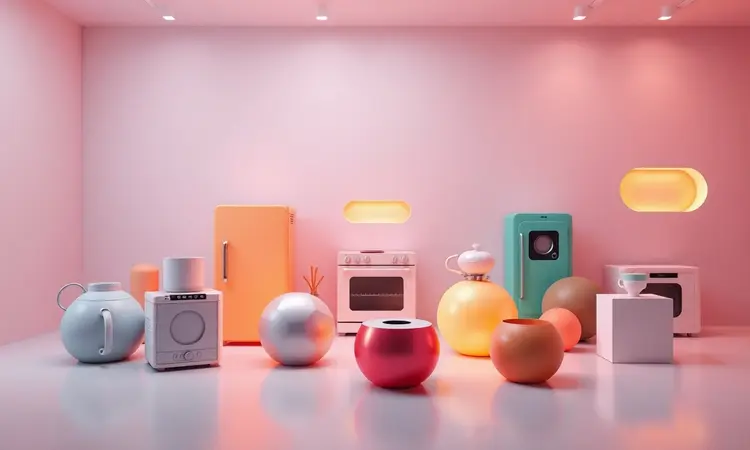

Quando você busca uma fritadeira elétrica com bom custo-benefício, a Amvox aparece frequentemente nas prateleiras e lojas online. Mas será que a Air Fryer Amvox é boa de verdade?

Com presença sólida no mercado brasileiro desde 2003, a marca sediada em Camaçari oferece desde modelos compactos até as espaçosas versões Oven.

Neste guia, vamos analisar detalhadamente a reputação da empresa, a qualidade de seus materiais e os principais modelos disponíveis para que você possa decidir se o investimento vale a pena para sua rotina na cozinha.

<SummaryList products={frontmatter.top_products} />

## Sobre a marca Amvox: História e mercado

A Amvox se consolidou como uma marca brasileira de referência no segmento de eletrodomésticos, especialmente nas fritadeiras elétricas tipo air fryer.

A empresa nasceu com um propósito claro: oferecer produtos de qualidade a preços acessíveis, conquistando consumidores que buscam uma alimentação mais saudável sem abrir mão do sabor.

Ao longo dos anos, ampliou seu portfólio incluindo outros eletroportáteis que facilitam o dia a dia na cozinha. Esse compromisso com inovação e praticidade faz da Amvox uma opção viável para famílias que desejam adotar um estilo de vida mais saudável e eficiente.

## A marca Amvox é confiável? Reputação no Reclame Aqui

Confiança é fundamental ao investir em qualquer eletrodoméstico. Ao analisar a reputação da Amvox no Reclame Aqui, encontramos um cenário realista: há reclamações sobre qualidade de produtos e atendimento, algo comum em qualquer marca com grande volume de vendas.

O que realmente importa é como a empresa responde. A Amvox geralmente assume as questões apresentadas pelos consumidores e busca resolvê-las, demonstrando compromisso com a satisfação do cliente.

Isso transforma a marca em uma opção confiável, especialmente quando você pesquisa e escolhe o modelo que melhor atende suas necessidades específicas.

## Análise dos principais modelos de Air Fryer Amvox

A diversidade de opções é uma das maiores vantagens da Amvox. A marca oferece modelos que vão desde os compactos até verdadeiras centrais culinárias multifuncionais.

Essa variedade permite que cada pessoa encontre a air fryer perfeita para sua realidade, seja você solteiro, more em casal ou tenha uma família grande.

### 1. Fritadeira Elétrica Amvox ARF 1205 (4,5L)

<ProductBox 
  title={frontmatter.top_products[0].title} 
  image={frontmatter.top_products[0].image} 
  link={frontmatter.top_products[0].link} 
/>

Ideal para quem quer começar no mundo das fritadeiras a ar sem comprometer espaço na bancada. Com 4,5 litros de capacidade, ela acomoda batatas fritas para 3 ou 4 pessoas tranquilamente.

Os 1400W de potência garantem que seus alimentos fiquem crocantes rapidamente, enquanto o controle de temperatura ajustável entre 80°C e 200°C permite desde descongelar suavemente até alcançar aquele ponto dourado perfeito.

O timer de 30 minutos com desligamento automático dá aquela segurança extra para quem sempre esquece coisas no forno. E a melhor parte? O cesto removível em aço inox com superfície antiaderente torna a limpeza tão simples quanto lavar uma tigela.

A alça antitérmica evita sustos desnecessários, embora o peso de cerca de 4 kg exija um pouco mais de força na hora de manusear.

<CaixaProsContras>

**Prós:**

- Grande capacidade de 4,5 litros.

- Controle de temperatura ajustável.

- Timer com desligamento automático.

- Cesto removível em aço inox para fácil limpeza.

**Contras:**

- Peso de 4,05 kg pode ser um pouco pesado para alguns.

- Funcionalidades básicas em relação a modelos mais avançados.

</CaixaProsContras>

### 2. Fritadeira Elétrica Amvox ARF 1250 (5,5L)

<ProductBox 
  title={frontmatter.top_products[1].title} 
  image={frontmatter.top_products[1].image} 
  link={frontmatter.top_products[1].link} 
/>

Imagine poder preparar um frango inteiro ou porções generosas de batata para a família toda. Com 5,5 litros de capacidade, este modelo transforma esse cenário em realidade.

Os mesmos 1400W de potência trabalham com o sistema Turbo Cyclo, que circula o ar quente de forma eficiente para garantir que cada pedaço fique igualmente crocante.

O visor transparente é um diferencial inteligente. Você pode espiar como está o cozimento sem interromper o processo e sem perder calor, mantendo a eficiência energética.

A estrutura "cool touch" é uma verdadeira tranquilidade para quem tem crianças ou animais em casa, evitando acidentes por queimaduras. A limpeza continua sendo simples com o cesto removível, embora os 3,8 kg ainda exijam certa força no manuseio.

<CaixaProsContras>

**Prós:**

- Capacidade ampla de 5,5 litros

- Controle de temperatura ajustável

- Visor transparente para monitoramento

- Cesto removível e fácil de limpar

**Contras:**

- Peso relativamente alto (3,8 kg)

- Voltagem disponível apenas em 110V ou 220V

</CaixaProsContras>

### 3. Amvox Air Fryer ARF 1222 Oven (12L)

<ProductBox 
  title={frontmatter.top_products[2].title} 
  image={frontmatter.top_products[2].image} 
  link={frontmatter.top_products[2].link} 
/>

Esta não é apenas uma air fryer. É uma verdadeira central culinária que substitui vários eletroportáteis na sua cozinha.

Com impressionantes 12 litros de capacidade, ela comporta refeições completas para famílias numerosas ou para quem gosta de preparar comida para a semana toda de uma vez.

O painel digital com 8 funções pré-programadas elimina adivinhações. Basta selecionar o que está preparando, e o aparelho ajusta temperatura e tempo automaticamente. Assar pães, desidratar frutas, grelhar carnes.

Tudo em um único equipamento que economiza espaço e simplifica sua rotina. A porta transparente mantém a magia de ver a transformação dos alimentos, enquanto os 1700W de potência garantem eficiême.

<CaixaProsContras>

**Prós:**

- Capacidade de 12 litros, ideal para refeições em família.

- Diversidade de funções (fritar, assar e desidratar).

- Painel digital com facilidade de uso.

- Sistema de circulação de ar que garante alimentos crocantes.

**Contras:**

- Assistência técnica pode ser difícil de acessar.

- Grades podem parecer menos robustas.

</CaixaProsContras>

### 4. Amvox Air Fryer ARF 1255 (7L)

<ProductBox 
  title={frontmatter.top_products[3].title} 
  image={frontmatter.top_products[3].image} 
  link={frontmatter.top_products[3].link} 
/>

Perfeita para famílias que adoram receber visitas ou para quem prefere cozinhar em maior quantidade. Com 7 litros de capacidade, ela oferece o equilíbrio ideal entre tamanho generoso e praticidade no armazenamento.

Os 1700W de potência significam menos tempo esperando e mais tempo saboreando.

O timer de até 60 minutos é generoso o suficiente para preparações mais demoradas, enquanto o desligamento automático funciona como seu assistente pessoal de segurança. O design moderno não é apenas estética.

Ele reflete a funcionalidade inteligente de um aparelho que se integra perfeitamente à sua cozinha, com controles intuitivos que qualquer pessoa da família consegue operar.

<CaixaProsContras>

**Prós:**

- Grande capacidade de 7 litros, ideal para cozinhar em família.

- Potência de 1700W para um preparo mais rápido.

- Design moderno que combina com diversas cozinhas.

- Cesto antiaderente e removível que facilita a limpeza.

**Contras:**

- Manual de instruções pode ser pouco claro.

- O preço pode ser um ponto a ser considerado, mas é justificado pela qualidade e recursos oferecidos.

</CaixaProsContras>

### 5. Air Fryer Amvox ARF 1150 Reverse

<ProductBox 
  title={frontmatter.top_products[4].title} 
  image={frontmatter.top_products[4].image} 
  link={frontmatter.top_products[4].link} 
/>

Para quem ama versatilidade, este modelo é um verdadeiro dois em um. Além de funcionar como air fryer convencional, ele se transforma em um fogão elétrico prático.

Imagine poder fritar batatas e logo em seguida aquecer um molho sem precisar trocar de panela ou sujar outro eletroportátil.

O cesto de vidro removível é uma experiência diferente. Você vê cada etapa do cozimento, observando as transformações de cor e textura que normalmente ficam escondidas.

Essa transparência também ajuda a evitar abrir o aparelho desnecessariamente, mantendo a temperatura estável e o consumo eficiente de energia. A tecnologia antiaderente transforma a limpeza em uma tarefa de segundos.

<CaixaProsContras>

**Prós:**

- Design 2 em 1 que combina Air Fryer e fogão elétrico.

- Cesto de vidro removível para fácil acompanhamento do cozimento.

- Tecnologia antiaderente que facilita a limpeza.

- Segurança com desligamento automático e timer.

**Contras:**

- Pode ocupar um espaço considerável na bancada.

- A capacidade de 5 litros pode ser insuficiente para grandes famílias.

</CaixaProsContras>

## Por que escolher uma Air Fryer da marca Amvox?

Escolher uma air fryer da Amvox significa investir em praticidade inteligente. A marca conseguiu algo raro: unir tecnologia confiável com design contemporâneo a preços que não assustam.

O resultado são aparelhos que transformam a preparação de refeições em algo mais saudável, utilizando até 80% menos óleo que as frituras tradicionais, mas mantendo aquela crocância que todo mundo ama.

A multifuncionalidade é outro grande trunfo. Não se trata apenas de fritar. São aparelhos que assam, grelham, descongelam e até desidratam, substituindo vários eletroportáteis por um só. Essa versatilidade economiza espaço na bancada e dinheiro no longo prazo.

Para quem busca otimizar tempo na cozinha sem abrir mão do sabor, a Amvox oferece soluções que realmente fazem diferença no dia a dia.

## Manutenção e cuidados com a sua Air Fryer Amvox

Manter sua air fryer funcionando perfeitamente por anos é mais simples do que parece. A limpeza regular após cada uso com água e sabão neutro mantém o revestimento antiaderente intacto.

Evite produtos abrasivos que podem criar micro-ranhuras onde os alimentos grudam no futuro. Uma verificação periódica no cabo e plugue previne problemas elétricos antes que aconteçam.

### Garantia e assistência técnica Amvox

A Amvox oferece garantia padrão de um ano, período suficiente para você testar a fundo a durabilidade e desempenho do equipamento. A marca mantém uma rede de assistência técnica que facilita o acesso ao suporte quando necessário.

Manter o manual do produto em local acessível e registrar a compra são passos simples que garantem tranquilidade. Saber que há suporte disponível transforma o ato de comprar em uma decisão mais segura.

## O que dizem os consumidores: Vale a pena o investimento?

A voz dos consumidores é unânime em um ponto: as air fryers Amvox entregam o que prometem. As avaliações destacam consistentemente a eficiência na preparação de alimentos com menos gordura, resultando em uma sensação de bem-estar após as refeições.

A praticidade é mencionada como revolucionária para quem tem rotinas agitadas. Preparar um jantar completo em minutos, sem precisar ficar vigiando uma panela com óleo quente, muda a dinâmica da cozinha.

O design moderno não é apenas bonito. É funcional, integrando-se naturalmente ao ambiente.

Alguns mencionam uma curva de aprendizado para explorar todas as funcionalidades, mas essa jornada de descoberta se transforma em empolgação à medida que novas possibilidades culinárias se revelam.

As eventuais dificuldades iniciais são largamente superadas pelos benefícios duradouros.

## Conclusão

Diante de tudo o que analisamos, a resposta é clara: sim, a Air Fryer Amvox é uma excelente escolha para quem busca praticidade, saúde e economia sem abrir mão da qualidade.

Desde sua reputação consolidada no mercado brasileiro até a variedade de modelos que atendem diferentes realidades familiares, a marca demonstra um entendimento real das necessidades dos consumidores.

O que realmente diferencia a Amvox é sua capacidade de entregar tecnologia confiável a preços acessíveis.

Seja optando pelo modelo compacto de 4,5 litros para começar, ou investindo na versão Oven de 12 litros que funciona como uma verdadeira cozinha portátil, você está adquirindo mais que um eletrodoméstico.

Está trazendo para casa uma ferramenta que transforma a rotina alimentar, oferecendo refeições mais saudáveis sem sacrificar o prazer de comer bem.

A garantia de um ano e a rede de assistência técnica oferecem a tranquilidade necessária para esse investimento. E quando você vê alimentos crocantes saindo do aparelho com uma fração do óleo tradicional, percebe que o valor vai muito além do preço pago.

Para transformar sua relação com a cozinha e descobrir como é possível comer melhor com menos trabalho, a Amvox se mostra uma parceira confiável na jornada rumo a uma alimentação mais consciente e saborosa.