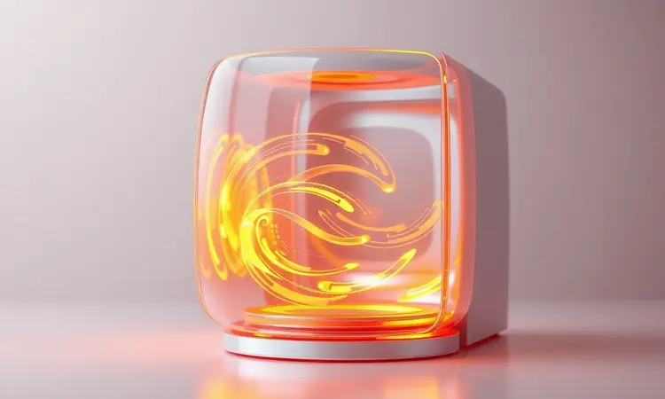
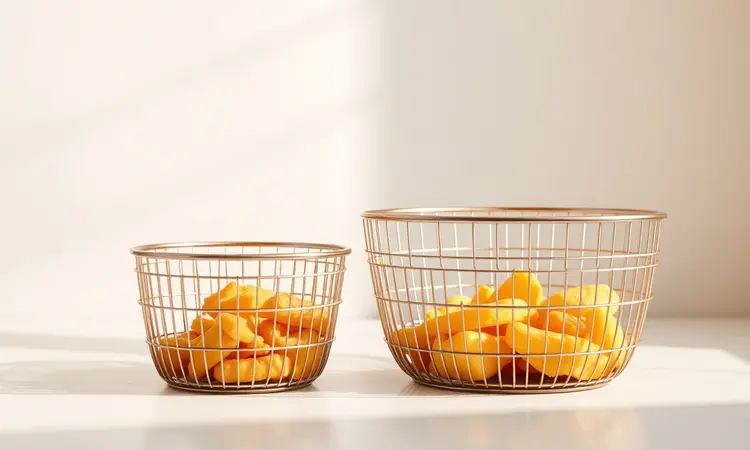
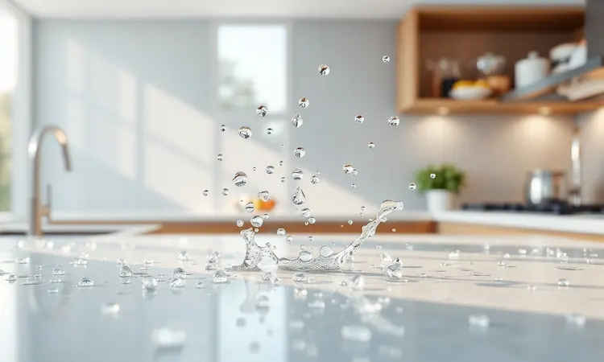

Você já percebeu que encontrar a fritadeira elétrica ideal pode ser um desafio diante de tantas opções no mercado? Se busca aliar saúde, praticidade e a confiança de uma marca tradicional, as Air Fryers da Arno certamente estão no seu radar.

Este guia vai além de listar especificações técnicas. Vamos te mostrar como cada modelo pode transformar seu dia a dia, desde as versões compactas para quem mora sozinho até os gigantes familiares que viram o centro das reuniões.

Prepare-se para descobrir não apenas potência e capacidade, mas como essa tecnologia pode tornar sua relação com a cozinha mais leve, saudável e, acima de tudo, prazerosa.

<SummaryList products={frontmatter.top_products} />

## Por que escolher uma Air Fryer Arno? Tradição e Tecnologia

Imagine unir a confiança de décadas de experiência em eletrodomésticos com a inovação que seu estilo de vida atual exige. É exatamente isso que a Air Fryer Arno oferece.

Mais do que um aparelho, ela representa uma mudança de mentalidade na cozinha, substituindo a fritura tradicional pesada por um método que usa até 80% menos óleo. O resultado?

Alimentos que mantêm aquele crocante irresistível por fora e a suculência por dentro, mas sem aquela sensação de culpa ou peso depois da refeição. É tecnologia a serviço do seu bem-estar.

### Diferenciais da tecnologia de circulação de ar quente da Arno

O segredo está em como o calor é distribuído. Enquanto um forno comum deixa pontos quentes e frios, o sistema exclusivo da Arno funciona como um redemoinho de ar quente que envolve cada pedaço de alimento com a mesma intensidade.

Pense em como isso muda tudo: batatas fritas uniformemente douradas, coxinhas crocantes em toda a superfície e até legumes que mantêm suas vitaminas porque não ficam encharcados em óleo. Essa eficiência não é apenas sobre saúde, é sobre economia de tempo.

O cozimento rápido e a facilidade de limpar peças removíveis na lava-louças significam que você ganha minutos preciosos no seu dia, minutos que podem virar um cafezinho a mais ou uma conversa extra com a família.

## Análise dos Melhores Modelos de Air Fryer Arno

Agora que você entende o 'porquê', vamos ao 'qual'. Cada modelo Arno foi pensado para um perfil diferente de cozinheiro. Analisamos potência, design e funcionalidades para que você encontre não apenas um eletrodoméstico, mas um parceiro na sua rotina alimentar.

### Fritadeira Air Fryer Arno Easy Fry Turbo 6L (AFI6) - O Melhor Custo-Benefício

<ProductBox 
  title={frontmatter.top_products[0].title} 
  image={frontmatter.top_products[0].image} 
  link={frontmatter.top_products[0].link} 
/>

Para quem não quer abrir mão de espaço mas precisa de um investimento inteligente, a Easy Fry Turbo 6L é a resposta. Seus 6 litros de capacidade são o ponto ideal para uma família média ou para quem adora receber visitas.

A tecnologia Direct Heat é o grande trunfo: ela elimina a etapa de pré-aquecimento, então você coloca os alimentos, ajusta o timer e em minutos já sente aquele cheirinho de comida pronta.

O cesto com compartimento para água é um detalhe genial que evita aquela fumaça chata e mantém carnes mais suculentas. Com 12 programas automáticos, desde batatas até bolos, fica difícil errar. Apenas fique atento à voltagem na hora da compra, pois ela não é bivolt.

Se isso se ajusta à sua tomada, você terá em casa uma fritadeira que entrega performance de modelos mais caros por um preço que cabe no orçamento.

### Fritadeira Air Fryer Arno Airfry & Grill Expert 6,5L (AFD6) - A Versatilidade com Grill

<ProductBox 
  title={frontmatter.top_products[1].title} 
  image={frontmatter.top_products[1].image} 
  link={frontmatter.top_products[1].link} 
/>

Algumas pessoas não querem apenas fritar sem óleo, querem expandir as possibilidades da cozinha. Para elas, a Airfry & Grill Expert 6,5L é como ter um restaurante em casa.

A função grill integrada transforma o aparelho: um dia você faz batatas fritas crocantes, no outro grelha picanhas perfeitas com aquelas marquinhas características, tudo no mesmo eletrodoméstico.

A tecnologia Extra Crocância eleva o padrão, garantindo que cada alimento tenha aquela textura de restaurante. Os programas automáticos são tão intuitivos que até quem tem medo de panelas se sente um chef.

É verdade que ela exige um cantinho generoso na bancada, mas quando você descobre que pode fazer um jantar completo sem sujar vários utensílios, o espaço ocupado passa a ser visto como um investimento em praticidade.

### Fritadeira Air Fryer Arno Mega Digital 7,5L (AFD7) - Ideal para Famílias Grandes

<ProductBox 
  title={frontmatter.top_products[2].title} 
  image={frontmatter.top_products[2].image} 
  link={frontmatter.top_products[2].link} 
/>

Quando a casa está sempre cheia, cozinhar em pequenas levas é inviável. A Mega Digital 7,5L resolve isso servindo até 8 pessoas de uma só vez, o equivalente a um assado de domingo inteiro ou a porções generosas de petiscos para um jogo de futebol.

Com 1700W de potência, a tecnologia Hot Air trabalha rápido, mesmo com grandes quantidades. O painel digital oferece controle preciso, com 8 programas que vão desde descongelar até assar, e a faixa de temperatura de 40°C a 200°C permite até iogurtes e desidratar frutas.

Assim como a irmã Turbo, ela não é bivolt, então escolha sua voltagem com cuidado. A recompensa é uma máquina que combina a robustez necessária para o dia a dia agitado de uma família grande com um design moderno que não fica escondido no armário.

### Fritadeira Air Fryer Arno Dual 8,3L (AFD2) - Tecnologia de Cestos Independentes

<ProductBox 
  title={frontmatter.top_products[3].title} 
  image={frontmatter.top_products[3].image} 
  link={frontmatter.top_products[3].link} 
/>

Multitarefa é o sobrenome desta fritadeira. Com dois cestos independentes (5,2L e 3,1L), ela permite uma façanha que mudará sua rotina: preparar dois pratos diferentes ao mesmo tempo.

Enquanto as batatas fritam em um lado, os nuggets das crianças ficam prontos no outro, ou você pode assar legumes em uma cesta e proteínas na outra, montando um prato completo em uma única sessão.

O sistema de circulação de ar quente atua separadamente em cada compartimento, então não há risco de misturar sabores. O painel digital gerencia ambas as operações com funções pré-programadas que simplificam o processo.

Sim, ela é a rainha do espaço na bancada, mas para quem valoriza tempo e quer reduzir o período entre colocar a comida e sentar à mesa, essa é uma troca mais que justa.

### Fritadeira Air Fryer Arno Easy Fry Extra Compacta (AFP4)

<ProductBox 
  title={frontmatter.top_products[4].title} 
  image={frontmatter.top_products[4].image} 
  link={frontmatter.top_products[4].link} 
/>

Nem todo mundo tem uma cozinha espaçosa ou precisa alimentar uma multidão. Para apartamentos compactos, solteiros ou casais, a Easy Fry Extra Compacta prova que tamanho não é documento.

Com 4 litros, ela prepara porções perfeitamente equilibradas: 1kg de batatas para um lanche especial ou 30 asinhas de frango para um jantar íntimo. A tecnologia Extra Crocância funciona igualmente bem aqui, entregando a mesma qualidade dos modelos maiores.

A potência varia para atender diferentes necessidades energéticas, e o painel digital com 10 funções tira o trabalho de adivinhar configurações.

A verdadeira vantagem vai além do tamanho: sua eficiência energética pode reduzir significativamente o consumo comparado a ligar um forno convencional só para assar algumas batatas, uma economia que você sente no bolso ao longo dos meses.

## Como Escolher a Air Fryer Arno Ideal: Critérios de Compra

Com tantas opções excelentes, a decisão final depende de como você vive. Vamos além das especificações técnicas para conectar números ao seu cotidiano real.

### Capacidade em Litros: Do Individual ao Familiar

Pense nas suas refeições típicas. Se você geralmente cozinha para si mesmo ou para mais uma pessoa, modelos de 2 a 4 litros evitam o desperdício de energia e comida, além de serem mais fáceis de guardar.

Agora, se sua casa é ponto de encontro ou sua família é numerosa, saltar para os 6 litros ou mais transforma a air fryer na protagonista das refeições principais.

A capacidade certa não é sobre litros, é sobre não precisar fazer duas ou três levas para alimentar todo mundo, economizando seu tempo e paciência.

### Painel Digital vs. Controle Mecânico: Qual vale mais a pena?

Essa escolha reflete sua personalidade na cozinha. O painel digital é para quem ama precisão e conveniência: toques sutis ajustam temperatura e tempo, programas pré-definidos garantem resultados perfeitos sem cálculos, e o display claro elimina adivinhações.

Já o controle mecânico, comum nos modelos mais básicos, fala com quem prioriza simplicidade e durabilidade. É robusto, intuitivo (gire o botão e pronto) e tem menos componentes que possam apresentar problemas.

Não existe opção errada, apenas a que melhor se alinha com como você quer interagir com o aparelho todos os dias.

### Acabamento em Inox vs. Plástico: Durabilidade e Design

O inox brilhante não é apenas estética. Ele resiste melhor aos arranhões do dia a dia, ao calor das proximidades do fogão e mantém uma aparência nova por mais tempo, integrando-se a cozinhas modernas ou industriais.

O plástico, por outro lado, oferece leveza para movimentar o aparelho com facilidade e costuma representar uma entrada mais acessível no mundo das air fryers.

A decisão passa por quanto você valoriza a longevidade visual do produto versus a flexibilidade inicial do investimento. Ambos cumprem sua função, mas comunicam estilos diferentes na sua bancada.

## Dicas de Manutenção e Limpeza para sua Arno

Cuidar da sua air fryer é garantir que ela continuará cuidando das suas refeições por anos. A regra de ouro é a simplicidade: após o uso, deixe o aparelho esfriar naturalmente.

A cesta e as peças removíveis normalmente são laváveis na máquina de lavar louças, mas uma esponja macia e água quente com detergente neutro resolvem na maior parte das vezes. Evite produtos abrasivos ou palhas de aço que possam danificar as superfícies.

Uma limpeza superficial após cada uso e uma mais detalhada uma vez por mês (prestando atenção às entradas de ar) mantêm o desempenho no auge.

### Como prolongar a vida útil do revestimento antiaderente

O segredo para manter aquele revestimento como novo está nos pequenos hábitos. Sempre use utensílios de silicone, madeira ou plástico para manusear os alimentos dentro da cesta. Metal risca, e cada risco pequeno é uma porta de entrada para o desgaste.

Na hora da limpeza, esqueça as esponjas de aço; prefira as macias ou panos úmidos. O maior inimigo é a preguiça: não deixe restos de comida secarem e grudarem. Uma rápida lavagem logo após o uso, enquanto os resíduos ainda estão soltos, faz toda a diferença.

Ao seguir essas práticas, você não está apenas preservando um revestimento, está protegendo o investimento que faz alimentos deliciosos com muito menos óleo.

## FAQ: Perguntas Frequentes sobre Fritadeiras Arno

É natural ter dúvidas quando se incorpora uma nova tecnologia à rotina. Reunimos as perguntas mais comuns para dar a você a confiança de quem já conhece o produto há tempos.

### Air Fryer Arno gasta muita energia elétrica?

Ao contrário do que muitos imaginam, uma air fryer é uma das formas mais eficientes de cozinhar.

Por concentrar o calor diretamente nos alimentos e cozinhar mais rápido que um forno tradicional, ela consome significativamente menos energia para alcançar o mesmo resultado.

Pense nisso: em vez de aquecer um grande espaço vazio (o forno), você aquece apenas o ar que circula ao redor da comida.

O consumo varia conforme o modelo e tempo de uso, mas em média, usar uma air fryer pode ser mais econômico na conta de luz do que usar o forno elétrico para tarefas similares.

### Quais acessórios posso usar dentro da Air Fryer Arno?

Aqui a criatividade é bem-vinda, mas com cuidado. Tapetes de silicone antiaderente são excelentes aliados para assar bolos, pães ou alimentos pequenos que possam passar pelas grades da cesta.

Formas de alumínio ou cerâmica próprias para forno também funcionam, permitindo preparar lasanhas, quiches e outras receitas mais elaboradas. A regra essencial é evitar metais pontiagudos ou que possam arranhar o revestimento interno.

Com os acessórios certos, sua air fryer deixa de ser apenas uma fritadeira e se transforma em um miniforno multifuncional que expande seu repertório culinário sem complicações.

## Conclusão

Escolher uma Air Fryer Arno é mais do que selecionar um eletrodoméstico; é adotar uma maneira mais inteligente e saudável de cozinhar. Cada modelo que analisamos carrega o DNA da marca: confiança, inovação e atenção aos detalhes que fazem diferença no seu dia a dia.

Se você busca o equilíbrio perfeito entre espaço e custo, a Easy Fry Turbo 6L é sua companheira. Para quem deseja versatilidade absoluta, a Airfry & Grill Expert 6,5L com sua função grelhador abre um mundo de possibilidades.

Famílias grandes encontram na Mega Digital 7,5L a capacidade generosa que respeita seu tempo. Os mestres da multitarefa se identificarão com a Dual 8,3L e seus dois cestos independentes.

E para os espaços compactos ou vidas solo, a Easy Fry Extra Compacta prova que qualidade não depende de tamanho.

Independente da escolha, você estará levando para casa mais que tecnologia: estará convidando praticidade, saúde e momentos mais saborosos para sua rotina.

A verdadeira beleza desses aparelhos está em como eles se tornam parte natural da sua vida, ocupando um espaço na cozinha e outro no seu jeito de pensar a alimentação. Agora, com todas as informações em mãos, qual modelo vai transformar suas próximas refeições?