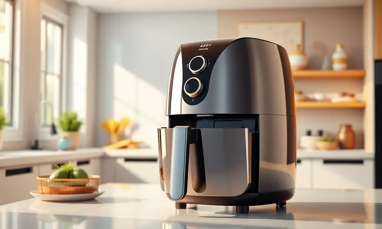
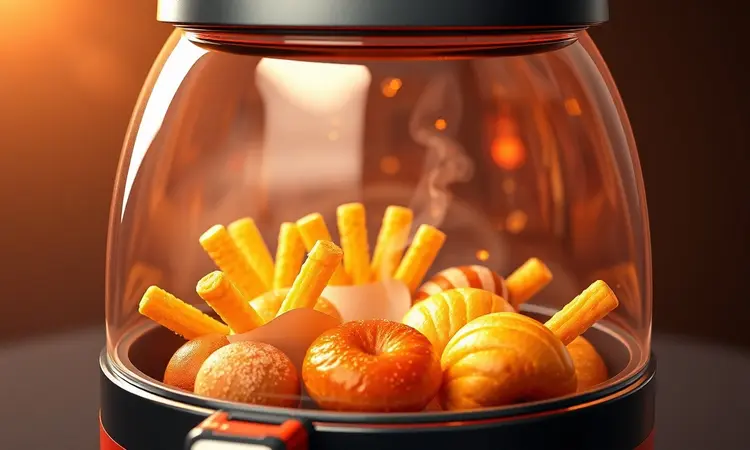
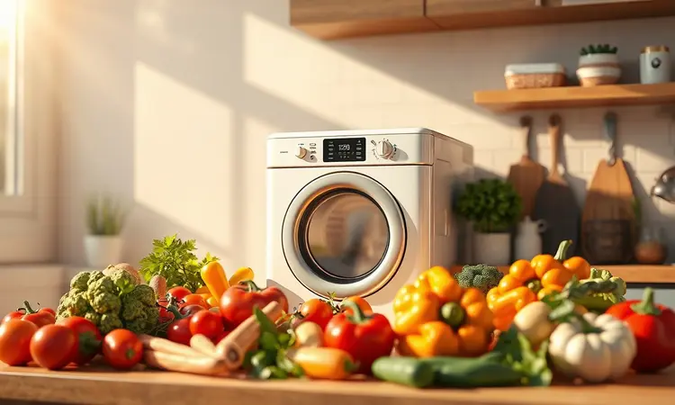

Procurando uma fritadeira elétrica que alie potência e praticidade? A linha Air Fryer Arno Easy Fry conquistou seu espaço nas cozinhas brasileiras, prometendo alimentos crocantes com pouquíssimo óleo. Mas será que ela cumpre o que promete?

Com opções que vão desde o modelo Turbo de 6 litros até a versão Extra com visor digital, é natural ter dúvidas sobre qual escolher e se o investimento faz sentido para sua rotina.

Neste guia, vamos além das especificações técnicas e mergulhamos na experiência real de uso, analisando design, eficiência energética e desempenho em receitas do dia a dia para te ajudar a tomar uma decisão embasada.

<SummaryList products={frontmatter.top_products} />

## Avaliação da Air Fryer Arno Easy Fry Turbo

<ProductBox 
  title={frontmatter.top_products[0].title} 
  image={frontmatter.top_products[0].image} 
  link={frontmatter.top_products[0].link} 
/>

Se você busca uma air fryer que combine capacidade generosa e tecnologia eficiente, o modelo Turbo AFI6 é um forte candidato. Com seus 6 litros, ele atende bem famílias e permite preparar porções maiores de uma só vez.

O grande diferencial está na tecnologia Direct Heat, que elimina a necessidade de pré-aquecimento e acelera todo o processo de cocção. Imagine poder começar a preparar o jantar sem aquela espera de 5 a 10 minutos que outros aparelhos exigem.

Outro recurso inteligente é o compartimento para água no cesto, que ajuda a manter carnes e legumes suculentos enquanto reduz a fumaça durante o preparo.

Com 12 programas automáticos, você tem a praticidade de escolher o modo ideal para batatas fritas, frango assado ou legumes grelhados com um simples toque, sem precisar ficar ajustando tempo e temperatura manualmente.

Porém, é justo mencionar dois pontos que recebem atenção especial dos usuários: o nível de ruído durante a operação, que pode ser mais perceptível em ambientes pequenos, e a limpeza do cesto, que exige um pouco mais de cuidado em comparação com alguns concorrentes.

Ainda assim, considerando o desempenho geral e a versatilidade, ela se posiciona como uma excelente opção para quem prioriza funcionalidade.

<CaixaProsContras>

**Prós:**

- Tecnologia Direct Heat para aquecimento rápido.

- Cesto com compartimento para água, mantendo alimentos suculentos.

- 12 programas automáticos para diversas receitas.

- Capacidade generosa ideal para famílias.

**Contras:**

- Pode ser ruidosa durante o funcionamento.

- Limpeza pode ser um pouco complicada.

</CaixaProsContras>

### Design e Construção da Air Fryer Arno Easy Fry

A primeira impressão ao retirar a air fryer da caixa é de um produto que equilibra estética moderna e funcionalidade prática. Construído em plástico resistente, o aparelho é relativamente leve para seu tamanho, facilitando o manuseio e movimentação na bancada.

O cesto removível possui um revestimento antiaderente de qualidade, que evita que alimentos grudem e simplifica a limpeza após o uso.

Uma característica que muitos usuários valorizam é a tampa transparente, que permite acompanhar o processo de cocção sem precisar abrir o aparelho e interromper a circulação de ar quente.

Essa transparência transforma uma simples fritadeira em uma ferramenta de cozinha mais intuitiva, onde você pode monitorar o ponto exato dos alimentos e evitar surpresas desagradáveis.

### Coletor e Grade da Air Fryer Arno Easy Fry

Dois componentes essenciais para o funcionamento adequado de qualquer air fryer são o coletor de gordura e a grade interna. No caso da Arno Easy Fry, ambos foram projetados pensando na eficiência e na praticidade de manutenção.

O coletor fica posicionado na parte inferior e tem a função de armazenar a gordura que escorre dos alimentos durante o cozimento, evitando que ela se espalhe e dificulte a limpeza.

Já a grade é responsável por garantir uma circulação uniforme do ar quente em torno dos alimentos, promovendo aquela crocância característica em todos os lados.

Fabricados em materiais que suportam altas temperaturas sem deformar ou liberar substâncias indesejadas, esses itens são fundamentais para preservar a qualidade das preparações e estender a vida útil do equipamento.

### Capacidade da Air Fryer Arno Easy Fry

Um dos principais critérios na escolha de uma air fryer é a capacidade, e aqui a linha Easy Fry oferece opções variadas. Os modelos mais comuns variam entre 3,2 e 4 litros, atendendo bem famílias pequenas ou casais.

Essa dimensão permite preparar refeições completas, como frango assado com batatas ou uma porção generosa de legumes grelhados para até quatro pessoas.

O que muitos não consideram inicialmente é como o design compacto faz diferença no dia a dia.

Diferente de fornos elétricos ou fritadeiras tradicionais que ocupam espaço valioso na bancada, a Arno Easy Fry se encaixa facilmente na maioria das cozinhas e pode ser armazenada em armários quando não está em uso.

Essa praticidade se soma à eficiência do sistema de circulação de ar, que garante resultados consistentes em todas as preparações.

### Painel e Funções Extras da Air Fryer Arno Easy Fry

O painel de controle é onde a experiência do usuário realmente ganha vida. Em modelos digitais, como o Extra AFP4, você encontra uma interface intuitiva com funções pré-programadas que eliminam adivinhações.

Timer, temperatura ajustável e botões específicos para diferentes tipos de alimentos transformam o preparo de refeições em um processo quase automático.

Para quem está começando na cozinha saudável ou busca maximizar a eficiência no dia a dia, esses controles fazem toda a diferença.

Eles permitem que você experimente receitas novas com mais confiança, sabendo que o tempo e a temperatura estão otimizados para cada tipo de alimento, desde batatas fritas crocantes até peixes delicados que precisam de um cozimento mais brando.

## Performance: Preparando Alimentos na Air Fryer Arno Easy Fry

A verdadeira prova de qualquer eletrodoméstico de cozinha está no resultado final, e é aí que a Arno Easy Fry se destaca.

Sua tecnologia de circulação de ar quente não é apenas um termo de marketing, mas um sistema que realmente entrega alimentos crocantes por fora e suculentos por dentro, usando até 80% menos óleo do que métodos tradicionais.

### Batatas Fritas na Air Fryer Arno Easy Fry

Poucos testes são mais reveladores para uma air fryer do que preparar batatas fritas. Com a Arno Easy Fry, o processo é tão simples quanto cortar as batatas em palitos, temperar com azeite e ervas a gosto, e distribuí-las uniformemente na cesta.

Em menos de 20 minutos, você terá um acompanhamento crocante e dourado que rivaliza com versões fritas em óleo.

O segredo está na distribuição uniforme do calor, que ataca todos os lados das batatas simultaneamente, eliminando aquelas pontas queimadas enquanto outras partes ficam moles.

O resultado é consistente a cada uso, tornando a air fryer uma aliada confiável para lanches rápidos ou refeições completas.

### Pão de Queijo na Air Fryer Arno Easy Fry

Para os amantes da culinária mineira, a boa notícia é que a Arno Easy Fry consegue recriar a textura perfeita do pão de queijo tradicional.

A chave está na capacidade de aquecer rapidamente e manter uma temperatura estável, criando aquela casca crocante característica enquanto o interior permanece macio e derretido.

O melhor? Você pode preparar quantidades generosas de uma só vez, perfeito para receber visitas ou garantir lanches práticos durante a semana. A facilidade de limpeza depois é outra vantagem, já que qualquer queijo que escorra sai facilmente do cesto antiaderente.

### Carnes na Air Fryer Arno Easy Fry

Carnes são onde muitas air fryers encontram seus limites, mas a Arno Easy Fry se sai particularmente bem nessa categoria. A circulação intensa de ar quente sela rapidamente a superfície dos cortes, mantendo os sucos internos enquanto cria uma crosta saborosa.

Frango, linguiças e até cortes mais magros de carne vermelha ganham novo sabor e textura.

Para resultados ainda melhores, considere marinar suas carnes por algumas horas antes de cozinhar. Esse passo extra potencializa os sabores e ajuda a garantir que cada pedaço fique suculento e bem temperado por dentro.

O tempo reduzido de preparo, em comparação com fornos convencionais, também significa economia de energia e mais praticidade para refeições durante a semana.

## Air Fryer Arno Easy Fry faz Vapor? O Impacto da Água no Coletor

Uma dúvida comum entre quem está considerando uma air fryer é sobre a produção de vapor durante o uso. Sim, a Arno Easy Fry libera vapor durante o cozimento, especialmente quando se preparam alimentos com alto teor de umidade, como legumes ou carnes não grelhadas.

Esse vapor é parte natural do processo de cozimento com ar quente e geralmente não representa problema algum.

O que requer atenção é o coletor de gordura, que pode acumular não apenas resíduos gordurosos, mas também umidade.

Limpá-lo regularmente, especialmente após preparar alimentos muito úmidos, garante que o aparelho funcione com máxima eficiência e evita odores indesejados que podem se formar com o tempo.

## Conheça Outros Modelos da Linha Easy Fry

Se o modelo Turbo não atende completamente às suas necessidades, a linha Easy Fry oferece outras opções interessantes.

Desde o compacto Easy Fry até o versátil Easy Fry Grill, cada versão traz características específicas pensadas para diferentes perfis de usuário e tamanhos de família.

### Fritadeira Air Fryer Arno Easy Fry Extra Superfície AFP4

<ProductBox 
  title={frontmatter.top_products[1].title} 
  image={frontmatter.top_products[1].image} 
  link={frontmatter.top_products[1].link} 
/>

Projetada para quem não abre mão de espaço, a versão Extra Superfície AFP4 impressiona com seus 4 litros de capacidade e cesto amplo que acomoda pizzas de até 27 cm ou 1 kg de batatas fritas.

Com potência que varia entre 1700W e 2200W, ela entrega resultados rápidos e consistentes.

O painel digital oferece 10 funções pré-programadas que cobrem desde frituras básicas até preparos mais elaborados, enquanto a tecnologia Extra Crocância garante que alimentos saiam sempre no ponto ideal.

A ausência de necessidade de pré-aquecimento economiza tempo precioso na correria do dia a dia.

<CaixaProsContras>

**Prós:**

- Capacidade generosa para grandes porções.

- Sistema de aquecimento duplo para cozimento uniforme.

- Painel digital com funções pré-programadas.

- Fácil limpeza com cesto removível e compatível com lava-louças.

**Contras:**

- Pode ser volumosa para espaços pequenos.

- A temperatura máxima pode ser alta demais para alguns pratos.

</CaixaProsContras>

### Fritadeira Air Fryer Arno Airfry & Grill Expert AFD6

<ProductBox 
  title={frontmatter.top_products[2].title} 
  image={frontmatter.top_products[2].image} 
  link={frontmatter.top_products[2].link} 
/>

Para quem busca versatilidade além da fritura, o modelo Airfry & Grill Expert AFD6 oferece função 2 em 1 que combina air fryer tradicional com grelha integrada.

Com 6,5 litros de capacidade, ela permite preparar carnes grelhadas e legumes ao mesmo tempo que frita outros alimentos, otimizando espaço e tempo na cozinha.

A tecnologia Extra Crocância segue presente, garantindo aquela textura perfeita que faz a diferença em cada mordida. Os 8 programas pré-definidos simplificam a preparação de receitas populares, enquanto o design em inox agrega durabilidade e estilo ao ambiente.

<CaixaProsContras>

**Prós:**

- Função 2 em 1 (fritadeira e grill)

- Tecnologia Extra Crocância

- Programas pré-definidos facilitando o uso

- Design moderno e fácil de limpar

**Contras:**

- Tamanho grande que pode não se adequar a cozinhas pequenas

- Limpeza da grelha pode ser um pouco trabalhosa dependendo do uso

</CaixaProsContras>

### Fritadeira Air Fryer Arno Mega Digital AFD7

<ProductBox 
  title={frontmatter.top_products[3].title} 
  image={frontmatter.top_products[3].image} 
  link={frontmatter.top_products[3].link} 
/>

Quando a necessidade é capacidade máxima, o modelo Mega Digital AFD7 se apresenta como solução robusta com impressionantes 7,5 litros.

Perfeito para famílias numerosas ou quem gosta de preparar refeições para congelar, ele permite cozinhar para até 8 pessoas de uma só vez.

A tecnologia Hot Air mantém-se eficiente mesmo em grandes volumes, reduzindo significativamente o uso de óleo enquanto mantém a qualidade dos alimentos.

O painel digital com 8 programas pré-definidos oferece praticidade, embora alguns usuários notem que receitas com massas líquidas ou empanados muito densos podem exigir ajustes na técnica.

<CaixaProsContras>

**Prós:**

- Grande capacidade de 7,5 litros.

- Tecnologia Hot Air para cozimento saudável.

- Painel digital com programas pré-definidos.

- Redução significativa de gordura nos alimentos.

**Contras:**

- Limitações na preparação de pratos com massa líquida.

- Pode não ser ideal para todas as receitas empanadas.

</CaixaProsContras>

### Fritadeira Air Fryer Arno Dual AFD2

<ProductBox 
  title={frontmatter.top_products[4].title} 
  image={frontmatter.top_products[4].image} 
  link={frontmatter.top_products[4].link} 
/>

A inovação chega com o modelo Dual AFD2, que apresenta dois cestos independentes totalizando 8,3 litros de capacidade.

Essa configuração permite verdadeira multitarefa na cozinha, como preparar o prato principal em um cesto enquanto o acompanhamento cozinha no outro, tudo simultaneamente.

Além dos sete programas pré-definidos, ela inclui função de desidratação para fazer chips de frutas ou legumes e ajuste de temperatura preciso entre 40°C e 200°C. A construção em aço inox garante durabilidade, ainda que acrescente algum peso ao aparelho.

<CaixaProsContras>

**Prós:**

- Cozinha simultaneamente em dois cestos independentes.

- Painel digital com várias funções e programas.

- Tecnologia de circulação de ar quente para cozimento uniforme.

- Construída em aço inox, conferindo resistência.

**Contras:**

- Peso um pouco elevado, o que pode dificultar o manuseio.

- Cestos independentes podem exigir mais atenção na limpeza.

</CaixaProsContras>

## Praticidade e Economia no Dia a Dia

Mais do que um eletrodoméstico, a Air Fryer Arno Easy Fry representa uma mudança no estilo de vida na cozinha.

Ela não apenas reduz o consumo de óleo e promove hábitos alimentares mais saudáveis, como também otimiza o tempo gasto no preparo das refeições, libertando você para outras atividades.

### A Air Fryer Arno Easy Fry Consome Muita Energia?

Considerando que funciona por períodos relativamente curtos (geralmente entre 15 e 30 minutos por uso), a Arno Easy Fry pode ser mais econômica do que fornos elétricos tradicionais que precisam de pré-aquecimento e operam por mais tempo.

Seu consumo varia conforme o modelo e temperatura usada, mas a eficiência do sistema de circulação de ar quente ajuda a compensar o uso energético.

### A Air Fryer Arno Easy Fry é Barulhenta?

Como qualquer aparelho com ventilação forçada, a Arno Easy Fry produz um ruído durante a operação, comparável ao de um forno convencional em funcionamento.

Embora alguns modelos da linha sejam efetivamente mais audíveis do que concorrentes premium, esse som raramente interfere em conversas ou atividades normais na cozinha, tornando-se rapidamente apenas um pano de fundo familiar.

### Como Limpar a Air Fryer Arno Easy Fry

A manutenção é surpreendentemente simples na maioria dos modelos. Após esfriar completamente, o cesto e a bandeja podem ser removidos e lavados com água morna e sabão neutro, sendo muitos deles compatíveis com lava-louças.

Evitar produtos abrasivos preserva o revestimento antiaderente e garante que o aparelho mantenha sua eficiência ao longo dos anos.

### A Air Fryer Arno Easy Fry é Segura?

Segurança foi prioridade no design da linha Easy Fry.

Recursos como desligamento automático ao final do tempo programado, exteriores que permanecem frios ao toque mesmo durante o uso e materiais livres de BPA nas partes que têm contato com os alimentos oferecem tranquilidade durante o uso diário.

## FAQ: Perguntas Comuns sobre Airfryer Arno

### Qual a melhor airfryer Arno?

A resposta depende diretamente das suas necessidades específicas. Para famílias grandes que preparam refeições completas frequentemente, o modelo Mega Digital AFD7 com 7,5 litros é excelente.

Caso priorize versatilidade, a versão Airfry & Grill Expert AFD6 oferece função dupla. Para uso cotidiano em famílias menores, os modelos Turbo ou Extra Superfície atendem bem com melhor custo-benefício.

### Qual airfryer da Arno é mais fácil de limpar?

Todos os modelos da linha Easy Fry foram projetados com foco na facilidade de limpeza, mas os que possuem cestos removíveis e revestimento antiaderente de qualidade, como o Extra Superfície AFP4, costumam acumular menos resíduos e simplificar ainda mais a manutenção pós-uso.

### Airfryer digital vale a pena?

Os modelos digitais não são apenas uma questão de estética, mas de precisão. O controle exato de temperatura e tempo, especialmente para receitas mais complexas, faz diferença significativa nos resultados finais.

Se você pretende usar a air fryer frequentemente e explorar receitas variadas, o investimento extra em um modelo digital geralmente se justifica pela consistência e praticidade oferecidas.

### Qual tamanho de airfryer escolher?

Considere dois fatores principais: o número de pessoas na sua casa e a frequência de uso. Para uma ou duas pessoas, modelos entre 2,5 e 4 litros são suficientes. Famílias de três a quatro membros se beneficiam de capacidades entre 5 e 6 litros.

Acima disso, pense não apenas no volume diário, mas também se você costuma preparar refeições para congelar ou receber convidados com frequência.

## Conclusão

Após analisar minuciosamente a linha Air Fryer Arno Easy Fry, fica claro que ela representa muito mais do que apenas um eletrodoméstico de cozinha.

Ela simboliza uma mudança acessível em direção a hábitos alimentares mais saudáveis, sem exigir sacrifícios no sabor ou na praticidade.

Seja você um iniciante buscando simplificar a rotina na cozinha ou um entusiasta da culinária saudável procurando versatilidade, existe um modelo nesta linha que atende suas necessidades específicas.

O equilíbrio entre tecnologia eficiente (como o sistema Direct Heat que elimina o pré-aquecimento), design funcional que facilita a limpeza, e resultados consistentes em receitas variadas posiciona a Arno Easy Fry como uma escolha sólida no mercado competitivo de air fryers.

Embora pontos como o ruído em alguns modelos e a necessidade de limpeza cuidadosa mereçam consideração, são compensados pela qualidade geral das preparações e pela durabilidade da construção.

Se seu objetivo é reduzir o consumo de óleo sem abrir mão do prazer de alimentos crocantes e saborosos, investir em uma Arno Easy Fry pode transformar sua relação com a cozinha diária.

Comece identificando qual modelo melhor se alinha com o tamanho da sua família, espaço disponível e orçamento, e prepare-se para descobrir uma nova forma de cozinhar que combina saúde, sabor e praticidade.