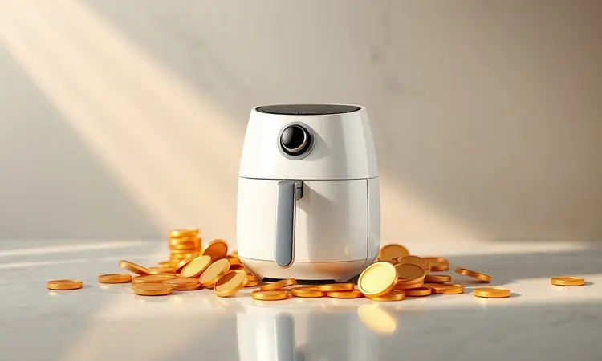
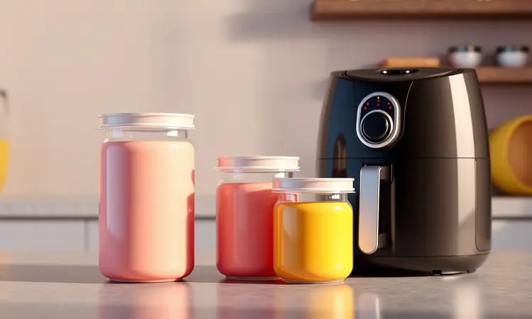
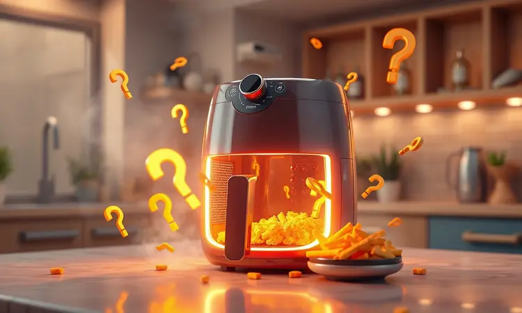
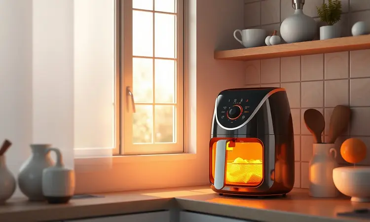

Ter uma air fryer em casa se tornou sinônimo de praticidade e alimentação mais saudável, mas com tantas opções no mercado, a dúvida cruel sempre surge: qual é a melhor air fryer boa e barata?

Nem sempre o preço mais baixo garante um bom negócio, assim como o modelo mais caro pode ter funções que você nunca usará. Neste guia completo, analisamos os modelos que realmente entregam custo-benefício, validados por especialistas e consumidores.

Se você quer transformar sua rotina na cozinha sem estourar o orçamento, continue lendo para descobrir qual fritadeira elétrica é a ideal para o seu perfil e necessidade.

<SummaryList products={frontmatter.top_products} />

## Como escolher a melhor air fryer focada em custo-benefício?

Imagine finalmente encontrar aquele aparelho que não apenas cabe no seu orçamento, mas também na sua rotina. O segredo está em olhar além do preço e focar em como cada característica se transforma em benefício real no seu dia-a-dia.

A capacidade, potência, facilidade de limpeza e funcionalidades extras devem conversar diretamente com seu estilo de vida. E nada melhor do que ouvir quem já está usando: as avaliações dos usuários são seu melhor termômetro para evitar arrependimentos.

### Potência e Eficiência: O que os Watts Significam?

Você já chegou em casa cansado e queria um jantar rápido, mas o equipamento demorava tanto que quase desistiu? É aqui que os watts fazem toda diferença. Eles não são apenas números técnicos; representam tempo de vida recuperado na sua rotina.

Modelos com maior potência aquecem mais rápido e cozinham de maneira mais uniforme, transformando aquela espera de 30 minutos em apenas 15. Mas atenção: potência excessiva pode se traduzir em contas de luz mais altas.

O equilíbrio perfeito é encontrar aquela medida que acelera seu preparo sem pesar no bolso.

### Capacidade vs. Tamanho da Família: Qual o Ideal?

Pense na última vez que preparou batatas fritas para todos e teve que fazer em três rodadas. Frustrante, não? A capacidade ideal da sua air fryer deve eliminar esse problema.

Para uma pessoa ou casal, 2 a 3 litros são suficientes para refeições completas sem desperdício. Já famílias maiores encontram na faixa de 4 a 6 litros a liberdade de preparar o almoço de todos de uma só vez. Mas há um detalhe crucial: o espaço na sua cozinha.

Um modelo muito grande pode dominar sua bancada, enquanto um compacto demais limitará sua criatividade culinária. A arte está em casar suas necessidades de preparo com as dimensões do seu espaço disponível.

### Digital ou Analógica: Qual Painel é Melhor?

Algumas pessoas amam precisão, outras preferem simplicidade. Os painéis digitais oferecem controle cirúrgico sobre temperatura e tempo, perfeito para quem segue receitas ao pé da letra ou adora experimentar novos modos de preparo.

Já os analógicos têm um charme à parte: são intuitivos, diretos e eliminam aquela sensação de estar operando um foguete espacial na cozinha. A escolha reflete seu estilo: você é do tipo que mede cada grau ou prefere girar um botão e partir para o abraço?

### Recursos Extras: Cesto Antiaderente e Funções

Chega ao fim o preparo, você olha para o cesto e pensa: "vai demorar meia hora para limpar isso". É exatamente esse sofrimento que um cesto antiaderente de qualidade elimina. Ele transforma a limpeza em um passar de pano, não em uma maratona de esfregação.

E quando falamos em funções extras como desidratação ou grelhados, estamos falando de versatilidade que expande seu cardápio sem exigir novos eletrodomésticos.

Esses recursos podem ser a diferença entre um aparelho que apenas frita batatas e um parceiro culinário que acompanha sua evolução na cozinha.

## Análise: As 10 Melhores Air Fryers Boas e Baratas de 2026

Agora que você já sabe exatamente o que procurar, vamos conhecer os modelos que realmente merecem sua atenção. Analisamos dezenas de opções para trazer estas dez que equilibram preço acessível e desempenho consistente.

De compactas para solteiros a gigantes para famílias, cada uma tem sua personalidade única.

### 1. Air Fryer Mondial AF-35-BF

<ProductBox 
  title={frontmatter.top_products[0].title} 
  image={frontmatter.top_products[0].image} 
  link={frontmatter.top_products[0].link} 
/>

Para quem busca simplicidade que funciona, a Mondial AF-35-BF é como aquele amigo confiável: não promete milagres, mas cumpre o combinado. Com seus 3,5 litros, ela abraça porções generosas sem exigir que você faça rodízio de batatas.

A tecnologia de circulação de ar quente entrega aquela crocância dourada que faz você esquecer que está comendo algo mais saudável.

O timer de 60 minutos com desligamento automático é seu guardião contra comidas carbonizadas, enquanto os 1500W garantem que seu jantar não se transforme em uma espera eterna.

Sim, ela é básica, mas sua robustez e preço acessível a tornam uma primeira air fryer quase perfeita.

<CaixaProsContras>

**Prós:**

- Capacidade ideal para porções maiores.

- Tecnologia que reduz a necessidade de óleo.

- Timer e desligamento automático para segurança.

- Design compacto que não ocupa muito espaço.

**Contras:**

- É um modelo básico, sem recursos sofisticados.

- Não é bivolt, disponível apenas em 110V ou 220V.

</CaixaProsContras>

### 2. WAP Air Fryer Family Prosdócimo 4L

<ProductBox 
  title={frontmatter.top_products[1].title} 
  image={frontmatter.top_products[1].image} 
  link={frontmatter.top_products[1].link} 
/>

Imagine cozinhar frango e legumes juntos, ambos saindo crocantes e suculentos. Essa é a promessa da WAP Family Prosdócimo 4L, com sua tecnologia de circulação de ar em 360° que trata cada alimento com igual cuidado.

Os 4 litros são o ponto ideal para famílias pequenas que não querem comprometer espaço nem versatilidade. O controle de temperatura precisa (80°C a 200°C) permite desde desidratar bananas até dourar um filé perfeito.

Apenas mantenha atenção: como uma panela no fogão, sua área externa esquenta, então manuseie com carinho.

<CaixaProsContras>

**Prós:**

- Boa capacidade de 4 litros para porções maiores.

- Potência eficiente para preparos rápidos.

- Controles intuitivos de temperatura e tempo.

- Facilidade na limpeza com componentes antiaderentes.

**Contras:**

- Área externa pode esquentar bastante.

- Cabo de alimentação é relativamente curto.

</CaixaProsContras>

### 3. Mondial Grand Family 5L AFN-50-BI

<ProductBox 
  title={frontmatter.top_products[2].title} 
  image={frontmatter.top_products[2].image} 
  link={frontmatter.top_products[2].link} 
/>

Quando a família cresce, mas o espaço na cozinha não, a Mondial Grand Family surge como solução. Seus 5 litros comportam um frango inteiro com batatas ao redor, eliminando a necessidade de múltiplas fornadas.

Os 1900W são a força bruta que acelera preparos sem piedade, perfeito para aqueles dias corridos onde cada minuto conta.

Sim, os números do painel podem desbotar com o tempo e ela tem sua voz (um pouco barulhenta), mas sua capacidade de transformar óleo em ar quente crocante faz você perdoar essas pequenas idiossincrasias.

<CaixaProsContras>

**Prós:**

- Grande capacidade ideal para famílias.

- Potência alta que acelera o preparo dos alimentos.

- Cesto antiaderente que facilita a limpeza.

- Timer com desligamento automático para maior segurança.

**Contras:**

- Números no painel podem desbotar com o tempo.

- Pode ser um pouco barulhenta durante o funcionamento.

</CaixaProsContras>

### 4. Philco Air Fryer Oven 12L PFR2200P

<ProductBox 
  title={frontmatter.top_products[3].title} 
  image={frontmatter.top_products[3].image} 
  link={frontmatter.top_products[3].link} 
/>

E se você pudesse substituir seu forno convencional por algo mais rápido, econômico e versátil? A Philco Air Fryer Oven é exatamente essa proposta ousada. Com 12 litros, ela não é uma air fryer, é um centro culinário compacto.

As 9 funções pré-programadas vão de fritura a desidratação, permitindo criar desde batatas crocantes até chips de maçã saudáveis. A única concessão? O cesto antiaderente interno tem 3,5 litros, então para usar toda capacidade você precisará das bandejas extras.

Mas para quem busca um único aparelho que faz tudo, ela é um investimento que se paga em versatilidade.

<CaixaProsContras>

**Prós:**

- Versatilidade com várias funções de cocção.

- Grande capacidade de 12 litros, ideal para famílias.

- Design moderno e painel digital intuitivo.

- Função desidratar para criar snacks saudáveis.

**Contras:**

- Cesto antiaderente menor em comparação à capacidade total.

- Preço pode ser mais elevado em relação a concorrentes.

</CaixaProsContras>

### 5. Air Fryer Britânia BFR25P

<ProductBox 
  title={frontmatter.top_products[4].title} 
  image={frontmatter.top_products[4].image} 
  link={frontmatter.top_products[4].link} 
/>

Algumas marcas carregam uma herança de confiança, e a Britânia soube traduzir isso para o mundo das air fryers. O modelo BFR25P entrega 4 litros de pura praticidade, com tecnologia Air Flow 360º que envolve os alimentos em calor uniforme.

O design não apenas é bonito na bancada, como também é inteligente: tudo é removível e antiaderente, transformando a limpeza em uma tarefa de segundos. Os controles são diretos, sem complicações desnecessárias.

Apenas verifique sua voltagem antes de comprar, pois ela não é bivolt.

<CaixaProsContras>

**Prós:**

- Potência de 1500W para aquecimento rápido.

- Tecnologia Air Flow 360º para crocância.

- Timer com desligamento automático para mais segurança.

- Design moderno e fácil de limpar.

**Contras:**

- Não é bivolt, o que pode limitar a escolha da voltagem.

- Capacidade um pouco menor em comparação a modelos maiores.

</CaixaProsContras>

### 6. Air Fryer Electrolux EAF15 por Rita Lobo

<ProductBox 
  title={frontmatter.top_products[5].title} 
  image={frontmatter.top_products[5].image} 
  link={frontmatter.top_products[5].link} 
/>

Quando uma marca renomada se une a uma especialista em alimentação saudável, o resultado precisa ser excepcional. E a Electrolux EAF15 entrega: ela reduz até 90% da gordura em comparação à fritura tradicional, sem abrir mão do sabor.

Os 3,2 litros são dimensionados para casais ou pequenas famílias que valorizam qualidade sobre quantidade. O sistema de desligamento automático é como ter um assistente pessoal que avisa quando sua comida está no ponto exato.

O cabo pode ser curto para algumas bancadas, mas essa é uma pequena concessão para quem busca saúde com praticidade.

<CaixaProsContras>

**Prós:**

- Redução significativa de gordura e calorias.

- Rápido tempo de preparo dos alimentos.

- Fácil limpeza com cesto antiaderente.

- Desligamento automático aumenta a segurança.

**Contras:**

- Cabo de alimentação pode ser curto.

- Carcaça externa pode ocupar mais espaço na bancada.

</CaixaProsContras>

### 7. Gaabor Mini Air Fryer 1.4L Individual

<ProductBox 
  title={frontmatter.top_products[6].title} 
  image={frontmatter.top_products[6].image} 
  link={frontmatter.top_products[6].link} 
/>

Para apartamentos compactos, estudantes ou quem vive sozinho, a Gaabor Mini é a prova de que tamanho não é documento. Com apenas 1,4 litros, ela cabe em qualquer cantinho e resolve refeições individuais rapidamente.

Os 900W são suficientes para transformar uma porção de batatas em 15 minutos, e o controle mecânico dispensa manuais complicados.

Não espere preparar um banquete, mas para aquela porção de nuggets após um dia longo ou para requentar a pizza de ontem, ela é a companheira perfeita.

<CaixaProsContras>

**Prós:**

- Design compacto que economiza espaço.

- Ideal para porções individuais ou pequenos casais.

- Prepara alimentos de forma rápida e crocante.

- Operação simples com controle mecânico.

**Contras:**

- Capacidade limitada para refeições maiores.

- Falta de um display digital pode dificultar a precisão na cocção.

</CaixaProsContras>

### 8. Air Fryer Philips Walita Essential Xl RI9270

<ProductBox 
  title={frontmatter.top_products[7].title} 
  image={frontmatter.top_products[7].image} 
  link={frontmatter.top_products[7].link} 
/>

A credibilidade da Philips se manifesta na Essential XL através da tecnologia Rapid Air, que não apenas cozinha, mas transforma alimentos em versões mais saudáveis de si mesmos.

Com 6,2 litros, ela abraça até 5 porções de uma vez, ideal para famílias que não têm tempo para múltiplas fornadas. Os 7 presets de cozimento são atalhos para resultados consistentes, mesmo quando você está com pressa.

As peças laváveis na máquina são o golpe final: depois de cozinhar, basta encaixar na lava-louças e seguir com seu dia.

<CaixaProsContras>

**Prós:**

- Grande capacidade, ideal para famílias.

- Tecnologia que reduz gordura nos alimentos.

- Painel digital com presets fáceis de usar.

- Peças removíveis e laváveis, facilitando a limpeza.

**Contras:**

- A navegação pelos presets pode ser um pouco tediosa.

- O cesto pode parecer um pouco solto ao encaixar.

</CaixaProsContras>

### 9. Air fryer Widemax FWM45P2 - Midea

<ProductBox 
  title={frontmatter.top_products[8].title} 
  image={frontmatter.top_products[8].image} 
  link={frontmatter.top_products[8].link} 
/>

E se você pudesse preparar o frango para as crianças e os legumes para os adultos ao mesmo tempo, sem misturar sabores? A Midea Widemax realizou esse desejo com suas zonas de cozimento independentes.

Sua versatilidade é impressionante: fritar, grelhar e assar em um único aparelho. O design vertical é uma benção para cozinhas com pouca bancada, embora seu tamanho total ainda exija um espaço dedicado.

A limpeza manual é o preço dessa inovação, mas para famílias com preferências alimentares diversas, essa troca vale cada minuto extra.

<CaixaProsContras>

**Prós:**

- Cozinha dois pratos ao mesmo tempo.

- Diversos modos de preparo.

- Resultados crocantes e saborosos.

- Design compacto e moderno.

**Contras:**

- Pode ser grande para espaços pequenos.

- Limpeza não é prática.

</CaixaProsContras>

### 10. Air fryer DiamondTech 6 L - Oster

<ProductBox 
  title={frontmatter.top_products[9].title} 
  image={frontmatter.top_products[9].image} 
  link={frontmatter.top_products[9].link} 
/>

Oster trouxe para o mundo das air fryers o mesmo cuidado com durabilidade que a consagrou em outros eletrodomésticos. O revestimento DiamondTech não é apenas um nome bonito: suas partículas de diamante realmente resistem ao tempo e facilitam a limpeza diária.

Os 6 litros acomodam famílias com apetite generoso, e as 10 funções pré-programadas são como ter um livro de receitas embutido.

O visor transparente é aquela curiosidade que se transforma em utilidade: você acompanha a transformação dos alimentos sem interromper o cozimento. A eficiência energética poderia ser melhor, mas a qualidade dos resultados justifica a escolha.

<CaixaProsContras>

**Prós:**

- Revestimento antiaderente de alta durabilidade.

- Capacidade ideal para famílias.

- Painel digital com várias funções.

- Design moderno e fácil de limpar.

**Contras:**

- Eficiência energética pode ser um pouco abaixo da média.

- Tamanho pode ser excessivo para cozinhas pequenas.

</CaixaProsContras>

## Mito ou verdade? 8 curiosidades sobre air fryer que você ainda não sabe

As air fryers conquistaram nossas cozinhas, mas ainda carregam segredos. É verdade que usam menos óleo, mas algumas receitas pedem um fio de azeite para atingirem a crocância perfeita.

Mito que apenas fritam: elas são multifuncionais, assando pães e grelhando carnes com maestria. Verdade que economizam tempo, reduzindo em até metade o preparo de muitos alimentos.

Descobrir essas nuances é como aprender a linguagem secreta do aparelho, transformando-o de simples eletrodoméstico em aliado culinário.

## Vale a pena comprar uma air fryer?

A resposta depende menos do aparelho e mais do seu estilo de vida. Se você busca praticidade sem abrir mão da saúde, se cansa de limpar panelas engorduradas, ou se simplesmente quer recuperar minutos preciosos do seu dia, então sim, vale cada real.

Ela não é mágica, mas é eficiente: transforma óleo em ar quente, espera em agilidade, complexidade em simplicidade. Para quem cozinha regularmente e valoriza refeições mais leves, ela deixa de ser um gasto para se tornar um investimento em bem-estar e tempo livre.

## Dúvidas frequentes sobre air fryer barata e boa

Encontrar a air fryer perfeita envolve responder perguntas básicas de forma honesta. Comece pelo tamanho da sua família: modelos menores (até 3L) servem casais, enquanto maiores (4L+) atendem famílias inteiras.

Funções extras como desidratação ou múltiplos programas podem parecer tentadoras, mas avalie se você realmente usará ou se serão apenas botões esquecidos.

A limpeza é seu teste decisivo: peças removíveis e antiaderentes transformam uma tarefa chata em questão de segundos. Por fim, leia experiências reais: avaliações de usuários revelam o que as especificações técnicas escondem.

## Conclusão

Escolher a air fryer ideal não é sobre encontrar o modelo mais barato ou o mais caro, mas sobre identificar qual se encaixa na sua vida como uma luva. Das compactas para solteiros às gigantes para famílias, cada modelo nesta lista tem personalidade própria.

A Mondial AF-35-BF é a entrada confiável, a Philco é o centro culinário completo, a Gaabor é a solução para espaços mínimos.

O que todas compartilham é a capacidade de transformar rotinas: menos óleo, mais saúde; menos tempo na cozinha, mais vida fora dela; menos esforço na limpeza, mais prazer no preparo.

Agora que você conhece o cenário completo, a decisão final reflete o tipo de cozinheiro que você é e o estilo de vida que deseja construir. Qual será sua escolha?