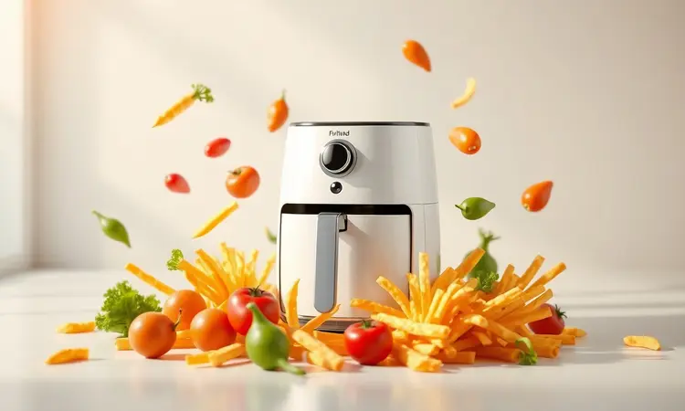
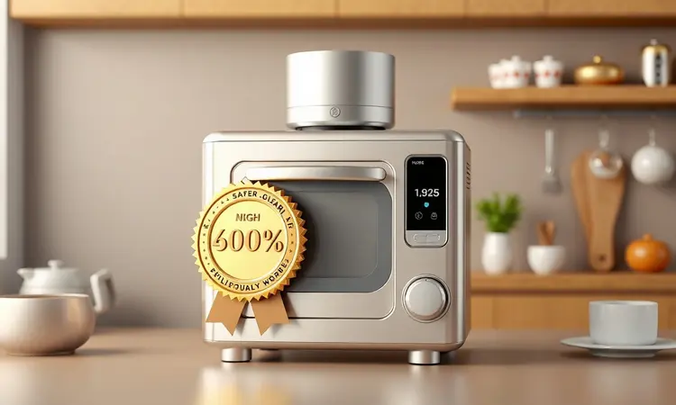
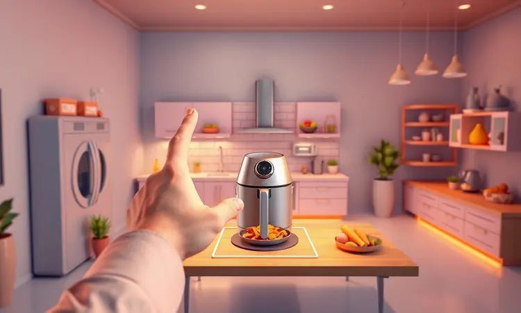

A busca por uma alimentação mais saudável e prática trouxe as fritadeiras elétricas para o centro das cozinhas brasileiras.

Entre as diversas opções de entrada no mercado, a linha Bella Cuccina, produzida pela Britânia, destaca-se pelo preço competitivo e variedade de tamanhos. No entanto, muitos consumidores se perguntam: a Air Fryer Bella Cuccina é boa de verdade ou o barato sai caro?

Neste guia completo, analisamos tecnicamente os principais modelos da linha, desde as versões compactas de 3 litros até a imponente Oven de 12 litros, para que você entenda o custo-benefício e decida se vale a pena investir em um desses modelos para o seu dia a dia.

<SummaryList products={frontmatter.top_products} />

## A linha de fritadeiras Bella Cuccina da Britânia

Pense na Bella Cuccina não como um único produto, mas como uma família inteira de soluções para sua cozinha.

A Britânia acertou em criar uma linha que conversa com realidades diferentes: desde quem mora sozinho e precisa de praticidade absoluta até famílias que desejam unir saúde e sabor nas refeições do dia a dia. O que todas compartilham?

A promessa de transformar batatas fritas em aliadas, frangos em crocantes sem culpa e legumes em verdadeiras tentações. Mas cada modelo tem sua personalidade. Vamos conhecê-las?

## Modelos de air fryer Bella Cuccina disponíveis no mercado

A variedade pode parecer intimidadora à primeira vista, mas é justamente essa diversidade que torna a linha tão interessante.

Encontrar sua Bella Cuccina ideal é como escolher o parceiro perfeito para suas aventuras culinárias: precisa combinar com seu estilo de vida, seu espaço e, claro, sua fome.

### Air Fryer Britânia Bella Cuccina BCFR05 12L (Oven)

<ProductBox 
  title={frontmatter.top_products[0].title} 
  image={frontmatter.top_products[0].image} 
  link={frontmatter.top_products[0].link} 
/>

Você é do tipo que gosta de receber amigos, fazer jantares especiais ou simplesmente odeia fazer coisas em pequenas porções? Então esta é sua máquina dos sonhos.

Com 12 litros de capacidade, a BCFR05 não é apenas uma fritadeira, é praticamente um forno inteligente que também frita sem óleo. Imagine preparar um frango inteiro crocante ou assar um bolo enquanto usa outra prateleira para deixar batatas douradas.

A sensação de liberdade culinária que ela oferece é quase palpável.

E o melhor: toda essa versatilidade vem com controles simples. Temperatura que vai dos 70°C aos 230°C (perfeito para desde desidratar frutas até assar pães) e timer de 60 minutos que desliga sozinho, para você poder cuidar dos convidados enquanto o jantar se prepara.

<CaixaProsContras>

**Prós:**

- Versatilidade como fritadeira e forno.

- Grande capacidade de 12 litros.

- Controle de temperatura preciso.

- Design prático com cesto antiaderente.

**Contras:**

- Tamanho mais volumoso que modelos menores.

- Pode ser mais complexa para quem busca algo básico.

</CaixaProsContras>

### Air Fryer Britânia Bella Cuccina BCAF41 4,5L

<ProductBox 
  title={frontmatter.top_products[1].title} 
  image={frontmatter.top_products[1].image} 
  link={frontmatter.top_products[1].link} 
/>

Para famílias pequenas que não abrem mão de refeições completas, a BCAF41 é a medida certa. Com 4,5 litros, ela prepara batatas fritas para três ou quatro pessoas, ou um frango em pedaços que alimenta todo mundo sem precisar fazer duas levas.

A potência de 1500W significa que você não precisa reorganizar seu dia em torno do tempo de cozimento: em minutos, o cheiro de comida fresca toma sua cozinha.

E quando a refeição acaba, vem aquela sensação gostosa de facilidade. O cesto sai inteiro, vai direto para a pia e, com uma esponja rápida, já está pronto para a próxima aventura. Simples assim.

Se sua rotina pede equilíbrio entre capacidade e praticidade, esta é sua companheira ideal.

<CaixaProsContras>

**Prós:**

- Capacidade ideal para famílias pequenas.

- Potência elevada que garante rapidez no preparo.

- Controle de temperatura versátil.

- Cesto antiaderente facilita a limpeza.

**Contras:**

- Não é a opção mais compacta disponível.

- Pode exigir mais espaço na bancada da cozinha.

</CaixaProsContras>

### Air Fryer Britânia Bella Cuccina BCFR04 3,8L

<ProductBox 
  title={frontmatter.top_products[2].title} 
  image={frontmatter.top_products[2].image} 
  link={frontmatter.top_products[2].link} 
/>

Aqui está o equilíbrio perfeito entre potência e tamanho. Com 3,8 litros, a BCFR04 é aquela amiga que entende quando você quer fazer algo especial só para você, ou uma refeição rápida para duas pessoas.

Os 1500W garantem que a ansiedade pela fome vira satisfação em tempo recorde, enquanto o controle analógico oferece uma simplicidade que acalma: gire, clique e espere a magia acontecer.

Para quem valoriza segurança tanto quanto sabor, ela traz a tranquilidade do desligamento automático e proteção contra superaquecimento. Você pode colocar aquelas batatas para fritar e ir responder uma mensagem sem aquela preocupação no fundo da mente.

É praticidade que vem com paz de espírito.

<CaixaProsContras>

**Prós:**

- Potente (1500W) com aquecimento rápido.

- Controle de temperatura ajustável.

- Cesto antiaderente fácil de limpar.

- Sistema de segurança contra superaquecimento.

**Contras:**

- Capacidade limitada para grandes porções.

- Controle analógico pode ser menos preciso que digital.

</CaixaProsContras>

### Air Fryer Bella Cuccina BCAF40C 3,5L

<ProductBox 
  title={frontmatter.top_products[3].title} 
  image={frontmatter.top_products[3].image} 
  link={frontmatter.top_products[3].link} 
/>

Tecnologia que faz diferença no dia a dia: essa é a proposta da BCAF40C. A tecnologia Air Flow 360° não é apenas um nome bonito, é a garantia de que cada pedacinho de batata fica igualmente crocante, sem aquelas partes mais escuras ou menos douradas.

Para quem leva a sério a textura perfeita, isso faz toda a diferença.

Com seus 3,5 litros, ela é a companheira ideal para casais ou pequenas famílias que querem experimentar de tudo, desde snacks crocantes até legumes assados.

O timer de 60 minutos com desligamento automático é como ter um assistente na cozinha, lembrando você quando a perfeição foi alcançada.

<CaixaProsContras>

**Prós:**

- Fritura sem óleo para refeições mais saudáveis.

- Controle de temperatura ajustável para versatilidade.

- Timer com desligamento automático para maior segurança.

- Cesto antiaderente que facilita a limpeza.

**Contras:**

- Design pode ocupar mais espaço na cozinha.

- A capacidade pode ser limitada para famílias maiores.

</CaixaProsContras>

### Air Fryer Britânia Bella Cuccina BCFR02 3L

<ProductBox 
  title={frontmatter.top_products[4].title} 
  image={frontmatter.top_products[4].image} 
  link={frontmatter.top_products[4].link} 
/>

Para quem está começando sua jornada na cozinha saudável ou tem espaço realmente limitado, a BCFR02 é o ponto de partida perfeito.

Com seus 3 litros, ela cabe até nas cozinhas mais compactas, mas não se engane pelo tamanho: a circulação de ar de 360° garante que cada nugget, cada tira de batata, cada pedaço de frango fique dourado por igual.

Os 1300W podem parecer menos impressionantes que os 1500W dos modelos maiores, mas a economia de energia se transforma em economia no bolso ao longo do tempo. E o controle analógico?

É a simplicidade que muitos buscam: sem telas complicadas, sem configurações misteriosas, apenas comida boa sendo preparada.

<CaixaProsContras>

**Prós:**

- Prepara alimentos com redução ou eliminação de óleo.

- Versátil, adequada para diversos tipos de receitas.

- Cozimento rápido e eficiente graças à circulação de ar.

- Design prático e fácil de limpar.

**Contras:**

- Tempo de preparo pode ser maior para algumas receitas.

- Controle analógico pode não agradar a todos os usuários.

</CaixaProsContras>

## Afinal, a air fryer Bella Cuccina é boa?

A resposta vai além de especificações técnicas. A Bella Cuccina é boa porque entende que cozinhar não é apenas sobre alimentar o corpo, mas sobre criar momentos.

É boa porque transforma a ansiedade de quem nunca fritou um ovo na confiança de quem prepara jantares completos. É boa porque respeita seu espaço (seja ele grande ou pequeno) e seu tempo (seja ele amplo ou contado).

Claro, como qualquer relacionamento, exige ajustes. Você vai descobrir que algumas receitas funcionam melhor que outras, que o tempo perfeito para batatas pode ser diferente do ideal para legumes. Mas essa descoberta é parte do prazer.

A linha Britânia acertou ao oferecer opções para cada personalidade culinária, e não há sensação melhor do que encontrar a que conversa com a sua.

## Conclusão

Escolher uma Bella Cuccina é como encontrar o parceiro ideal para suas aventuras na cozinha. Não existe "o melhor modelo", existe "o melhor modelo para você". Para famílias barulhentas que adoram receber, a Oven de 12L abre um mundo de possibilidades.

Para casais que valorizam jantares a dois, os modelos de 3,5L a 4,5L oferecem o equilíbrio perfeito. Para quem busca simplicidade e economia, as versões menores são tesouros escondidos.

O que todas compartilham? A capacidade de transformar o ato de cozinhar de uma obrigação em um prazer. De trocar a culpa por batatas fritas pela satisfação de criar algo delicioso e saudável.

De fazer você olhar para sua cozinha e pensar: "hoje vou experimentar algo novo".

Então, vale a pena? Se você busca praticidade que não sacrifique sabor, versatilidade que caiba no seu espaço e resultados que surpreendem a cada uso, a resposta é um sonoro sim.

A Bella Cuccina não é apenas uma fritadeira sem óleo, é um convite para redescobrir o prazer de cozinhar.

## Vai comprar air fryer? 6 dicas para não errar na escolha

Escolher sua companheira de cozinha vai além de comparar litros e watts. Primeiro, seja honesto sobre seu espaço: uma máquina incrível que não cabe na bancada é apenas uma frustração decorativa.

Segundo, pense nas suas refeições típicas: prepara mais para você só ou para a família toda? Terceiro, observe como você gosta de cozinhar: prefere botões simples ou telas com mil funções?

Quarto, nunca subestime a facilidade de limpeza: cesto removível não é luxo, é necessidade. Quinto, a potência influencia seu tempo na cozinha, mas também sua conta de luz. Sexto e mais importante: leia experiências reais.

Outras pessoas já descobriram se aquela característica técnica se traduz em felicidade no dia a dia. Sua Bella Cuccina ideal está esperando, pronta para transformar suas refeições.