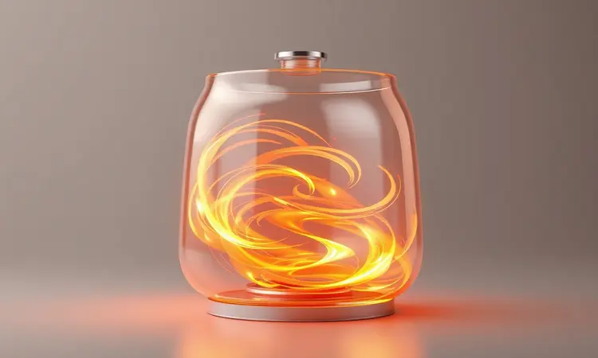

Você finalmente comprou sua fritadeira elétrica, mas ainda se sente inseguro sobre como tirar o melhor proveito dela? Você não está sozinho. Muitas pessoas limitam o uso desse aparelho incrível por não conhecerem as técnicas certas de circulação de ar e temperatura.

Neste guia definitivo, eu prometo te mostrar tudo o que você precisa saber: do primeiro uso à limpeza profunda, além de truques de chef para garantir aquela crocância perfeita sem usar óleo.

Prepare-se para descobrir como transformar sua rotina na cozinha com praticidade e saúde.

<SummaryList products={frontmatter.top_products} />

## O que é e como funciona a tecnologia de uma Air Fryer?

Imagine conseguir aquela crocância irresistível da batata frita, mas sem aquele banho de óleo que deixa você se sentindo pesado. É exatamente essa magia que a Air Fryer realiza através de uma tecnologia inteligente.

Em vez de submergir os alimentos em gordura, um ventilador na parte superior do aparelho circula ar quente em alta velocidade ao redor da comida. Esse movimento constante cria uma camada dourada e crocante por fora, enquanto mantém o interior suculento.

O que parece simples é na verdade uma revolução na forma como cozinhamos. Você não está apenas reduzindo calorias, está preservando os nutrientes que normalmente se perdem na fritura tradicional.

E o melhor: essa mesma tecnologia que faz milagres com batatas também assa, grelha e até desidrata alimentos. É como ter vários eletrodomésticos em um só, conquistando espaço na bancada e praticidade no seu dia a dia.

## Manual do Primeiro Uso: Como preparar e fazer a 'cura' do antiaderente

Agora que você entende a magia por trás do aparelho, vamos prepará-lo para durar anos e anos. Pense nesse momento como um ritual de apresentação entre você e sua nova parceira de cozinha.

Comece lavando a cesta e a bandeja com água morna e detergente neutro, usando sempre uma esponja macia. Após enxaguar bem, seque completamente cada peça.

Aqui vem o segredo da longevidade: aplique uma fina camada de óleo vegetal em toda a superfície antiaderente. Não é exagero, é carinho. Essa barreira invisível protege o revestimento nos primeiros usos, garantindo que seus alimentos soltem com facilidade sempre.

Para finalizar o ritual, ligue a air fryer vazia a 200°C por cerca de 10 minutos. Esse calor solidifica a proteção, e seu aparelho está oficialmente pronto para criar memórias gastronômicas.

## Passo a passo para operar sua Air Fryer corretamente

Com o aparelho preparado, chegou a hora da verdade. A operação correta é mais simples do que parece, mas alguns detalhes fazem toda diferença entre um resultado bom e um resultado extraordinário.

O processo básico envolve pré-aquecer, dispor os alimentos em camada única, ajustar temperatura e tempo, e finalizar com aquele toque especial que garante crocância uniforme.

### A importância do pré-aquecimento: Quando e como fazer

Você já tentou colocar um bolo no forno frio? O resultado nunca é o mesmo. Com a air fryer, a lógica é idêntica. O pré-aquecimento não é só uma recomendação, é o segredo para começar o cozimento no ponto perfeito.

Quando você liga o aparelho por 3 a 5 minutos na temperatura desejada, está criando um ambiente ideal que envolve os alimentos imediatamente. Isso significa crocância instantânea por fora e cozimento uniforme por dentro.

O tempo de pré-aquecimento varia conforme a receita, mas uma regra prática funciona na maioria dos casos: use a mesma temperatura do cozimento.

Essa sincronia térmica evita que os alimentos fiquem moles no início do processo, garantindo aquela textura que faz você fechar os olhos de prazer a cada mordida.

### Encontrando a temperatura e o tempo ideal para cada alimento

Parece complexo no início, mas encontrar o ponto perfeito é como aprender a dançar: você começa seguindo os passos básicos até desenvolver seu próprio ritmo. Para a maioria dos alimentos, a zona ideal fica entre 160°C e 200°C.

Batatas fritas, por exemplo, atingem o ápice da crocância a 200°C por 15 a 20 minutos. Já um filé de frango mantém a suculência perfeita a 180°C por 20 a 25 minutos.

A verdadeira maestria vem com a observação. Na metade do tempo, abra a gaveta e veja como está o progresso. Essa pausa estratégica não só mostra o ponto exato como permite virar ou agitar os alimentos.

Com algumas tentativas, você desenvolverá um sexto sentido para ajustes precisos, criando receitas personalizadas que refletem exatamente seu paladar.

## Segredos para garantir a crocância máxima

Agora que dominamos o básico, vamos elevar o nível. A crocância perfeita não é um acidente, é uma combinação de técnicas que transformam ingredientes simples em experiências sensoriais. Tudo começa com espaço: nunca sobrecarregue a cesta.

O ar precisa circular livremente, envolvendo cada pedaço como um abraço quente que transforma texturas.

Uma leve névoa de óleo em spray pode ser o toque final que intensifica o brilho dourado. Mas a verdadeira magia está no ajuste fino: temperatura um pouco mais alta no final pode criar aquela casquinha irresistível, enquanto um minuto a menos preserva a umidade interna.

É esse equilíbrio entre ciência e intuição que separa o usuário casual do verdadeiro mestre da air fryer.

### O truque de sacudir o cesto (The Shake Effect)

Imagine seus alimentos como convidados em uma festa: todos precisam circular para aproveitar melhor o ambiente. O "Shake Effect" é exatamente isso.

Pausar o cozimento na metade do tempo e sacudir gentilmente o cesto redistribui cada pedaço, garantindo que todos os lados recebam atenção igual do ar quente.

Para batatas fritas e vegetais, essa técnica é revolucionária. Ela evita que os alimentos grudem uns nos outros, criando aquela crocância individual que faz cada mordida valer a pena. Experimente fazer esse movimento a cada 10 ou 15 minutos, dependendo da receita.

Você sentirá a diferença não apenas no visual, mas no som crocante ao mastigar.

### Pincelar ou borrifar óleo? Entenda a diferença

Essa escolha pode definir o caráter do seu prato. Pincelar óleo oferece controle cirúrgico: cada pincelada cria uma camada uniforme, perfeita para quando você busca uma crocância específica e consistente. É a técnica do artesão, onde cada movimento é intencional.

Borrifar, por outro lado, é a opção da praticidade com consciência. A névoa fina de azeite ou óleo cobre os alimentos com leveza, reduzindo drasticamente a quantidade de gordura sem sacrificar o sabor.

Para quem busca saúde sem comprometer o prazer, essa é a estrada dourada do meio.

Ambos os métodos têm seu lugar na sua jornada culinária. O segredo está em experimentar: algumas receitas pedem a precisão do pincel, outras brilham com a leveza do spray. Descobrir essas preferências é parte da diversão de dominar sua nova ferramenta.

## Melhores modelos de Air Fryer para investir hoje

<ProductBox 
  title={frontmatter.top_products[0].title} 
  image={frontmatter.top_products[0].image} 
  link={frontmatter.top_products[0].link} 
/>

Depois de entender toda a potencialidade da tecnologia, surge a pergunta prática: qual modelo realmente merece espaço na sua cozinha? Em 2023, algumas estrelas se destacam pelo equilíbrio entre funcionalidade e valor.

Para famílias que compartilham refeições e momentos, a Mondial Grand Family 5L oferece capacidade generosa aliada à facilidade de limpeza que preserve seu tempo precioso.

Se versatilidade é sua prioridade, a Philips Premium Air Fryer XXL com seus impressionantes 7.7 litros é praticamente uma cozinha compacta.

Além de fritar sem óleo, ela assa, grelha e se conecta ao app HomeID, trazendo inteligência digital para suas receitas tradicionais.

Para quem busca simplicidade com sofisticação, a Gourmia 7 Qt Air Fryer apresenta um display digital intuitivo que remove qualquer barreira tecnológica.

No topo da linha, a Ninja Crispi Pro justifica seu investimento com eficiência que transforma até os cozinheiros mais iniciantes em chefs de respeito.

Cada modelo carrega uma personalidade diferente, refletindo não apenas necessidades práticas, mas também seu estilo de vida e relação com a cozinha.

## Acessórios essenciais que facilitam sua vida

Escolher o modelo perfeito é só o começo. Os acessórios certos funcionam como extensões que multiplicam suas possibilidades, transformando limitações em oportunidades criativas.

Formas de silicone moldam seus desejos em realidades comestíveis, enquanto grelhas e espetos reinventam apresentações que impressionam à mesa.

Esses pequenos investimentos não apenas diversificam seu cardápio, mas criam uma experiência de limpeza tão suave que você quase esquece que cozinhou. São os detalhes que transformam a obrigação em prazer, a tarefa em ritual.

### Borrifador de azeite para Air Fryer

<ProductBox 
  title={frontmatter.top_products[1].title} 
  image={frontmatter.top_products[1].image} 
  link={frontmatter.top_products[1].link} 
/>

Entre todos os acessórios, o borrifador de azeite merece destaque especial. Ele é o maestro da gordura, controlando com precisão milimétrica a quantidade que realmente importa para o sabor.

Aplicar uma fina névoa de azeite extra virgem não apenas intensifica os sabores, como cria aquele brilho apetitoso que faz os olhos brilharem antes mesmo do primeiro garfo.

O mercado oferece desde modelos de vidro que preservam a pureza do azeite até sistemas com bombeamento que garantem distribuição perfeita.

Enquanto algumas opções podem apresentar distribuição irregular, um bom borrifador se paga rapidamente em saúde economizada e sabores potencializados. É o tipo de ferramenta que, uma vez experimentada, se torna indispensável na sua rotina.

### Formas de silicone e tapetes antiaderentes

<ProductBox 
  title={frontmatter.top_products[2].title} 
  image={frontmatter.top_products[2].image} 
  link={frontmatter.top_products[2].link} 
/>

Esses são os guardiões da sua paz na cozinha. As formas de silicone, com seus formatos variados, são como moldes mágicos que transformam massas em obras de arte sem usar uma gota de óleo.

A compatibilidade com micro-ondas, fornos elétricos e sua própria air fryer as torna as aliadas mais versáteis do seu arsenal.

Já os tapetes antiaderentes funcionam como escudos invisíveis que protegem o cesto original das marcas do uso frequente.

Resistentes a altas temperaturas e fáceis de limpar (muitos até na máquina de lavar louça), eles eliminam aquela crosta de gordura teimosa que tira o brilho da experiência.

A flexibilidade do silicone pede algum cuidado para manter a forma, mas essa pequena atenção é insignificante perto da liberdade que oferecem.

## O que você NUNCA deve colocar na sua fritadeira elétrica

Todo poder vem com responsabilidade, e conhecer os limites da sua air fryer é essencial para uma relação duradoura e segura. Massas líquidas como panquecas ou bolos são convites para vazamentos desastrosos que transformam cozinhar em faxina.

Alimentos excessivamente úmidos, como certos vegetais frescos, podem resultar em texturas encharcadas que frustram expectativas.

Cortes grandes de carne ou peças inteiras de frango representam outro território proibido. O calor circulante simplesmente não consegue penetrar adequadamente nessas estruturas densas, criando zonas de cozimento irregular que comprometem segurança e sabor.

Respeitar esses limites não é uma restrição, é a sabedoria que permite explorar com confiança tudo que realmente funciona espetacularmente bem.

## Limpeza e Manutenção: Como remover gordura sem estragar o cesto

A relação com sua air fryer não termina quando a comida está pronta. O cuidado pós-uso é o segredo da longevidade que mantém cada refeição tão perfeita quanto a primeira. Comece sempre pelo resfriamento completo: o contraste térmico abrupto é inimigo dos materiais.

Para a limpeza diária, água morna e sabão neutro aplicados com esponja macia são sua dupla dinâmica. Produtos abrasivos são os vilões que riscam o revestimento antiaderente, então mantenha-os longe.

Evite mergulhar o cesto completamente, pois a tecnologia interna merece proteção contra a umidade excessiva.

Quando a gordura se acumula, o bicarbonato de sódio surge como herói natural. Misturado com água até formar uma pasta, ele solta até as incrustações mais teimosas sem agredir as superfícies.

Essa rotina de cuidado não é trabalho extra, é o investimento que garante anos de crocância perfeita.

## FAQ: Respostas para as 10 dúvidas mais comuns sobre Air Fryer

No dia a dia, pequenas dúvidas surgem naturalmente. São esses questionamentos que separam o uso básico da verdadeira maestria. Reunimos aqui as perguntas que mais ocupam a mente dos entusiastas, oferecendo clareza que transforma incertezas em confiança.

### Pode colocar papel alumínio ou papel manteiga?

Sim, mas com a sabedoria da experiência. O papel alumínio pode ser seu aliado contra alimentos que grudam, criando uma barreira protetora que facilita tremendamente a limpeza posterior.

A chave está em não bloquear a circulação vital do ar: use pedaços pequenos que cubram apenas áreas específicas, nunca toda a cesta.

Já o papel manteiga resistente ao calor é perfeito para bolos e biscoitos que tendem a se fundir com o cesto. A fixação adequada evita que ele flutue durante o cozimento, mantendo a funcionalidade sem comprometer a segurança.

Esses recursos, quando usados com inteligência, expandem ainda mais seu universo de possibilidades.

### Como evitar que o alimento grude no fundo?

Essa frustração tem solução simples e eficaz. Comece sempre com o pré-aquecimento adequado, que cria uma camada térmica uniforme preparando o cenário perfeito.

Uma leve aplicação de óleo em spray ou uma pincelada cuidadosa de azeite não apenas melhora a textura final, como cria uma película protetora entre o alimento e a superfície.

O espaço também é seu aliado. Evite sobrecarregar a cesta, permitindo que cada pedaço receba sua dose individual de ar quente circulante. Essas práticas se combinam para garantir que cada alimento se solte com facilidade, mantendo intacta sua apresentação e seu sabor.

### Pode abrir a gaveta enquanto ela está ligada?

Aqui está uma das funcionalidades mais convenientes da air fryer moderna. A maioria dos modelos permite abrir a gaveta durante o funcionamento, uma liberdade que transforma o processo de cozimento.

Use esse recurso para verificar o ponto exato, virar alimentos com precisão ou simplesmente admirar a transformação em andamento.

Apenas lembre-se que cada abertura causa uma pequena queda de temperatura interna. Planeje essas intervenções estrategicamente, mantendo-as breves para minimizar o impacto no tempo total.

Esse controle em tempo real é parte do que torna a experiência tão envolvente e pessoal.

## Conclusão

A jornada com sua air fryer é muito mais do que aprender a operar um eletrodoméstico. É descobrir uma forma nova de relacionamento com a comida, onde saúde e prazer não são opostos, mas companheiros de viagem.

Desde o primeiro ritual de preparação até a maestria das técnicas de crocância, cada etapa revela possibilidades que transformam o ato de cozinhar de obrigação diária em expressão criativa.

Os modelos disponíveis hoje oferecem opções para cada estilo de vida, desde o solteiro urbano até a família que se reúne ao redor da mesa. Os acessórios certos ampliam essas possibilidades, enquanto o conhecimento dos limites garante segurança e resultados consistentes.

A manutenção cuidadosa assegura que essa parceria dure anos, criando memórias gastronômicas que vão muito além da praticidade.

No final, o que você realmente está adquirindo não é apenas um aparelho de cozinha, mas um convite para reinventar seus hábitos alimentares com alegria e sem culpa.

Uma ferramenta que respeita seu tempo, sua saúde e seu paladar, oferecendo crocância perfeita, sabor intenso e a liberdade de explorar sem medo. Sua air fryer espera por você, está na hora de criar sua primeira obra-prima crocante.