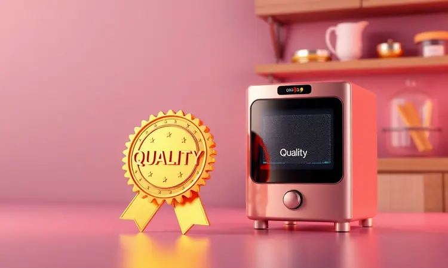
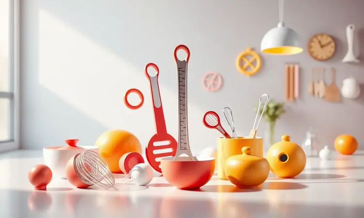

A Britânia é uma das marcas mais tradicionais no mercado brasileiro de eletrodomésticos, e sua linha de fritadeiras sem óleo está entre as mais vendidas e procuradas.

No entanto, com uma gama tão vasta de modelos que vão desde opções compactas para quem mora sozinho até versões "Oven" com alta capacidade para famílias grandes, surge a dúvida comum: a Air Fryer Britânia é boa de verdade?

Para responder a essa pergunta, analisamos a reputação da marca, a tecnologia de seus cestos e o desempenho dos modelos campeões de venda. Se você busca praticidade e quer saber se o investimento vale a pena, este guia completo trará a resposta sincera.

<SummaryList products={frontmatter.top_products} />

## Análise da Marca: A Britânia é Confiável?

A Britânia é uma marca que habita memórias de cozinha há mais de 60 anos. Você provavelmente já viu algum produto deles na casa da sua avó ou em apartamentos de amigos. Essa trajetória se traduz em experiência que fabricantes mais novos ainda estão tentando alcançar.

Os consumidores elogiam consistentemente a durabilidade dessas air fryers, aquela sensação de que o investimento não vai virar sucata em seis meses.

O suporte ao cliente geralmente resolve as questões rapidamente, e quando surgem críticas, normalmente tratam de variações específicas entre modelos. No geral, a Britânia construiu uma reputação de entregar o que promete por um preço que não assusta.

Mas além da confiança na marca, o que realmente importa são as experiências que esses aparelhos criam na sua rotina. E é nos modelos específicos que você descobre qual se encaixa no seu estilo de vida.

### Britânia no Reclame Aqui

Consultando o Reclame Aqui, você encontra um cenário realista: a Britânia mantém um índice razoável de solução de problemas, com avaliações que refletem a satisfação da maioria dos consumidores.

As principais reclamações costumam girar em torno do atendimento ao cliente em situações específicas, não necessariamente sobre a qualidade do produto em si. Isso é importante porque mostra que, mesmo quando algo dá errado, há caminhos para resolver.

### Britânia BFR25P: Prática para quem mora sozinho ou casal

<ProductBox 
  title={frontmatter.top_products[0].title} 
  image={frontmatter.top_products[0].image} 
  link={frontmatter.top_products[0].link} 
/>

Imagine chegar em casa depois do trabalho e em minutos ter batatas fritas crocantes sem aquele cheiro de óleo que impregna a cozinha. A BFR25P transforma essa cena em rotina.

Com seus 4 litros, ela é ideal para refeições a dois ou para quem vive sozinho e não quer sobras para a semana toda.

A tecnologia Air Flow 360º funciona como um chef invisível, garantindo que cada pedaço fique uniformemente dourado, sem aquela frustração de encontrar batatas moles no meio do cesto.

A potência de 1500W significa que você não precisa planejar seu jantar com uma hora de antecedência. E quando terminar, o revestimento antiaderente "Dura Mais" faz a limpeza parecer uma tarefa secundária, não um castigo pós-refeição.

Sim, a tomada de 20 Amperes pode exigir um adaptador dependendo da sua instalação elétrica, mas isso é um detalhe técnico que não tira o brilho da praticidade que ela entrega diariamente.

<CaixaProsContras>

**Prós:**

- Tecnologia Air Flow 360º para cozimento uniforme.

- Revestimento antiaderente facilita a limpeza.

- Excelente para pequenas quantidades de alimentos.

- Timer com desligamento automático para maior segurança.

**Contras:**

- Tomada de 20 Amperes pode precisar de adaptador.

- Não é bivolt, estando disponível apenas em 110V ou 220V.

</CaixaProsContras>

### Britânia Oven BFR2100P: A Melhor Air Fryer Oven da Marca

<ProductBox 
  title={frontmatter.top_products[1].title} 
  image={frontmatter.top_products[1].image} 
  link={frontmatter.top_products[1].link} 
/>

Se sua cozinha precisa ser uma verdadeira central de produção para uma família de quatro ou cinco pessoas, a BFR2100P é como ter um assistente culinário em tempo integral. Com 12 litros de capacidade, ela não apenas frita, mas assa, desidrata e reaquece.

Pense nela preparando frango crocante para o almoço enquanto desidrata maçãs para o lanche das crianças e reaquece a pizza da noite anterior.

O painel digital com 9 funções pré-programadas remove a curva de aprendizado, permitindo que qualquer membro da família prepare refeições consistentes sem consultar manuais.

O design em inox não é apenas estético, ele comunica robustez, aquela sensação de que o aparelho vai acompanhar sua família por anos.

Claro, ele ocupa espaço na bancada, mas quando um único eletrodoméstico substitui três ou quatro, esse espaço se transforma em economia de tempo e organização.

<CaixaProsContras>

**Prós:**

- Multifuncional: assa, frita, desidrata e reaquece.

- Capacidade generosa para preparar grandes quantidades.

- Painel digital com funções práticas.

- Excelente eficiência energética A.

**Contras:**

- Ocupa bastante espaço na bancada.

- Pode liberar fumaça nas primeiras utilizações.

</CaixaProsContras>

### Britânia BFR50 Redstone: Design Eficiente e Revestimento Antiaderente

<ProductBox 
  title={frontmatter.top_products[2].title} 
  image={frontmatter.top_products[2].image} 
  link={frontmatter.top_products[2].link} 
/>

O cesto quadrado da BFR50 Redstone é um daqueles detalhes que parecem simples até você perceber quanto espaço estava desperdiçando com modelos redondos.

Com 5,5 litros, ela consegue acomodar uma quantidade surpreendente de alimentos, ideal para quem quer preparar refeições completas de uma só vez.

Mas o verdadeiro diferencial está no revestimento Redstone com nano cerâmica, que faz com que alimentos naturalmente grudentos como queijo ou batata-doce se soltem sem esforço.

O controle de temperatura entre 80°C e 200°C permite desde desidratar frutas delicadas até conseguir aquela crocância perfeita em asas de frango.

Sim, ela não é a mais silenciosa do mercado, mas quando você está mastigando alimentos crocantes feitos com 80% menos gordura, o zumbido do motor se torna um som de vitória, não de incômodo.

<CaixaProsContras>

**Prós:**

- Excelente capacidade para grandes porções.

- Tecnologia de revestimento que facilita a limpeza.

- Eficiência no preparo de alimentos.

- Design atrativo e moderno.

**Contras:**

- Pode ser um pouco ruidosa durante o funcionamento.

- Não possui algumas funcionalidades avançadas que outras marcas oferecem.

</CaixaProsContras>

### Britânia Gold BFR51: Modelo Prático com Boa Capacidade

<ProductBox 
  title={frontmatter.top_products[3].title} 
  image={frontmatter.top_products[3].image} 
  link={frontmatter.top_products[3].link} 
/>

Para famílias que precisam de praticidade sem complicações, a BFR51 oferece 5,5 litros de capacidade com controles tão intuitivos que até as crianças podem aprender a usar.

O revestimento antiaderente dourado não é apenas estético, ele cria uma superfície que praticamente repele sujeira, transformando a limpeza pós-refeição em uma tarefa de segundos.

A tecnologia Air Flow 360º trabalha para distribuir calor uniformemente, embora alguns usuários notem que para conseguir aquela crocância nível restaurante em todos os alimentos, talvez seja necessário ajustar os tempos.

Mas para o dia a dia familiar, onde consistência e praticidade valem mais que perfeição gourmet, ela entrega exatamente o que promete: refeições mais saudáveis sem trabalho extra.

<CaixaProsContras>

**Prós:**

- Boa capacidade de 5,5 litros, adequada para famílias.

- Revestimento antiaderente que facilita a limpeza.

- Design moderno e compacto.

- Sistema de proteção contra superaquecimento.

**Contras:**

- Fluxo de ar pode não ser tão potente para crocância ideal.

- Controle de temperatura analógico pode ser limitado para alguns usuários.

</CaixaProsContras>

### Britânia Oven BFR2300P: Air Fryer Oven 3 em 1

<ProductBox 
  title={frontmatter.top_products[4].title} 
  image={frontmatter.top_products[4].image} 
  link={frontmatter.top_products[4].link} 
/>

Quando você precisa de versatilidade que acompanhe suas mudanças de humor culinário, a BFR2300P aparece como uma solução 3 em 1. Com 12 litros e 1800W de potência, ela alterna entre fritar, assar e reaquecer como quem troca de canal.

A circulação de ar 360º garante que não importa se você está preparando batatas assadas ou espetinhos de frango, o calor atinge cada centímetro igualmente.

Alguns usuários mencionam que o design interno poderia ser mais robusto, mas isso muitas vezes reflete a escolha de materiais que facilitam a limpeza.

Se você está disposto a tratar o aparelho com o mesmo cuidado que dedica a uma panela antiaderente de qualidade, sua durabilidade surpreende.

E no final, a possibilidade de fazer um bolo, reaquecer lasanha e fritar nuggets no mesmo equipamento justifica qualquer concessão estética.

<CaixaProsContras>

**Prós:**

- Função 3 em 1: frita, assa e reaquece.

- Alta capacidade de 12 litros, ideal para famílias.

- Tecnologia Air Flow para cozimento uniforme.

- Fácil de limpar e manter.

**Contras:**

- Design interno pode parecer menos resistente.

- Controle analógico pode ser menos intuitivo para alguns usuários.

</CaixaProsContras>

### Air Fryer Oven Britânia BAF16A: A Melhor para Famílias Grandes

<ProductBox 
  title={frontmatter.top_products[5].title} 
  image={frontmatter.top_products[5].image} 
  link={frontmatter.top_products[5].link} 
/>

Para famílias numerosas ou para quem adora receber visitas, a BAF16A é menos um eletrodoméstico e mais uma estação de trabalho culinária. Com 16 litros totais (incluindo um cesto de 5,5 litros), ela funciona simultaneamente como fritadeira e forno.

Imagine preparar frango assado enquanto frita batatas na mesma máquina, ou assar um bolo enquanto desidrata bananas para snacks saudáveis.

As 10 funções pré-programadas são como ter um livro de receitas embutido, e a luz interna permite monitorar o cozimento sem abrir a porta e perder temperatura.

Sim, ela requer uma tomada especial de 20A e ocupa espaço considerável, mas quando você está servindo refeições completas para seis ou oito pessoas sem precisar usar o forno tradicional, o fogão e múltiplas panelas, esse espaço se paga em organização e economia de tempo.

<CaixaProsContras>

**Prós:**

- Grande capacidade ideal para famílias numerosas.

- Versatilidade como fritadeira e forno.

- Facilidade na limpeza com revestimento antiaderente.

- Funções pré-programadas que simplificam o uso.

**Contras:**

- Requer tomada de 20A, o que pode não ser adequado para todas as casas.

- Tamanho maior pode ocupar mais espaço na cozinha.

</CaixaProsContras>

### Britânia BFR31: A Mais Compacta e Econômica

<ProductBox 
  title={frontmatter.top_products[6].title} 
  image={frontmatter.top_products[6].image} 
  link={frontmatter.top_products[6].link} 
/>

Se sua cozinha tem o espaço de um apartamento pequeno ou você simplesmente odeia a sensação de eletrodomésticos dominando o balcão, a BFR31 é sua aliada.

Com apenas 3 litros, ela é perfeita para aquelas refeições rápidas: uma porção de batatas fritas para acompanhar o hambúrguer, nuggets para as crianças, ou legumes assados para um jantar leve.

Os 1300W podem parecer modestos comparados a modelos maiores, mas para as quantidades que ela prepara, são mais que suficientes. O controle de temperatura preciso permite desde descongelar pães até conseguir aquela crocância perfeita em alimentos pequenos.

E quando tudo termina, o cesto removível vai direto para a pia sem complicações. É o tipo de praticidade que faz você usar o aparelho quase todos os dias, não apenas em ocasiões especiais.

<CaixaProsContras>

**Prós:**

- Design compacto ideal para cozinhas pequenas

- Prepara alimentos de forma saudável com pouco óleo

- Controle de temperatura preciso

- Fácil de limpar com cesto antiaderente

**Contras:**

- Potência pode ser inferior a outros modelos

- Capacidade pode ser limitada para famílias maiores

</CaixaProsContras>

### Bella Cuccina BCFR05: Design Diferenciado no Portfólio

<ProductBox 
  title={frontmatter.top_products[7].title} 
  image={frontmatter.top_products[7].image} 
  link={frontmatter.top_products[7].link} 
/>

Para quem acredita que eletrodomésticos também são peças de decoração, a BCFR05 traz um design que conversa com cozinhas modernas.

Com 12 litros de capacidade total e cesto de 2,7 litros, ela oferece flexibilidade interessante: você pode usar apenas o cesto para refeições menores ou a capacidade total para preparações maiores.

A faixa de temperatura de 70°C a 230°C é particularmente útil para quem explora técnicas como desidratação em baixa temperatura ou assados em alta.

As grelhas ajustáveis em três níveis permitem otimizar o espaço interno, como assar bolo em um nível enquanto desidrata frutas em outro. A bandeja coletora é um daqueles detalhes inteligentes que você só percebe a importância quando já está usando.

A potência varia conforme o modelo, então verifique as especificações exatas, mas no geral, ela representa a parte do portfólio Britânia que conversa com quem valoriza estética tanto quanto funcionalidade.

<CaixaProsContras>

**Prós:**

- Design moderno e atraente.

- Grande capacidade para diversas preparações.

- Controle de temperatura preciso.

- Facilita a limpeza com bandeja coletora.

**Contras:**

- Potência pode variar entre modelos.

- Pode ocupar mais espaço em cozinhas menores.

</CaixaProsContras>

## O que ficar de olho na hora de escolher sua Air Fryer?

Escolher uma air fryer vai além de comparar preços e cores. É sobre entender qual modelo se adapta ao seu ritmo de vida, ao espaço que você tem disponível e às refeições que realmente prepara.

Vamos além das especificações técnicas para os critérios que realmente importam na prática.

### Capacidade do Cesto e Dimensões Externas

Pense na capacidade não apenas em litros, mas em cenas do seu cotidiano. Um cesto de 3 litros é suficiente para aquela pizza congelada depois do trabalho ou nuggets para as crianças.

Já 5,5 litros acomodam um frango inteiro ou porções generosas para três ou quatro pessoas. Os 12 a 16 litros das versões Oven transformam-se em capacidade para festas em família sem precisar fazer várias levas.

As dimensões externas, por sua vez, determinam se o aparelho vive escondido no armário ou se torna um companheiro permanente na bancada. Modelos compactos da Britânia geralmente cabem em espaços que você nem sabia que tinha disponível.

### Potência, Consumo e Ruídos de Funcionamento

A potência entre 1400 e 2000 watts se traduz em tempo: quanto mais potente, mais rápido seus alimentos ficam prontos. Mas isso não significa necessariamente maior consumo, pois o tempo de uso é menor.

Comparadas com fornos tradicionais que precisam pré-aquecer por 15 minutos, as air fryers começam a trabalhar imediatamente. Quanto aos ruídos, pense neles como o som do trabalho sendo feito, não como um incômodo.

A maioria dos modelos opera com um zumbido constante similar a um ventilador, mas nunca ao ponto de impedir uma conversa na mesma sala.

### Limpeza após o uso e Qualidade do Antiaderente

A limpeza é onde muitas promessas de praticidade caem por terra, mas não com as Britânia. As partes removíveis não apenas vão à máquina de lavar louça, elas foram projetadas para caber nela sem ocupar metade do espaço.

O antiaderente de qualidade faz diferença nas pequenas coisas: não precisa esfregar por cinco minutos para remover queijo derretido ou massa de bolo que grudou. É a diferença entre lavar louça como obrigação e como um detalhe rápido entre uma refeição e outra.

### Temperatura Externa e Comprimento do Fio

Segurança parece um tópico técnico até você ter crianças em casa ou animais de estimação curiosos. Os revestimentos que mantêm a superfície fria não são apenas um detalhe de engenharia, são paz de espírito.

O comprimento do fio, por sua vez, decide se você fica refém da tomada mais próxima ou se tem liberdade para posicionar o aparelho onde faz mais sentido no fluxo da sua cozinha.

Um fio mais longo pode parecer insignificante até o dia em que você precisa reorganizar tudo para um jantar especial.

## Perguntas Frequentes (FAQ)

Quando as especificações técnicas não respondem todas as dúvidas, a experiência de quem já usou fala mais alto.

A durabilidade das Britânia frequentemente surpreende positivamente, com relatos de aparelhos que seguem funcionando perfeitamente depois de anos de uso regular.

A limpeza realmente é tão simples quanto parece, especialmente se você segue o conselho básico de limpar enquanto ainda está morna.

E no final, o que mais importa não está nas folhas de especificações, mas naquelas avaliações de pessoas reais contando como o aparelho se inseriu em suas rotinas.

## Conclusão

A Air Fryer Britânia é muito mais do que um eletrodoméstico, é um facilitador de rotinas. Ela representa aquela mudança pequena mas significativa que transforma "preciso cozinhar" em "vou preparar algo gostoso e saudável sem trabalho".

Dos modelos compactos que cabem em qualquer cantinho às versões Oven que assumem múltiplas funções na cozinha, há uma opção para cada tipo de cozinheiro, cada tamanho de família, cada orçamento.

O que une todos esses modelos é a promessa cumprida da Britânia: produtos que funcionam como anunciado, duram mais do que o esperado e simplificam o dia a dia sem exigir que você se torne um expert em tecnologia culinária.

Se você procura reduzir o consumo de óleo sem abrir mão do sabor, ganhar tempo na cozinha sem perder qualidade, ou simplesmente tornar as refeições mais práticas, alguma das air fryers Britânia certamente encontrará seu lugar na sua rotina.

O investimento não se paga apenas em economia de energia ou ingredientes, mas naquelas horas extra que você ganha para fazer o que realmente importa, enquanto suas refeições ficam prontas quase que por magia.