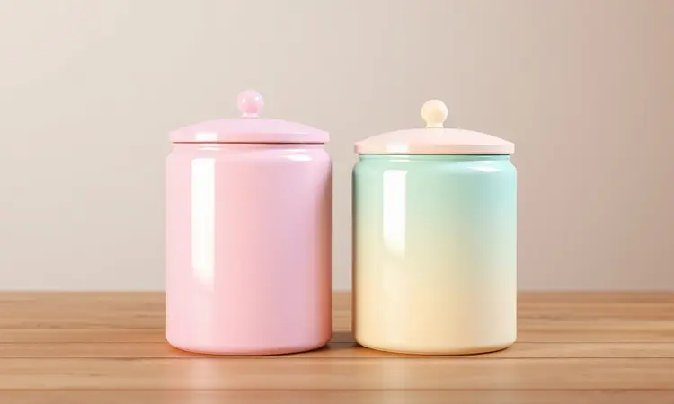
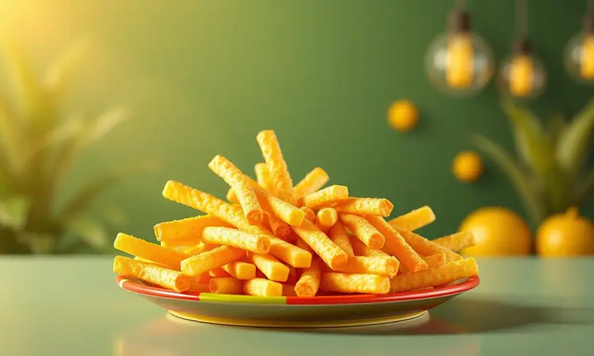

Ter uma alimentação saudável sem abrir mão da praticidade é o desejo de muitos, e as fritadeiras sem óleo se tornaram aliadas indispensáveis nessa missão.

Se você está considerando comprar uma Fritadeira Elétrica Cadence, certamente já percebeu que a marca se destaca pelo design moderno e pelo excelente custo-benefício.

No entanto, com tantas opções de tamanhos e funções, surge a dúvida: qual o modelo ideal para a minha rotina?

Neste guia definitivo, vamos explorar os principais modelos da Cadence, entender suas funcionalidades e dar dicas práticas para você extrair o máximo de sabor e durabilidade do seu aparelho.

<SummaryList products={frontmatter.top_products} />

## Por que Escolher uma Fritadeira Elétrica Cadence?

Imagina acordar com aquele cheirinho de bacon crocante, mas sem a gordura que ficaria na panela... Ou querer uma batata frita que realmente satisfaz, mas não deixa aquele peso no estômago? É exatamente esse equilíbrio que a Cadence busca entregar.

A marca transformou a ideia de 'fritadeira' em um verdadeiro ajudante de cozinha multifuncional.

O que mais conquista é como elas resolvem problemas do dia a dia: cestos removíveis que pulam direto para a pia depois do jantar, tecnologia de ar quente que reduz a gordura em até 80%, e aquela versatilidade que permite ir do frango assado a um bolo de caneca em minutos.

Se você deseja simplificar sua rotina sem abrir mão do sabor autêntico, essa conversa vai fazer muito sentido.

## Como Funciona a Tecnologia das Fritadeiras sem Óleo da Marca?

Você já se perguntou como é possível fritar sem óleo? O segredo está em algo que parece mágica, mas é pura física: a convecção. Imagine um vento de calor que circula em alta velocidade dentro da fritadeira, envolvendo cada pedaço de alimento e cozinhando por igual.

É como se o ar quente fosse milhares de microgotas quentes que substituem o óleo.

Isso significa que o resultado é a mesma crocância por fora e maciez por dentro que você adora nas frituras tradicionais, mas sem aquela gordura extra que fica no fundo do prato.

A tecnologia vai além: tem temporizadores que garantem o ponto perfeito e controles de temperatura que transformam o aparelho em um verdadeiro chef assistente na sua bancada.

## Principais Diferenciais das Air Fryers Cadence

Enquanto muitas marcas oferecem apenas a função básica, a Cadence elevou o jogo com diferenciais que fazem diferença na rotina real das pessoas. Primeiro, pense na versatilidade: um só aparelho que frita, assa, grelha e até torra.

É como ter quatro eletrodomésticos em um só espaço na sua cozinha.

Depois, tem aquele design que não esconde na gaveta: os modelos vêm com acabamentos modernos que conversam com sua decoração, do Rosé Gold ao preto fosco que não marca dedo. E o melhor?

O revestimento antiaderente das peças faz a limpeza ser tão rápida que você quase nem percebe que usou. É eficiência que não pesa no bolso nem no espaço.

## Análise dos Melhores Modelos de Fritadeira Cadence

Com tantos diferenciais, a dúvida seguinte é natural: qual modelo escolher? A Cadente criou uma linha pensada para diferentes realidades e necessidades.

Vamos conhecer os protagonistas dessa história, desde o compacto perfeito para solteiros até o modelo família que substitui até o forno convencional.

### 1. Fritadeira Sem Óleo 3,8L Cadence Super Cook Fryer FRT410

<ProductBox 
  title={frontmatter.top_products[0].title} 
  image={frontmatter.top_products[0].image} 
  link={frontmatter.top_products[0].link} 
/>

Ideal para quem busca o equilíbrio perfeito entre tamanho e desempenho, a FRT410 é aquele companheiro de cozinha que não ocupa espaço, mas entrega resultados de restaurante.

Com 3,8 litros, ela prepara o suficiente para duas a três pessoas com tranquilidade - pense naquele frango assado de domingo acompanhado de batatas douradas.

Os 1300W de potência garantem que o calor chegue rápido, economizando tempo e energia.

Mas o que realmente conquista é o controle total: temperatura regulável de 80°C a 200°C (perfeito para desidratar frutas ou fritar empanados) e timer de até 60 minutos com desligamento automático. Imagine programar o tempo certo e sair da cozinha sem preocupação.

O cesto removível e a superfície antiaderente transformam a limpeza em questão de minutos, mas vale lembrar: evite produtos abrasivos para manter o acabamento impecável por anos. É versatilidade que cabe no seu orçamento e no seu estilo de vida.

### 2. Fritadeira Sem Óleo 3L Cadence Dream Rosé Gold FRT527

<ProductBox 
  title={frontmatter.top_products[1].title} 
  image={frontmatter.top_products[1].image} 
  link={frontmatter.top_products[1].link} 
/>

Para quem acredita que eletrodomésticos também devem ser objetos de decoração, a Dream Rosé Gold é um sonho realizado. O tom rosé dourado ilumina qualquer bancada de cozinha, mas a beleza vai muito além da aparência.

Com seus 3 litros, ela é perfeita para casais ou pequenas famílias que querem praticidade com requinte.

O painel digital intuitivo oferece 7 programas pré-configurados - basta escolher 'frango', 'legumes' ou 'bolo' e deixar a tecnologia trabalhar. São 1250W de potência que aquecem rapidamente, garantindo consistência em cada preparo.

A grelha removível facilita tanto a lavagem que você quase não percebe o trabalho extra.

Uma dica preciosa: na primeira utilização, passe um pouco de óleo no interior do cesto. Esse simples cuidado forma uma película protetora que preserva o revestimento antiaderente por muito mais tempo. Estilo e funcionalidade nunca combinaram tão bem.

### 3. Fritadeira Sem Óleo 4,2L Cadence Delicook Fryer FRT550

<ProductBox 
  title={frontmatter.top_products[2].title} 
  image={frontmatter.top_products[2].image} 
  link={frontmatter.top_products[2].link} 
/>

Quando a família cresce ou as visitas são frequentes, a capacidade extra faz toda diferença. A Delicook Fryer com seus 4,2 litros é a solução para quem não quer preparar alimentos em rodadas múltiplas.

Imagine assar um frango inteiro acompanhado de diversas porções de batatas e legumes - tudo de uma só vez.

Os 1350W proporcionam aquecimento rápido e uniforme, enquanto o seletor de temperatura (80°C a 200°C) e o timer de 60 minutos oferecem controle de restaurante na sua cozinha.

Mas o verdadeiro segredo está no sistema Easy Clean: a grelha especial foi projetada para que os resíduos não grudem, tornando a limpeza tão simples quanto lavar um prato.

Compacta mesmo com maior capacidade, ela se adapta a diferentes espaços com elegância. Perfeita para uso doméstico intenso, mas ainda assim prático e acessível.

### 4. Fritadeira 9L Cadence Classicook Forno e Fryer (Modelo de Alta Capacidade)

<ProductBox 
  title={frontmatter.top_products[3].title} 
  image={frontmatter.top_products[3].image} 
  link={frontmatter.top_products[3].link} 
/>

Quando a necessidade vai além das frituras e entra no território dos fornos convencionais, a Classicook redefine o que significa 'versátil'.

Com impressionantes 9 litros de capacidade, ela substitui com vantagem os fornos elétricos de bancada, unindo o melhor dos dois mundos.

Os 1500W de potência garantem que a temperatura ideal seja atingida rapidamente, seja para assar uma lasanha cremosa ou fritar batatas crocantes.

O design retrô com visor transparente é um charme à parte - você monitora o processo de cozimento sem abrir a tampa e interromper o fluxo de calor.

As prateleiras e grelhas ajustáveis são o grande diferencial: prepare diferentes pratos simultaneamente, organizando legumes na parte de baixo e proteínas na superior. Uma dica essencial: na primeira vez que usar, unte levemente os acessórios com óleo.

Esse pequeno ritual inicial promove uma vida útil muito mais longa ao revestimento.

Para famílias maiores ou quem adora receber amigos, é o investimento que mais entrega espaço, funcionalidade e economia de energia.

## Guia de Compra: Como Escolher a Fritadeira Ideal?

Depois de conhecer os modelos, como tomar a decisão certa? Escolher uma fritadeira vai além das especificações técnicas - é sobre encontrar o aparelho que conversa com sua rotina, seu espaço e seus hábitos alimentares. Vamos transformar números em experiências reais.

### Capacidade em Litros: Do Individual ao Familiar

Pense em quantas pessoas você costuma cozinhar. Se a resposta é 'apenas para mim na maioria dos dias', modelos de 2 a 3 litros são mais do que suficientes.

Eles preparam aquela porção perfeita de batatas fritas para o filme da noite ou o filé de frango do almoço rápido sem desperdício.

Agora, se sua casa tem mais vozes pedindo comida, a partir de 3,8 litros você ganha flexibilidade. São volumes que permitem preparar refeições completas de uma só vez: proteína, acompanhamento e até aquele pão de alho especial para acompanhar.

Lembre-se: capacidade maior não significa sempre melhor - significa mais adequado à sua realidade.

### Potência e Consumo de Energia

Entre 1.200 e 2.200 watts, as fritadeiras Cadence garantem aquecimento rápido, mas a potência ideal depende do que você precisa. Para preparações mais simples e porções menores, 1.300W proporcionam excelente eficiência sem pesar na conta de luz.

Se você planeja usar o aparelho como substituto frequente do forno, modelos próximos de 1.500W entregam performance robusta.

O consumo de energia não é exorbitante quando usado com inteligência - fritadeiras trabalham com ciclos rápidos de cozimento, o que significa menos tempo ligadas que um forno convencional.

## O que Você Pode Preparar na sua Cadence? Ideias de Receitas Práticas

Agora vem a parte divertida: desbravar todas as possibilidades. Sua Cadence é muito mais que uma 'fritadeira' - é um laboratório culinário compacto. Comece com o clássico irresistível: batatas cortadas em palitos finos, um fio de azeite e 15 minutos em 200°C.

Crocância garantida sem a gordura que sobra no fundo do pacote.

Explore o mundo das carnes: filés de frango empanados com farinha de rosca e ervas, nuggets caseiros que as crianças vão adorar, ou costelinhas de porco que derretem na boca. Mas não pare por aí.

As leguminosas ganham nova vida: brócolis e couve-flor com um toque de alho desidratado ficam com textura perfeita. E quem disse que não dá para ser doce? Experimente fatias de banana com canela ou minibolos de caneca que ficam prontos enquanto o café esquenta.

A criatividade é sua única limitação - e o melhor: cada experimento sai mais saudável que a versão tradicional.

## Guia de Limpeza e Manutenção: Como Manter sua Air Fryer Sempre Nova

Um aparelho limpo é um aparelho que dura. E com a Cadence, a manutenção é tão simples quanto o uso. A regra de ouro: lave o cesto depois de cada utilização com água morna e detergente neutro. Esqueça produtos químicos agressivos - uma esponja macia resolve quase tudo.

Mensalmente, faça uma limpeza mais profunda nas partes fixas com um pano úmido. Esse ritual rápido previne o acúmulo de resíduos que poderiam afetar o desempenho a longo prazo.

E quando desmontar as peças, você descobre como cada parte foi pensada para facilitar seu dia.

### Passo a Passo para uma Higienização Eficaz e Segura

Primeiro, desconecte da tomada e espere o aparelho esfriar completamente. Segurança em primeiro lugar sempre. Remova o cesto, a grelha e todas as partes desmontáveis - essa é a beleza do design da Cadence, tudo se solta com facilidade.

Na pia, use água morna (não fervente) e detergente neutro. Seque bem com um pano macio antes de guardar, evitando umidade que poderia danificar componentes internos.

Para aquelas manchas mais persistentes que às vezes aparecem, uma pasta de bicarbonato de sódio com água funciona como mágica: aplique, deixe agir por alguns minutos e retire suavemente.

O segredo está na constância: cinco minutos de cuidado após cada uso garantem anos de desempenho impecável.

## Erros Comuns ao Usar a Fritadeira Elétrica e Como Evitá-los

Mesmo com tanta tecnologia, alguns deslizes podem atrapalhar o resultado final. O mais comum? Lotar demais o cesto. Quando os alimentos ficam muito apertados, o ar quente não circula adequadamente, resultando em partes cruas e outras queimadas.

A solução é simples: respeite o espaço, prepare em lotes se necessário.

Outro erro frequente é pular o pré-aquecimento. Aqueça por 3 a 5 minutos antes de colocar os alimentos - isso garante que o processo comece na temperatura correta, selando os sabores e texturas desde o primeiro minuto.

E sobre o óleo: mesmo nas fritadeiras 'sem óleo', um borrifo rápido de azeite ou spray culinário faz milagres na crocância final. É a quantidade mínima que maximiza o sabor.

## Perguntas Frequentes sobre Fritadeiras Cadence (FAQ)

Depois de tudo isso, algumas dúvidas ainda podem pairar no ar. A capacidade varia realmente conforme a necessidade: de 2 litros para quem mora sozinho até 9 litros para famílias grandes ou anfitriões frequentes.

A boa notícia é que há um modelo perfeito para cada cenário.

Sobre limpeza: a maioria das peças removíveis é compatível com máquinas de lava-louça (verifique sempre o manual do seu modelo específico). Essa praticidade transforma o pós-cozimento em algo quase automático.

E os recursos técnicos? Controles de temperatura precisos e programas pré-definidos não são apenas conveniência - são garantia de resultados consistentes a cada uso, mesmo quando você está explorando receitas novas.

## Conclusão

Escolher uma Fritadeira Elétrica Cadence é decidir investir em mais qualidade de vida na cozinha. Não se trata apenas de um eletrodoméstico, mas de um aliado que transforma hábitos alimentares sem exigir sacrifícios de sabor ou praticidade.

Dos modelos compactos que cabem em qualquer espaço aos versáteis que substituem múltiplos aparelhos, existe uma opção que conversa exatamente com sua rotina.

Os diferenciais vão além das especificações técnicas: é sobre ter mais tempo livre porque a limpeza é rápida, sobre experimentar receitas sem medo porque os controles são intuitivos, sobre reunir a família em torno de refeições mais saudáveis que ainda trazem aquele prazer genuíno da comida bem-feita.

Agora que você conhece cada modelo, entende a tecnologia por trás e já imagina as receitas que vai preparar, a decisão final se torna mais clara. Qual Cadence vai transformar sua cozinha?

O primeiro passo é reconhecer que uma escolha inteligente hoje significa anos de praticidade, saúde e descobertas culinárias pela frente.