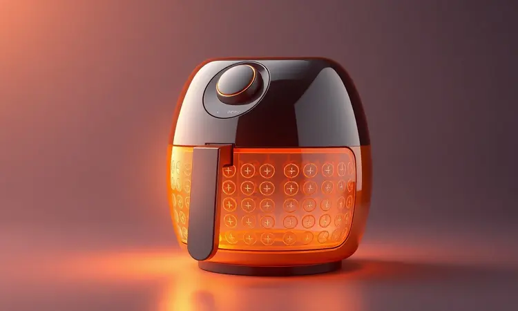
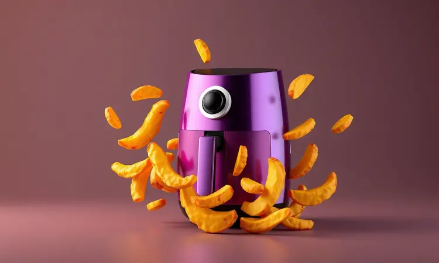
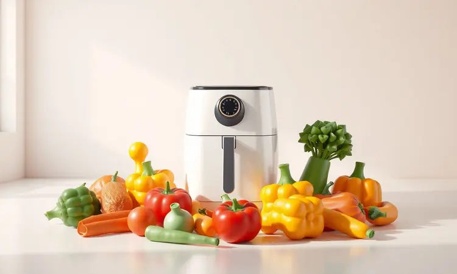
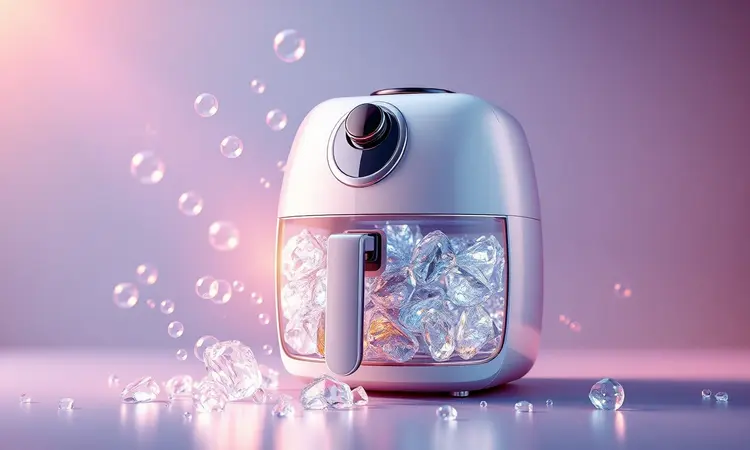

Você finalmente comprou sua Air Fryer e está ansioso para testar todas aquelas receitas crocantes que vê na internet, mas bateu aquela insegurança sobre como começar? Você não está sozinho.

Embora pareça simples, usar a fritadeira elétrica do jeito certo vai muito além de apenas apertar um botão. Envolve cuidados que garantem a durabilidade do aparelho e, mais importante, a segurança da sua família.

Neste guia definitivo, você vai aprender o passo a passo completo, desde o processo obrigatório antes do primeiro uso até truques avançados para deixar qualquer alimento com textura de frito, sem usar óleo. Prepare-se para dominar sua Air Fryer de uma vez por todas.

<SummaryList products={frontmatter.top_products} />

## Antes de Ligar: O Ritual da "Cura" do Antiaderente

Antes de qualquer receita, há um ritual essencial: a cura da superfície antiaderente. Este não é um capricho, mas uma garantia.

Ao aquecer o aparelho vazio a uma temperatura alta, você ativa a camada protetora da fritadeira, eliminando resíduos de fabricação e garantindo que sua primeira batata frita venha com sabor puro, não com cheiro de plástico novo.

### Por que e como fazer a cura da sua Air Fryer nova?

O processo é simples, mas seu impacto é duradouro. Ligue sua Air Fryer vazia em uma temperatura entre 200°C e 220°C e deixe-a trabalhar por 15 a 30 minutos.

O calor vai estabilizar a superfície antiaderente, criando uma barreira mais eficiente contra resíduos e garantindo que o sabor dos seus alimentos seja o protagonista. Após esse tempo, desligue, espere esfriar completamente e passe um pano úmido por dentro. Pronto.

Seu aparelho está sacramentado e preparado para anos de crocância.

## Passo a Passo: Como Usar a Air Fryer Pela Primeira Vez

Com a cura feita, chegou a hora da verdade. Comece lavando apenas a cesta e a bandeja removíveis com água morna e sabão neutro. Não lave a unidade principal. Em seguida, já podemos ligar.

Pré-aqueça o aparelho por alguns minutos, coloque os alimentos na cesta, ajuste tempo e temperatura, e inicie o ciclo. Parece direto, mas dois detalhes fazem toda a diferença entre o sucesso e a frustração.

### Escolhendo o local seguro e arejado para o aparelho

Pense no local como um parceiro de cozinha. Sua Air Fryer precisa de espaço para respirar. Escolha uma superfície estável, longe de cortinas, toalhas ou qualquer material inflamável. Deixe pelo menos 10 centímetros de espaço livre em todos os lados.

Isso não é apenas uma dica de segurança, é a chave para que o ar quente circule de forma livre e uniforme, garantindo que cada milímetro do seu frango fique igualmente dourado.

Evite colocá-la debaixo de armários, pois o vapor pode danificar a madeira e prejudicar o desempenho.

### Entendendo os controles: Temperatura vs. Tempo de Preparo

Aqui está onde você passa de usuário para chef. A temperatura (geralmente entre 160°C e 200°C) e o tempo são uma dupla dinâmica. Eles não funcionam isoladamente. Carnes mais densas pedem temperaturas altas e tempos mais longos para selar os sucos por dentro.

Vegetais e snacks exigem menos: uma temperatura média e poucos minutos para uma crocância rápida que preserva os nutrientes.

Dominar essa relação é o que transforma o cozimento de uma tarefa em uma ciência exata, onde o resultado é sempre crocante por fora e perfeito por dentro.

## 7 Dicas de Ouro para Alimentos Mais Crocantes e Saborosos

Dominados os fundamentos, é hora de elevar o jogo. Estas dicas são o divisor de águas entre uma comida feita na Air Fryer e uma experiência gastronômica.

### 1. O segredo do pré-aquecimento (e quando ele é indispensável)

O pré-aquecimento é o aperto de mãos entre o aparelho e seu alimento. Esses 3 a 5 minutos extras garantem que o choque térmico seja imediato. Assim, a superfície do alimento sela na hora, prendendo a umidade interior e criando uma crosta irresistível.

Para batatas fritas, nuggets ou qualquer coisa empanada, pular esta etapa é abrir mão da textura dos seus sonhos.

### 2. A regra de ouro: Não lote o cesto!

Imagine tentar secar roupa em um varal superlotado. Algumas peças ficam úmidas, outras secam demais. Na Air Fryer, a lógica é a mesma. O ar quente precisa de caminhos livres para circular.

Quando você amontoa os alimentos, cria zonas frias onde a comida fica mole e zonas quentes onde queima. O resultado? Uma porção desigual e frustrante. A solução é simples e garantida: cozinhe em porções menores.

Vale mais a pena fazer duas levas perfeitas do que uma única leva decepcionante.

### 3. O uso estratégico do óleo: Pulverizadores e pincéis

<ProductBox 
  title={frontmatter.top_products[0].title} 
  image={frontmatter.top_products[0].image} 
  link={frontmatter.top_products[0].link} 
/>

A magia de um frito sem óleo exige um toque preciso. Um pulverizador (garrafa spray) é seu melhor aliado.

Ele aplica uma névoa fina e uniforme de óleo, que é o suficiente para ativar a reação de Maillard (responsável pelo dourado e pelo sabor) sem deixar os alimentos pesados ou encharcados.

Pincéis de silicone com reservatório também funcionam bem, dando um controle manual charmoso. A meta não é fritar, é vestir levemente o alimento para que o ar quente trabalhe sua magia.

### 4. Agitar ou virar: O truque para o cozimento uniforme

Mesmo com o ar circulando, alguns alimentos têm um lado mais teimoso. Por isso, na metade do tempo de cozimento, faça uma pausa rápida. Abra a gaveta, agite a cesta ou vire aqueles bifes e hambúrgueres.

Este simples movimento de 10 segundos garante que cada centímetro receba seu momento de glória sob o calor, eliminando pontos crus e entregando uma crocância homogênea de ponta a ponta.

## O que Pode e o que NÃO Pode Colocar na Air Fryer?

Sua criatividade tem limites saudáveis. A Air Fryer é versátil, mas não é uma panela de pressão nem um forno micro-ondas. Conhecer seus limites protege seu aparelho e sua paz.

### Acessórios permitidos: Formas de silicone, vidro e cerâmica

<ProductBox 
  title={frontmatter.top_products[1].title} 
  image={frontmatter.top_products[1].image} 
  link={frontmatter.top_products[1].link} 
/>

Para expandir seu cardápio, você pode usar acessórios seguros para forno. Formas de silicone flexíveis são ideais para muffins e mini bolos. Recipientes de vidro refratário ou cerâmica resistente a altas temperaturas também são permitidos.

A regra é clara: se pode ir ao forno convencional, pode ir à Air Fryer. Só evite vidro comum (pode estourar) e sempre confira se o item cabe sem tocar na resistência superior.

### Papel alumínio e papel manteiga: Como usar com segurança?

<ProductBox 
  title={frontmatter.top_products[2].title} 
  image={frontmatter.top_products[2].image} 
  link={frontmatter.top_products[2].link} 
/>

Papel alumínio pode ser um salvador para alimentos suculentos que soltam muito líquido, como peixes. A chave é não criar uma barreira. Nunca cubra toda a cesta.

Faça uma "cama" pequena para o alimento ou envolva-o solto, mas sempre deixando espaço para o ar circular pelos lados. Papel manteiga comum é arriscado, pode voar e tocar na resistência. Prefira versões específicas para Air Fryer, que são perfuradas para ventilação.

### Alimentos proibidos: O que pode causar sujeira extrema ou danos

Alguns ingredientes são convites para a dor de cabeça. Massas líquidas (como a de panqueca ou tempurá) vazam e podem causar curtos-circuitos. Queijos derretidos soltos podem pingar e queimar no fundo, criando uma fumaça densa e uma limpeza hercúlea.

Alimentos com casca muito úmida ou recheios aquosos (como tomates inteiros) podem "explodir". Pense sempre: se solta muita água ou gordura de forma descontrolada, é melhor usar o forno tradicional.

## Manutenção e Limpeza: Como Fazer o Aparelho Durar Anos

O segredo da longevidade está no cuidado pós-festa. Uma limpeza rápida após cada uso é o ritual que mantém seu aparelho sempre como novo.

### Como limpar a gordura grudada sem riscar o teflon

A gordura ressecada parece uma missão impossível, mas não é. Desligue e espere o aparelho esfriar completamente. Em uma tigela, misture água morna com algumas colheres de vinagre branco. Mergulhe a cesta e a bandeja nesta solução por 15 minutos.

O vinagre vai desgrudar os resíduos sem agredir. Depois, use apenas uma esponja macia (a parte amarela) ou um pano de microfibra. Esqueça palhas de aço e produtos químicos agressivos. Eles são os inimigos do revestimento antiaderente.

### Limpeza da resistência: O que fazer quando a parte de cima acumula gordura?

Com o tempo, gotículas de gordura podem subir e grudar no elemento de aquecimento, na parte superior interna do aparelho. Se notar acúmulo, a ação é delicada. Desconecte da tomada e esfrie completamente.

Umedeça um pano macio com água morna e detergente neutro, torça bem para não pingar, e passe suavemente na superfície visível da resistência. Não pressione. O objetivo é remover o excesso sem danificar as hélices ou o elemento.

Deixe secar bem ao ar livre antes do próximo uso.

## Solução de Problemas Comuns (FAQ)

Pequenos contratempos acontecem, mas a solução geralmente está a um passo de distância.

### Minha Air Fryer está soltando fumaça branca, o que fazer?

Fumaça branca é quase sempre um sinal de gordura acumulada que está queimando no fundo do aparelho ou na resistência. A primeira ação é desligar e deixar esfriar.

Faça uma limpeza profunda na cesta, bandeja e dê aquela olhada na resistência superior conforme a dica anterior.

Na próxima vez, evite alimentos muito gordurosos (como bacon puro) sem colocar um pouco de água na bandeja inferior para capturar os pingos, e sempre seque bem vegetais aquosos antes de cozinhar.

### Por que a comida ficou murcha ou com gosto de plástico?

Textura murcha é um clássico sinal de excesso de umidade ou falta de pré-aquecimento. Se você colocou legumes ou batatas sem secá-los bem, eles cozinham no vapor que criam, ficando moles.

O pré-aquecimento falho não sela a superfície, permitindo que a umidade escape e deixe o alimento sem crocância.

Já o gosto de plástico é mais raro, mas pode vir de acessórios de baixa qualidade que não são termorresistentes ou, em casos extremos, de não ter feito o processo de cura inicial. Sempre use utensílios específicos para forno e siga o ritual da primeira vez.

## Conclusão

Dominar sua Air Fryer é uma jornada que vai da ansiedade da primeira ligada à confiança de quem comanda a cozinha.

Você começou aprendendo a preparar o aparelho, passou pelos cuidados essenciais de segurança e entendimento dos controles, e chegou às técnicas refinadas que transformam ingredientes simples em experiências crocantes.

Mais do que um eletrodoméstico, ela se torna uma extensão da sua criatividade, permitindo explorar sabores com uma praticidade que se encaixa na rotina.

A limpeza simples e os resultados consistentes garantem que, com cada uso, essa ferramenta se consolide não como mais um gadget, mas como um verdadeiro aliado culinário.

Agora é colocar a mão na massa (ou nas batatas) e descobrir, na prática, como cada dica deste guia se transforma em pratos mais saborosos, saudáveis e impressionantes. Sua cozinha nunca mais será a mesma.