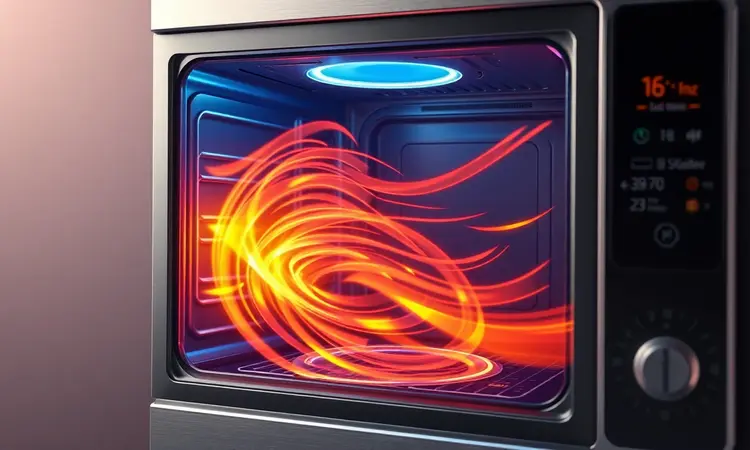
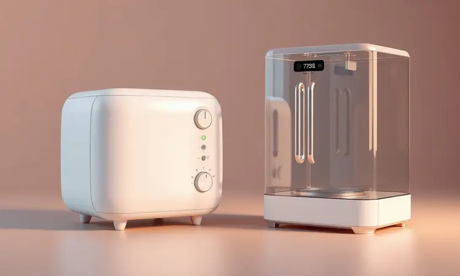

Você adora o sabor irresistível de uma fritura, mas se sente culpado pelas calorias extras ou odeia a sujeira de óleo espalhada pela cozinha? Você não está sozinho; essa é a dúvida de milhares de brasileiros que buscam praticidade no dia a dia.

Neste guia definitivo, vamos desvendar se a Air Fryer realmente consegue entregar a mesma textura que a fritadeira tradicional e qual delas oferece o melhor custo-benefício para sua rotina.

Você vai aprender as diferenças técnicas, os impactos na saúde e verá uma análise dos melhores modelos do mercado para não errar na compra.

<SummaryList products={frontmatter.top_products} />

## Air Fryer vs. Fritadeira Tradicional: O Duelo das Cozinhas Modernas

Imagina ficar entre duas filosofias de cozinha. De um lado, a praticidade moderna que promete crocância com menos culpa. Do outro, o método testado pelo tempo que entrega aquele sabor inconfundível das frituras de infância.

Essa escolha está se tornando cada vez mais comum nas cozinhas brasileiras, e não se trata apenas de um equipamento, mas sim de como você quer viver sua relação com a comida.

A Air Fryer utiliza a circulação de ar quente para cozinhar os alimentos, resultando em pratos crocantes com até 80% menos óleo.

Enquanto isso, a fritadeira tradicional oferece sabores mais intensos e texturas que muitos consideram insubstituíveis, especialmente em receitas clássicas. A verdadeira questão é: o que tem mais peso na sua rotina?

A busca por uma alimentação mais leve ou a nostalgia da fritura perfeita?

## Como funciona a Air Fryer? A mágica da convecção de ar quente

Parece mágica, mas é pura física. A Air Fryer funciona como um forno de convecção superpotente e compacto.

Em vez de submergir os alimentos em óleo, ela circula ar quente em alta velocidade, criando uma camada crocante por fora enquanto mantém o interior macio e suculento. Imagine conseguir aquela cor dourada perfeita nas batatas usando apenas uma colher de sopa de óleo.

Esse processo não apenas reduz drasticamente a gordura necessária, mas também acelera o tempo de cocção. E o melhor: muitas dessas fritadeiras modernas vêm com funcionalidades extras, como assar e grelhar, transformando-se em verdadeiras ajudantes de cozinha.

A facilidade de limpeza, com peças removíveis e laváveis na máquina de louça, é o toque final que conquista até os mais relutantes.

## Fritadeira Tradicional: Por que ela ainda é a favorita dos restaurantes?

Entre em qualquer cozinha profissional e você verá por quê. A fritadeira tradicional atinge altas temperaturas rapidamente, garantindo que cada pedaço de frango empanado ou porção de batata frita saia com a casquinha dourada perfeita.

Ela pode lidar com volumes impressionantes ao mesmo tempo, essencial para atender dezenas de pedidos em poucos minutos.

O sistema de fritura em óleo quente cria uma reação química única, a famosa reação de Maillard, responsável por texturas e aromas que simplesmente não se reproduzem de outras formas.

Mesmo com todo o avanço tecnológico, quando um cliente pede uma batata frita tradicional, restaurantes sabem que só há um caminho para satisfazer essa expectativa.

## Comparativo Direto: Onde cada uma ganha?

A escolha final depende de quais aspectos mais importam na sua rotina. A Air Fryer brilha na redução de óleo e na praticidade pós-uso, enquanto a fritadeira tradicional continua imbatível quando o assunto é entregar a experiência sensorial completa da fritura.

### 1. Saúde e Valor Nutricional: A vitória do ar quente

Se você anda monitorando sua ingestão de gordura, a Air Fryer se apresenta como sua maior aliada. Enquanto uma fritadeira convencional pode consumir até 2 litros de óleo por preparo, seu equivalente moderno utiliza apenas uma colher de sopa ou até nenhuma.

Mas vai além da simples redução calórica: a cocção por ar quente em temperaturas mais controladas ajuda a preservar vitaminas e nutrientes que seriam degradados pelo óleo fervente.

Imagine transformar batatas fritas de vilãs em um acompanhamento que você pode servir sem peso na consciência.

### 2. Sabor e Textura: Onde o óleo ainda é rei?

É aqui que a tradição ainda reina absoluta. O óleo quente não apenas frita; ele também carameliza, selando sabores e criando aquela crocância que estala entre os dentes.

Em pratos como coxinhas, pasteis ou frango a passarinho, a diferença é perceptível: enquanto a Air Fryer entrega uma textura agradável, a fritadeira tradicional oferece a experiência completa.

Se você é daqueles que fecha os olhos para saborear cada mordida, talvez não queira abrir mão dessa sensação.

### 3. Praticidade e Limpeza: Qual dá menos trabalho no pós-jantar?

Depois do jantar, quando a fadiga bate e a pia está cheia, é aqui que a Air Fryer mostra seu verdadeiro valor. Sem ólo residual para armazenar ou descartar, sem aquela camada gordurosa grudada em tudo.

Muitos modelos vêm com cestos e bandejas removíveis que vão direto para a lava-louças, transformando uma tarefa chata em algo resolvido em minutos.

Enquanto isso, a fritadeira tradicional exige cuidados especiais: filtragem do óleo, limpeza completa das superfícies engorduradas, e sempre aquela preocupação com o descarte ambientalmente correto.

### 4. Economia: Gasto de energia vs. Custo do óleo de cozinha

Pense no seu orçamento mensal. Uma fritadeira tradicional consome óleo que precisa ser reposto com frequência, especialmente se você frita regularmente. Já a Air Fryer transforma esse custo recorrente em uma economia constante.

Além disso, sua operação mais rápida e eficiente energeticamente pode significar uma redução visível na conta de luz, especialmente em famílias que cozinham diariamente. É o clássico caso de investir um pouco mais agora para economizar muito depois.

## Air Fryer Convencional vs. Air Fryer Oven: Qual a diferença real?

Agora que você já decidiu pelo ar quente, surge outra escolha: formato compacto ou versão multifuncional? A Air Fryer convencional é como um velocista - pequena, rápida e perfeita para porções individuais ou para casais.

Já o Air Fryer Oven é o atleta completo: com seu design maior e formato de forno, ele assa, grelha, tosta e ainda serve como fritadeira.

Pergunte-se: você precisa de algo focado e econômico em espaço, ou prefere um equipamento que substitua várias funções ao mesmo tempo?

## O que você pode (e não deve) preparar em cada tipo de fritadeira

Cada ferramenta tem seus superpoderes. A fritadeira tradicional é a rainha dos empanados crocantes, pastéis estaladiços e batatas fritas com aquela casquinha dourada ideal.

Já a Air Fryer brilha com legumes assados (que ficam doces e caramelizados), frango grelhado com pele crocante sem gordura, e até sobremesas como tortinhas de frutas. Onde você precisa ter cuidado?

Esqueça preparações líquidas como sopas ou molhos na Air Fryer, e evite alimentos muito úmidos ou que soltem muita água na tradicional, para não causar respingos perigosos de óleo quente.

## 5 Critérios essenciais para escolher a sua fritadeira ideal

Antes de clicar no botão comprar, faça essas cinco perguntas para si mesmo: que tamanho de família você alimenta? Que tipo de comida realmente importa no seu dia a dia? Quanto tempo você tem para limpar depois? Qual seu orçamento para contas de energia?

E, principalmente, quais funcionalidades extras fariam sua vida realmente mais fácil? Cada resposta vai estreitando suas opções até encontrar a parceira perfeita para sua cozinha.

### Fritadeira Elétrica Air Fryer Mondial: O clássico custo-benefício

<ProductBox 
  title={frontmatter.top_products[0].title} 
  image={frontmatter.top_products[0].image} 
  link={frontmatter.top_products[0].link} 
/>

Se você está dando seus primeiros passos no mundo das frituras saudáveis, a Mondial é como aquele amigo confiável que nunca te deixa na mão.

Com modelos como o AFN-40 de 4 litros, ela oferece o básico bem feito: controle de temperatura até 200°C e timer de 60 minutos com desligamento automático. É ideal para quem precisa de uma solução prática para refeições do dia a dia, sem complicações.

A versão Family Inox eleva o jogo com seus 1500W de potência e design que combina com qualquer cozinha moderna. O que você ganha aqui é simplicidade funcional - nada de dezenas de botões confusos, apenas uma máquina que entrega o que promete.

### WAP Airfry Oven Digital 12L: Versatilidade e grande capacidade

<ProductBox 
  title={frontmatter.top_products[1].title} 
  image={frontmatter.top_products[1].image} 
  link={frontmatter.top_products[1].link} 
/>

Para famílias que amam receber ou para quem odeia fazer comida em várias levas, este modelo é uma revolução. Com 12 litros de capacidade, ele prepara comida para até 8 pessoas de uma só vez, ou várias receitas simultaneneas nas duas grelhas inclusas.

Imagine assar um frango inteiro enquanto torra legumes ao redor. O painel digital com 10 funções pré-programadas tira o medo de errar temperaturas, e a circulação de ar em 360° garante que cada pedaço saia uniformemente perfeito.

A porta frontal de vidro é especialmente inteligente - você monitora o cozimento sem perder calor, evitando aquela abertura constante que resfria o interior.

### Fritadeira Elétrica de Imersão: Para quem busca a crocância perfeita

<ProductBox 
  title={frontmatter.top_products[2].title} 
  image={frontmatter.top_products[2].image} 
  link={frontmatter.top_products[2].link} 
/>

Algumas pessoas não negociam quando o assunto é textura. Se você é desse time, a fritadeira elétrica de imersão é sua ferramenta sagrada.

Ela oferece controle cirúrgico da temperatura, permitindo que você atinja exatamente os 180°C necessários para selar os alimentos sem absorver gordura excessiva. O resultado é aquela casquinha dourada que estala ao morder, com interior macio e suculento.

Sim, requer mais cuidado com o óleo e a limpeza, mas para ocasiões especiais ou para quem realmente valoriza a experiência gastronômica tradicional, esse sacrifício vale cada mordida.

### WAP Airfry Barbecue Digital: Tecnologia para grelhados perfeitos

<ProductBox 
  title={frontmatter.top_products[3].title} 
  image={frontmatter.top_products[3].image} 
  link={frontmatter.top_products[3].link} 
/>

Quem disse que churrasco precisa de quintal? Este modelo traz a experiência do grelhado para dentro de casa, sem a fumaça que impregna cortinas e móveis.

Com tecnologia Smokeless e 12 funções em um só equipamento, ele faz tudo: desde frituras saudáveis até assados e o clássico churrasco com aquelas marcas perfeitas na carne.

O aquecimento duplo com circulação de ar 360° garante rapidez e eficiência, enquanto o design horizontal permite grelhar alimentos maiores sem cortá-los. É a escolha para quem quer reduzir vários eletrodomésticos em um só, economizando espaço e ganhando versatilidade.

## Erros comuns ao usar a Air Fryer que estragam sua comida

Você investiu no equipamento, mas os resultados não estão como nas fotos? Provavelmente está cometendo um desses erros clássicos. Encher demais a cesta é o mais comum - os alimentos precisam de espaço para o ar circular, senão você terá uma mistura de queimado e cru.

Esquecer o pré-aquecimento é como entrar em uma piscina fria: dá um choque térmico nos alimentos que compromete a textura. E cuidado com o excesso de óleo - uma borrifada leve é suficiente, mais que isso transforma crocância em umidade.

A boa notícia é que cada erro tem conserto, e com um pouco de prática você domina essa nova maneira de cozinhar.

## Perguntas Frequentes (FAQ) sobre Fritadeiras

Ainda com dúvidas? Você não está sozinho. Muitos se perguntam se a Air Fryer realmente substitui a fritadeira tradicional para todos os pratos - a resposta é: quase. Para 80% das receitas, sim, ela entrega resultados excelentes com muito menos gordura.

Sobre segurança, ambos os equipamentos são seguros quando usados conforme as instruções, especialmente modelos com desligamento automático e controle de temperatura.

Quanto à limpeza, a diferença é abismal: enquanto a tradicional demanda cuidados especiais com óleo quente, a Air Fryer se limpa quase sozinha. A verdadeira pergunta que fica é: qual se adapta melhor ao seu ritmo de vida?

## Conclusão: Qual a melhor escolha para a sua casa?

No final, a decisão entre Air Fryer e fritadeira tradicional reflete mais sobre você do que sobre os equipamentos. Se sua rotina pede praticidade, saúde e facilidade de limpeza, a Air Fryer se encaixa como uma luva no seu dia a dia.

Se o sabor tradicional, a textura inconfundível e o ritual da fritura perfeita estão no topo da sua lista, a fritadeira elétrica de imersão continua sendo sua aliada.

Para muitos, a solução ideal está no meio: uma Air Fryer para o cotidiano e uma fritadeira tradicional para ocasiões especiais.

Independente da escolha, você está investindo não apenas em um eletrodoméstico, mas em uma nova forma de se relacionar com a comida - mais consciente, mais prática e, acima de tudo, mais prazerosa.