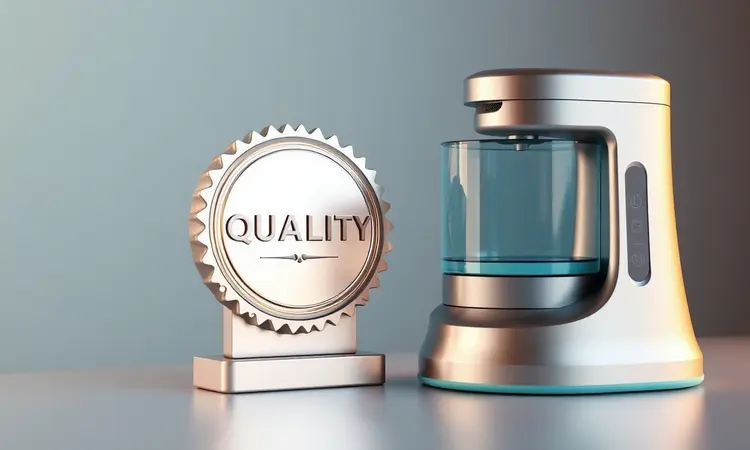
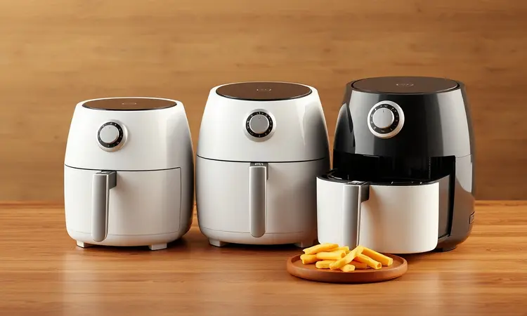

A Elgin é uma marca tradicional e consolidada no mercado brasileiro. Mas quando o assunto cai na cozinha e você se vê pensando em uma air fryer, é natural a dúvida surgir: vale mesmo a pena investir na Elgin?

Com uma linha que vai desde modelos compactos de 3,5 litros até verdadeiras estrelas tipo forno de 12 litros, a marca promete aliar tecnologia e custo-benefício.

Neste artigo, vamos desvendar o que realmente importa: se essa air fryer vai de fato transformar seu dia a dia na cozinha, oferecendo mais saúde, praticidade e alguns sorrisos à mesa.

<SummaryList products={frontmatter.top_products} />

## A marca Elgin é boa e confiável?

Imagine comprar um eletrodoméstico que você pretende usar quase diariamente pelos próximos anos. A confiança na marca se torna essencial. A Elgin, com sua trajetória brasileira de décadas, construiu sua reputação nesse exato pilar: durabilidade.

Não é apenas sobre ter peças disponíveis (embora isso já seja um alívio), mas sobre a segurança de saber que a empresa trás inovação com um pé firme na qualidade.

O suporte ao cliente robusto e o foco em eletrodomésticos funcionais mostram um compromisso que vai além da venda, buscando se tornar parte do seu cotidiano de forma confiável.

Em resumo, é uma escolha sólida para quem não quer arriscar com promessas vazias, mas sim com uma parceria de longo prazo na cozinha.

Ok, a marca é confiável. Mas como essa confiança se traduz na prática, dentro da sua casa? A resposta está na variedade de modelos, cada um desenhado para resolver uma necessidade específica.

Vamos conhecer os principais, entendendo qual deles pode ser o parceiro ideal para sua rotina.

## Melhores modelos de Air Fryer Elgin para comprar

A Elgin oferece um cardápio variado de air fryers, onde o segredo está em encontrar o modelo que conversa com o tamanho da sua família e o ritmo da sua vida.

Desde a praticidade minimalista até a versatilidade completa, existe uma opção esperando para simplificar suas refeições.

### Air Fryer Elgin 42AFG35 3,5L

<ProductBox 
  title={frontmatter.top_products[0].title} 
  image={frontmatter.top_products[0].image} 
  link={frontmatter.top_products[0].link} 
/>

Você mora sozinho ou é um casal que valoriza refeições rápidas e saudáveis sem complicação? A 42AFG35, também conhecida como Facilita Fry, é a sua resposta. Com seus 3,5 litros, ela é a companheira perfeita para o dia a dia sem desperdício.

A potência de 1400W e a tecnologia Air Circuit 360° trabalham em conjunto para um resultado que surpreende: alimentos crocantes e uniformemente cozidos, usando até 80% menos óleo.

O controle de temperatura (de 80°C a 200°C) e o timer de 60 minutos com desligamento automático são aqueles detalhes que trazem paz de espírito. Você programa, cuida de outras coisas e volta para uma refeição pronta, sem sustos. A limpeza?

A grelha antiaderente removível resolve na hora, muitas vezes sendo segura para a lava-louças. É a praticidade em sua essência, ideal para quem busca eficiência sem ocupar muito espaço.

<CaixaProsContras>

**Prós:**

- Prepara alimentos com até 80% menos gordura.

- Tecnologia de circulação de ar quente para cozimento uniforme.

- Timer e controle de temperatura com desligamento automático.

- Grelha antiaderente e fácil de limpar.

**Contras:**

- Nível de ruído perceptível durante o uso.

- A capacidade pode ser limitada para famílias maiores.

</CaixaProsContras>

### Air Fryer Elgin 42AFG40 4,2L

<ProductBox 
  title={frontmatter.top_products[1].title} 
  image={frontmatter.top_products[1].image} 
  link={frontmatter.top_products[1].link} 
/>

Quando a família cresce ou os amigos aparecem para jantar, a capacidade se torna crucial. A 42AFG40, com seus 4,2 litros e 1600W de potência, é a transição perfeita para quem precisa de mais porção sem abrir mão da saúde.

A mesma tecnologia de circulação de ar garante que o frango fique crocante por fora e suculento por dentro para todos, reduzindo drasticamente o uso de gordura.

O timer de 60 minutos e o cesto quadrado removível com revestimento antiaderente mantêm a proposta de praticidade da Elgin, mas agora em uma escala maior.

Sim, o investimento pode ser um pouco mais expressivo, mas ele se paga na capacidade de reunir as pessoas à mesa com comida saborosa e muito mais leve.

<CaixaProsContras>

**Prós:**

- Grande capacidade de 4,2 litros, ideal para famílias.

- Tecnologia que prepara alimentos com até 80% menos gordura.

- Timer de até 60 minutos com desligamento automático.

- Fácil limpeza com cesto removível e revestimento antiaderente.

**Contras:**

- Pode ter um preço mais elevado em relação a outras opções.

- A capacidade pode ser excessiva para quem cozinha para poucas pessoas.

</CaixaProsContras>

### Air Fryer Elgin Vision Fry AFJ50 5L

<ProductBox 
  title={frontmatter.top_products[2].title} 
  image={frontmatter.top_products[2].image} 
  link={frontmatter.top_products[2].link} 
/>

E se você pudesse espiar a mágica acontecer? A Vision Fry AFJ50 5L traz um toque de teatro para a cozinha com seu visor transparente. Imagine acompanhar as batatas ficando douradas ou o bolo crescendo sem abrir a porta e interromper o cozimento.

Isso vai além da curiosidade, é controle total. Com 5 litros de capacidade e 1700W, ela é uma aliada poderosa para famílias. O painel digital touch screen, com 12 funções pré-programadas, tira as dúvidas na hora de preparar desde salgados até legumes assados.

A tecnologia 360º garante o resultado crocante de sempre, enquanto o design moderno agrega estilo ao balcão. Um detalhe: o encaixe do cesto pode ser firme no começo, mas isso é sinal de durabilidade, acomodando-se com o uso.

<CaixaProsContras>

**Prós:**

- Design moderno e atraente.

- Visor transparente para acompanhar o preparo.

- 12 funções pré-programadas facilitam o uso.

- Alta potência proporciona um cozimento rápido e uniforme.

**Contras:**

- O cabo de alimentação pode ser considerado curto por alguns.

- O encaixe do cesto pode ser um pouco rígido no início.

</CaixaProsContras>

### Air Fryer Elgin Gran Fry AFG80 8L

<ProductBox 
  title={frontmatter.top_products[3].title} 
  image={frontmatter.top_products[3].image} 
  link={frontmatter.top_products[3].link} 
/>

Para as grandes ocasiões ou famílias realmente numerosas, a Gran Fry AFG80 8L é a solução generosa. Com potência que varia entre 1.750W e 1.900W, ela aquece rápido e lida com grandes volumes sem perder a eficiência, mantendo a promessa de usar até 80% menos gordura.

O controle de temperatura entre 80°C e 200°C abre um leque de receitas, enquanto o timer de 60 minutos mantém a segurança e a praticidade. A limpeza continua fácil, pensada para o dia a dia.

É verdade que o acabamento pode mostrar marcas de uso com o tempo, um trade-off comum em aparelhos de grande porte e uso frequente, mas que é amplamente compensado pela potência e capacidade que ela entrega.

<CaixaProsContras>

**Prós:**

- Grande capacidade, perfeita para famílias ou refeições de grupo.

- Potência variada que garante rapidez no preparo.

- Tecnologia que promove cozimento uniforme e crocante.

- Design prático e fácil de limpar.

**Contras:**

- Acabamento pode riscar com facilidade.

- Não é um modelo bivolt, oferecendo apenas duas voltagens específicas.

</CaixaProsContras>

### Air Fryer Elgin Style Oven 10L

<ProductBox 
  title={frontmatter.top_products[4].title} 
  image={frontmatter.top_products[4].image} 
  link={frontmatter.top_products[4].link} 
/>

Por que ter vários aparelhos se um só pode fazer quase tudo? A Style Oven 10L é a personificação da versatilidade. Mais do que uma air fryer, ela é um forno, um reaquecedor e um centro culinário compacto.

Com 10 litros de capacidade e um painel digital touch de 10 funções, ela descomplica o preparo de qualquer refeição, de um frango crocante a um bolo quentinho. A tecnologia Air Circuit 360º garante que o calor chegue a todos os cantos.

A potência de 1.400W pode significar um tempo de cozimento um pouco mais longo para algumas receitas em comparação com modelos mais potentes, mas a troca é justa: você ganha múltiplas funções em um design que ocupa o espaço de um único eletrodoméstico.

<CaixaProsContras>

**Prós:**

- Multifuncionalidade (fritar, assar e reaquecer)

- Painel digital com funções pré-programadas

- Design compacto ideal para porções maiores

- Facilidade na limpeza com porta removível e acessórios antiaderentes

**Contras:**

- Potência pode resultar em cozimentos mais lentos

- Ausência de aviso sonoro ao final do preparo

</CaixaProsContras>

### Air Fryer Elgin Easy Oven Fry 12L

<ProductBox 
  title={frontmatter.top_products[5].title} 
  image={frontmatter.top_products[5].image} 
  link={frontmatter.top_products[5].link} 
/>

A Easy Oven Fry 12L é para quem não aceita limites na cozinha. Com 12 litros de capacidade e 1800W de potência, ela é a ferramenta definitiva para preparar grandes porções de forma rápida e saudável.

As funções de fritar, assar e reaquecer coexistem harmoniosamente, comandadas pela eficiente circulação de ar 360º. A limpeza é facilitada por acessórios removíveis e laváveis na máquina, um detalhe precioso após preparar uma refeição completa.

Um ponto de atenção é que, apesar da capacidade total generosa, o design interno pode otimizar o espaço de forma diferente de alguns concorrentes.

No entanto, a eficiência e a multifuncionalidade que oferece a tornam uma opção poderosa para quem não abre mão de versatilidade e capacidade.

<CaixaProsContras>

**Prós:**

- Versatilidade com funções de fritar, assar e reaquecer.

- Tecnologia de circulação de ar quente para um cozimento uniforme.

- Capacidade generosa ideal para grandes porções.

- Facilidade de limpeza com peças removíveis.

**Contras:**

- Espaço interno pode ser menor do que em concorrentes diretos.

- Alguns usuários mencionam o nível de ruído como um ponto a considerar.

</CaixaProsContras>

### Air Fryer Elgin Oven 12L

<ProductBox 
  title={frontmatter.top_products[6].title} 
  image={frontmatter.top_products[6].image} 
  link={frontmatter.top_products[6].link} 
/>

A linha Oven 12L representa o auge da integração. Este aparelho não é apenas uma air fryer ou um forno, ele é um desidratador, um reaquecedor e um centro culinário completo.

Com seus 12 litros e 1800W, ele domina o preparo de grandes quantidades com a precisão de um painel digital e 10 funções pré-programadas. A tecnologia Air Circuit 360° assegura resultados profissionais.

É o investimento para quem leva a cozinha a sério e quer um só equipamento para múltiplas tarefas.

Alguns relatos apontam para desgaste de peças após uso intenso prolongado (algo a se observar), mas o desempenho geral, a segurança e a facilidade de limpeza consolidam sua posição como uma solução abrangente e confiável para cozinhas ativas.

<CaixaProsContras>

**Prós:**

- Multifuncionalidade que combina várias funções em um único aparelho.

- Grande capacidade de 12 litros, perfeita para famílias.

- Tecnologia de circulação de ar quente para cozimento uniforme.

- Painel digital intuitivo com configurações pré-programadas.

**Contras:**

- Possíveis relatos de desgaste em peças após uso prolongado.

- O design pode ser um pouco volumoso para cozinhas menores.

</CaixaProsContras>

## Dicas para não errar na escolha da sua Air Fryer Elgin

Escolher o modelo certo vai além da marca, é um exercício de autoconhecimento da sua rotina. Comece pela capacidade: quantas bocas você costuma alimentar diariamente?

Um modelo de 3,5L é um companheiro discreto para uma ou duas pessoas, enquanto um de 8L ou mais é um anfitrião para festas em família.

A potência é sua aliada na velocidade, mas lembre-se que modelos multifuncionais podem ter uma potência um pouco menor em troca de versatilidade. Pense na limpeza: cestos antiaderentes e removíveis são diferenciais que poupam tempo e aborrecimento.

Por fim, avalie as funções extras. Você precisa apenas fritar ou sonha em assar pães e desidratar frutas? Responder essas perguntas é o mapa que levará você ao modelo Elgin que não apenas caberá no seu balcão, mas se encaixará perfeitamente na sua vida.

## Conclusão

Então, a Air Fryer Elgin vale a pena? A resposta emerge não de uma lista de especificações, mas da transformação que ela promove. Vale a pena se você busca mais do que um eletrodoméstico, mas um parceiro que entende que cozinha é sobre saúde sem abrir mão do prazer.

A Elgin, com sua herança de confiabilidade, oferece essa ponte.

Dos modelos compactos que respeitam espaços menores às potências máximas que alimentam festas, existe uma opção que traduz tecnologia em experiências reais: crocância sem culpa, tempo recuperado para o que importa e a segurança de uma marca que estará lá depois da compra.

Se você valoriza durabilidade aliada a um custo-benefício honesto e uma variedade que realmente atende diferentes estilos de vida, a Air Fryer Elgin não é apenas uma boa compra, é um investimento inteligente no seu bem-estar e na praticidade do seu dia a dia.

Que tal descobrir qual modelo tem seu nome escrito?