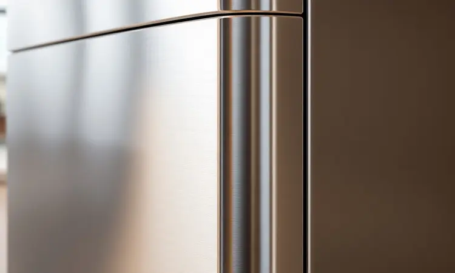
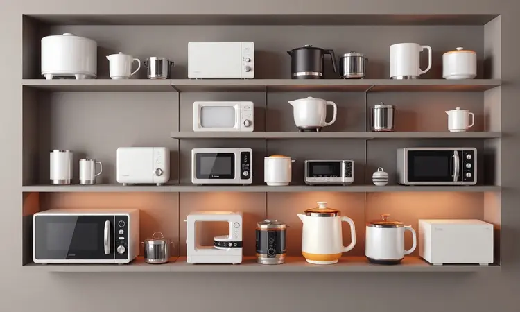

A marca Elgin é uma tradição no coração do brasileiro, lembrada pelos tempos dos primeiros aparelhos de ar-condicionado e das máquinas de costura que ajudavam em casa.

Quando ela expandiu seu império para o mundo dos eletroportáteis, uma pergunta inevitável surgiu: a Air Fryer Elgin é boa de verdade?

Com uma linha que vai dos modelos compactos de 3,5 litros, perfeitos para quem mora sozinho, até os gigantes estilo Oven de 12 litros, capazes de alimentar uma festa, a promessa da Elgin é clara: entregar eficiência sem abrir mão do custo-benefício.

Neste guia, vamos além das especificações técnicas. Vamos mergulhar na reputação da marca, analisar o desempenho dia após dia de cada modelo e te ajudar a descobrir se uma fritadeira Elgin é a peça que falta para transformar sua rotina na cozinha.

<SummaryList products={frontmatter.top_products} />

## Sobre a marca Elgin

Mais do que uma fabricante, a Elgin é um capítulo da história dos eletrodomésticos no Brasil. Sua trajetória, marcada pela inovação e pela busca por soluções que simplificam a vida, criou um legado de confiança.

O que começou com ar-condicionado e máquinas de costura evoluiu para um portfólio completo, e as air fryers são a prova de como a marca entende os novos tempos.

Em 2024, a Elgin não oferece apenas um eletroportátil, mas uma ferramenta para um estilo de vida mais ágil e saudável.

O compromisso vai além da praticidade, abraçando a sustentabilidade e a eficiência energética, mostrando que é possível cuidar da sua alimentação e do planeta ao mesmo tempo.

## A reputação da Elgin no Reclame Aqui

Uma marca só se sustenta pela confiança que gera, e o Reclame Aqui é um termômetro valioso desse sentimento. No caso da Elgin, o panorama é positivo.

A empresa mantém um bom índice de resolução de problemas, com a maioria das reclamações sendo atendidas de forma que deixa o consumidor satisfeito. É comum ler elogios à durabilidade dos produtos e à presteza do atendimento ao cliente.

Como qualquer gigante do setor, há queixas pontuais, geralmente relacionadas a prazos de entrega ou à logística da assistência técnica.

O aprendizado aqui é simples: a reputação da Elgin é sólida, mas como em qualquer compra significativa, vale dar uma espiada nas avaliações mais recentes para ter a certeza de que o modelo que você quer está correspondendo às expectativas.

## Melhores modelos de Air Fryer Elgin para comprar agora

É na prateleira que a reputação se materializa. A linha de Air Fryers da Elgin é diversa, pensada para caber em diferentes realidades e desejos.

Conheça os modelos que estão conquistando espaço nas cozinhas brasileiras, cada um com sua personalidade e conjunto de vantagens.

### 1. Air Fryer Elgin Start Fry 3,5 Litros (AFG35)

<ProductBox 
  title={frontmatter.top_products[0].title} 
  image={frontmatter.top_products[0].image} 
  link={frontmatter.top_products[0].link} 
/>

Para quem valoriza a simplicidade e a agilidade no dia a dia, a Start Fry de 3,5 litros é um achado. Ela é a companheira ideal de solteiros ou casais, ocupando pouco espaço no balcão, mas entregando muito sabor.

Com seus 1.400W de potência, esquenta rápido e usa o sistema de circulação de ar para deixar batatas, nuggets ou legumes uniformemente crocantes, usando uma fração mínima de óleo.

Controlar é intuitivo: um botão para a temperatura (de 80°C a 200°C) e outro para o timer de até 60 minutos. Depois do uso, a limpeza não é um martírio. A grelha removível com revestimento antiaderente muitas vezes pode ir direto para a lava-louças.

Se a sua família é grande, ela pode não dar conta de uma refeição completa de uma vez. Mas para quem busca uma entrada acessível no mundo das fritadeiras sem óleo, ela cumpre o papel com louvor.

<CaixaProsContras>

**Prós:**

- Compacta e fácil de armazenar.

- Painel analógico intuitivo.

- Preparo saudável com pouco ou nenhum óleo.

- Boa opção custo-benefício para o uso diário.

**Contras:**

- Capacidade pequena para famílias maiores.

- Desempenho mediano em comparação a modelos mais avançados.

</CaixaProsContras>

### 2. Air Fryer Elgin Cube Fry 4,2 Litros (AFG400)

<ProductBox 
  title={frontmatter.top_products[1].title} 
  image={frontmatter.top_products[1].image} 
  link={frontmatter.top_products[1].link} 
/>

A Cube Fry é o equilíbrio perfeito entre tamanho e performance para uma família pequena que já quer mais versatilidade. Seu design quadrado não é apenas moderno, ele otimiza cada centímetro interno dos 4,2 litros de capacidade.

Com 1.600W de potência e a tecnologia Air Circuit 360°, o ar quente circula de forma eficiente, garantindo que o frango fique dourado por fora e suculento por dentro, usando até 80% menos gordura.

Ajustar a temperatura e o timer de 60 minutos é simples, e a melhor parte talvez venha depois da refeição. O cesto e a grelha são completamente removíveis e têm aquele revestimento antiaderente que faz a sujeira escorregar, podendo ser lavados na máquina.

Ela não tem todas as firulas dos modelos top de linha, mas para quem quer eficiência sem complicação, ela é uma candidata de peso.

<CaixaProsContras>

**Prós:**

- Tecnologia Air Circuit 360° para cozimento uniforme.

- Capacidade ideal para famílias pequenas.

- Limpeza fácil com partes removíveis e laváveis.

- Design moderno que otimiza o espaço.

**Contras:**

- Funcionalidades podem ser limitadas em comparação a modelos premium.

- Potência média pode não ser suficiente para receitas muito exigentes.

</CaixaProsContras>

### 3. Air Fryer Elgin Vision Fry 5 Litros (AFJ50)

<ProductBox 
  title={frontmatter.top_products[2].title} 
  image={frontmatter.top_products[2].image} 
  link={frontmatter.top_products[2].link} 
/>

Chega de ficar abrindo a tampa a cada cinco minutos para ver se a comida já está no ponto. A Vision Fry resolve isso com um design inteligente: um visor transparente que permite espiar o milagre do cozimento acontecer sem perder calor ou interromper o processo.

Com 5 litros de capacidade e potência robusta de 1700W, ela é para quem quer tecnologia à mesa. O painel digital touch screen dá acesso a 12 funções pré-programadas, transformando o preparo de um frango, um bolo ou legumes assados em um toque.

A tecnologia Air Circuit 360º continua presente, garantindo aquele cozimento uniforme que usa até 80% menos óleo. Um detalhe importante: ela não é bivolt, então você precisa escolher a voltagem certa na hora da compra.

Mas se você quer praticidade com um toque de sofisticação, ela é uma visão e tanto.

<CaixaProsContras>

**Prós:**

- Design moderno com visor transparente.

- Painel digital intuitivo com 12 funções.

- Cozimento uniforme com menos gordura.

- Cesto quadrado que otimiza o espaço.

**Contras:**

- Não é bivolt, exigindo escolha entre voltagens.

- Cabo de alimentação considerado curto por alguns usuários.

</CaixaProsContras>

### 4. Air Fryer Elgin Gran Fry 8 Litros (AFG80)

<ProductBox 
  title={frontmatter.top_products[3].title} 
  image={frontmatter.top_products[3].image} 
  link={frontmatter.top_products[3].link} 
/>

Quando a família é grande ou os encontros são frequentes, você precisa de um equipamento que dê conta do recado. A Gran Fry, com seus impressionantes 8 litros, é a solução.

Ela permite preparar porções generosas de batata frita, frango ou até um bolo inteiro de uma só vez, de forma rápida e muito mais saudável (até 80% menos gordura).

A potência, que varia entre 1.750W e 1.900W, traz agilidade, enquanto a tecnologia Air Circuit 360º garante que cada pedaço fique perfeito. Controle total com temperatura ajustável e timer de 60 minutos com desligamento automático oferecem segurança e conveniência.

A limpeza também é pensada para não dar trabalho, com grelha removível e antiaderente. Só fique atento à voltagem, pois este modelo não é bivolt. Para quem precisa de espaço e eficiência, ele é um gigante gentil.

<CaixaProsContras>

**Prós:**

- Grande capacidade de 8 litros, ideal para famílias.

- Tecnologia Air Circuit 360º para cozimento uniforme.

- Fácil limpeza com grelha removível e antiaderente.

- Timer com desligamento automático para segurança.

**Contras:**

- Não é bivolt, requer atenção à voltagem.

- O peso pode ser considerado um pouco elevado para algumas pessoas.

</CaixaProsContras>

### 5. Air Fryer Elgin Oven Fry 12 Litros (Easy Oven)

<ProductBox 
  title={frontmatter.top_products[4].title} 
  image={frontmatter.top_products[4].image} 
  link={frontmatter.top_products[4].link} 
/>

Por que ter uma air fryer e um forno se você pode ter os dois em um só aparelho? A Oven Fry, ou Easy Oven, é exatamente isso: um poderoso forno elétrico de 12 litros que também funciona como uma fritadeira sem óleo.

É a escolha definitiva para quem ama receber ou simplesmente não quer fazer várias levas de comida. Assar um frango, fritar batatas sem óleo ou reaquecer a pizza do final de semana, tudo com a eficiência da tecnologia Air Circuit 360º.

A limpeza é facilitada pelas partes removíveis. Um ponto de atenção: a capacidade útil do cesto interno pode ser um pouco menor que os 12 litros totais.

Mas se você busca versatilidade em grande escala e a possibilidade de reduzir drasticamente o uso de gordura, este é um universo de possibilidades para sua cozinha.

<CaixaProsContras>

**Prós:**

- Grande capacidade de 12 litros.

- Funções múltiplas (assar, fritar sem óleo, reaquecer).

- Tecnologia de circulação de ar que proporciona cozimento uniforme.

- Fácil limpeza com partes removíveis e antiaderentes.

**Contras:**

- Capacidade do cesto interno pode ser menor que a capacidade total.

- Alguns modelos vêm com controle analógico em vez de digital.

</CaixaProsContras>

### 6. Air Fryer Elgin Style Oven 10 Litros

<ProductBox 
  title={frontmatter.top_products[5].title} 
  image={frontmatter.top_products[5].image} 
  link={frontmatter.top_products[5].link} 
/>

A Style Oven é para quem não abre mão de ter controle total e visual sobre o que está cozinhando. Este forno elétrico multifuncional de 10 litros tem potência de 1.400W para fritar, assar e reaquecer com até 80% menos gordura.

O que a diferencia é a experiência de uso: um painel digital touch screen com 10 funções pré-programadas, uma luz interna e um visor transparente. Você literalmente vê o pão crescer ou o frango dourar sem abrir a porta.

É verdade que seu tamanho imponente exige um espaço nobre na bancada. Mas em troca, você ganha a capacidade de preparar refeições completas e saborosas para vários convidados, tudo com a praticidade de um painel inteligente e a magia de acompanhar cada etapa.

<CaixaProsContras>

**Prós:**

- Multifuncionalidade (fritar, assar e reaquecer)

- Redução significativa de gordura nos alimentos

- Painel digital com funções pré-programadas

- Luz interna e visor transparente para monitoramento

**Contras:**

- Tamanho grande, que pode ocupar bastante espaço

- Potência relativamente alta, demandando cuidado na instalação elétrica

</CaixaProsContras>

### 7. Air Fryer Elgin Facilita Fry AFG3501

<ProductBox 
  title={frontmatter.top_products[6].title} 
  image={frontmatter.top_products[6].image} 
  link={frontmatter.top_products[6].link} 
/>

Se o orçamento é apertado e o espaço na cozinha é mínimo, a Facilita Fry é a prova de que praticidade não precisa custar caro. Este modelo compacto de 3,5 litros e 1400W é a porta de entrada perfeita para o mundo das air fryers.

Ela faz o básico muito bem: circula ar quente (Air Circuit 360°), tem ajuste de temperatura e timer. É silenciosa e resolve o jantar de uma pessoa ou casal rapidamente.

A contrapartida está nos materiais mais básicos (o corpo em plástico pode marcar) e na falta de um detalhe de segurança importante: ela não pausa automaticamente quando você abre o cesto.

Mas se você quer experimentar os benefícios de uma fritadeira sem óleo sem um grande investimento inicial, ela é uma facilitadora e tanto.

<CaixaProsContras>

**Prós:**

- Preço acessível e bom custo-benefício.

- Compacta, ideal para cozinhas pequenas.

- Facilita preparos básicos de forma silenciosa.

- Possui timer e ajuste de temperatura.

**Contras:**

- Materiais básicos que podem comprometer a durabilidade.

- Ausência de pausa automática ao abrir o cesto.

</CaixaProsContras>

## Características gerais das fritadeiras elétricas Elgin

O que une essa família tão diversa de produtos? Um DNA comum focado em tornar a alimentação mais saudável acessível, sem abrir mão da eficiência e da facilidade que a vida moderna exige.

### Design e construção

A Elgin entende que um eletroportátil vive em exposição na cozinha. Por isso, o design das suas air fryers vai além da funcionalidade, apresentando linhas modernas que conversam com diferentes estilos de decoração. Mas a beleza não é superficial.

A construção prioriza a durabilidade, com materiais de qualidade, alças ergonômicas para um manejo seguro (mesmo quando está quente) e botões que respondem ao toque.

A peça central, o cesto, é quase sempre removível e revestida com antiaderente, tornando a etapa da limpeza muito menos intimidadora. É a combinação ideal: um equipamento que você tem orgulho de mostrar e que está pronto para o trabalho pesado do dia a dia.

### Desempenho em receitas e funcionalidades

A verdadeira prova de uma air fryer está no prato. E aqui as Elgin brilham pela capacidade de entregar resultados consistentes.

A tecnologia de circulação de ar quente é a estrela, garantindo que os alimentos fiquem crocantes por fora e macios por dentro, seja em uma simples batata frita ou em um filé de peixe mais delicado. A versatilidade é outro ponto forte.

Muitos modelos vão além de "fritar", oferecendo funções para grelhar, assar e até descongelar. Isso transforma o aparelho em um aliado para diversas receitas, desde um café da manhã rápido com pães aquecidos até um jantar especial com legumes assados.

Ela incentiva a experimentação na cozinha, com a segurança de que o resultado será saboroso e mais saudável.

### Consumo de energia e limpeza

Dois medos comuns ao adquirir um novo eletrodoméstico são a conta de luz e a bagunça para limpar. As air fryers Elgin atacam esses dois fronts.

Graças ao sistema eficiente de circulação de ar que cozinha os alimentos rapidamente, o consumo de energia é significativamente menor comparado a um forno tradicional ligado por uma hora. É economia que você sente no bolso.

E quando a festa acaba, a limpeza não precisa ser um drama. A grande maioria dos modelos possui o cesto e, em alguns casos, o recipiente coletor de gordura, totalmente removíveis e com revestimento antiaderente.

Muitos são seguros para lavar na máquina de louças, transformando minutos de trabalho em segundos de praticidade.

## Como escolher a melhor air fryer da marca para sua casa

Com tanta opção, a escolha pode parecer difícil, mas ela se torna simples quando você responde a três perguntas-chave. Primeiro: para quantas pessoas você cozinha? A capacidade (em litros) dita se o modelo será um aliado ou uma frustração.

Um solteiro se apaixona por 3,5L, uma família de quatro precisa de 5L ou mais. Segundo: o que você realmente vai cozinhar? Se é só para frituras rápidas, um modelo básico basta.

Se você quer assar bolos e fazer refeições completas, busque por multifuncionalidade e programas pré-definidos. Terceiro: quanto espaço e orçamento você tem? Meça sua bancada e seja realista sobre o investimento.

Por fim, dê sempre uma olhada nas avaliações de quem já comprou. Elas são o termômetro mais honesto da durabilidade e do desempenho no mundo real.

## Conclusão

Então, a Air Fryer Elgin é boa e vale a pena? A resposta é um convincente sim, mas com um detalhe importante: ela vale a pena para quem escolhe o modelo certo. A força da Elgin está justamente nessa variedade que atende do apartamento compacto à casa cheia de gente.

Não se trata apenas de um eletroportátil que promete fritar sem óleo.

É sobre ganhar tempo em noites corridas, sobre trazer mais saúde para a mesa sem abrir mão do sabor crocante que a gente adora, e sobre a confiança de estar adquirindo um produto de uma marca com tradição e bom suporte no Brasil.

Seja a entrada acessível da Facilita Fry, a versatilidade futurista da Vision Fry com seu visor transparente, ou o poder familiar da Gran Fry de 8 litros, há uma Elgin desenhada para a sua rotina.

Ao escolher com base no seu dia a dia real, você não está apenas comprando uma air fryer. Você está trazendo para sua cozinha um pedaço de praticidade, um toque de modernidade e a liberdade de explorar uma alimentação mais leve, sem dramas e com muito mais sabor.

A transformação no seu modo de cozinhar começa com o modelo que conversa com a sua vida.