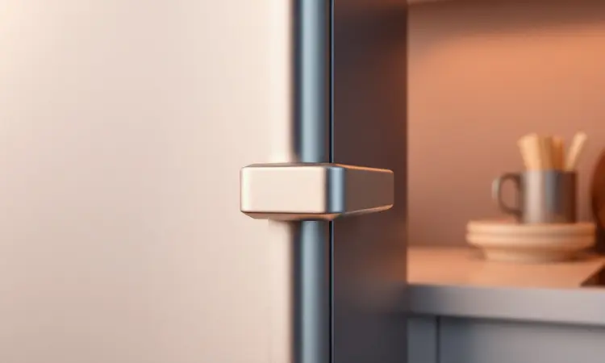
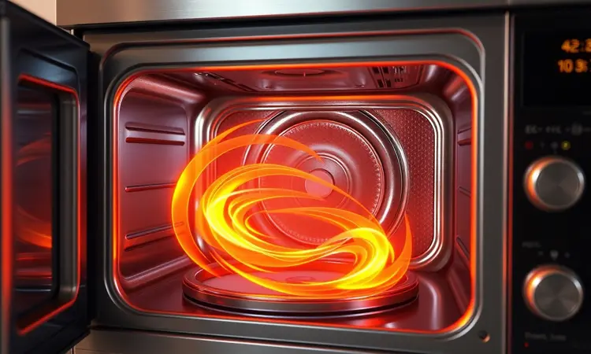
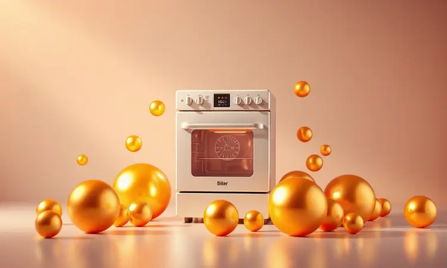

A busca pela praticidade na cozinha já não precisa ser um conflito entre tempo e saúde. Com a popularização das fritadeiras elétricas, muitos se perguntam se a Airfryer Fama realmente entrega essa promessa de equilíbrio.

Como parte do portfólio da Britânia, uma marca com décadas de presença no mercado brasileiro, a Fama conquista atenção pelo acesso facilitado a essa tecnologia. Mas será que essa acessibilidade vem acompanhada da durabilidade e eficiência que sua rotina exige?

Mergulhamos fundo na análise da Air Fryer Fama 3L FFR27P para descobrir se ela é apenas uma entrada acessível no universo das air fryers ou uma verdadeira aliada do seu dia a dia.

<SummaryList products={frontmatter.top_products} />

## Air Fryer Fama 3L FFR27P: Conheça o modelo da fritadeira

<ProductBox 
  title={frontmatter.top_products[0].title} 
  image={frontmatter.top_products[0].image} 
  link={frontmatter.top_products[0].link} 
/>

Imagine abrir mão do óleo em excesso sem sacrificar aquele crocante irresistível das batatas fritas ou da coxinha. É exatamente essa experiência que a Air Fryer Fama 3L FFR27P busca oferecer.

Com seus 3 litros de capacidade, ela atende perfeitamente uma família pequena ou até mesmo uma pessoa que gosta de preparar porções para congelar.

Os 1300W de potência não são apenas um número no manual, eles representam agilidade real: aquela sensação de chegar em casa após um dia corrido e ter o jantar pronto em minutos, não em horas.

O que realmente faz diferença na prática é o controle que você tem nas mãos. Ajustar a temperatura entre 80°C e 200°C significa poder desde aquecer um pão de queijo delicadamente até conseguir aquela douradura perfeita em um frango assado.

Já o timer de 60 minutos oferece autonomia para receitas mais elaboradas, aquelas que exigem tempo mas também sua atenção em outras tarefas.

A tecnologia de circulação de ar quente em 360° trabalha nos bastidores para garantir que cada pedaço do cesto receba o mesmo tratamento, eliminando aquelas frustrações de alimentos queimados de um lado e crus do outro.

E quando falamos do pós-preparo, o cesto removível com revestimento antiaderente transforma o que antes era uma tarefa penosa em algo quase instantâneo: um rápido enxágue e está pronto para a próxima aventura culinária.

É honesto mencionar que aqui não há atalhos automatizados. A ausência de presets pré-programados significa que você realmente aprenderá a cozinhar, entendendo tempo e temperatura para cada alimento.

Para alguns, isso é um caminho de descoberta; para outros, pode representar uma curva de aprendizado inicial.

<CaixaProsContras>

**Prós:**

- Praticidade no preparo de refeições saudáveis.

- Potência de 1300W para cozimento rápido.

- Cesto removível facilita a limpeza.

- Tecnologia de circulação de ar para cozimento uniforme.

**Contras:**

- Não possui presets pré-programados.

- A qualidade do revestimento antiaderente pode exigir cuidados especiais.

</CaixaProsContras>

### Design do produto

A primeira impressão conta, especialmente quando o eletrodoméstico vive em cima do balcão. A Airfryer Fama entrega um visual que conversa com cozinhas contemporâneas sem tentar chamar atenção demais.

Disponível em cores que vão do branco imaculado ao preto sofisticado, ela se integra como mais um utensílio, não como um destaque forçado.

O painel digital mantém a simplicidade como virtude: botões claros e display legível que eliminam aquela sensação de estar operando uma nave espacial quando você só quer um frango crocante.

O tamanho compacto é um alívio para quem já luta por cada centímetro de espaço na cozinha, enquanto as alças ergonômicas garantem que retirar o cesto quente não se transforme em um exercício de equilíbrio e coragem.

É aquele tipo de detalhe que você só percebe o valor quando está com as mãos ocupadas e precisa de segurança genuína.

### Funcionalidade e Potência

Potência de 1300W soa bem no papel, mas o que isso significa na sua rotina? Imagine reduzir o tempo de preparo de batatas fritas de 30 para 15 minutos, ou conseguir assar nuggets congelados enquanto prepara o acompanhamento.

Essa agilidade transforma a air fryer de um aparelho interessante para uma ferramenta essencial nos dias mais atribulados.

A versatilidade vai além da fritura sem óleo. Aquela função de assar permite preparar desde legumes caramelizados até um bolo simples para o lanche da tarde. Já o modo grelhar pode dar uma crosta perfeita em um pedaço de carne sem precisar acender o forno convencional.

É como ter um assistente culinário compacto que entende que sua cozinha precisa ser multifuncional.

E quando o assunto é armazenamento, o design compacto significa que você não precisará desmontar metade da cozinha para guardá-la. Ela encontra seu espaço facilmente, sempre pronta para a próxima receita.

### Segurança

Manusear um aparelho que atinge 200°C naturalmente gera certa apreensão. É aqui que os recursos de segurança da Fama trabalham para sua tranquilidade.

O desligamento automático ao abrir a tampa não é apenas um detalhe técnico, é a garantia de que um momento de distração não se transformará em um acidente.

A proteção contra superaquecimento funciona como um guardião silencioso, monitorando continuamente para que o aparelho opere dentro dos limites seguros.

Os materiais são escolhidos não apenas pela durabilidade, mas pela capacidade de manter o calor contido onde ele deve estar: dentro do cesto, não nas superfícies externas.

Isso não elimina a importância do bom senso. Ler o manual pode parecer burocrático, mas entender as recomendações do fabricante é o que transforma um eletrodoméstico em um parceiro confiável para os próximos anos.

### Revestimento Antiaderente

O verdadeiro teste de qualquer air fryer não está apenas no preparo, mas no que vem depois. O revestimento antiaderente da Fama é onde a promessa de praticidade se materializa concretamente.

Imagine retirar alimentos crocantes sem que metade deles fique grudada no fundo, transformando a limpeza em uma guerra com esponjas e palhas de aço.

Esse revestimento é projetado para resistir às altas temperaturas recorrentes, mantendo sua integridade mesmo após meses de uso frequente.

E aqui está um benefício muitas vezes subestimado: a possibilidade real de usar apenas uma fração do óleo que você utilizaria tradicionalmente.

Não se trata apenas de menos gordura, mas de sabores mais limpos e autênticos que emergem quando o alimento não está nadando em óleo.

A contrapartida dessa facilidade é a responsabilidade no cuidado. Utensílios de metal podem ser inimigos silenciosos desse revestimento, e uma limpeza agressiva pode abreviar significativamente sua vida útil.

Tratá-lo com o respeito que merece é o preço por ter aquele pós-uso tão simples.

## Sobre a Fama/Britânia

Quando você adquire um produto Fama, está optando por uma extensão do legado da Britânia no Brasil. Essa não é uma marca que surgiu do nada tentando surfar uma onda de tendência; é um braço especializado de uma empresa que entende o consumidor brasileiro há décadas.

Existe uma confiança implícita nessa herança: a segurança de que por trás do produto há uma estrutura de suporte, garantia e expertise que marcas apenas digitais muitas vezes não conseguem replicar.

Essa bagagem se traduz em produtos que buscam equilibrar inovação com robustez. Não são necessariamente os aparelhos com mais recursos exóticos do mercado, mas sim aqueles que prometem fazer bem o essencial por um período prolongado.

É uma filosofia que valoriza a consistência acima do exibicionismo tecnológico.

## Afinal, airfryer Fama é boa mesmo?

A resposta depende principalmente do que você busca. Se sua expectação é por um aparelho repleto de automatizações que praticamente cozinham sozinhas, talvez haja opções mais adequadas.

Mas se você valoriza o equilíbrio entre simplicidade operacional, resultados consistentes e um investimento que não exige um empréstimo bancário, a Fama se apresenta como uma candidata extremamente convincente.

Ela entrega exatamente o que promete: frituras mais saudáveis com crocância satisfatória, versatilidade para explorar diferentes técnicas culinárias e uma limpeza que não se torna um martírio diário.

A capacidade de 3 litros é o ponto ideal para quem não precisa alimentar um exército, mas quer porções generosas para sobrar ou para receber visitas inesperadas.

O que talvez seja seu maior trunfo é a honestidade com o consumidor.

Não há promessas milagrosas de que você se tornará um chef profissional overnight, mas sim a garantia de que terá uma ferramenta confiável para transformar seus ingredientes em refeições saborosas com menos complicação e mais saúde.

## Por que investir neste produto?

Investir em uma Airfryer Fama é essencialmente investir em dois ativos preciosos: tempo e bem-estar. Cada minuto economizado no preparo acumula-se ao longo dos meses, criando uma reserva de horas que podem ser dedicadas a outras prioridades.

Cada redução no consumo de óleo é um benefício cumulativo para sua saúde, especialmente quando percebemos que não estamos abrindo mão do prazer gastronômico.

Para famílias que buscam alternativas mais leves sem o drama de dietas restritivas, ela funciona como uma ponte entre o saudável e o saboroso.

Para solteiros ou casais, representa a liberdade de preparar refeições completas sem a logística complexa de múltiplas panelas e etapas.

E existe também a questão da relação custo-benefício.

Em um universo onde algumas air fryers parecem cobrar pelo status mais que pela funcionalidade, a Fama se posiciona como uma opção consciente: entrega o núcleo da experiência sem os excessos que muitas pessoas jamais utilizarão.

## Conclusão

A jornada em busca da air fryer ideal muitas vezes nos leva a um dilema: devemos priorizar recursos abundantes ou foco nas necessidades reais? A Airfryer Fama 3L FFR27P defende eloquentemente a segunda opção.

Ela não tenta ser tudo para todos, mas sim excelente no que se propõe: oferecer uma alternativa genuinamente mais saudável à fritura tradicional, com resultados consistentes e uma operação que respeita sua curva de aprendizado.

Seu design integra-se discretamente à cozinha, sua funcionalidade atende às demandas do dia a dia moderno e sua relação com a Britânia proporciona aquela segurança adicional de que você está adquirindo um produto com suporte e tradição.

A ausência de presets pré-programados pode ser vista como uma oportunidade para realmente aprender sobre cocção, transformando cada refeição em uma pequena conquista pessoal.

Para quem está dando os primeiros passos no universo das air fryers ou busca uma opção confiável sem extravagâncias desnecessárias, a Fama se estabelece como uma escolha sólida e consciente.

Ela cumpre sua promessa central com honestidade: alimentos crocantes por fora, macios por dentro, e uma paz de espírito na limpeza que faz toda diferença na rotina.

O investimento se justifica não apenas pelo produto em si, mas pela transformação que ele pode trazer para sua relação com a cozinha cotidiana.