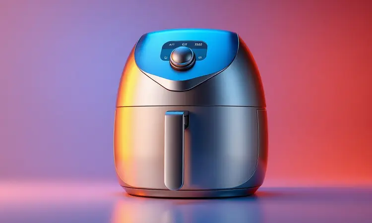

Quando você está pesquisando uma air fryer, a dúvida que mais aparece é justamente essa: a Air Fryer Gallant é boa mesmo? Ela realmente entrega aquela crocância saudável que promete?

Com modelos que vão do compacto 5L ao imponente forno de 25L, a marca brasileira conquista espaço oferecendo design moderno e interfaces intuitivas.

Neste artigo, vamos além das especificações técnicas para entender se essas máquinas realmente transformam sua rotina na cozinha ou se existem opções que fazem melhor pelo seu investimento.

<SummaryList products={frontmatter.top_products} />

## Sobre a Gallant

A jornada da Gallant no mercado brasileiro é marcada por uma proposta clara: trazer tecnologia acessível para a cozinha do dia a dia.

Mais do que apenas uma fabricante de eletrodomésticos, a marca se posiciona como uma aliada na busca por alimentação mais saudável sem abrir mão do sabor.

Seu foco em air fryers não é por acaso - representa a resposta a uma demanda crescente por praticidade que não sacrifique a qualidade.

Ao investir em design limpo e funcionalidades pensadas para o usuário real, a Gallant construiu uma identidade reconhecível para quem valoriza a relação entre eficiência e estética nos eletrodomésticos.

## Air Fryer Gallant é Boa?

Sim, mas com um adendo importante: ela é boa para quem valoriza o equilíbrio entre custo e benefício. Se você busca uma máquina robusta com todos os recursos de marcas premium, talvez não seja a primeira opção.

Mas se deseja uma air fryer que faça exatamente o que promete - fritar, assar e grelhar com pouquíssimo óleo - com um design que não envergonha na bancada, então a resposta é um sim convincente.

O ponto forte está justamente em cumprir suas funções básicas com excelência, oferecendo durabilidade na medida certa para quem não precisa (ou não quer pagar por) extravagâncias tecnológicas.

## Principais Modelos de Air Fryer Gallant

A resposta à pergunta "vale a pena?" muda completamente dependendo do modelo que você escolhe. É aqui que a Gallant mostra sua versatilidade, oferecendo opções tão diferentes quanto as necessidades das famílias brasileiras. Vamos entender qual se encaixa na sua rotina.

### 1 – Air Fryer Gallant GFE05 Digital Family 5L 1400W

<ProductBox 
  title={frontmatter.top_products[0].title} 
  image={frontmatter.top_products[0].image} 
  link={frontmatter.top_products[0].link} 
/>

Para o casal que busca praticidade sem exagero, este modelo de 5 litros acerta na medida. Imagine sair do trabalho e em minutos ter batatas crocantes ou filés de frango dourados, tudo sem aquele óleo que deixa a comida pesada.

O painel digital com 10 funções pré-programadas elimina as dúvidas - você só escolhe o alimento e ele ajusta tempo e temperatura automaticamente.

A segurança fica por conta do desligamento automático e proteção contra superaquecimento, enquanto o cesto antiaderente removível transforma a limpeza em uma tarefa de menos de cinco minutos.

A única consideração é que para famílias maiores, os 5 litros podem pedir duas rodadas de preparo, mas para o dia a dia de quem cozinha para duas ou três pessoas, é mais do que suficiente.

<CaixaProsContras>

**Prós:**

- Capacidade adequada para pequenas famílias.

- Painel digital intuitivo com múltiplas funções.

- Segurança com desligamento automático.

- Fácil limpeza com cesto removível.

**Contras:**

- Capacidade pode ser limitada para grupos maiores.

- Não possui visor transparente para acompanhar o cozimento.

</CaixaProsContras>

### 2 – Air Fryer Gallant Digital Com Visor GFE07 Family Moments 7,5L 1600W

<ProductBox 
  title={frontmatter.top_products[1].title} 
  image={frontmatter.top_products[1].image} 
  link={frontmatter.top_products[1].link} 
/>

Imagine preparar o jantar da família sem precisar abrir a tampa a cada cinco minutos para ver se está no ponto.

O visor transparente deste modelo oferece exatamente essa tranquilidade, permitindo que você acompanhe o douramento perfeito sem interromper a circulação de ar quente. Com 7,5 litros, há espaço suficiente para o frango, as batatas e os legumes de uma refeição completa.

Os 1600W de potência garantem que tudo fique pronto mais rápido, enquanto as 9 funções pré-programadas do painel digital são como ter um cozinheiro virtual garantindo o resultado ideal.

Sim, seu tamanho exige um cantinho dedicado na cozinha, mas quando você vê toda a família sendo atendida de uma só vez, o espaço ocupado parece um investimento inteligente.

<CaixaProsContras>

**Prós:**

- Visor transparente para monitoramento do preparo.

- Capacidade de 7,5 litros, ideal para famílias.

- Potência de 1600W para cozimento rápido.

- Painel digital com 9 funções pré-programadas.

**Contras:**

- Tamanho maior pode dificultar o armazenamento.

- O visor pode necessitar de limpeza frequente.

</CaixaProsContras>

### 3 – Air Fryer Oven Gallant GFE12 Super Family 12L 1500W

<ProductBox 
  title={frontmatter.top_products[2].title} 
  image={frontmatter.top_products[2].image} 
  link={frontmatter.top_products[2].link} 
/>

Quando a família toda senta à mesa, você precisa de uma aliada que dê conta do recado. Esta air fryer oven de 12 litros é praticamente uma cozinha compacta, com 18 funções digitais que vão da fritura sem óleo à desidratação de frutas.

A versatilidade aqui é o verdadeiro destaque - assa um bolo enquanto grelha legumes, tudo com os 1500W que aceleram o processo sem comprometer a uniformidade.

O tamanho impõe respeito, é verdade. Em cozinhas menores, ela vai exigir um planejamento de espaço.

Mas quando você consegue preparar o almoço de domingo inteiro em um único eletrodoméstico, o metro quadrado ocupado se transforma em tempo ganho e praticidade multiplicada.

<CaixaProsContras>

**Prós:**

- Grande capacidade de 12 litros, perfeita para famílias.

- Multifuncionalidade com 18 modos de cozimento.

- Potência de 1500W para cozimento rápido.

- Design moderno e fácil de usar.

**Contras:**

- Tamanho maior pode ser um desafio em cozinhas pequenas.

- Algumas funções podem exigir mais teste para otimizar resultados.

</CaixaProsContras>

### 4 – Air Fryer Gallant Digital GFE15 Super Compact 15L 1600W

<ProductBox 
  title={frontmatter.top_products[3].title} 
  image={frontmatter.top_products[3].image} 
  link={frontmatter.top_products[3].link} 
/>

Compacta no nome, generosa na capacidade. Este modelo de 15 litros consegue a proeza de preparar grandes porções mantendo linhas que se adaptam à maioria das bancadas.

Para quem recebe amigos com frequência ou tem uma família numerosa, os 1600W de potência garantem que todos sejam atendidos sem espera prolongada.

O painel digital touch com display LED traz uma experiência moderna, enquanto as múltiplas funções pré-programadas abrem um cardápio de possibilidades - da pizza crocante ao bolo fofinho.

A atenção necessária fica por conta da voltagem, já que não é bivolt, mas isso se resolve com uma verificação simples da sua tomada antes da compra.

<CaixaProsContras>

**Prós:**

- Capacidade de 15 litros ideal para grandes porções.

- Potência de 1600W para aquecimento rápido.

- Várias funções pré-programadas para diferentes tipos de pratos.

- Design compacto que se adapta a qualquer cozinha.

**Contras:**

- Não é bivolt, limitando opções elétricas.

- Pode ser volumosa para cozinhas muito pequenas.

</CaixaProsContras>

### 5 – Forno e Fryer Fritadeira Gallant Digital GFE25 Rotisserie 25L 1700W

<ProductBox 
  title={frontmatter.top_products[4].title} 
  image={frontmatter.top_products[4].image} 
  link={frontmatter.top_products[4].link} 
/>

Para quem sonha com um verdadeiro chef em casa, este modelo de 25 litros é mais que uma air fryer - é uma estação de cozinha completa.

A função rotisserie traz aquele assado uniforme que parece saído de um restaurante, enquanto as 21 funções pré-programadas oferecem controle cirúrgico sobre temperatura (60°C a 200°C) e tempo (1 a 90 minutos).

Os acessórios incluídos, como grelha e bandeja coletora, transformam a experiência culinária em algo profissional. O volume de 25 litros atende desde grandes famílias até pequenos eventos, fazendo deste aparelho um investimento para quem leva a sério a arte de receber.

Como nos modelos maiores, a atenção com a voltagem correta é essencial, mas é um detalhe técnico que não diminui o brilho da proposta.

<CaixaProsContras>

**Prós:**

- Multifuncionalidade com várias opções de preparo.

- Painel digital intuitivo com funções pré-programadas.

- Acompanha diversos acessórios úteis.

- Grande capacidade ideal para famílias ou eventos.

**Contras:**

- Não é bivolt, limitando as opções de instalação.

- Pode ser considerado volumoso para algumas cozinhas.

</CaixaProsContras>

## Design, Estética e Durabilidade

A primeira impressão conta, e a Gallant entende isso. Seus modelos trazem um visual clean que conversa bem com cozinhas contemporâneas, nas cores preto fosco ou inox que disfarçam marcas de uso.

Mas a beleza vai além da superfície - os materiais escolhidos resistem ao dia a dia intenso sem perder o brilho inicial.

Acabamentos antiaderentes não só facilitam a limpeza, como protegem a estrutura interna, garantindo que sua air fryer continue bonita e funcional por anos.

É aquela combinação rara entre eletrodoméstico prático e objeto de decoração que você não tem vergonha de deixar sobre a bancada.

## Desempenho, Programas e Funções

Onde a Gallant realmente brilha é na entrega consistente do básico bem feito. A tecnologia de circulação de ar quente transforma simples batatas em versões crocantes que rivalizam com as fritas tradicionais, usando até 80% menos óleo.

Cada função no painel - seja assar, grelhar ou tostar - foi calibrada para resultados previsíveis, eliminando o "será que vai dar certo?" da equação.

Para quem tem medo de tecnologia na cozinha, a simplicidade da interface é um alívio. Não importa se é sua primeira air fryer ou se você já é veterano, os resultados são sempre pratos saborosos com textura perfeita.

É performance que não exibe números impressionantes no papel, mas que transforma ingredientes em refeições memoráveis na prática.

## Consumo de Energia

Aqui está uma das surpresas mais agradáveis: sua conta de luz pode até dar uma leve baixada. Comparada com um forno convencional que precisa de pré-aquecimento e mantém alta temperatura por longos períodos, a air fryer trabalha mais inteligente.

Com potências entre 1400W e 1700W (dependente do modelo), ela aquece rápido e mantém o calor de forma eficiente, desligando automaticamente quando o ciclo termina.

Em números práticos: preparar batatas fritas para quatro pessoas consome cerca de 0,3 kWh, contra aproximadamente 1,2 kWh do forno elétrico tradicional.

Multiplique essa economia pelas várias vezes que você usa a máquina durante a semana, e terá um argumento financeiro tão convincente quanto o benefício à saúde.

## Limpeza e Segurança

Quem já desistiu de fazer um prato especial por causa da louça sabe o valor da facilidade de limpeza.

Com a Gallant, essa preocupação desaparece - cestos removíveis vão direto para a máquina de lavar louça, e as superfícies antiaderentes garantem que até alimentos mais grudentos saiam com uma passada de pano úmido.

A segurança acompanha a praticidade. Desligamento automático evita que você se esqueça do aparelho ligado, enquanto a proteção contra superaquecimento é um guardião silencioso que trabalha nos bastidores.

São detalhes que parecem pequenos até o dia em que você precisa deles, e aí demonstram seu verdadeiro valor.

## A Air Fryer Gallant no Reclame Aqui

Consultar o Reclame Aqui é como pedir a opinião sincera de milhares de colegas que já passaram pela mesma decisão de compra.

O mosaico de experiências com a Gallant mostra um padrão interessante: a maioria elogia a eficiência das frituras e a durabilidade, enquanto um grupo menor aponta questões de atendimento ou detalhes técnicos específicos.

O que chama atenção é o índice de resposta da empresa - boa parte das reclamações recebe retorno, indicando um compromisso (ainda que imperfeito) com a satisfação do cliente.

Para você que está pesquisando, fica o aprendizado: leia tanto as críticas quanto as soluções apresentadas, pois muitas vezes o problema está no processo, não no produto em si.

## Perguntas Frequentes sobre a Fritadeira Gallant

As dúvidas que mais assombram quem está prestes a comprar uma air fryer tendem a ser as mesmas. Vamos descomplicar os pontos que realmente importam na hora da decisão.

### Quem Fabrica a Marca Gallant?

A Gallant é uma marca genuinamente brasileira que nasceu com o propósito de descomplicar a vida na cozinha.

Diferente das gigantes multinacionais que produzem em escala global, ela mantém uma produção mais próxima do consumidor final, permitindo ajustes rápidos às necessidades do mercado local.

Essa proximidade se traduz em produtos que entendem como o brasileiro realmente cozinha, com foco na relação direta entre funcionalidade e custo acessível.

### A Marca Gallant é Boa?

Boa é pouco - ela é consistentemente competente naquilo que se propõe a fazer. Não espere a robustez de marcas que custam três vezes mais, mas também não se surpreenda ao encontrar uma durabilidade que supera expectativas para a categoria.

A Gallant domina a arte do equilíbrio: materiais de qualidade suficiente para anos de uso, tecnologia adequada para resultados excelentes, e um preço que não exige um empréstimo bancário.

Para quem busca um eletrodoméstico que cumpra sua função sem firulas desnecessárias, é uma das melhores escolhas no mercado.

### O que a Fritadeira Gallant Faz?

Imagine um assistente culinário que transforma ingredientes crus em pratos prontos usando uma tecnologia simples, mas genial: ar quente em movimento.

A fritadeira Gallant não apenas "frita" com até 80% menos óleo, como também assa (bolos, pães), grelha (carnes, legumes), tosta (sanduíches, torradas) e até desidrata (frutas, temperos).

O segredo está na circulação inteligente do ar, que envolve os alimentos uniformemente, criando aquela crocância exterior enquanto mantém o interior suculento. É como ter várias panelas em uma só, com a vantagem de uma limpeza que leva minutos.

### Qual a Garantia da Air Fryer Gallant?

A Gallant oferece garantia de 1 a 2 anos, dependendo do modelo e do canal de venda - informação que você confirma no manual ou na nota fiscal.

Essa proteção cobre defeitos de fabricação, dando a tranquilidade de que seu investimento está resguardado contra problemas inesperados.

Algumas lojas ainda oferecem garantias estendidas por um custo adicional, uma opção interessante se você planeja usar o aparelho intensamente.

O cuidado para manter a garantia válida é simples: use conforme as instruções, evite improvisos perigosos e guarde a documentação original.

### Pode Colocar Forma de Alumínio na Airfryer Gallant?

Sim, e isso amplia ainda mais suas possibilidades na cozinha. Formas de alumínio são perfeitas para receitas líquidas (como ovos mexidos ou quiches) ou alimentos que soltam muito caldo.

O segredo está na moderação: use formas que não obstruam completamente a circulação de ar, deixando espaço para o fluxo atingir todos os lados do alimento.

E atenção às instruções específicas do seu modelo - algumas air fryers têm recomendações particulares sobre materiais.

Quando usada com critério, a forma de alumínio transforma sua fritadeira em um forno versátil que prepara desde mini-pizzas até porções individuais de lasanha.

## Conclusão

Após analisar cada detalhe, a resposta para "a Air Fryer Gallant vale a pena?" se desdobra em uma verdade mais sutil: ela vale exatamente o que você precisa que valha.

Se seu objetivo é ter uma máquina que torne sua alimentação mais saudável sem complicações, que sobreviva ao uso diário com dignidade, e que não exija um curso técnico para operar, então sim, é uma das melhores opções no mercado.

A Gallant não compete no terreno da ostentação tecnológica. Ela brilha no campo da consistência - entrega sempre o que promete, na medida certa para transformar sua rotina na cozinha.

Desde o modelo compacto de 5L até o forno multiuso de 25L, existe uma versão pensada para cada realidade familiar e necessidade culinária.

O investimento se justifica não pelos números impressionantes no manual, mas pelas pequenas vitórias do dia a dia: o tempo ganho na cozinha, a saúde preservada com menos óleo, a praticidade da limpeza rápida.

São esses momentos acumulados que transformam um simples eletrodoméstico em um aliado verdadeiro na busca por uma vida mais prática e saborosa.

Se você está em dúvida entre a Gallant e outras opções, faça a pergunta certa: não é "qual tem mais funções?", mas sim "qual vai realmente ser usada na minha cozinha todos os dias?". A resposta pode estar mais perto do que imagina.