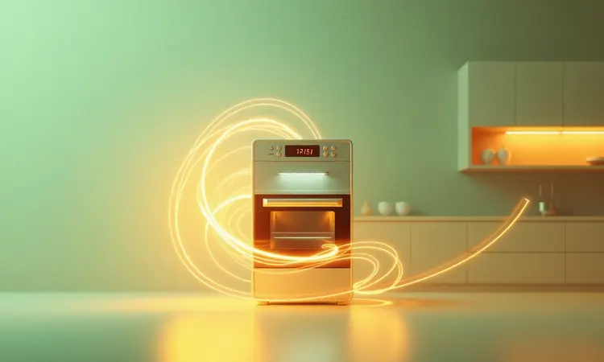

A busca por uma alimentação mais saudável e prática tem levado muitos consumidores a explorarem marcas emergentes no mercado de eletrodomésticos. Uma pergunta que tem surgido com frequência nas buscas online é: a Air Fryer Lumi realmente entrega o que promete?

Com a proposta de oferecer crocância sem óleo e um design funcional que cabe em qualquer cozinha, este modelo desperta a curiosidade de quem busca equilíbrio entre custo e benefício.

Mas será que ela consegue competir com os gigantes do setor, ou é melhor investir em nomes já consagrados?

Neste artigo, vamos além das especificações técnicas para descobrir como essa air fryer se comporta no dia a dia de verdade, preparando uma análise completa que vai ajudá-lo a tomar uma decisão com segurança e conhecimento.

Imagine ter em sua cozinha um eletrodoméstico que transforma a maneira como você prepara alimentos, oferecendo a crocância que tanto ama nas frituras, mas com uma fração mínima de óleo.

A Air Fryer Lumi foi projetada exatamente para isso: fritar utilizando ar quente em circulação, promovendo uma opção mais saudável sem abrir mão do sabor.

Seu design moderno e compacto esconde uma eficiência que surpreende, permitindo preparar desde batatas fritas crocantes até carnes suculentas e assados dourados.

O que realmente diferencia a Lumi são os recursos pensados para simplificar sua rotina: painéis digitais intuitivos, pré-configurações para diferentes alimentos e uma tecnologia que entrega resultados consistentes.

Essa combinação entre inovação e praticidade faz dela mais do que um aparelho, mas sim uma aliada na sua jornada por uma alimentação equilibrada.

<SummaryList products={frontmatter.top_products} />

## Características Técnicas da Air Fryer Lumi

<ProductBox 
  title={frontmatter.top_products[0].title} 
  image={frontmatter.top_products[0].image} 
  link={frontmatter.top_products[0].link} 
/>

Quando você abre a caixa da Air Fryer Lumi, o que encontra é uma combinação de engenharia inteligente e design pensado no usuário.

O modelo 7300, um dos mais populares, oferece 1700W de potência que se traduzem em velocidade: imagine transformar batatas em palitos crocantes e dourados em apenas 15 minutos, enquanto você prepara o restante do almoço.

Com 6,5 litros de capacidade, ela dá a liberdade de preparar o jantar para toda a família de uma só vez, eliminando a necessidade de fazer rodízios de batches e deixando todos satisfeitos ao mesmo tempo.

O controle total fica em suas mãos com temperaturas ajustáveis entre 80°C e 200°C (chegando a 220°C em alguns modelos), permitindo desde desidratar frutas para lanches saudáveis até dourar perfeitamente um frango inteiro.

O temporizador de até 60 minutos com desligamento automático traz aquela tranquilidade de poder se afastar da cozinha sem preocupações, sabendo que o aparelho cuidará da segurança.

A superfície antiaderente é onde a praticidade brilha: após preparar aqueles nuggets crocantes que as crianças adoram, a limpeza se torna uma tarefa rápida e sem estresse, sem aquela luta para remover resíduos grudados.

Painéis digitais sensíveis ao toque e a tecnologia de circulação de ar quente completam o pacote, garantindo que cada pedaço de alimento receba o calor necessário para ficar uniformemente crocante por fora e macio por dentro.

<CaixaProsContras>

**Prós:**

- Variedade de modelos com diferentes capacidades e potências.

- Controle intuitivo com painel digital e menus pré-definidos.

- Superfície antiaderente facilita a limpeza.

- Tecnologia que reduz o uso de óleo para frituras mais saudáveis.

**Contras:**

- Modelos maiores podem ser volumosos para cozinhas pequenas.

- A potência mais alta pode consumir mais energia.

</CaixaProsContras>

## O que avaliar antes de adquirir uma fritadeira elétrica?

Agora que você conhece as especificações técnicas da Air Fryer Lumi, surge a pergunta fundamental: como escolher a fritadeira ideal para o seu estilo de vida? Primeiro, pense na sua rotina alimentar: quantas pessoas costumam sentar à sua mesa?

Modelos menores de 3,8 litros são companheiros perfeitos para solteiros ou casais, enquanto versões como a Lumi 7300 com 6,5 litros atendem famílias inteiras sem esforço.

A potência vai além de números no manual, ela define o ritmo da sua cozinha: mais watts significam menos tempo esperando e mais momentos aproveitando refeições quentinhas.

As funções disponíveis podem transformar um simples eletrodoméstico em um verdadeiro centro culinário. Algumas fritadeiras vão além da fritura sem óleo, oferecendo opções para assar, grelhar e até desidratar.

Mas o verdadeiro teste da relação a longo prazo está na limpeza: peças removíveis e superfícies antiaderentes não são apenas conveniências, são garantias de que após um jantar delicioso, você não enfrentará uma batalha contra a gordura.

Por fim, considere como cada característica se conecta com seu dia a dia real, não apenas com promessas técnicas no papel.

## Alternativas e Comparativos no Mercado

Como a Air Fryer Lumi se posiciona diante das marcas que já conquistaram espaço nas cozinhas brasileiras? Comparar é essencial para entender onde ela brilha e onde outras opções podem oferecer vantagens específicas para suas necessidades.

Vamos analisar quatro concorrentes diretos que competem no mesmo segmento de preço e funcionalidade.

### Mondial AFON-12L-BI

<ProductBox 
  title={frontmatter.top_products[1].title} 
  image={frontmatter.top_products[1].image} 
  link={frontmatter.top_products[1].link} 
/>

Se espaço é o que você precisa, a Mondial AFON-12L-BI se apresenta como uma fortaleza culinária.

Com capacidade total de 12 litros e um cesto de 5 litros dedicado à função air fryer, ela é a escolha para quem tem uma família numerosa ou gosta de receber visitas frequentemente.

Imagine preparar asas de frango crocantes para uma reunião de amigos sem precisar fazer várias levas. A potência que varia entre 2000W e 2200W significa que mesmo grandes quantidades serão preparadas rapidamente.

O design 2 em 1 é seu trunfo principal: além de air fryer, funciona como forno elétrico completo. São 10 funções predefinidas no painel digital que prometem simplicidade, embora alguns usuários relatem que a resposta pode ser um pouco mais lenta do que o esperado.

Os acessórios inclusos, como luva de silicone e assadeiras antiaderentes, mostram que a Mondial pensou na experiência completa.

A questão que fica é se você tem espaço na bancada para acomodar sua estrutura robusta, um compromisso necessário para quem busca versatilidade em grande escala.

<CaixaProsContras>

**Prós:**

- Design 2 em 1 versátil (Air Fryer e forno).

- Grande capacidade ideal para famílias.

- Painel digital com funções predefinidas facilita o uso.

- Revestimento antiaderente facilita a limpeza.

**Contras:**

- O painel digital pode ser lento em algumas respostas.

- Tamanho robusto exige espaço considerável na bancada.

</CaixaProsContras>

### Philips Walita RI9270/90

<ProductBox 
  title={frontmatter.top_products[2].title} 
  image={frontmatter.top_products[2].image} 
  link={frontmatter.top_products[2].link} 
/>

Quando o assunto é tradição e tecnologia refinada, a Philips Walita RI9270/90 entra em cena com a experiência de quem criou o conceito de air fryer.

Com 2000W de potência e capacidade para até 6 pessoas, ela carrega o peso de uma reputação construída em milhões de cozinhas ao redor do mundo.

A tecnologia Rapid Air não é apenas um nome bonito, ela garante que os alimentos desenvolvam aquela crocância característica por fora enquanto mantêm a suculência interna, usando até 90% menos gordura que uma fritura tradicional.

O painel digital touch screen com 7 predefinições oferece a elegância de operação que muitos buscam, e a compatibilidade com lava-louças nas peças removíveis transforma a limpeza em uma tarefa quase automática.

Alguns usuários notam que a tecla de liga/desliga poderia ser mais responsiva, mas esse detalhe parece pequeno quando comparado com a consistência dos resultados.

Se você valoriza a segurança de uma marca consolidada e resultados previsíveis a cada uso, a Philips apresenta um argumento forte.

<CaixaProsContras>

**Prós:**

- Potência de 2000W garante cozimento rápido e uniforme.

- Capacidade de 6,2 litros ideal para famílias.

- Tecnologia Rapid Air proporciona alimentos crocantes e saudáveis.

- Facilidade de limpeza com peças laváveis na máquina.

**Contras:**

- Tecla de liga/desliga pode apresentar inconsistências.

- Capacidade útil pode ser insuficiente para famílias muito grandes.

</CaixaProsContras>

### Oster OFRT520

<ProductBox 
  title={frontmatter.top_products[3].title} 
  image={frontmatter.top_products[3].image} 
  link={frontmatter.top_products[3].link} 
/>

Para quem busca equilíbrio entre tamanho e performance, a Oster OFRT520 se posiciona como uma opção inteligente.

Com 4,6 litros de capacidade e 1500W de potência, ela encontra o ponto ideal para famílias de tamanho médio que não querem comprometer espaço na bancada nem eficiência na cozinha.

O controle de temperatura ajustável entre 80°C e 200°C oferece a versatilidade necessária para desde snacks crocantes até pratos principais elaborados.

A facilidade de limpeza ganha destaque aqui: cesto e grelha removíveis com revestimento antiaderente significam que você passará menos tempo esfregando e mais tempo desfrutando das refeições.

Um ponto que requer atenção é que alguns modelos não possuem botão liga/desliga dedicado, exigindo que você desconecte o aparelho da tomada para interromper o funcionamento.

Considerando o conjunto de funcionalidades e o design compacto que se adapta a diferentes estilos de cozinha, a Oster se apresenta como uma concorrente séria no segmento intermediário.

<CaixaProsContras>

**Prós:**

- Alta potência que proporciona cozimento rápido.

- Controle de temperatura ajustável para versatilidade nas receitas.

- Facilidade de limpeza com cesto e grelha antiaderentes.

- Design compacto e moderno, adequado para diversas cozinhas.

**Contras:**

- Alguns modelos não têm botão liga/desliga, exigindo desconexão da tomada para parar.

- Não é bivolt, existindo versões específicas de 127V e 220V.

</CaixaProsContras>

### Electrolux EAF90

<ProductBox 
  title={frontmatter.top_products[4].title} 
  image={frontmatter.top_products[4].image} 
  link={frontmatter.top_products[4].link} 
/>

Quando multifuncionalidade é a palavra de ordem, a Electrolux EAF90 levanta a mão com propriedade. Mais do que uma air fryer, ela se apresenta como uma estação culinária 5 em 1 capaz de fritar sem óleo, assar, gratinar, reaquecer e até desidratar alimentos.

Com 12 litros de capacidade, ela atende famílias maiores que desejam consolidar vários eletrodomésticos em um único aparelho. A tecnologia de convecção e fluxo de ar ciclônico promete aquela distribuição uniforme de calor que transforma qualquer receita.

O painel digital simplifica a operação com funções programadas e timer com desligamento automático, ideal para quem quer resultados consistentes sem complicações.

A ressalva fica por conta de relatos de alguns usuários sobre problemas no painel touch e questões de durabilidade em certos componentes.

Para quem busca um aparelho que substitua vários outros na cozinha e tenha capacidade generosa, a Electrolux oferece uma proposta tentadora, desde que você esteja disposto a investir em um equipamento de maior porte.

<CaixaProsContras>

**Prós:**

- Multifuncionalidade 5 em 1, substitui vários aparelhos.

- Cozinha alimentos de maneira saudável e crocante.

- Grande capacidade ideal para famílias.

- Painel digital simples e fácil de operar.

**Contras:**

- Alguns relatos de problemas no painel touch.

- Questões de durabilidade em certos componentes.

</CaixaProsContras>

## Qual fritadeira elétrica consome menos energia?

Na hora de escolher sua air fryer, o consumo energético vai além da conta de luz: ele reflete a eficiência com que o aparelho transforma eletricidade em resultados culinários.

As fritadeiras elétricas modernas, especialmente as do tipo air fryer, operam geralmente entre 1.200 e 1.800 watts, significativamente menos que fornos tradicionais que podem ultrapassar os 3.000 watts.

A verdadeira economia, porém, está na combinação entre potência inteligente e tempo reduzido de uso.

Modelos com tecnologia de aquecimento rápido fazem a diferença prática: imagine chegar em casa após um dia cansativo e em 15 minutos ter batatas crocantes prontas, em vez dos 40 minutos que um forno convencional exigiria.

Funcionalidades como controle preciso de temperatura evitam que o aparelho trabalhe além do necessário, e modos de energia eficiente em algumas marcas otimizam o consumo sem sacrificar os resultados.

Ao avaliar o consumo, pense não apenas nos watts declarados no manual, mas em quanto tempo você realmente precisará mantê-la ligada para obter os pratos que deseja.

## Dicas Práticas para Usar e Conservar Sua Air Fryer

Ter uma air fryer em casa é como ganhar um novo parceiro na cozinha, mas para que essa relação dure e renda os melhores resultados, alguns cuidados fazem toda a diferença.

Vamos percorrer juntos a jornada desde o primeiro momento em que você tira o aparelho da caixa até o dia a dia de uso frequente, transformando cada etapa em uma experiência de descoberta.

### 1. Leia o Manual do Usuário

Pode parecer óbvio, mas quantas vezes já abrimos um novo eletrodoméstico ansiosos para testá-lo e deixamos o manual de lado? Com a Air Fryer Lumi, esse pequeno livro é seu mapa para explorar todo o potencial escondido.

Nele você encontrará não apenas instruções básicas de segurança que protegem você e sua família, mas também segredos sobre tempos de cozimento ideais para diferentes alimentos e combinações de temperatura que transformam receitas simples em experiências gourmet.

São apenas alguns minutos de leitura que podem poupar horas de tentativa e erro, garantindo que cada uso seja uma celebração do sabor.

### 2. Realize a Cura Inicial

Antes de preparar sua primeira refeição, a cura inicial é o ritual que prepara o aparelho para anos de serviço fiel. Comece removendo todos os acessórios e dando a eles um banho completo com água e sabão.

Em seguida, ligue a fritadeira vazia a 200°C por aproximadamente 15 minutos, um processo que elimina quaisquer resíduos industriais e prepara as superfícies internas para o contato com alimentos. Após esse tempo, desligue e deixe esfriar completamente.

Esse cuidado inicial é a garantia de que seus primeiros pratos terão o sabor puro dos ingredientes, sem interferências de odores de fabricação.

### 3. Pré-aqueça Antes de Usar

Assim como você aquece o forno antes de assar um bolo, pré-aquecer sua air fryer é o segredo para resultados consistentemente crocantes.

Esses 3 a 5 minutos iniciais criam um ambiente térmico perfeito dentro do aparelho, onde o ar quente já está circulando em seu ritmo ideal quando os alimentos são inseridos.

Essa prática faz toda a diferença especialmente com carnes e batatas, que desenvolvem uma crosta dourada uniforme desde os primeiros momentos. É um pequeno investimento de tempo que paga dividendos em textura e sabor a cada refeição.

### 4. Não Sobrecarregue a Cesta

A tentação de encher a cesta para preparar tudo de uma vez é compreensível, mas a air fryer funciona com um princípio simples: o ar precisa circular livremente.

Quando você deixa espaço adequado entre os alimentos, cada pedaço recebe sua dose generosa de calor, resultando naquele crocante uniforme que faz os olhos brilharem.

Sobrecarregar não apenas compromete a textura, criando áreas moles e outras queimadas, mas também aumenta o tempo total de preparo.

Pense na cesta como um palco onde cada ingrediente precisa de seu espaço para brilhar, e você terá performances culinárias dignas de aplausos.

### 5. Utilize Menos Óleo

Uma das revoluções que a air fryer traz para sua cozinha é a liberdade de usar quantidades mínimas de óleo sem sacrificar a crocância.

A tecnologia de circulação de ar quente da Lumi faz o trabalho pesado, enquanto uma ou duas colheres de óleo são suficientes para realçar sabores e texturas.

Essa redução não apenas torna suas refeições mais leves e saudáveis, mas também significa menos respingos na limpeza e menos preocupação com excessos.

Descubra o equilíbrio perfeito para seus pratos favoritos: às vezes, um simples spray de azeite é tudo o que você precisa para transformar legumes em acompanhamentos dignos de restaurante.

### 6. Agite os Alimentos Durante o Cozimento

Na metade do tempo de preparo, fazer uma pausa para mexer os alimentos é como dar a eles uma segunda chance de brilhar. Essa prática simples garante que todos os lados recebam atenção igual do ar quente, eliminando pontos crus ou áreas menos douradas.

Para batatas fritas, significa crocância uniforme em cada palito; para pedaços de frango, uma douração perfeita em toda a superfície.

É um movimento que transforma o cozimento de um processo passivo em uma interação ativa com sua comida, resultando em texturas que impressionam a cada mordida.

### 7. Evite Usar Adaptadores

Conectar sua Air Fryer Lumi diretamente na tomada não é apenas uma recomendação técnica, é uma questão de segurança e eficiência.

Adaptadores e extensões podem criar pontos de resistência que superaquecem, comprometendo tanto o funcionamento do aparelho quanto a integridade da sua instalação elétrica.

Escolha uma tomada adequada, preferencialmente próxima ao local de uso, e reserve essa conexão exclusiva para sua air fryer durante o funcionamento.

Esse cuidado protege seu investimento e garante que a potência prometida chegue integralmente aos elementos de aquecimento, traduzindo-se em resultados consistentes refeição após refeição.

### 8. Limpeza Adequada

A relação com sua air fryer após o jantar não precisa ser de conflito: com as partes removíveis da Lumi, a limpeza se torna uma tarefa quase terapêutica. Cesto e bandeja vão direto para a máquina de lavar louças na maioria dos modelos, saindo como novos após o ciclo.

Para limpeza manual, o revestimento antiaderente faz com que resíduos soltem com facilidade, especialmente se você agir enquanto o aparelho ainda está morno.

Seguir as recomendações do fabricante nesse aspecto é investir na longevidade do equipamento, garantindo que ele mantenha seu desempenho de estreia ano após ano.

### 9. Evite Cobrir Todo o Fundo do Cesto

Visualize o fundo do cesto da sua air fryer como uma pista de dança onde cada alimento precisa de espaço para se movimentar. Cobri-lo completamente é como lotar uma balada: ninguém consegue se mexer direito.

Deixar áreas livres permite que o ar quente faça seu trabalho de circulação, criando aquela corrente que envolve cada pedaço de comida em calor uniforme.

Distribuir os alimentos em camada única, mesmo que signifique fazer duas levas, é o segredo para transformar ingredientes simples em pratos com textura profissional.

E não se esqueça de virá-los na metade do tempo, dando a cada lado sua chance no centro do palco térmico.

### 10. Conheça os Alimentos Adequados

Sua Air Fryer Lumi é uma artista versátil que se adapta a diferentes gêneros culinários.

Batatas fritas são seu concerto de estreia, sim, mas ela também brilha com legumes grelhados que mantêm vivos seus nutrientes e cores, frangos assados com pele crocante que estala ao cortar, e até pães e bolos que crescem fofos no ambiente controlado de calor.

Carnes com teor natural de gordura se transformam em experiências suculentas, pois a circulação de ar sela os sucos internos enquanto cria uma superfície dourada.

Experimente ajustar tempos e temperaturas conforme descobre as preferências da sua Lumi, e você terá não apenas um eletrodoméstico, mas um parceiro criativo na cozinha.

## Conclusão

Ao final desta jornada de descoberta, fica claro que a Air Fryer Lumi não é apenas mais um eletrodoméstico no mercado, mas uma proposta inteligente para quem busca equilíbrio entre funcionalidade, saúde e investimento.

Ela entrega exatamente o que promete: crocância sem culpa, praticidade no dia a dia e resultados que impressionam tanto no sabor quanto na textura.

Sua variedade de modelos permite que você encontre o tamanho perfeito para sua realidade, seja para preparar snacks rápidos ou refeições completas para a família.

Comparada com as gigantes do setor, a Lumi se sustenta bem oferecendo tecnologia similar a preços mais acessíveis, embora precise provar sua durabilidade a longo prazo como as marcas consolidadas.

Para quem está dando os primeiros passos no mundo das frituras saudáveis ou busca atualizar um equipamento antigo, ela representa uma oportunidade de experimentar os benefícios da tecnologia sem comprometer o orçamento.

A decisão final depende de como você visualiza essa parceria na cozinha: se busca um companheiro versátil para transformar suas refeições diárias com praticidade e resultados consistentes, a Air Fryer Lumi está pronta para ocupar esse espaço.

Lembre-se de considerar não apenas as especificações técnicas, mas como cada função se conecta com seu estilo de vida real.

Com os cuidados adequados que compartilhamos, ela pode se tornar muito mais que um eletrodoméstico: uma aliada na sua busca por uma alimentação mais saborosa, saudável e, acima de tudo, prazerosa.