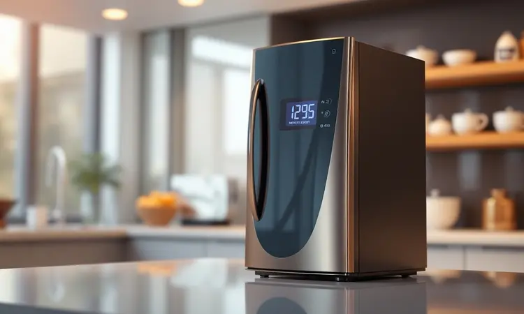
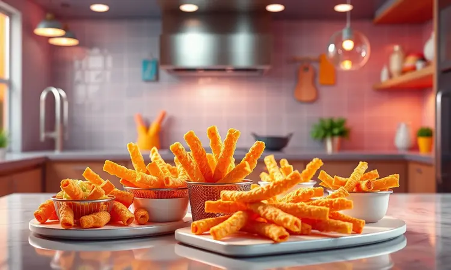
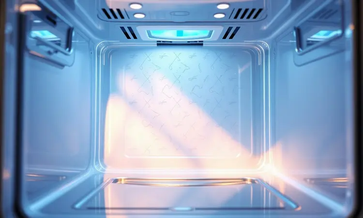

A busca pela fritadeira elétrica ideal passa frequentemente pela Mallory, uma marca consolidada no mercado brasileiro. Mas será que a Air Fryer Mallory é boa mesmo ou existem opções melhores?

Com uma linha que varia desde modelos compactos de 4 litros até as robustas versões Oven de 12 litros com cesto rotativo, a marca tenta equilibrar custo-benefício e tecnologia.

Neste artigo, vamos analisar profundamente o desempenho, a facilidade de limpeza e o consumo de energia dos principais modelos de 2025 para ajudar você a decidir se o investimento realmente vale a pena para sua rotina.

<SummaryList products={frontmatter.top_products} />

## Air Fryer Mallory é Boa?

Imagine poder preparar batatas fritas crocantes, frango dourado e até bolo de caneca sem encharcar tudo em óleo. É essa promessa que a Air Fryer Mallory traz para sua cozinha.

Ela não é apenas mais um eletrodoméstico, mas sim uma aliada para quem busca sabor sem culpa e praticidade no dia a dia.

A tecnologia de circulação de ar quente funciona como um forno supereficiente que frita sem imersão, criando aquela textura irresistível que todo mundo ama.

Onde ela realmente brilha? Na versatilidade. Você ganha um aparelho que assa, grelha, aquece e até desidrata alimentos.

Para famílias pequenas, os modelos compactos são uma mão na roda, enquanto as versões maiores transformam o preparo de refeições em algo quase industrial (no bom sentido). A pergunta que fica é: entre tantas opções, qual modelo se encaixa no seu estilo de vida?

## Melhores Air Fryers Mallory para Conhecer

A Mallory entende que cozinhas são diferentes, assim como as pessoas que usam. Por isso, criou uma linha que vai do básico ao quase profissional. Conheça os cinco modelos que estão fazendo sucesso e descubra qual deles conversa com sua rotina.

### 1. Fritadeira Air Oven Easycook Mallory 12 litros

<ProductBox 
  title={frontmatter.top_products[0].title} 
  image={frontmatter.top_products[0].image} 
  link={frontmatter.top_products[0].link} 
/>

Pense naquele domingo em família, com todo mundo reunido na mesa. A Easycook de 12 litros nasceu para esses momentos. Ela tem espaço suficiente para assar um frango inteiro, preparar batatas para seis pessoas ou até fazer duas assadeiras de legumes ao mesmo tempo.

Com 220°C de temperatura máxima e timer de 90 minutos, você programa o preparo e segue com seu dia.

O visor de vidro com luz interna é a cereja do bolo: você acompanha o frango dourando ou o bolo crescendo sem precisar abrir a porta e interromper o cozimento. É como ter um forno de convecção especializado em deixar tudo crocante.

<CaixaProsContras>

**Prós:**

- Grande capacidade de 12 litros, ideal para porções familiares.

- Tecnologia de circulação de ar quente, promovendo um cozimento saudável.

- Múltiplas funções: assar, fritar, grelhar e tostar.

- Painel de LED que facilita a operação.

**Contras:**

- Ocupa um espaço considerável na cozinha.

- O preço pode ser elevado em comparação a modelos mais simples.

</CaixaProsContras>

### 2. Fritadeira Mallory Grand Smart Air Fryer 4 Litros

<ProductBox 
  title={frontmatter.top_products[1].title} 
  image={frontmatter.top_products[1].image} 
  link={frontmatter.top_products[1].link} 
/>

Morando sozinho ou em apartamento compacto? A Grand Smart de 4 litros é sua melhor amiga. Ela cabe em qualquer bancada sem dominar o espaço, mas ainda assim prepara porções generosas para duas pessoas.

Com 1200W de potência, aquece tão rápido que você mal tem tempo de preparar os ingredientes.

O melhor vem depois: o cesto removível com revestimento antiaderente vai direto para a pia. Cinco minutos e está limpo. Para quem detesta louça acumulada, essa praticidade muda completamente a relação com o preparo de alimentos.

<CaixaProsContras>

**Prós:**

- Prepara alimentos com até 80% menos gordura.

- Potência de 1200W garante cozimento rápido.

- Cesto removível e antiaderente facilita a limpeza.

- Timer com desligamento automático aumenta a segurança.

**Contras:**

- Design simples que pode não agradar a todos.

- O cesto de 2,8 litros pode ser pequeno para famílias grandes.

</CaixaProsContras>

### 3. Fritadeira Elétrica Masterchef Oven Mallory 12 Litros

<ProductBox 
  title={frontmatter.top_products[2].title} 
  image={frontmatter.top_products[2].image} 
  link={frontmatter.top_products[2].link} 
/>

Se você é do tipo que adora receitas elaboradas, a Masterchef Oven é seu playground. Além das funções básicas, ela desidrata frutas, faz iogurte e até fermenta massas.

Os 1700W de potência significam que tudo cozinha mais rápido, enquanto o sistema de fluxo de ar 360 graus garante que cada milímetro do alimento receba o mesmo tratamento.

O painel com botões sensíveis ao toque parece saído de um filme de ficção científica, mas é incrivelmente intuitivo. Escolha entre 8 programas pré-configurados ou ajuste manualmente para criar suas próprias receitas.

<CaixaProsContras>

**Prós:**

- Grande capacidade de 12 litros, ideal para famílias.

- Tecnologia de fritura a ar que promove refeições mais saudáveis.

- Painel intuitivo com funções pré-programadas.

- Acessórios versáteis inclusos para diferentes preparos.

**Contras:**

- Modelo não é bivolt; atenção na escolha da voltagem.

- Tamanho volumoso pode exigir mais espaço na cozinha.

</CaixaProsContras>

### 4. Air Fryer Mallory Digital Turbo Cook

<ProductBox 
  title={frontmatter.top_products[3].title} 
  image={frontmatter.top_products[3].image} 
  link={frontmatter.top_products[3].link} 
/>

Para quem gosta de precisão, a Digital Turbo Cook é uma engenhoca. O painel digital oferece 9 receitas pré-programadas com ajustes perfeitos de tempo e temperatura. Quer saber o segredo?

O sistema Air Cook 360° opera em ciclos inteligentes que mantêm o calor constante, mesmo quando a porta é aberta rapidamente.

Os 6 litros de capacidade são o ponto ideal: suficiente para uma família de quatro pessoas, mas sem ocupar espaço excessivo. E aquele visor em vidro? Ele transforma o cozimento em um espetáculo, especialmente com crianças curiosas.

<CaixaProsContras>

**Prós:**

- Painel digital com receitas pré-programadas.

- Grande capacidade de 6 litros.

- Visor em vidro para acompanhamento do preparo.

- Sistema Air Cook 360° para cozimento uniforme.

**Contras:**

- Desvio na temperatura interna em certos momentos.

- Pode não ser ideal para quem prefere controles analógicos.

</CaixaProsContras>

### 5. Air Fryer Mallory Smart Glass

<ProductBox 
  title={frontmatter.top_products[4].title} 
  image={frontmatter.top_products[4].image} 
  link={frontmatter.top_products[4].link} 
/>

Há algo mágico em ver a comida cozinhar. A Smart Glass entrega exatamente isso com sua cuba de vidro temperado. Imagine observar as batatas ficando douradas, o frango liberando sucos ou os legumes mudando de cor em tempo real. É hipnotizante.

Com 1500W e 4,5 litros, ela tem o equilíbrio perfeito entre potência e tamanho. O painel sensível ao toque responde com um leve toque, e o Air Cook System 360° garante que cada pedaço fique igualmente crocante.

Só tome cuidado: a cuba de vidro exige um manuseio mais delicado, mesmo sendo resistente.

<CaixaProsContras>

**Prós:**

- Cuba de vidro temperado para visualização do cozimento

- Capacidade ideal para famílias e porções maiores

- Painel digital sensível ao toque para fácil controle

- Sistema Air Cook System que reduz gordura nas refeições

**Contras:**

- A cuba de vidro pode requerer cuidados adicionais no manuseio

- Preço pode ser superior a modelos convencionais

</CaixaProsContras>

## Análise Técnica: Design e Usabilidade

Tamanho e potência são importantes, mas de que adiantam se o aparelho for complicado de usar ou difícil de limpar? Vamos aos detalhes que fazem diferença no dia a dia.

### Coletor, Grade e Cavidade Interna

O coletor de gordura da Mallory é um herói desconhecido. Ele captura todo aquele excesso que normalmente ficaria no fundo da fritadeira, fazendo com que você precise apenas esvaziá-lo e passar um pano. A grade interna?

Ela não é apenas um suporte, mas sim um design que direciona o ar quente em padrões específicos para que cada alimento receba calor por igual.

Quanto à cavidade interna, o revestimento antiaderente é tão eficiente que alimentos gordurosos simplesmente escorregam. Depois do uso, um pouco de água morna e detergente resolvem em segundos.

Essa facilidade de limpeza é o que transforma a air fryer de "mais um eletrodoméstico" em "aliado diário".

### Facilidade de uso do Painel Digital

Você já desistiu de usar um aparelho porque o painel parecia a cabine de um avião? A Mallory entende esse drama. Seus painéis digitais são intuitivos como a tela do seu smartphone: toque aqui para temperatura, ali para tempo, escolha o programa e pronto.

Não há menus secretos ou combinações complicadas.

Os modelos mais avançados até memorizam suas configurações favoritas. Fez batatas a 200°C por 20 minutos e adorou o resultado? Salve como "Batatas Perfeitas" e reproduza com um toque. É tecnologia que serve às pessoas, não o contrário.

## Testes Práticos com Alimentos

Especificações técnicas são bonitas no papel, mas o que importa é como a comida fica no prato. Colocamos as Mallorys à prova com os alimentos que todo mundo quer saber: batata frita e pão de queijo. Os resultados podem surpreender você.

### Desempenho com Batata Frita e Pão de Queijo

A batata frita é o teste definitivo. Se ela não ficar crocante por fora e macia por dentro, nada mais funciona direito. Nas Mallorys, o segredo está no sistema de circulação que remove a umidade enquanto cria uma casquinha dourada.

Em 20 minutos, você tem batatas que rivalizam com as de qualquer fast-food, mas com 80% menos óleo.

Já o pão de queijo revela outro talento: a capacidade de aquecer sem ressecar. Em vez de ficar borrachudo no micro-ondas, ele sai quentinho por dentro com aquela casquinha crocante que todo mineiro reconhece.

São detalhes que transformam um lanche rápido em uma experiência.

### Preparo de Carnes na Air Fryer Mallory

Carnes são o grande desafio. Como conseguir aquela crosta dourada sem secar o interior? A Mallory resolve com ciclos inteligentes de calor que selam primeiro, depois cozinham uniformemente. Um filé de frango sai suculento, com aquela pele crocante que parece frita.

O melhor? Tudo isso sem a bagunça do óleo quente saltitando. Você prepara, come e limpa em menos tempo do que levaria para aquecer o forno tradicional. Para quem tem pressa mas não quer abrir mão do sabor, é uma revolução.

## Eficiência e Manutenção

Investir em uma air fryer é também uma decisão sobre eficiência energética e tempo de limpeza. Felizmente, a Mallory acerta em ambos os aspectos.

### Consumo de Energia e Nível de Ruído

Comparada a um forno tradicional que precisa pré-aquecer por 15 minutos, a Mallory atinge a temperatura ideal em 3 a 5 minutos. Essa agilidade significa menos energia gasta para o mesmo resultado.

Os 1200W a 1800W de consumo podem parecer altos, mas como o tempo de uso é menor, a conta no final do mês quase não muda.

Quanto ao ruído, é como um forno de convecção: você ouve o ventilador, mas ele não atrapalha uma conversa ou assistir TV. Em cozinhas americanas integradas, nem percebe que está ligado.

### Cuidados, Limpeza e Segurança

A segurança vem em camadas: desligamento automático quando o timer termina, proteção contra superaquecimento e até um aviso sonoro se você tentar operar com o cesto mal encaixado. São pequenos detalhes que evitam acidentes.

Para limpeza, a regra é simples: espere esfriar, remova as partes soltas e lave com água morna. O revestimento antiaderente faz o resto. Uma vez por mês, limpe o exterior com um pano úmido e verifique o coletor de gordura. Mais simples impossível.

## Como escolher a melhor Air Fryer Mallory?

A escolha correta depende de três perguntas simples:

1. **Para quantas pessoas você cozinha?** 4 litros para 1-2 pessoas, 6 litros para 3-4, 12 litros para famílias grandes ou quem gosta de preparar em quantidade.

2. **Qual seu nível de exigência?** Painéis básicos são perfeitos para quem quer apenas apertar um botão. Painéis digitais agradam quem gosta de controle total.

3. **Quanto espaço você tem?** Meça sua bancada antes de escolher. As de 12 litros são impressionantes, mas ocupam o espaço de um micro-ondas.

Dica bônus: se você tem crianças em casa, considere os modelos com visor de vidro. Ver a comida cozinhar torna a experiência educativa e divertida.

## Conclusão

A Air Fryer Mallory não é apenas mais um eletrodoméstico na sua cozinha. É uma ferramenta que transforma a maneira como você se relaciona com a comida: menos gordura, mais sabor, muito mais praticidade.

Seja você um solteiro apartamentado que detesta lavar louça ou uma família que precisa de agilidade nos jantares, há um modelo que se adapta ao seu ritmo.

O veredito? Vale cada centavo não pelo que ela faz, mas pelo que ela permite que você faça: cozinhar sem complicação, experimentar sem medo de errar e, principalmente, ter mais tempo para o que realmente importa.

A Mallory entrega consistência onde outras marcas vacilam e simplicidade onde outras complicam.

Se você procura uma aliança duradoura com sua cozinha, comece escolhendo a capacidade certa para seu estilo de vida. Depois, deixe que a tecnologia cuide do resto. Suas refeições nunca mais serão as mesmas.