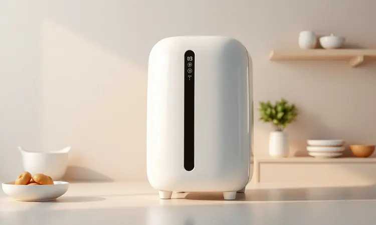
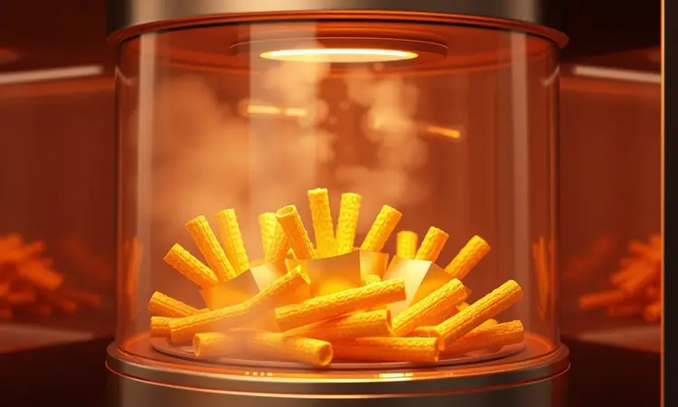

Quando você busca uma fritadeira elétrica, provavelmente pensa em dois cenários: investir pesado em uma supermáquina ou arriscar em uma opção barata que pode decepcionar. A Mondial New Pratic 3,5L (modelo AF-31) aparece justamente nesse meio do caminho.

Ela promete entregar o essencial sem complicar sua vida, ou sua carteira.

Se você já se perguntou se dá para ter alimentos crocantes sem gastar uma fortuna em energia ou se o barulho não vai atrapalhar sua série favorita, vamos juntos destrinchar esse modelo popular para descobrir se ele realmente merece um espaço na sua cozinha.

<SummaryList products={frontmatter.top_products} />

## Descrição do produto

<ProductBox 
  title={frontmatter.top_products[0].title} 
  image={frontmatter.top_products[0].image} 
  link={frontmatter.top_products[0].link} 
/>

Pense nela como aquela amiga prática da cozinha: não tem todos os truques mágicos, mas sempre resolve o problema. Com cerca de 3 litros úteis, é ideal para quem cozinha sozinho ou em casal, aquelas porções que não justificam ligar o forno.

São 1500W de potência que aquecem rápido, e você ajusta entre 80°C e 200°C para desde aquecer um pão até assar uma batata perfeita.

O visual é limpo, em plástico brilhante que combina com praticamente qualquer decoração, mas cuidado: como muitas superfícies brilhantes, pode mostrar marquinhas com o tempo. A parte boa?

A limpeza é facilitada pelo revestimento antiaderente, e o cesto sai completamente para você lavar sem dor de cabeça.

<CaixaProsContras>

**Prós:**

- Bom custo-benefício.

- Praticidade e facilidade de uso.

- Capacidade adequada para pequenas porções.

- Superfície antiaderente que facilita a limpeza.

**Contras:**

- Construção em plástico brilhante que risca com facilidade.

- Funções básicas e menos versátil em comparação com modelos mais avançados.

</CaixaProsContras>

## Design e capacidade

Ela ocupa pouco espaço na bancada, algo que você agradece especialmente se sua cozinha não é das grandes. O design moderno em plástico branco com detalhes prateados não chama atenção demais, mas também não deixa a desejar na estética.

É leve o suficiente para você mover quando precisa limpar embaixo, e a base antiderrapante dá segurança para não escorregar durante o uso.

Os 3,5 litros de capacidade são mais do que suficientes para aquele almoço rápido de segunda-feira ou para preparar petiscos para um pequeno grupo de amigos.

## Construção e acabamento

O que você vê é basicamente o que você tem: construção em plástico resistente que cumpre bem sua função, mas sem aquele acabamento premium de modelos mais caros.

O painel de controle é minimalista e intuitivo, apenas dois botões giratórios para tempo e temperatura, mais um botão liga/desliga. Não há telas digitais ou luzes coloridas, o que pode ser um ponto positivo para quem prefere simplicidade.

O cesto interno é revestido com material antiaderente de boa qualidade, e a grade que segura os alimentos também é removível, facilitando muito na hora de lavar.

## Usabilidade

Aqui está onde ela realmente brilha para o público certo. Se você nunca usou uma airfryer na vida, vai conseguir operá-la em minutos. Gire um botão para escolher quanto tempo precisa (até 30 minutos), gire o outro para a temperatura desejada, e pronto.

Não há modos pré-programados complicados, não há aplicativos para conectar. É pura simplicidade que funciona. E o melhor: como não solta fumaça, você pode usar até mesmo em apartamentos pequenos sem se preocupar em ativar o alarme de incêndio.

## Preparo de alimentos

Esqueça a ideia de que precisa de óleo para tudo. A tecnologia de circulação de ar quente faz com que os alimentos fiquem crocantes por fora e macios por dentro, usando apenas uma colher de óleo (ou muitas vezes nenhuma).

Batatas fritas ficam douradas, frangos assam uniformemente, e até legumes ganham uma textura interessante. A sensação é de estar "trapaceando" na dieta, mas na verdade você está fazendo escolhas mais saudáveis.

### Ruído padrão para air fryer

Vamos ser sinceros: ela faz barulho. Não é um motor de avião decolando, mas lembra aquele zunido constante de um forno elétrico ou micro-ondas em funcionamento. Se você pretende usá-la enquanto assiste a um filme em volume baixo, talvez precise aumentar um pouco o som.

Mas para a maioria das pessoas, é um ruído de fundo que se torna parte natural do ambiente da cozinha.

### Consumo de energia

Aqui vem uma das grandes vantagens sobre o forno tradicional. Com 1500W de potência, ela consome menos energia porque aquece rápido e o espaço interno é pequeno, não precisa pré-aquecer por 15 minutos como um forno grande.

Em média, uma hora de uso consome cerca de 1,5 kWh. Para você ter uma referência, preparar batatas fritas para duas pessoas geralmente leva menos de 20 minutos. Ou seja, economia não só no óleo, mas também na conta de luz.

## Ficha Técnica

Se você gosta de números exatos: capacidade de 3,5 litros, potência de 1500W, temperatura ajustável de 80°C a 200°C, temporizador de até 30 minutos, cesto removível com revestimento antiaderente, dimensões aproximadas de 30x30x32cm e peso de cerca de 4kg.

É a ficha técnica de um aparelho feito para o essencial, sem enrolação.

## Limpeza e cuidados

Esta é uma parte crucial, porque ninguém quer passar meia hora limpando depois de cozinhar. A boa notícia é que todo o cesto interno (incluindo a grade) vai na máquina de lavar louças. Para limpeza manual, uma esponja macia com detergente neutro resolve.

Evite produtos abrasivos que possam arranhar o revestimento antiaderente. Uma dica valiosa: limpe enquanto ainda está morna (não quente), pois resíduos de gordura saem mais facilmente.

E não se esqueça de limpar ocasionalmente as aberturas de ventilação na parte de trás para manter a circulação de ar ideal.

## Concorrentes diretos e modelos similares

No universo das airfryers básicas, ela compete principalmente com marcas como Britânia e Oster, que oferecem modelos similares na mesma faixa de preço.

A Philips é uma opção mais premium, com tecnologia patenteada que alguns juram ser superior, mas custa significativamente mais. Já a Mallory oferece funções extras como modos pré-programados por um preço um pouco acima.

A questão é: você precisa de atalhos digitais ou prefere o controle manual total? Se a resposta for a segunda opção, a Mondial se mantém como uma competidora forte.

## Conclusão

A Mondial New Pratic 3,5L não vai impressionar ninguém com telas touch ou conectividade Wi-Fi. Ela é, no bom sentido, uma ferramenta honesta: cumpre exatamente o que promete, sem firulas.

Para quem está entrando no mundo das airfryers e quer testar o conceito sem gastar muito, ela é uma escolha excelente. Para quem já tem experiência e busca apenas um aparelho reserva para o dia a dia, também funciona perfeitamente.

O plástico pode arranhar e o barulho existe, mas a relação entre o que você paga e o que recebe é difícil de bater. Se sua cozinha precisa de praticidade, economia e resultados decentes, essa airfryer merece sua consideração.

Ela não revolucionará sua vida culinária, mas certamente vai simplificá-la de uma forma que você vai agradecer toda vez que preparar um lanche rápido sem sujar várias panelas.