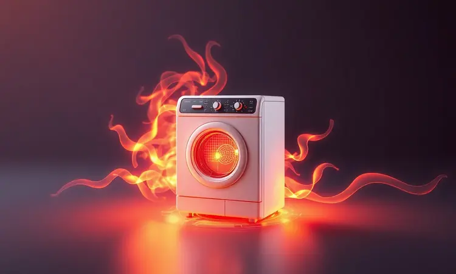

A busca por uma alimentação mais saudável trouxe as fritadeiras sem óleo para o centro das cozinhas brasileiras.

Mas quando você se depara com preços tão atrativos quanto os da Multilaser (agora Multi), aquela pulguinha atrás da orelha aparece: será que o barato sai caro?

Será que vale a pena investir em uma marca conhecida pelo custo-benefício ou é melhor ir direto para as gigantes do mercado?

Fomos a fundo nessa questão para descobrir se a Air Fryer Multilaser é realmente boa ou apenas mais um eletrodoméstico que promete milagres e entrega frustrações.

<SummaryList products={frontmatter.top_products} />

## A marca Multilaser (Multi) é confiável?

Imagine comprar um eletrodoméstico que precisa funcionar dia após dia, suportando o ritmo da sua cozinha. A Multilaser construiu seu nome justamente nesse terreno: oferecer alternativas acessíveis sem abrir mão da funcionalidade básica.

É aquela marca que você encontra quando o orçamento aperta, mas a necessidade de praticidade fala mais alto.

Os produtos geralmente recebem elogios pela relação preço-desempenho, especialmente de quem está dando os primeiros passos na cozinha saudável.

Mas a confiança vem com nuances: enquanto alguns usuários contam histórias de anos de uso sem problemas, outros mencionam variações na durabilidade ou na assistência técnica. O segredo?

Pesquisar o modelo específico que você tem em mente, porque na Multilaser, assim como em qualquer marca, existem estrelas e coadjuvantes.

## Air Fryer Multilaser é boa? Entenda os principais critérios

Antes de mergulharmos nos modelos específicos, vamos desmontar o que realmente importa quando você avalia uma fritadeira sem óleo. Não se trata apenas de potência ou capacidade, mas de como esses números se traduzem no seu dia a dia na cozinha.

### 1. Preço e Custo-benefício

O primeiro olhar sempre vai para o preço, e aqui a Multilaser joga no time dos acessíveis. Mas a pergunta que vale ouro é: o que você realmente ganha com essa economia?

Na prática, essas fritadeiras entregam exatamente o que prometem: uma porta de entrada para o mundo das air fryers sem que você precise desembolsar uma pequena fortuna.

Para quem está testando as águas da alimentação mais saudável ou precisa de uma solução prática para o dia a dia corrido, o custo-benefício faz sentido.

Você consegue preparar batatas crocantes, frangos dourados e até bolos sem precisar dominar técnicas de cozinha avançadas. É como ter um assistente culinário básico, mas extremamente eficiente pelo preço que cobra.

### 2. Desempenho e Potência

Agora vamos ao que interessa: ela realmente frita? Com potências que variam entre 1.200W e 1.800W, as air fryers da Multilaser aquecem rápido o suficiente para não deixar você esperando eternamente enquanto a fome aperta.

A tecnologia de circulação de ar quente funciona como manda o figurino, criando aquela crocância que faz seus olhos brilharem sem a culpa do óleo excessivo.

O que você precisa entender é que desempenho aqui tem um significado prático: alimentos consistentemente bem preparados, tempo de cocção que respeita sua rotina e versatilidade para experimentar receitas além das batatas fritas.

Não espere milagres de um modelo básico, mas espere consistência naquilo que ele se propõe a fazer.

### 3. Durabilidade e Acabamento

E depois de testar o desempenho, surge a questão que tira o sono de qualquer comprador: ela aguenta o tranco do dia a dia? A maioria dos modelos surpreende positivamente aqui.

Materiais que resistem ao uso constante, superfícies que não embaçam após algumas lavagens e uma construção que não parece frágil ao toque.

O acabamento geralmente prioriza a praticidade da limpeza, com partes removíveis que transformam a temida faxina pós-fritura em uma tarefa de minutos.

Claro, como qualquer eletrodoméstico, tratar com cuidado prolonga a vida útil, mas a sensação é de que você não está comprando algo descartável.

### 4. Reputação da Multilaser no Reclame Aqui

Nenhuma análise estaria completa sem dar uma espiada no termômetro da satisfação dos consumidores.

No Reclame Aqui, a Multilaser apresenta aquela mistura típica de marcas populares: muitos elogios pelo custo-benefício, algumas queixas sobre assistência técnica e um esforço visível da empresa em melhorar sua resposta aos clientes.

O que isso significa na prática? Que vale a pena dar uma olhada nas avaliações mais recentes do modelo específico que você quer comprar. A reputação evolui, e o que era problema há um ano pode já ter sido resolvido.

Use o histórico como referência, não como sentença final.

## Principais modelos de Airfryer Multilaser (Multi)

Agora que você entende os critérios, chegamos ao momento decisivo: conhecer os personagens principais dessa história. Cada modelo da Multilaser tem sua personalidade, seu público ideal e seus momentos de brilho na cozinha.

### Fritadeira Elétrica Air Fryer 4L com Grade Vermelha – CE083

<ProductBox 
  title={frontmatter.top_products[0].title} 
  image={frontmatter.top_products[0].image} 
  link={frontmatter.top_products[0].link} 
/>

Pense naquele domingo à tarde em que a família pequena se reúne para um lanche especial, mas ninguém quer perder horas na cozinha.

A CE083 chega como solução nesses momentos: 4 litros de capacidade que cabem batatas para todos, 1500W de potência para agilizar o processo e controles tão simples que até quem nunca usou air fryer entende na primeira tentativa.

O timer de 60 minutos e temperatura ajustável até 200°C dão o controle necessário para não queimar aqueles nuggets que as crianças amam. A limpeza? A cesta removível e antiaderente faz com que você passe mais tempo saboreando do que lavando.

Só fique atento a um detalhe crucial: ela não é bivolt, então confirme se a voltagem combina com a da sua casa antes de clicar em comprar.

<CaixaProsContras>

**Prós:**

- Boa capacidade para famílias pequenas.

- Controle de temperatura e timer funcionais.

- Cesta antiaderente e removível para fácil limpeza.

- Ótimo custo-benefício em comparação com outras marcas.

**Contras:**

- Não é bivolt; é necessário escolher a voltagem correta.

- Pode ser considerada básica em termos de funcionalidades.

</CaixaProsContras>

### Fritadeira Elétrica Air Fryer 4 Litros Preta – CE221

<ProductBox 
  title={frontmatter.top_products[1].title} 
  image={frontmatter.top_products[1].image} 
  link={frontmatter.top_products[1].link} 
/>

Se design importa tanto quanto funcionalidade na sua cozinha, a CE221 apresenta aquele visual 'black piano' que conversa com eletrodomésticos mais sofisticados.

Mas não é apenas beleza: os mesmos 1500W de potência e 4 litros de capacidade garantem que a performance acompanhe a estética.

Imagine preparar um jantar rápido para o casal após um dia cansativo de trabalho. O timer com desligamento automático e aviso sonoro permite que você cuide de outras tarefas enquanto o frango assa, sem o medo constante de queimar tudo.

A praticidade continua na limpeza, com partes que saem facilmente para a pia. Só tenha em mente que para famílias maiores, os 4 litros podem exigir rodízios de preparo.

<CaixaProsContras>

**Prós:**

- Design moderno e elegante em "Black Piano".

- Potência de 1500W para aquecimento rápido.

- Timer com aviso sonoro e desligamento automático.

- Fácil limpeza com partes removíveis.

**Contras:**

- Capacidade de 4 litros pode ser insuficiente para famílias grandes.

- Não possui funções adicionais como descongelamento.

</CaixaProsContras>

### Fritadeira Elétrica Air Fryer 4,2 Litros Preta – CE191

<ProductBox 
  title={frontmatter.top_products[2].title} 
  image={frontmatter.top_products[2].image} 
  link={frontmatter.top_products[2].link} 
/>

Para quem tem uma família que ama variedade no cardápio, a CE191 chega com uma proposta sedutora: 4,2 litros de capacidade e múltiplas funções em um só aparelho.

Assar, fritar, tostar e gratinar deixam de ser verbos separados e se tornam possibilidades ao alcance de botões simples.

O cenário ideal? Um almoço de domingo onde você quer servir batatas crocantes, legumes gratinados e uma carne dourada, tudo com a praticidade de um único eletrodoméstico.

O timer com alarme sonoro é seu aliado contra distrações, enquanto a superfície antiaderente garante que o pós-festa na cozinha seja rápido. Apenas lembre que, para eventos muito grandes, você ainda precisará de rodízios estratégicos.

<CaixaProsContras>

**Prós:**

- Capacidade ideal para famílias.

- Várias funções de preparo.

- Timer com alarme sonoro.

- Facilita a limpeza.

**Contras:**

- Capacidade limitada para grandes porções.

- Pode não ser ideal para frituras em grandes quantidades.

</CaixaProsContras>

### Fritadeira Elétrica Air Fryer 3,5 Litros Gourmet – CE200

<ProductBox 
  title={frontmatter.top_products[3].title} 
  image={frontmatter.top_products[3].image} 
  link={frontmatter.top_products[3].link} 
/>

Cansado de eletrodomésticos que fazem apenas uma coisa? A CE200 chega com a proposta de ser o multitarefas da sua cozinha. Com 3,5 litros focados em eficiência, ela frita, assa e gratina com uma naturalidade que impressiona para o preço.

Imagine experimentar receitas que você só via em programas de culinária, mas sem precisar de equipamentos profissionais ou habilidades de chef. O controle preciso de temperatura (80°C a 200°C) e o timer programável são seus companheiros nessa jornada gastronômica.

A limpeza continua fácil, mas o espaço que ela ocupa na bancada é considerável, então planeje onde vai viver esse novo membro da família culinária.

<CaixaProsContras>

**Prós:**

- Versatilidade: frita, assa e gratina.

- Controle preciso de temperatura.

- Timer programável com desligamento automático.

- Fácil limpeza devido ao revestimento antiaderente.

**Contras:**

- Pode ocupar bastante espaço na cozinha.

- O tempo de preparo é ligeiramente maior que o da fritura convencional.

</CaixaProsContras>

### Fritadeira Elétrica Digital 4 litros com Seletor Giratório – CE168

<ProductBox 
  title={frontmatter.top_products[4].title} 
  image={frontmatter.top_products[4].image} 
  link={frontmatter.top_products[4].link} 
/>

Para quem acha que controles manuais são coisa do passado, a CE168 apresenta um painel digital que simplifica ainda mais a experiência. Os 4 litros de capacidade encontram na praticidade do seletor giratório um parceiro perfeito para o dia a dia corrido.

O cenário é aquele: você chega em casa após o trabalho, com fome e pouco tempo, mas determinada a não cair na tentação do delivery. Girar o seletor para a temperatura certa, programar o timer e seguir com sua vida enquanto a air fryer cuida do resto.

A alça fria é aquele detalhe que você só percebe o valor quando precisa retirar a cesta quente sem queimar os dedos. É menos funções que modelos premium, mas mais do que suficiente para transformar suas refeições.

<CaixaProsContras>

**Prós:**

- Capacidade adequada para famílias.

- Funciona sem óleo, tornando as refeições mais saudáveis.

- Painel digital e seletor giratório facilitam o uso.

- Timer com desligamento automático garante segurança.

**Contras:**

- Menos funções em comparação com modelos premium.

- Pode ser um pouco pesada para manuseio.

</CaixaProsContras>

### Fritadeira Air Fryer Multi 2 Gavetas

<ProductBox 
  title={frontmatter.top_products[5].title} 
  image={frontmatter.top_products[5].image} 
  link={frontmatter.top_products[5].link} 
/>

E se você pudesse cozinhar o frango para o jantar enquanto prepara batatas para um lanche futuro? As modelos com 2 gavetas da Multi transformam essa multitarefa em realidade.

Com capacidade total de 8 litros (4+4) e controles independentes, elas são para quem não aceita esperar.

Imagine a cena: uma gaveta cuidando dos legumes para o almoço enquanto a outra prepara uma sobremesa rápida. Sem transferência de odores, sem precisar coordenar tempos manualmente.

O investimento é maior, mas o retorno em agilidade e flexibilidade pode valer cada centavo para famílias atarefadas ou quem adora receber visitas sem stress na cozinha.

<CaixaProsContras>

**Prós:**

- Cozinha dois alimentos diferentes ao mesmo tempo.

- Controles independentes de tempo e temperatura.

- Facilidade na limpeza devido ao acabamento antiaderente.

- Evita transferência de odores entre os alimentos.

**Contras:**

- Preço geralmente mais elevado em relação a fritadeiras de uma gaveta.

- Pode exigir um tempo de adaptação para coordenar o uso das gavetas.

</CaixaProsContras>

### Fritadeira Elétrica Sem Óleo Air Fryer 3,5L – CE198

<ProductBox 
  title={frontmatter.top_products[6].title} 
  image={frontmatter.top_products[6].image} 
  link={frontmatter.top_products[6].link} 
/>

Para quem busca equilíbrio entre capacidade e espaço, a CE198 oferece 3,5 litros que cabem em cozinhas menores sem abrir mão de preparar refeições completas.

Os 1500W garantem rapidez, enquanto o controle de temperatura (60°C a 200°C) abre portas para receitas que vão além da fritura tradicional.

Pense nas festinhas em família onde você quer impressionar com petiscos crocantes, mas sem ocupar todo o balcão da cozinha. A cesta removível e antiaderente significa que, após a festa, a limpeza é questão de minutos.

Só considere que, se sua família for grande ou seus eventos frequentes, talvez precise de uma capacidade maior ou de preparar em lotes.

<CaixaProsContras>

**Prós:**

- Alta potência que garante rapidez no preparo.

- Cesta removível e antiaderente facilita a limpeza.

- Controle de temperatura ajustável para várias receitas.

- Ótima capacidade para famílias ou eventos.

**Contras:**

- Ocupa um espaço considerável na bancada.

- Pode ser considerada um investimento um pouco maior.

</CaixaProsContras>

## Qual a potência média da AirFryer Multilaser?

Quando você lê "potência média entre 1.200W e 1.800W", o que isso realmente significa na sua cozinha? Traduzindo: é energia suficiente para não deixar você esperando enquanto a fome cresce, mas equilibrada para não fazer sua conta de luz disparar.

Essa faixa garante que os alimentos atinjam a temperatura ideal rapidamente, criando aquela crocância que faz a diferença entre "comível" e "delicioso".

Mas potência não é tudo: o que importa é como ela se combina com a circulação de ar e o design interno para entregar resultados consistentes. Na Multilaser, a maioria dos modelos fica na casa dos 1500W, o ponto ideal entre eficiência e consumo consciente.

## Veredito: Vale a pena comprar uma fritadeira Multi?

Depois de analisar critério por critério e modelo por modelo, chegamos ao momento da verdade. A resposta não é um simples sim ou não, mas um "depende do que você busca".

Se você está dando os primeiros passos na cozinha saudável, tem um orçamento limitado ou precisa de uma solução prática para o dia a dia sem comprometer a qualidade básica, a Multilaser se apresenta como uma opção honesta.

Ela entrega exatamente o que promete: uma maneira acessível de preparar alimentos mais saudáveis sem dramas.

Se, por outro lado, você busca recursos avançados, durabilidade comprovada em anos de uso intensivo ou um design que converse com eletrodomésticos premium, talvez valha considerar investir um pouco mais em outras marcas.

O que fica claro é que a Multilaser não é uma armadilha para incautos. É uma marca que ocupa um nicho específico com competência: oferecer o essencial bem feito por um preço que não assusta. Para muitas famílias brasileiras, essa é exatamente a proposta que faz sentido.

## Conclusão

A jornada desde a dúvida inicial sobre "barato sai caro" até a compreensão real do que a Multilaser oferece revela algo fundamental: no mundo das air fryers, como na vida, nem sempre o mais caro é o mais adequado para você.

A Air Fryer Multilaser é boa sim, dentro do contexto para o qual foi projetada.

Ela não compete com modelos premium em recursos avançados ou acabamento luxuoso, mas competi com maestria em um terreno crucial: tornar a alimentação mais saudável acessível para quem não pode ou não quer investir fortunas.

Se sua necessidade é uma ferramenta prática para transformar batatas em crisps crocantes, frangos em refeições douradas e legumes em acompanhamentos saborosos, sem dramas na limpeza ou no bolso, você encontrou uma candidata séria.

Apenas lembre-se: conheça seus modelos, entenda suas limitações e escolha aquele que conversa com sua rotina real na cozinha. Afinal, o melhor eletrodoméstico não é o mais caro, mas o que você usa todos os dias com satisfação.