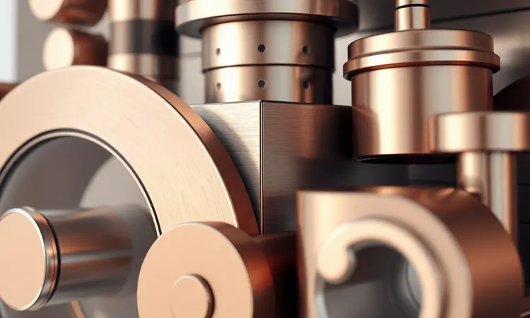
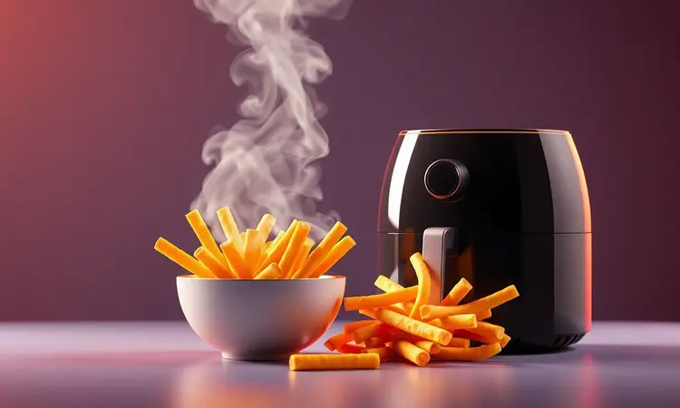
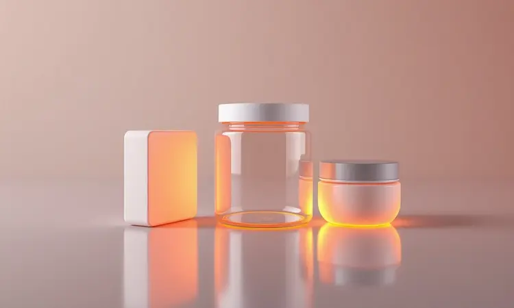

Comprar uma air fryer tornou-se um marco na cozinha moderna, unindo praticidade e saúde no preparo dos alimentos. Entre tantas marcas disponíveis, a Oster se destaca pelo design robusto e tecnologias diferenciadas, mas a dúvida permanece: a Air Fryer Oster é boa mesmo?

Se você está em dúvida entre o modelo Oven de 12L, a linha DiamondTech ou as opções mais compactas, este guia foi feito para você. Analisamos detalhadamente o portfólio da marca, comparamos com concorrentes como a Electrolux e avaliamos o desempenho real.

Descubra agora qual modelo realmente vale o investimento para sua cozinha.

<SummaryList products={frontmatter.top_products} />

## Air Fryer Oster: Vale a Pena Investir na Marca?

Imagine transformar sua cozinha em um espaço onde o crocante perfeito não exige litros de óleo nem horas de monitoramento.

A Air Fryer Oster tem ganhado destaque no mercado exatamente por entregar essa promessa, combinando a tradição da marca em eletrodomésticos com inovações que facilitam sua rotina.

A tecnologia de circulação de ar quente vai além de simplesmente aquecer alimentos, ela cria uma experiência: batatas fritas com aquele dourado uniforme que você adora, frangos suculentos por dentro e crocantes por fora, tudo usando até 80% menos óleo.

Mas a verdadeira pergunta não é se a tecnologia funciona, e sim como ela se encaixa na sua vida. Se você abre a geladeira e pensa "hoje quero algo rápido", ou se planeja refeições para a família inteira, existe um modelo Oster pensado para seu ritmo.

Vamos explorar cada opção como quem escolhe um parceiro de cozinha: não pelo que ele promete, mas pelo que realmente entrega no seu dia a dia.

## Por que você precisa de uma fritadeira elétrica Oster?

Pare por um momento e visualize sua rotina na cozinha. Quantas vezes você desiste de preparar algo mais elaborado porque não quer sujar várias panelas, monitorar fogão e forno ao mesmo tempo, ou lidar com o cheiro de óleo que impregna tudo?

A fritadeira elétrica Oster surge como um atalho inteligente para essas dores. Ela não substitui apenas a fritura tradicional, ela reorganiza sua relação com o preparo de alimentos.

Ao oferecer opções para assar, fritar, grelhar e até desidratar em um único aparelho, você ganha espaço físico (menos eletrodomésticos acumulando poeira) e mental (menos decisões sobre qual utensílio usar).

A praticidade se traduz em refeições mais saudáveis que parecem indulgentes, em tempo recuperado para você, e numa cozinha que exala confiança em vez de cansaço.

### Air Fryer Oven Oster OFRT780 12L

<ProductBox 
  title={frontmatter.top_products[0].title} 
  image={frontmatter.top_products[0].image} 
  link={frontmatter.top_products[0].link} 
/>

Para famílias numerosas ou quem adora receber amigos, a capacidade importa tanto quanto o sabor. O modelo OFRT780 com 12 litros é como ter um forno compacto que também frita, assa e desidrata.

Imagine preparar um frango inteiro girando lentamente na função rotisserie enquanto batatas assam na bandeja inferior, tudo ao mesmo tempo.

Os 1800W de potência garantem que o calor chegue rápido e uniforme, criando uma casca crocante que protege o suco interior dos alimentos.

O display digital com nove funções pré-programadas elimina adivinhações. Você seleciona "legumes" e o aparelho já sabe a temperatura e tempo ideais. Aquela ansiedade de "será que já está no ponto certo?" desaparece.

A única ressalva prática vem na limpeza: os acessórios giratórios da rotisserie exigem atenção extra, e alguns modos não permitem pular o pré-aquecimento.

Mas quando você serve um jantar completo para seis pessoas usando apenas um eletrodoméstico, esses detalhes se tornam compromissos aceitáveis.

<CaixaProsContras>

**Prós:**

- Versatilidade: funciona como fritadeira, forno e desidratador.

- Grande capacidade de 12 litros ideal para famílias.

- Função rotisserie que proporciona cozimento uniforme.

- Display digital com várias funções pré-programadas.

**Contras:**

- Limpeza dos acessórios pode ser mais trabalhosa.

- Pré-aquecimento não pode ser pulado em alguns modos de programação.

</CaixaProsContras>

### Air Fryer Oven Oster OFRT660 4,8L

<ProductBox 
  title={frontmatter.top_products[1].title} 
  image={frontmatter.top_products[1].image} 
  link={frontmatter.top_products[1].link} 
/>

Se seu espaço é limitado mas suas ambições culinárias não, o modelo OFRT660 encontra o equilíbrio ideal. Com 4,8 litros, ele alimenta confortavelmente até quatro pessoas sem ocupar metade do balcão da cozinha.

Os 1500W de potência significam que em poucos minutos você tem batatas fritas crocantes ou vegetais assados com aquele tosta dourada que transforma simples ingredientes em pratos especiais.

O painel digital oferece oito funções pré-programadas que funcionam como um chef assistente pessoal. A opção de desidratar permite criar chips de frutas saudáveis ou temperos caseiros, expandindo seu repertório além do básico.

O acabamento em aço inoxidável não é apenas estético, ele comunica durabilidade. Apenas atenção ao peso (5,6 kg) se você precisar movê-la frequentemente, e verifique a voltagem correta para sua residência, já que não é bivolt.

<CaixaProsContras>

**Prós:**

- Capacidade ideal para famílias de até 4 pessoas.

- Potência alta que garante alimentos mais crocantes.

- Diversidade de funções culinárias com opções pré-programadas.

- Design moderno em aço inoxidável.

**Contras:**

- Não é bivolt, o que pode limitar a instalação em algumas casas.

- O peso pode ser um pouco elevado para manuseio frequente.

</CaixaProsContras>

### Fritadeira Inox DiamondTech Oster 7,5L

<ProductBox 
  title={frontmatter.top_products[2].title} 
  image={frontmatter.top_products[2].image} 
  link={frontmatter.top_products[2].link} 
/>

Existe um momento na vida da cozinha onde você cansa de esfregar. A tecnologia DiamondTech da Oster nasce exatamente para esse cansaço.

O revestimento antiaderente é 15 vezes mais resistente a riscos do que os convencionais, o que significa que anos de uso não vão deixar marcas de desgaste.

Para quem valoriza tanto a durabilidade quanto a praticidade, essa característica muda completamente a experiência de posse.

Com 7,5 litros de capacidade, ela acomoda porções generosas sem necessidade de cozinhar em rodadas. O visor transparente é um toque de genialidade: você acompanha o dourado das batatas ou o grelhado da carne sem abrir a tampa e interromper o fluxo de ar quente.

O painel touch responde com precisão às suas escolhas entre dez funções pré-programadas. Apenas lembre que, para espaços muito compactos, suas dimensões podem exigir um planejamento de posicionamento.

<CaixaProsContras>

**Prós:**

- Capacidade de 7,5 litros, ideal para grandes porções.

- Tecnologia DiamondTech facilita a limpeza e aumenta a durabilidade.

- Painel touch com diversas funções pré-programadas.

- Visor transparente para monitorar o cozimento.

**Contras:**

- Não é bivolt, requer escolha de voltagem.

- O design pode ser um pouco volumoso para espaços pequenos.

</CaixaProsContras>

### Fritadeira Oster OFRT520 4,6L

<ProductBox 
  title={frontmatter.top_products[3].title} 
  image={frontmatter.top_products[3].image} 
  link={frontmatter.top_products[3].link} 
/>

Quando você precisa de resultados consistentes sem complicações, o modelo OFRT520 oferece uma simplicidade que encanta.

Com 4,6 litros e 1500W, ela aquece rápido e mantém a temperatura estável entre 80°C e 200°C, permitindo desde desidratar lentamente até fritar rapidamente.

O timer programável até 60 minutos funciona como um despertador culinário: você coloca os alimentos, ajusta e pode se afastar sabendo que o desligamento automático evitará surpresas.

A elegância do acabamento em inox esconde uma praticidade robusta. O cesto removível com revestimento antiaderente vai direto para a máquina de lavar louça, transformando a limpeza em uma tarefa de segundos.

O único ruído nessa harmonia é o barulho durante a operação, típico de ventiladores potentes, mas que se torna apenas fundo sonoro quando você experimenta a crocância perfeita que ela entrega.

<CaixaProsContras>

**Prós:**

- Capacidade generosa de 4,6 litros, adequada para famílias.

- Potência de 1500W, garantindo aquecimento rápido.

- Controle de temperatura versátil entre 80°C e 200°C.

- Fácil limpeza com componentes removíveis.

**Contras:**

- Pode ser um pouco barulhenta durante o uso.

- A porta pode exigir ajuste para fechar corretamente.

</CaixaProsContras>

### Fritadeira Oster OFRT510 4L

<ProductBox 
  title={frontmatter.top_products[4].title} 
  image={frontmatter.top_products[4].image} 
  link={frontmatter.top_products[4].link} 
/>

Para quem aprecia a estética tanto quanto a funcionalidade, o modelo OFRT510 em Black Piano com detalhes em inox é um objeto de desejo que também cozinha. Suas linhas limpas e acabamento sofisticado fazem com que você não queira escondê-la no armário.

Os 4,5 litros de capacidade e 1500W de potência significam que ela entrega desempenho proporcional ao seu visual, atingindo 200°C rapidamente para selar sabores.

O controle analógico de temperatura, com saltos entre 160°C e 200°C, exige um pouco de intuição culinária, mas também oferece liberdade para quem gosta de ajustes manuais.

É como dirigir um carro manual depois de anos no automático: existe uma curva de aprendizado, mas também uma sensação de controle direto.

O cesto antiaderente mantém a limpeza simples, enquanto o barulho operacional lembra que há potência trabalhando dentro daquela carcaça elegante.

<CaixaProsContras>

**Prós:**

- Desempenho rápido e uniforme no preparo dos alimentos.

- Capacidade generosa de 4,5 litros.

- Design moderno e fácil de integrar na cozinha.

- Cesto antiaderente que facilita a limpeza.

**Contras:**

- Controle de temperatura analógico que pode não ser tão preciso.

- Pode ser um pouco barulhenta durante o funcionamento.

</CaixaProsContras>

## Design e Construção dos Modelos Oster

Uma air fryer passa mais tempo em exposição do que em uso. Ela fica no seu balcão, testemunhando suas manhãs apressadas e noites relaxantes. A Oster entende isso e desenvolve designs que conversam com sua cozinha, não apenas ocupam espaço.

Os acabamentos em inox refletem luz e limpeza, enquanto os plásticos resistentes suportam anos de abertura e fechamento sem folgas.

Mas a verdadeira inteligência do design está nos detalhes funcionais: cestos que deslizam sem esforço, alças que não esquentam ao toque, painéis inclinados na altura perfeita para leitura rápida. A facilidade de limpeza não é acidental, é projetada.

Quando um eletrodoméstico é fácil de manter, você o usa mais. E quando o usa mais, ele se torna parte da sua identidade culinária.

## Usabilidade e Desempenho no Dia a Dia

A prova de qualquer eletrodoméstico acontece na terça-feira à noite, quando o cansaço do trabalho encontra a fome da família. É nesse momento que a Air Fryer Oster transforma pressa em prazer.

O pré-aquecimento quase instantâneo significa que em cinco minutos você tem batatas fritas começando a dourar, enquanto prepara o resto do jantar.

A curva de aprendizado é tão suave que até crianças podem operá-la sob supervisão. Basta escolher a temperatura, definir o tempo e esperar o aviso sonoro.

O desempenho consistente cria confiança: você sabe que as asinhas de frango sairão sempre crocantes, que os legumes manterão seu brilho e nutrientes, que o peixe ficará úmido por dentro.

Essa previsibilidade transforma a cozinha de um local de tentativa e erro em um espaço de resultados garantidos.

## Air Fryer Electrolux ou Oster: qual é melhor?

Escolher entre Oster e Electrolux é como escolher entre dois amigos confiáveis, cada um com sua personalidade. A Electrolux brilha na simplicidade imediata: tecnologias de aquecimento rápido e funções automáticas que praticamente pensam por você.

Se seu objetivo é minimizar esforço mental no preparo, ela seduz com sua abordagem direta.

A Oster, por outro lado, investe na relação de longo prazo. Sua construção robusta, cestos maiores e tradição em eletrodomésticos falam de durabilidade. Ela não é apenas fácil de usar hoje, mas promete continuar fácil daqui a cinco anos.

A decisão final vive no seu estilo de vida: se você prioriza inovação tecnológica imediata ou robustez que acompanha suas mudanças.

## Como escolher a melhor fritadeira para sua cozinha

Escolher uma air fryer não é sobre especificações técnicas, é sobre perguntar-se como você realmente cozinha. Antes de comparar números, imagine seu dia típico na cozinha. Quantas pessoas você alimenta regularmente?

Prefere experimentar receitas novas ou repetir os pratos que já domina? Valoriza mais a velocidade ou a versatilidade?

### Confira a capacidade da fritadeira em litros

Os litros de capacidade traduzem-se diretamente em liberdade culinária. Um modelo de 2,5 litros é perfeito para solteiros ou casais que preparam porções individuais, enquanto os 6 litros ou mais abrem espaço para festas improvisadas e meal prep de fim de semana.

Mas capacidade vai além do número: pense em como você organiza os alimentos. Alguns modelos têm bandejas múltiplas que permitem cozinhar proteínas e acompanhamentos simultaneamente, dobrando virtualmente sua capacidade útil.

### Verifique o controle de temperatura e funções pré-programadas

O controle de temperatura é o maestro da sua orquestra culinária. Modelos digitais oferecem precisão cirúrgica, ideal para receitas que exigem pontos específicos. Os analógicos, enquanto menos precisos, oferecem uma intuitividade tátil que alguns cozinheiros preferem.

As funções pré-programadas são atalhos mentais: ao invés de lembrar que batatas fritas precisam de 200°C por 20 minutos, você apenas aperta um botão. Essa economia de energia cognitiva é o verdadeiro luxo em uma cozinha moderna.

### Veja se o produto é fácil de limpar

A relação com a limpeza determina quantas vezes você usará o aparelho. Componentes removíveis que vão à máquina de lavar louça transformam uma tarefa chata em um gesto rápido.

Revestimentos antiaderentes de alta qualidade não apenas facilitam a limpeza, mas também prolongam a vida do produto.

Observe também os cantos e frestas: alguns designs acumulam migalhas em áreas difíceis de alcançar, enquanto outros têm linhas limpas que deixam passar apenas água e sabão.

## Conclusão

Depois de explorar o universo das Air Fryers Oster, fica claro que a pergunta não é se elas valem a pena, mas qual modelo vale a pena para sua vida específica.

A marca oferece uma gama que vai desde o prático OFRT510 com seu visual elegante até o poderoso Oven OFRT780 que funciona como uma cozinha completa em um único aparelho.

O que une todos os modelos é uma filosofia: transformar o saudável em saboroso sem exigir horas de preparo ou limpeza.

Seja através da tecnologia DiamondTech que praticamente lava a si mesma, dos displays digitais que eliminam adivinhações, ou das capacidades generosas que alimentam famílias inteiras, a Oster entende que um eletrodoméstico deve simplificar, não complicar.

Sua escolha final deve refletir não apenas seu espaço físico disponível, mas seu estilo culinário. Se você é do tipo que planeja jantares elaborados, os modelos maiores com múltiplas funções liberarão sua criatividade.

Se busca praticidade no dia a dia, as opções compactas com controles intuitivos serão sua aliada perfeita. Independentemente da escolha, você estará investindo em mais do que um eletrodoméstico, estará conquistando tempo, saúde e prazer à mesa.