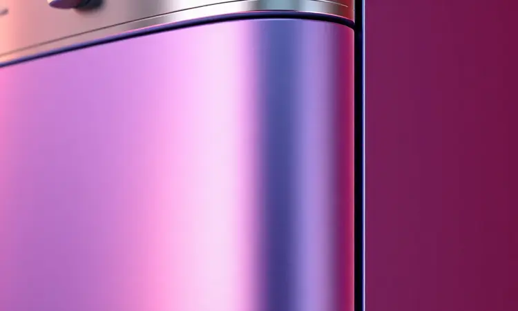
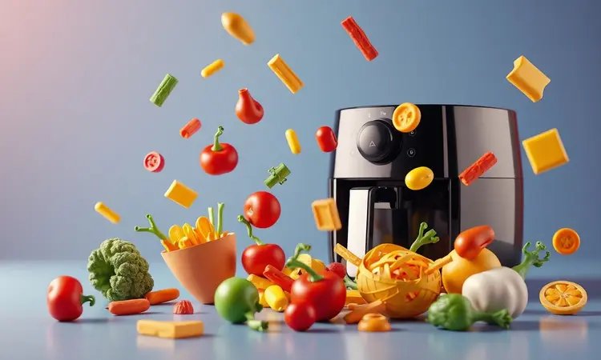

Imagine comprar um eletrodoméstico que promete transformar sua relação com a cozinha, mas ficar na dúvida se vai entregar o que promete.

Essa é exatamente a sensação de muitos brasileiros ao pesquisar sobre as fritadeiras da Elgin, uma marca que carrega décadas de tradição em eletroportáteis mas que, no novo mercado das air fryers, ainda gera questionamentos.

Será que vale a pena confiar nesse nome quando se trata de uma tecnologia relativamente recente? Vamos desvendar essa questão juntos, analisando não apenas números e especificações, mas a experiência real de quem já levou uma Elgin para casa.

<SummaryList products={frontmatter.top_products} />

## Sobre a marca Elgin e sua reputação no mercado

Desde 1952, a Elgin construiu seu legado nas cozinhas brasileiras. Não se trata apenas de fabricar eletrodomésticos, mas de entender os hábitos e necessidades de quem cozinha no país.

Quando você compra um produto Elgin, está adquirindo parte dessa história de proximidade com o consumidor brasileiro. Essa trajetória explica por que tantas famílias ainda têm um fogão ou liquidificador da marca funcionando perfeitamente após anos de uso.

Essa confiança conquistada gosto a gosto é o que a Elgin tenta transpor para o universo das air fryers: oferecer não apenas um aparelho, mas uma experiência familiar e confiável.

## A Air Fryer Elgin no Reclame Aqui e a opinião dos consumidores

Antes de convidar qualquer aparelho para sua cozinha, é natural querer saber como ele se comporta na casa dos outros. No Reclame Aqui, as avaliações sobre as air fryers Elgin pintam um retrato realista.

Muitos usuários celebram a praticidade, elogiando como conseguem preparar batatas crocantes para o jantar em minutos, com aquela sensação gostosa de comer algo saboroso sem exagerar no óleo.

Contudo, alguns relatos trazem à tona desafios no pós-venda, como dificuldades para conseguir peças de reposição ou respostas lentas do suporte.

Essas experiências mistas são um lembrete importante: mesmo com uma marca tradicional, o atendimento pode variar, e vale a pena considerar esse aspecto na sua decisão.

## Análise dos Modelos de Air Fryer da Elgin para comprar agora

O que realmente conta na hora da escolha é entender qual modelo dialoga com sua rotina. A Elgin oferece opções que vão do básico eficiente ao multifuncional, cada uma com sua personalidade na cozinha.

### Elgin Start Fry 3,5 Litros

<ProductBox 
  title={frontmatter.top_products[0].title} 
  image={frontmatter.top_products[0].image} 
  link={frontmatter.top_products[0].link} 
/>

Pense naqueles dias em que você chega cansado do trabalho e só quer algo rápido e gostoso para comer. A Start Fry 3,5 litros foi feita para esse momento.

Com seus 1400W, ela esquenta rápido, e a tecnologia Air Circuit 360° garante que cada pedacinho de frango ou batata receba calor de maneira uniforme.

Ajustar a temperatura entre 80°C e 200°C é tão simples quanto girar um botão, e o timer de 60 minutos permite que você cuide de outras coisas enquanto a comida fica pronta.

A simplicidade tem seu preço: o cesto de 3,5 litros é generoso para uma ou duas pessoas, mas pode apertar se sua fome ou sua família forem maiores.

Para quem mora sozinho ou em casal, no entanto, essa limitação se transforma em vantagem: o design compacto não ocupa metade do balcão, e a limpeza é tão fácil que você nem pensa duas vezes antes de usar.

<CaixaProsContras>

**Prós:**

- Fritura com até 80% menos gordura.

- Design compacto, ideal para espaços pequenos.

- Controle de temperatura ajustável para diferentes receitas.

- Fácil limpeza com revestimento antiaderente.

**Contras:**

- Cesto pequeno para porções maiores.

- Desempenho mediano em comparação com modelos mais caros.

</CaixaProsContras>

### Elgin Oven Fry 4 em 1 12 Litros

<ProductBox 
  title={frontmatter.top_products[1].title} 
  image={frontmatter.top_products[1].image} 
  link={frontmatter.top_products[1].link} 
/>

Se a Start Fry é para o dia a dia prático, a Oven Fry 4 em 1 é para quem vê a cozinha como um laboratório de possibilidades.

Imagine preparar chips de batata-doce desidratados no domingo, assar um frango inteiro na terça e reaquecer a pizza da sexta, tudo no mesmo aparelho. Com 12 litros de capacidade e 1800W de potência, essa versatilidade cabe numa família inteira.

O painel touch dá um ar moderno à experiência, mas é importante saber que tanta potência tem sua voz: o aparelho emite um ruído considerável durante o funcionamento, aquela faixa sonora que diz 'estou trabalhando'.

Outro detalhe prático: atenção à voltagem, pois este não é um modelo bivolt.

<CaixaProsContras>

**Prós:**

- Multifuncionalidade com 4 funções em um só aparelho.

- Capacidade ideal para famílias maiores.

- Potência alta para resultados rápidos e eficientes.

- Design moderno e fácil de limpar.

**Contras:**

- Nível de ruído pode ser considerável.

- Não possui opção bivolt.

</CaixaProsContras>

### Elgin Cube Fry 4,2 Litros

<ProductBox 
  title={frontmatter.top_products[2].title} 
  image={frontmatter.top_products[2].image} 
  link={frontmatter.top_products[2].link} 
/>

Algumas vezes, o que buscamos é o equilíbrio perfeito entre tamanho e estilo. A Cube Fry de 4,2 litros traz esse conceito para a cozinha: design quadrado moderno que parece mais um acessório de decoração do que um eletrodoméstico.

Para famílias de três ou quatro pessoas, a capacidade é mais do que suficiente para uma refeição completa, sempre com aquela economia de até 80% de gordura que faz bem ao paladar e à saúde.

O controle de temperatura vai até 200°C e o timer de 60 minutos oferece praticidade, mas há um detalhe de convivência: como qualquer aparelho potente, ele esquenta durante o uso, então vale deixar um espaço de respiro ao redor.

<CaixaProsContras>

**Prós:**

- Design moderno e compacto.

- Cozinha com até 80% menos gordura.

- Fácil limpeza devido ao revestimento antiaderente.

- Controle de temperatura e timer práticos.

**Contras:**

- Capacidade pode ser insuficiente para grandes famílias.

- Pode esquentar bastante durante o uso, exigindo cuidado.

</CaixaProsContras>

### Air Fryer Elgin Easy Oven Fry 3 em 1

<ProductBox 
  title={frontmatter.top_products[3].title} 
  image={frontmatter.top_products[3].image} 
  link={frontmatter.top_products[3].link} 
/>

Para quem gosta da ideia de multifuncionalidade mas busca algo mais acessível que a Oven Fry, a Easy Oven Fry 3 em 1 apresenta uma proposta interessante.

Com as mesmas 12 litros de capacidade, ela frita, assa e reaquece, trazendo para sua cozinha a possibilidade de experimentar receitas diferentes sem ocupar todo o espaço do balcão.

A tecnologia Air Circuit 360º continua garantindo que os alimentos cozinhem por igual, e a facilidade de limpeza chega ao ponto de poder lavar as peças na lava-louças.

No entanto, alguns usuários relatam que, com o tempo, certas peças podem mostrar desgaste ou sinais de ferrugem, especialmente se não secadas completamente após a lavagem.

<CaixaProsContras>

**Prós:**

- Multifuncionalidade: assa, frita e reaquece.

- Grande capacidade de 12 litros, ideal para famílias.

- Tecnologia de circulação de ar para cozimento uniforme.

- Facilidade na limpeza das peças.

**Contras:**

- Alguns relatos sobre durabilidade das peças.

- Espaço interno pode parecer menor do que o esperado.

</CaixaProsContras>

### Air Fryer Elgin 4 Litros

<ProductBox 
  title={frontmatter.top_products[4].title} 
  image={frontmatter.top_products[4].image} 
  link={frontmatter.top_products[4].link} 
/>

Às vezes, menos é mais. A Quick Fryer de 4 litros encapsula essa filosofia: um aparelho que faz bem o essencial, sem complicações.

Perfeita para quem mora sozinho ou para pequenas famílias, ela transforma o preparo de alimentos em algo simples e saudável, mantendo a promessa de até 80% menos gordura.

O revestimento Black Resist na cesta antiaderente é um toque inteligente que facilita demais a limpeza, e o desligamento automático oferece aquela paz de espírito para quem tem distrações na cozinha.

Se comparada a modelos mais potentes no mercado, ela pode demorar alguns minutos a mais para pré-aquecer, mas na maioria das receitas do dia a dia, essa diferença passa despercebida.

<CaixaProsContras>

**Prós:**

- Capacidade ideal para pequenas famílias.

- Preparo de alimentos com até 80% menos gordura.

- Fácil limpeza com cesta antiaderente.

- Design compacto que se adapta bem à cozinha.

**Contras:**

- Potência inferior a alguns concorrentes.

- Capacidade pode ser limitada para grandes porções.

</CaixaProsContras>

## Ficha Técnica e características gerais das fritadeiras Elgin

Para além dos modelos específicos, o que realmente define uma air fryer Elgin? É aquela combinação de elementos que se repetem em diferentes versões, criando uma identidade própria.

### Design, acabamento e capacidade

Olhe para uma cozinha brasileira média e você entenderá o pensamento por trás do design Elgin: linhas que não competem com a decoração, cores que se harmonizam e uma pegada mais discreta do que chamativa.

Essa escolha estética vem acompanhada de materiais que resistem ao uso diário e facilitam a limpeza, uma preocupação real para quem cozinha todos os dias.

Na questão da capacidade, a Elgin acerta ao oferecer uma gama que vai dos 3,5 litros mais solitários aos 12 litros familiares, permitindo que você escolha não pelo que o marketing diz, mas pelo tamanho real da sua fome.

### Consumo de energia e potência

Quando você liga uma air fryer, está fazendo um acordo com sua conta de luz. Os modelos Elgin variam entre 1.200W e 1.800W, números que falam sobre velocidade e eficiência.

Um aparelho mais potente pré-aquece rápido e cozinha em menos tempo, ideal para aqueles minutos preciosos antes do jantar. No entanto, essa agilidade tem seu custo energético, especialmente se o aparelho virar o protagonista da sua cozinha.

O segredo está no equilíbrio: escolher a potência que atende suas necessidades sem exageros, e usar os controles de temperatura e timer para otimizar cada minuto de uso.

## Uso da Air Fryer no dia a dia: Praticidade e performance

O verdadeiro teste de uma air fryer não acontece na loja, mas na segunda-feira à noite, quando você chega em casa sem criatividade para o jantar.

É nesse momento que a promessa de praticidade precisa se materializar em algo concreto: batatas fritas crocantes em 15 minutos, filés de frango dourados sem virar vira-latas na panela, legumes assados com aquele toque caramelizado.

A beleza está na simplicidade operacional: selecione a temperatura, ajuste o tempo e deixe o ar quente fazer sua mágica.

A limpeza pós-uso complementa essa conveniência, com peças removíveis que muitas vezes podem ir direto para a lava-louças, eliminando aquela etapa desagradável de esfregar panelas engorduradas.

## Cuidados, higienização e limpeza do aparelho

Relacionamentos duradouros exigem cuidado, e com sua air fryer não é diferente. Após cada uso, dar ao aparelho alguns minutos para esfriar antes da limpeza preserva tanto sua segurança quanto a integridade do material.

A cesta e a bandeja, com seu revestimento antiaderente, pedem água morna e detergente neutro, nada de esponjas agressivas que arranham a superfície. Para aquelas manchinhas teimosas de gordura, um banho de molho resolve.

Não se esqueça da parte externa: um pano úmido remove poeira e respingos, mantendo o aparelho com cara de novo por mais tempo. Esses pequenos rituais garantem que sua air fryer continue entregando performance de primeira, refeição após refeição.

## Conclusão: A Air Fryer Elgin é boa e vale a pena mesmo?

Voltemos à pergunta inicial, aquela que trouxe você até aqui. A Air Fryer Elgin é boa? A resposta depende do que você busca.

Se você valoriza a tradição de uma marca brasileira que conhece os hábitos locais, busca um equilíbrio entre custo e benefício, e está disposto a abrir mão de algumas funcionalidades avançadas em nome da simplicidade, então sim, ela pode ser uma excelente companheira de cozinha.

A Elgin não tenta competir com as ultra-tecnológicas importadas, mas oferece algo igualmente valioso: produtos que fazem bem o essencial, adaptados à realidade brasileira.

Os modelos variam do básico eficiente ao multifuncional versátil, sempre mantendo o compromisso de preparar alimentos mais saudáveis com menos gordura.

Antes de decidir, lembre-se de alinhar suas expectativas à sua rotina. Para quem cozinha pouco ou para poucas pessoas, os modelos menores como a Start Fry ou a Quick Fryer entregam praticidade sem ocupar espaço.

Famílias maiores ou entusiastas culinários podem encontrar na Oven Fry 4 em 1 a versatilidade que desejam. E sempre considere que, como qualquer aparelho, o cuidado no uso e na limpeza prolonga sua vida útil.

No final, a escolha certa é aquela que transforma o preparo das refeições de uma obrigação em um pequeno prazer do dia a dia.