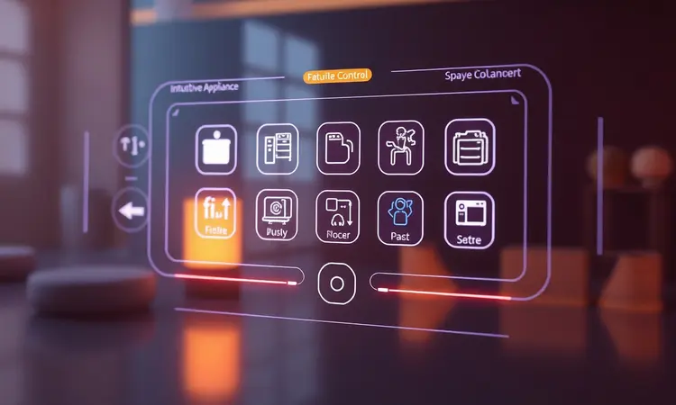

A busca por uma fritadeira sem óleo de grande capacidade geralmente leva os consumidores à Air Fryer Philco 9L Visor Glass Redstone 1800W PFR90.

Com design imponente e a promessa de alimentar famílias grandes com facilidade, surge a dúvida: será que realmente entrega o que promete ou é apenas mais uma promessa do marketing?

Além do famoso visor transparente, que convida você a acompanhar cada detalhe do preparo, sua potência de 1800W sugere velocidade. Vamos descobrir se o investimento vale a pena, analisando o que realmente importa: como ela se comporta no seu dia a dia na cozinha.

<SummaryList products={frontmatter.top_products} />

## Design e Construção da Air Fryer Philco 9L

<ProductBox 
  title={frontmatter.top_products[0].title} 
  image={frontmatter.top_products[0].image} 
  link={frontmatter.top_products[0].link} 
/>

O primeiro encontro com esta fritadeira é impressionante. Seu visual moderno e imponente transmite robustez, mas o que realmente chama atenção é como ela consegue embalar 9 litros de capacidade em um design relativamente compacto.

Imagine preparar batatas fritas para toda a família em uma única rodada, sem aquela coreografia de dividir as porções.

A revolução começa dentro do cesto: o revestimento cerâmico Redstone não só promete antiaderência como se transforma em uma alegria na hora da limpeza. Nada daquelas batalhas para remover alimentos grudados. E então vem o grande diferencial: o visor de vidro na cuba.

Você acompanha o dourado perfeito das batatas ou o crocante da coxa de frango sem interromper o processo, sem abrir a tampa e deixar todo o calor escapar.

A construção mescla plástico e aço inoxidável com equilíbrio, enquanto a tecnologia Air Flow 360º trabalha silenciosamente para garantir que cada milímetro dos seus alimentos receba calor uniforme.

A única ressalva fica no painel: os controles são mecânicos, sem a modernidade de uma tela digital. Mas será que essa simplicidade é realmente um problema na prática?

<CaixaProsContras>

**Prós:**

- Capacidade de 9 litros ideal para famílias.

- Revestimento cerâmico Redstone facilita a limpeza.

- Visor de vidro para monitorar o preparo sem abrir.

- Tecnologia Air Flow 360º para cozimento uniforme.

**Contras:**

- Controles mecânicos podem parecer ultrapassados para alguns usuários.

- Design não possui tela ou painel digital.

</CaixaProsContras>

## Comandos e Painel de Controle

Após a primeira impressão do design, como funciona essa interface de botões? A simplicidade pode ser sua maior virtude. Os controles mecânicos, claramente sinalizados, eliminam qualquer curva de aprendizado.

Você gira o botão para a temperatura desejada, ajusta o timer e pronto. Nada de navegar por menus complexos enquanto suas batatas queimam.

A ausência de uma tela digital touchscreen é compensada pela praticidade: menos coisas para dar errado, menos superfícies para acumular gordura. Para quem valoriza funcionalidade direta sobre ostentação tecnológica, esse painel oferece exatamente o necessário.

A função pré-programada para diferentes tipos de pratos (que aparece em alguns modelos) torna o processo ainda mais intuitivo, especialmente se você está começando sua jornada na culinária mais saudável.

## Desempenho no Preparo de Alimentos

E é aqui que a teoria encontra a prática. Os 1800W de potência não são apenas um número no manual: você sente a diferença no tempo de aquecimento. Em minutos, o aparelho está pronto para trabalhar, e a economia de tempo (e energia) começa a fazer sentido.

Agora, o verdadeiro teste: conseguiria realmente alimentar uma família inteira? A resposta está nos 9 litros generosos que transformam o jantar familiar em uma operação simples.

Frango assado, batatas fritas em quantidade, legumes grelhados - tudo cabe com espaço para respirar, garantindo que o ar quente circule como prometido.

O visor de vidro se torna seu aliado secreto. Enquanto prepara um frango crocante, você observa o dourado perfeito se formando, sem interromper o fluxo de calor. É o controle total sem abrir mão da conveniência. O resultado?

Alimentos consistentemente bem preparados, com aquela crocância que faz você esquecer que está usando uma fração do óleo tradicional.

## Conclusão

A Air Fryer Philco PFR90 não é apenas um eletrodoméstico, é uma proposta de mudança na sua cozinha. Para famílias maiores ou quem simplesmente odeia fazer várias rodadas de preparo, os 9 litros transformam refeições em eventos práticos.

O visor de vidro satisfaz nossa curiosidade natural e dá controle, enquanto o revestimento cerâmico elimina o pesadelo pós-preparo.

Sim, os controles são mecânicos em um mundo cada vez mais digital. Mas essa simplicidade pode ser exatamente o que sua cozinha precisa: funcionalidade direta, durabilidade e menos complicações.

Se você valoriza praticidade acima de buzzwords tecnológicas e precisa de capacidade real para alimentar sua família, este investimento faz sentido.

O espaço que ocupará no balcão será compensado pelo tempo que economizará no preparo de refeições mais saudáveis e saborosas.

No fim, a pergunta não é se ela tem todas as funcionalidades do mercado, mas se possui as que realmente importam para sua rotina. E para quem busca praticidade em grande escala, a resposta tende a ser positiva.