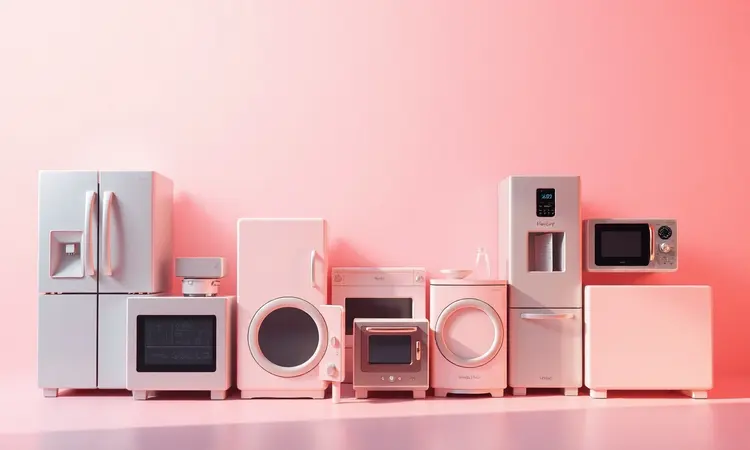

Procurando uma fritadeira elétrica robusta para a família toda? A Philco Jumbo Gourmet PFR13P de 7,2L chama a atenção pelo seu tamanho generoso, mas será que o desempenho acompanha essa capacidade?

Vamos mergulhar nos detalhes técnicos e descobrir se ela realmente se encaixa no seu dia a dia. Além disso, comparamos essa modelo com outras opções de grande volume da Philco, como a PFR06PI e a Redstone de 9L, garantindo que você tome a melhor decisão de compra.

Vale o investimento? Descubra agora em nossa análise sincera e completa.

<SummaryList products={frontmatter.top_products} />

## Fritadeira Elétrica Philco Jumbo Gourmet PFR13P: Ela é boa mesmo?

<ProductBox 
  title={frontmatter.top_products[0].title} 
  image={frontmatter.top_products[0].image} 
  link={frontmatter.top_products[0].link} 
/>

Imagine preparar batatas fritas, frango assado e até bolos em uma única fornada, sem precisar fazer tudo em rodadas exaustivas. É exatamente essa praticidade que a Philco Jumbo Gourmet PFR13P entrega com seus 7,2 litros de capacidade.

A tecnologia Air Fry 360° garante que o ar quente circule de maneira uniforme, criando aquela crocância perfeita em todos os alimentos, enquanto você usa pouco ou nenhum óleo.

O controle de temperatura vai de 80°C a 200°C, permitindo desde desidratar frutas até assar um frango inteiro. E o timer de 60 minutos com desligamento automático?

É aquela tranquilidade de poder se distrair com outras coisas enquanto o jantar fica pronto, sem risco de queimar nada.

Sim, ela ocupa espaço na bancada. Mas se você costuma cozinhar para grupos ou simplesmente odeia fazer pequenas porções múltiplas vezes, esse tamanho se transforma de inconveniente em sua maior aliada na cozinha.

<CaixaProsContras>

**Prós:**

- Grande capacidade de 7,2 litros.

- Cozinha de maneira mais saudável com pouco ou nenhum óleo.

- Tecnologia Air Fry 360° para melhor crocância.

- Fácil limpeza com revestimento antiaderente.

**Contras:**

- Pode ser volumosa para cozinhas pequenas.

- Potência alta pode demandar atenção ao uso.

</CaixaProsContras>

## Melhores opções de air fryers Philco de alta capacidade

Se o modelo Jumbo Gourmet não for exatamente o que você procura, a Philco oferece outras opções impressionantes para quem precisa de capacidade generosa. Cada uma tem sua personalidade única, atendendo a preferências diferentes na cozinha.

### 1. Air Fryer Philco Jumbo PFR06PI 7,2 L

<ProductBox 
  title={frontmatter.top_products[1].title} 
  image={frontmatter.top_products[1].image} 
  link={frontmatter.top_products[1].link} 
/>

Para quem busca a praticidade do grande volume com um visual que combina com qualquer cozinha moderna. A PFR06PI compartilha os mesmos 7,2 litros de capacidade da nossa análise principal, mas apresenta-se com detalhes em inox que dão um toque de sofisticação.

O controle de temperatura ajustável entre 80°C e 200°C acompanha um timer de 30 minutos, perfeito para quem prefere operações mais rápidas.

Atenção ao primeiro uso: realizar o processo de cura do cesto não é só uma recomendação, é um investimento na durabilidade do seu aparelho. Esse pequeno ritual inicial garante que o revestimento antiaderente permaneça eficiente por muito mais tempo.

<CaixaProsContras>

**Prós:**

- Grande capacidade de 7,2 litros.
Aqui permanece exatamente como veio:
Prepara alimentos sem óleo, promovendo uma alimentação saudável.

- Controle de temperatura ajustável e timer automático.

- Design bonito com detalhes em inox.

**Contras:**

- O processo de cura do cesto deve ser realizado antes do primeiro uso.

- Consumo de energia estimado em aproximadamente 0,57 kWh para preparos de 20 minutos.

</CaixaProsContras>

### 2. Air Fryer Philco Redstone PAF90 9 L

<ProductBox 
  title={frontmatter.top_products[2].title} 
  image={frontmatter.top_products[2].image} 
  link={frontmatter.top_products[2].link} 
/>

Quando você precisa do máximo de capacidade que uma air fryer pode oferecer, a Redstone de 9 litros entra em cena. Com 1800W de potência, ela não apenas cozinha quantidades impressionantes, mas faz isso com uma velocidade que surpreende.

O visor em vidro com iluminação interna é um diferencial que transforma a experiência: você vê os alimentos dourarem sem precisar interromper o processo, mantendo a temperatura ideal.

O revestimento cerâmico Redstone oferece uma limpeza facilitada, embora alguns usuários notem que, em cestos muito cheios, a gordura pode se acumular no fundo. A simplicidade do painel elimina a curva de aprendizado complicada.

<CaixaProsContras>

**Prós:**

- Grande capacidade de 9 litros, ideal para famílias.

- Potente (1800W) para cozimento rápido e uniforme.

- Visor em vidro com iluminação interna.

- Revestimento cerâmico facilita a limpeza.

**Contras:**

- Gordura pode grudar no fundo em cestos grandes.

- O antiaderente pode descascar com o tempo.

</CaixaProsContras>

### 3. Air Fryer Philco Visor Glass PFR55PI 7 L

<ProductBox 
  title={frontmatter.top_products[3].title} 
  image={frontmatter.top_products[3].image} 
  link={frontmatter.top_products[3].link} 
/>

Para quem valoriza o monitoramento visual acima de tudo. O visor em vidro da PFR55PI não é apenas um detalhe estético, é uma ferramenta prática que elimina as aberturas constantes da tampa.

Com 1800W de potência, ela aquece rapidamente, enquanto os 7 litros totais (5,3 litros no cesto útil) atendem bem a maioria das preparações familiares.

Uma dica prática: ao retirar o cesto, faça-o com cuidado. Alguns usuários relatam que ele pode se soltar da cuba se puxado bruscamente. Esse pequeno cuidado garante anos de uso tranquilo.

<CaixaProsContras>

**Prós:**

- Visor em vidro para monitoramento fácil do preparo.

- Alta potência que garante cozimento rápido.

- Controle de temperatura versátil.

- Sistema de circulação de ar quente para crocância.

**Contras:**

- Cesto de 5,3 litros pode ser pequeno para algumas receitas.

- Cuidado ao retirar o cesto, pois pode se soltar da cuba.

</CaixaProsContras>

## Mito ou verdade? 8 curiosidades sobre air fryer que você ainda não sabe

Antes de fechar sua compra, é importante separar fato de ficção quando se trata de air fryers. A primeira revelação: elas não "fritam" no sentido tradicional.

Utilizam circulação intensa de ar quente para criar uma crosta crocante, usando até 80% menos óleo que uma fritura convencional.

Esses aparelhos são verdadeiros multifuncionais. Além de fritar, podem assar pães, grelhar carnes e até desidratar frutas para snacks saudáveis.

O tempo de cozimento geralmente é 20% mais rápido que um forno tradicional, mas varia significativamente conforme a capacidade e potência do modelo escolhido.

## Onde comprar mais barato e modelos similares

Para encontrar a Philco Jumbo Gourmet PFR13P com preços competitivos, explore lojas como Magazine Luiza, Americanas e Mercado Livre durante períodos promocionais. Plataformas de comparação de preços ajudam a identificar as melhores oportunidades do momento.

Se estiver considerando alternativas, marcas como Mondial e Britânia oferecem modelos com capacidades similares, muitas vezes com pequenas variações de funcionalidade que podem se alinhar melhor às suas necessidades específicas.

Sempre confira as avaliações de usuários reais para entender como o aparelho se comporta no dia a dia.

## Conclusão

Escolher a air fryer ideal vai além da capacidade em litros ou da potência em watts. Trata-se de encontrar a parceira perfeita para sua rotina na cozinha.

A Philco Jumbo Gourmet PFR13P se destaca pelo equilíbrio entre volume generoso e tecnologia eficiente, ideal para famílias que desejam praticidade sem abrir mão da qualidade.

Se o espaço for uma preocupação, a PFR06PI oferece a mesma capacidade com um design mais compacto. Para quem precisa do máximo volume, a Redstone de 9 litros é imbatível.

E se monitorar visualmente o preparo for essencial, a Visor Glass com seu painel transparente conquista pelo diferencial.

Cada modelo da Philco apresenta características que transformam o ato de cozinhar em uma experiência mais simples, saudável e satisfatória.

A decisão final depende de como você imagina essa ferramenta se encaixando no seu dia a dia, transformando refeições em momentos mais práticos e saborosos para toda a família.