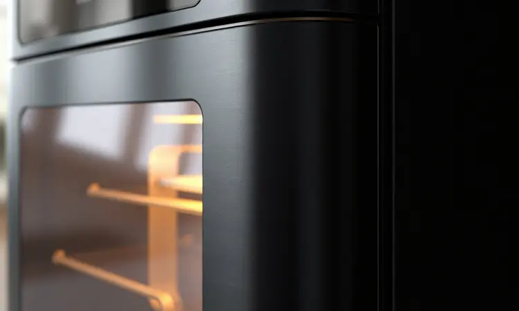

A busca pela fritadeira elétrica ideal passa frequentemente pela Philco, uma marca consolidada no mercado brasileiro.

O modelo Gourmet Black PFR15PG, com sua promessa de potência e cesto quadrado de 4,4 litros, desperta o interesse de quem busca praticidade e eficiência na cozinha. Mas será que ela é realmente boa?

Nesta análise detalhada, vamos explorar desde a qualidade da construção e facilidade de limpeza até o consumo de energia e o ruído durante o uso.

Se você está em dúvida se este modelo é a escolha certa para sua casa, acompanhe nosso review sincero e descubra se vale a pena gastar nela.

<SummaryList products={frontmatter.top_products} />

## Review da Philco Gourmet Black PFR15PG

<ProductBox 
  title={frontmatter.top_products[0].title} 
  image={frontmatter.top_products[0].image} 
  link={frontmatter.top_products[0].link} 
/>

Imagine ter aquelas batatas fritas crocantes e douradas prontas em minutos, sem a necessidade de mergulhá-las em óleo. É exatamente essa promessa que a Philco Gourmet Black PFR15PG traz para sua cozinha.

Com 1500W de potência e capacidade para 4,4 litros, ela transforma o preparo de refeições em uma tarefa rápida e satisfatória.

O controle de temperatura vai de 80°C até 200°C, permitindo desde assar um bolo até fritar peito de frango crocante.

Já o timer de 60 minutos com desligamento automático oferece aquela tranquilidade de poder deixar o aparelho trabalhando enquanto você cuida de outras coisas.

Mas vamos ser honestos, o design em preto brilhante, embora moderno, tende a acumular marcas de dedos e pequenos riscos com certa facilidade. Além disso, os controles analógicos podem demandar um pequeno ajuste na sua rotina se você está acostumado com telas digitais.

Ainda assim, quando o assunto é entregar praticidade com resultados consistentes, essa fritadeira se mostra como um investimento inteligente para quem quer equilibro entre saúde e sabor.

<CaixaProsContras>

**Prós:**

- Potência de 1500W para preparos rápidos.

- Capacidade ideal para famílias pequenas.

- Fritura com pouco ou nenhum óleo.

- Revestimento antiaderente facilita a limpeza.

**Contras:**

- Acabamento pode riscar facilmente.

- Controles analógicos não são muito intuitivos.

</CaixaProsContras>

## Design e construção

O primeiro contato com a Philco Gourmet Black PFR15PG revela um aparelho que não tenta esconder seu propósito. Sua estética em preto sólido integra-se facilmente à maioria das cozinhas, enquanto a construção robusta transmite segurança desde o primeiro uso.

É aquela peça que você olha e pensa: "essa aguenta o tranco da rotina familiar".

### Cesto e Espaço interno

O coração da experiência está no cesto de 4,4 litros, dimensionado para preparar porções que alimentam uma família pequena com folga. Pense em fritar nuggets para as crianças e batatas rústicas para os adultos, tudo em uma única rodada.

A engenharia interna promove uma circulação uniforme do ar quente, garantindo que cada pedaço de alimento receba o mesmo tratamento de calor, evitando aquelas partes mais queimadas e outras ainda cruas.

E quando a refeição termina, o cesto removível com revestimento antiaderente transforma a limpeza em uma tarefa de segundos. Basta passar um pano úmido e você está pronto para a próxima receita.

### Painel e Acabamento

Os controles analógicos trazem uma simplicidade reconfortante para quem prefere funcionalidade direta. Dois botões giratórios, um para tempo e outro para temperatura, eliminam a necessidade de decifrar menus complexos ou telas digitais sofisticadas.

É intuitivo no melhor sentido da palavra: você ajusta, gira e pronto.

Porém, esse mesmo design em preto brilhante que tanto atrai olhares também exige alguns cuidados. Como qualquer superfície escura e polida, ela revela marcas de dedos com facilidade, demandando uma limpeza regular para manter o visual impecável.

A robustez da estrutura compensa essa característica, garantindo estabilidade mesmo durante operações em altas temperaturas.

## Usabilidade e Desempenho

É na prática que a Philco Gourmet Black PFR15PG realmente conquista seu espaço.

A combinação entre potência e controle preciso resulta em alimentos consistentemente crocantes por fora e suculentos por dentro, tudo sem aquela sensação de gordura excessiva que deixa os pratos pesados.

### Preparo de alimentos

A magia acontece graças à tecnologia de circulação de ar quente, que envolve os alimentos em calor intenso e constante.

Imagine transformar batatas em fritas perfeitas usando apenas uma colher de óleo, ou assar frango até ficar dourado e crocante sem encharcá-lo em gordura.

A versatilidade vai além das frituras tradicionais, permitindo assar legumes caramelizados, preparar peixes com textura firme ou até testar receitas de bolos e sobremesas.

Para quem tem uma rotina agitada mas não abre mão de refeições caseiras, essa capacidade de reduzir drasticamente o tempo de preparo enquanto mantém a qualidade dos alimentos é um verdadeiro divisor de águas na cozinha.

### Consumo de energia

Uma preocupação comum ao investir em eletrodomésticos de maior potência é o impacto na conta de luz. A boa notícia é que a tecnologia de circulação de ar quente opera com uma eficiência energética impressionante.

Por cozinhar os alimentos mais rapidamente do que métodos convencionais, o aparelho permanece ligado por menos tempo, compensando sua potência nominal.

Pense assim: em vez de manter um forno tradicional aquecendo por 45 minutos, você consegue o mesmo resultado em 15 ou 20 minutos.

Essa economia de tempo se traduz diretamente em economia de energia, transformando a fritadeira em uma aliada tanto do seu paladar quanto do seu orçamento mensal.

### Ruído da air fryer

É verdade que todo aparelho com ventilador e resistência produz algum nível de ruído durante a operação. No caso da Philco Gourmet Black PFR15PG, o som gerado é comparável ao de um exaustor de cozinha em velocidade média, ou seja, perceptível mas não intrusivo.

A maioria dos usuários relata que o ruído é rapidamente absorvido pelo ambiente da cozinha, especialmente quando combinado com os sons naturais do preparo dos alimentos.

E aqui está um detalhe curioso: esse zumbido constante acaba se tornando um sinal reconfortante de que sua refeição está sendo preparada, como o barulho do café passando pela manhã.

## Limpeza e cuidados

A verdadeira prova de fogo para qualquer eletrodoméstico de cozinha é a facilidade de limpeza, e é aqui que a Philco Gourmet Black PFR15PG brilha.

As peças removíveis, incluindo cesto e bandeja coletora de gordura, são compatíveis com máquina de lavar louça, liberando você daquela tarefa manual que ninguém gosta.

Para manter o aparelho como novo, bastam cuidados simples: limpar o exterior com pano úmido após cada uso, evitar produtos abrasivos que possam danificar o revestimento antiaderente e garantir que todas as peças estejam completamente secas antes de guardar.

Esses pequenos hábitos prolongam significativamente a vida útil da fritadeira e garantem que cada preparo mantenha seu sabor original.

## Concorrentes diretos

No competitivo mercado das fritadeiras elétricas, a Philco encontra rivais respeitáveis como a Mondial e a Cadence.

A primeira se destaca por um design compacto e preços extremamente acessíveis, ideal para quem busca entrada no mundo das airfryers com investimento mínimo.

Já a Cadence aposta em tecnologias avançadas de circulação de ar, prometendo resultados ainda mais uniformes e crocantes.

A escolha entre elas depende do que você valoriza mais: a Mondial entrega simplicidade e custo-benefício imediato, a Cadence oferece sofisticação tecnológica, enquanto a Philco encontra seu equilíbrio no meio do caminho, combinando robustez, capacidade generosa e um desempenho que atende consistentemente às expectativas.

## Conclusão

Depois de analisar cada aspecto da Philco Gourmet Black PFR15PG, fica claro que ela não é apenas mais uma fritadeira elétrica no mercado.

É um equipamento que entende as necessidades reais da cozinha brasileira: versatilidade para preparar desde lanches rápidos até refeições completas, praticidade que transforma horas em minutos e um cuidado com a saúde que não sacrifica o sabor.

Sim, o acabamento em preto brilhante exige manutenção regular e os controles analógicos podem parecer básicos para quem busca alta tecnologia. Mas essas características são precisamente o que torna a PFR15PG tão autêntica em seu propósito.

Ela é a parceira de cozinha que funciona sem complicações, entrega resultados consistentes e se integra naturalmente à rotina familiar.

Se você busca uma airfryer que combine capacidade generosa, desempenho confiável e uma relação custo-benefício que justifique o investimento, a Philco Gourmet Black PFR15PG é uma escolha que dificilmente decepcionará.

Ela não promete milagres tecnológicos, mas cumpre com excelência aquilo que realmente importa: transformar seu momento na cozinha em uma experiência mais prática, saudável e satisfatória.