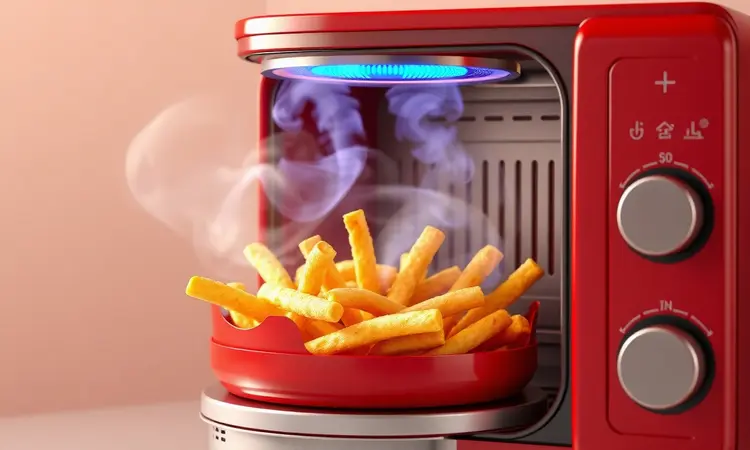
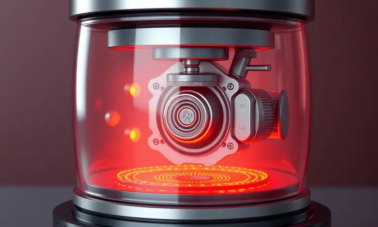

Procurando por uma nova air fryer para facilitar sua rotina na cozinha?

A Fritadeira Elétrica Air Fryer Gourmet II Red AF420, com sua capacidade de 4,2 litros e design moderno em preto e vermelho, tem chamado a atenção de muitos consumidores que buscam praticidade e alimentação saudável.

Mas será que ela realmente entrega o que promete em termos de performance, potência e durabilidade?

Neste artigo, vamos analisar detalhadamente a visão geral, as especificações técnicas e os principais destaques deste modelo da Laser Eletro para responder se essa fritadeira sem óleo é a escolha certa para o seu lar. Confira nossa análise sincera.

<SummaryList products={frontmatter.top_products} />

## Visão Geral da Air Fryer Gourmet II Red AF420

<ProductBox 
  title={frontmatter.top_products[0].title} 
  image={frontmatter.top_products[0].image} 
  link={frontmatter.top_products[0].link} 
/>

A Air Fryer Gourmet II Red AF420 se destaca por sua proposta de oferecer uma alimentação mais saudável, utilizando a circulação de ar quente para fritar, assar e grelhar com pouco ou nenhum óleo.

Com uma capacidade de 4,2 litros, é ideal para famílias, permitindo preparar porções generosas de forma prática. O modelo possui controle de temperatura ajustável até 200°C e um timer com desligamento automático de até 60 minutos.

Um dos grandes diferenciais é o seu revestimento antiaderente, que facilita a limpeza e manutenção. Seu design moderno e o painel intuitivo tornam o uso diário bastante acessível.

Contudo, vale lembrar que a potência pode variar entre 1300W e 1500W, e ela não é bivolt, o que requer atenção à voltagem correta antes da compra.

<CaixaProsContras>

**Prós:**

- Capacidade de 4,2 litros, perfeita para famílias.

- Tecnologia que reduz significativamente o uso de óleo.

- Revestimento antiaderente facilita a limpeza.

- Painel intuitivo simplifica o uso na rotina.

**Contras:**

- Não é bivolt, exigindo atenção à voltagem.

- A potência pode variar dependendo do modelo.

</CaixaProsContras>

## Destaques / Principais Características

Mas além dos números e especificações, o que realmente diferencia essa air fryer na sua experiência diária? Imagine poder preparar um suculento assado para quatro pessoas sem aquela sensação de que você está sacrificando saúde por sabor.

O sistema de circulação de ar quente não apenas reduz o óleo, mas transforma aqueles momentos de "fritar sem culpa" em rotina.

O painel digital intuitivo elimina aquela hesitação ao programar tempo e temperatura, algo especialmente útil quando você está multitarefando entre cuidar dos filhos e preparar o almoço.

E a facilidade de limpeza dos componentes removíveis não é apenas uma promessa técnica, é a garantia que você não ficará frustrado ao final de uma festa em família com todos aqueles restos grudados.

## Especificações Técnicas

Por trás dessa experiência prática, estão números que fazem sentido. A tecnologia de circulação de ar quente opera com temperaturas que variam até 200°C, permitindo ajustes precisos para diferentes tipos de alimento.

O timer com desligamento automático de até 60 minutos oferece segurança, especialmente quando você precisa sair da cozinha rapidamente.

O cesto removível antiaderente não apenas simplifica a limpeza, mas também representa uma construção que pensa na durabilidade do produto, evitando aquela deterioração comum após meses de uso intenso.

## Dimensões e Peso

Como essas características se manifestam no espaço físico? Com aproximadamente 37 cm de altura, 29 cm de largura e 32 cm de profundidade, a AF420 é compacta o suficiente para integrar-se em cozinhas menores sem sacrificar sua funcionalidade.

Pense nela não apenas como um aparelho, mas como um parceiro de espaço inteligente, que pode ser facilmente armazenado em armários ou mantido sobre bancadas quando necessário.

O peso de cerca de 4,5 kg transforma a movimentação em algo quase intuitivo. Você não precisará de força extra para limpar áreas difíceis ou reorganizar sua disposição de trabalho.

## Conteúdo da Embalagem

Quando sua AF420 chega, a experiência começa desde a caixa. A embalagem prioriza a proteção do produto, garantindo que ele chegue pronto para uso.

Dentro dela, você encontra não apenas a fritadeira em si com seu design elegante, mas também um manual do usuário detalhado que funciona como guia para aproveitar cada funcionalidade desde o primeiro dia.

Em alguns casos, receitas sugeridas podem acompanhar o produto, oferecendo inspiração para explorar novas possibilidades além do básico, ajudando você a maximizar o investimento.

## Informações Importantes

Para quem considera essa air fryer como parte da rotina familiar, vale destacar pontos que influenciam a experiência prática.

Embora seu design moderno em vermelho possa ser um destaque visual na cozinha, o tamanho do cesto, embora generoso, pode ser limitante para famílias maiores que precisam preparar quantidades muito grandes simultaneamente.

Isso significa que, em algumas ocasiões, você pode precisar dividir porções.

A performance promete preparar refeições crocantes e saborosas rapidamente, mas é importante considerar sua voltagem local antes da compra, dado que o modelo não é bivolt.

## Conclusão

A Air Fryer Gourmet II Red AF420 representa uma escolha equilibrada para quem busca introduzir hábitos mais saudáveis na rotina sem sacrificar praticidade ou experiência gastronômica.

Com sua capacidade de 4,2 litros, ela se adapta bem às necessidades familiares, oferecendo porções suficientes para momentos compartilhados.

A tecnologia de circulação de ar quente transforma a preocupação com óleo em uma possibilidade real de "fritar sem culpa", enquanto o revestimento antiaderente e componentes removíveis garantem que a limpeza não será uma frustração diária.

Se você valoriza um design que complementa sua cozinha, uma interface intuitiva que elimina hesitação e uma construção que pensa em durabilidade, este modelo pode ser a resposta para seus desafios de tempo e saúde.

A atenção à voltagem é um detalhe importante, mas para famílias que buscam um eletrodoméstico funcional, estético e que promove alimentação mais consciente, a AF420 oferece uma proposta convincente.