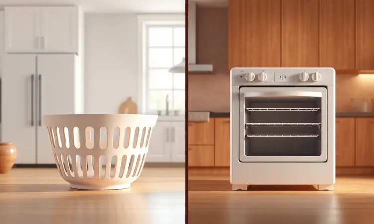

Você está procurando uma fritadeira sem óleo e se deparou com os preços da Philips Walita. A dúvida é inevitável: por que ela custa tanto?

Será que a marca que inventou a Air Fryer ainda mantém a liderança em qualidade e crocância, ou você está pagando apenas pelo nome e marketing?

Neste guia completo, vamos analisar a fundo a construção, a tecnologia exclusiva RapidAir e os modelos mais vendidos da atualidade, desde os digitais até os modelos Oven.

Se você quer saber se a Air Fryer Philips Walita é boa de verdade e qual modelo se encaixa no seu orçamento e espaço na cozinha, continue lendo nossa avaliação sincera e detalhada.

<SummaryList products={frontmatter.top_products} />

## Análise da Marca: Por que a Philips Walita Custa Mais Caro (e Vale a Pena)?

Imagine comprar um eletrodoméstico e, anos depois, ele ainda funcionar como no primeiro dia. É esse tipo de experiência que explica o investimento na Philips Walita.

Quando você paga um pouco mais, não está apenas adquirindo uma fritadeira sem óleo, está trazendo para sua cozinha décadas de pesquisa, materiais que resistem ao uso diário e uma engenharia pensada para durar.

A reputação não vem do marketing, mas daquele sussurro entre amigos e familiares: "a minha Philips já tem cinco anos e nunca deu problema".

### A Tecnologia RapidAir Explicada: O Segredo da Crocância

O verdadeiro diferencial está na sensação que você experimenta ao morder um alimento. A tecnologia RapidAir não é apenas uma especificação técnica, mas a resposta para quem quer o crocante da fritura sem a culpa da gordura. Como funciona?

Imagine um tornado de ar quente circulando em 360 graus ao redor dos alimentos, criando aquela casquinha dourada perfeita enquanto o interior fica macio e suculento.

Não se trata apenas de reduzir óleo, mas de recuperar o prazer de comer batatas fritas, coxinhas ou pães de queijo sem comprometer sua saúde.

A velocidade desse processo transforma sua rotina, permitindo que você prepare refeições completas enquanto arruma a casa ou ajuda as crianças com a lição.

### Reputação e Durabilidade: O que Dizem os Donos?

Converse com qualquer dono de uma Philips Walita e você ouvirá histórias parecidas. "Comprei em 2020 e uso quase todo dia", "sobreviveu a três mudanças", "minha filha universitária leva para o apartamento". Essa resistência ao tempo não é acidente.

A marca utiliza materiais que suportam ciclos diários de aquecimento e resfriamento, componentes elétricos com qualidade industrial e um design que prioriza a funcionalidade acima de modismos passageiros.

Quando as pessoas falam sobre facilidade de limpeza, estão falando sobre minutos a mais no seu dia. Quando mencionam o funcionamento silencioso, estão mencionando paz durante o preparo do jantar.

Essa é a matemática real do investimento: preço dividido por anos de uso confiável.

## Análise Completa dos Melhores Modelos da Marca

Agora que entendemos o que está por trás do nome Philips Walita, vamos explorar os modelos que transformam essa promessa em realidade. Cada um foi pensado para um tipo específico de cozinheiro, desde o chef de família até quem valoriza a simplicidade acima de tudo.

### 1. Air Fryer Forno Philips Walita Série 5000 AI551 (A Mais Versátil de Todas)

<ProductBox 
  title={frontmatter.top_products[0].title} 
  image={frontmatter.top_products[0].image} 
  link={frontmatter.top_products[0].link} 
/>

Imagine abrir sua cozinha para um mundo onde uma única máquina substitui forno, grelha, fritadeira e desidratador. A Série 5000 AI551 é exatamente isso: um centro culinário compacto que transforma dúvidas criativas em realidade.

Com 12 litros de capacidade, ela permite que você prepare desde um frango assado para o almoço de domingo até chips de vegetais para o lanche da semana.

O painel touch responde ao toque como seu smartphone, e a integração com o HomeID traz para sua cozinha um assistente pessoal de receitas. Sim, ela ocupa espaço, mas repense: quantos eletrodomésticos você eliminaria da bancada?

<CaixaProsContras>

**Prós:**

- Multifunções para diversas preparações culinárias.

- Capacidade generosa de 12 litros.

- Painel digital intuitivo e fácil de usar.

- Integração com o aplicativo HomeID para receitas.

**Contras:**

- Tamanho maior pode ocupar espaço na cozinha.

- Valor comparado a modelos menores pode ser elevado.

</CaixaProsContras>

### 2. Philips Walita Essential XL Digital RI9270 (A Escolha da Maioria)

<ProductBox 
  title={frontmatter.top_products[1].title} 
  image={frontmatter.top_products[1].image} 
  link={frontmatter.top_products[1].link} 
/>

Quando popularidade encontra performance, nasce um best-seller. A Essential XL Digital é aquele modelo que você vê na casa de amigos, recomendações de grupos familiares e avaliações com milhares de curtidas. Por quê?

Ela acerta no equilíbrio perfeito: capacidade suficiente para uma família de quatro pessoas (6,2 litros totais), potência que reduz o tempo de espera (2000W) e um painel touch que elimina adivinhações com sete programas predefinidos.

A tecnologia RapidAir faz seu trabalho magistralmente, criando aquela crocância que faz crianças comerem legumes sem reclamar. É a opção segura para quem quer entrada rápida no mundo das air fryers sem abrir mão da qualidade Philips.

<CaixaProsContras>

**Prós:**

- Tecnologia Rapid Air para reduzir o uso de gordura.

- Painel digital com várias predefinições para praticidade.

- Grande capacidade ideal para famílias.

- Fácil de limpar, com cesto removível e próprio para lava-louças.

**Contras:**

- Capacidade pode ser limitada para famílias muito grandes.

- Custo considerado elevado por alguns consumidores.

</CaixaProsContras>

### 3. Philips Walita Série 3000 Digital RI9252 (A Opção Digital Compacta)

<ProductBox 
  title={frontmatter.top_products[2].title} 
  image={frontmatter.top_products[2].image} 
  link={frontmatter.top_products[2].link} 
/>

Para casais ou pequenas famílias que desejam a precisão digital sem ocupar metade da bancada. Com 4,1 litros, a Série 3000 Digital é aquela companheira perfeita para jantares a dois ou preparo de porções individuais.

Os sete programas predefinidos são como atalhos para sua rotina: batatas fritas, frango, peixe, legumes, cada um com temperatura e tempo otimizados. A limpeza se transforma em questão de segundos, com peças que vão direto para a lava-louças.

Sim, alguns usuários relatam que o cesto pode desconectar durante o manuseio, mas esse é o preço da portabilidade. Para apartamentos compactos ou quem cozinha em menor escala, ela entrega experiência premium em tamanho reduzido.

<CaixaProsContras>

**Prós:**

- Tecnologia Rapid Air para cozimento uniforme.

- Painel digital com programas predefinidos.

- Fácil de limpar, com peças laváveis na lava-louças.

- Compacta, ideal para pequenas famílias.

**Contras:**

- O cesto pode desconectar durante o uso.

- Capacidade limitada para grandes porções.

</CaixaProsContras>

### 4. Philips Walita Série 3000 Analógica RI9201 (O Melhor Custo-Benefício)

<ProductBox 
  title={frontmatter.top_products[3].title} 
  image={frontmatter.top_products[3].image} 
  link={frontmatter.top_products[3].link} 
/>

Algumas vezes, simplicidade é sofisticação. A versão analógica da Série 3000 é para quem acredita que cozinhar não precisa de telas touch ou conectividade Bluetooth. Dois botões giratórios: um para temperatura (80°C a 200°C) e outro para tempo (até 60 minutos).

É tudo que você precisa para transformar ingredientes em refeições. A mesma tecnologia RapidAir, a mesma capacidade de 4,1 litros, o mesmo material de qualidade. O que muda? O preço e a ausência de distrações digitais.

Se você é do tipo que prefere sentir o botão girar sob seus dedos em vez de tocar numa tela, essa é sua escolha natural.

<CaixaProsContras>

**Prós:**

- Tecnologia Rapid Air que garante crocância.

- Capacidade generosa de 4,1 litros.

- Facilidade na limpeza com cesta removível.

- Controle de temperatura ajustável.

**Contras:**

- Display analógico pode parecer ultrapassado.

- Sem conectividade Bluetooth ou Wi-Fi.

</CaixaProsContras>

### 5. Philips Walita Série 1000 XL NA130 (A Gigante de 6 Litros)

<ProductBox 
  title={frontmatter.top_products[4].title} 
  image={frontmatter.top_products[4].image} 
  link={frontmatter.top_products[4].link} 
/>

Para famílias que pensam grande desde o café da manhã. Com 6,2 litros de capacidade, a Série 1000 XL é aquela máquina que permite preparar almoço e jantar simultaneamente ou atender visitas inesperadas sem crise.

Os controles analógicos mantêm a operação direta: gire para a temperatura, ajuste o timer, e deixe a RapidAir trabalhar. O acesso ao HomeID com mais de 500 receitas é um bônus que transforma iniciantes em cozinheiros confiantes.

A ausência de cesto e coletor separados é uma concessão ao design simplificado, mas para quem valoriza volume acima de modulações complexas, ela entrega exatamente o prometido: comida crocante para todos.

<CaixaProsContras>

**Prós:**

- Capacidade grande de 6,2 litros, ideal para famílias.

- Tecnologia RapidAir para cozimento uniforme.

- Fácil limpeza com peças removíveis.

- Boa performance em preparar alimentos crocantes sem óleo.

**Contras:**

- Falta de cesto e coletor separados pode limitar o desempenho em grande quantidade.

- A operação é analógica, o que pode não agradar quem prefere digitalização.

</CaixaProsContras>

## Design e Construção da Airfryer Philips Walita: O que muda nos modelos XL?

Segure um modelo XL nas mãos e você sentirá a diferença imediatamente. Não se trata apenas de dimensões maiores, mas de uma engenharia que equilibra peso e estabilidade.

Os materiais possuem um acabamento que resiste a respingos de gordura e limpezas frequentes sem perder o brilho.

O design segue uma linguagem minimalista que dialoga com cozinhas modernas, mas a verdadeira magia está nos detalhes: alças ergonômicas que não esquentam durante o uso, cantos arredondados que facilitam a limpeza, e uma base antiderrapante que mantém a máquina firme mesmo durante operações intensas.

Os modelos XL também recebem acessórios pensados para quem cozinha em escala: grelhas duplas, espetos giratórios e formas especiais que multiplicam as possibilidades culinárias.

## Performance com Alimentos: Batatas, Carnes e Pães de Queijo

A prova definitiva não está nas especificações técnicas, mas na ponta do garfo. Experimente batatas fritas que mantêm o crocante por mais tempo que as de restaurante, ou carnes que preservam seus sucos naturais enquanto desenvolvem uma crosta dourada perfeita.

Os pães de queijo alcançam aquele ponto mágico onde a casca estala delicadamente revelando o interior cremoso. O segredo está na circulação de ar tridimensional da RapidAir, que trata cada alimento com igual atenção, eliminando pontos frios ou queimados.

Não importa se você está preparando nuggets para as crianças ou um salmão para um jantar especial, o resultado sempre terá aquele toque profissional que impressiona.

### A Air Fryer Philips Walita é barulhenta ou consome muita energia?

Imagine preparar o jantar enquanto mantém uma conversa tranquila ou assiste sua série favorita. A engenharia acústica das Philips Walita transforma o funcionamento em um sussurro discreto, longe do barulho industrial de algumas alternativas mais baratas.

Quanto à energia, pense que você está substituindo um forno que precisa pré-aquecer por 15 minutos por uma máquina que atinge a temperatura ideal em questão de minutos.

A eficiência térmica faz com que cada watt seja convertido em calor direto para os alimentos, não para aquecer o ar ao redor. O resultado? Economia mensal que você percebe na conta de luz e consciência tranquila sobre seu impacto ambiental.

## Limpeza e Praticidade: Cesto e Grade da Walita

O verdadeiro teste de qualquer eletrodoméstico acontece depois da refeição, quando a preguiça da limpeza bate à porta. A Philips Walita antecipou esse momento com materiais antiaderentes que fazem os resíduos soltarem-se quase por vontade própria.

A maioria dos modelos permite que você simplesmente remova o cesto e a grade e os coloque na lava-louças, transformando uma tarefa tediosa em um gesto de segundos.

O design sem cantos afiados ou reentrâncias impossíveis elimina aquela frustração de encontrar migalhas presas em lugares inalcançáveis.

Quando a limpeza se torna tão simples quanto o cozimento, você naturalmente usa mais seu aparelho, criando um ciclo virtuoso de alimentação saudável.

## Guia de Compra: Como Escolher a Philips Walita Certa para Você?

Antes de clicar em "comprar", faça três perguntas simples: Quantas bocas você alimenta regularmente? Quanto espaço livre sua bancada oferece? E o mais importante, como você se relaciona com a tecnologia na cozinha?

As respostas definirão seu caminho ideal entre os modelos apresentados.

### Forno Oven ou Cesto Tradicional: Qual o Ideal para sua Rotina?

Visualize sua rotina culinária típica. Se você frequentemente prepara assados inteiros, pizzas ou precisa de múltiplas bandejas ao mesmo tempo, o formato Oven será seu aliado. Ele pensa como um forno convencional, mas com a eficiência da air fryer.

Agora, se sua vida gira em torno de preparos rápidos, porções individuais ou alimentos que precisam ser sacudidos durante o cozimento (como batatas fritas), o cesto tradicional oferece a agilidade que seu dia demanda.

A escolha não é sobre qual é melhor, mas sobre qual se adapta ao ritmo da sua vida.

### Capacidade: De 4,1L a 12L, Qual o Tamanho para sua Família?

Faça o exercício mental: imagine preparar sua refeição mais comum. Se for um jantar para dois com sobras para o almoço do dia seguinte, os 4,1 litros são suficientes. Para uma família de quatro pessoas com fome saudável de adolescente, busque os 6 litros.

Agora, se sua casa vive recebendo visitas, você adora preparar comida para a semana ou tem uma paixão por assados grandes, os 12 litros justificam seu espaço na bancada. Lembre-se, é melhor ter capacidade extra do que fazer várias levas seguidas.

### Painel Digital vs. Analógico: Vale a Diferença de Preço?

Essa decisão revela muito sobre como você cozinha. O painel digital é para quem valoriza precisão, programas pré-configurados e a facilidade de replicar receitas perfeitas sempre. Ele lembra configurações, oferece timer com display claro e conectividade com aplicativos.

O analógico apela ao instinto, à sensação de controle manual e à simplicidade sem distrações. A diferença de preço se paga não apenas nas funcionalidades extras, mas na experiência de uso diário. Qual versão do cozinheiro que há em você?

### Conectividade e App NutriU: Você Realmente Vai Usar?

Pense no seu smartphone como uma extensão da sua cozinha. O NutriU não é apenas um aplicativo com receitas, mas um companheiro que aprende seus gostos, sugere combinações baseadas no que você tem na geladeira e transforma iniciantes em criativos culinários.

Se você já utiliza apps para organizar compras, seguir receitas ou controlar dieta, essa integração fará sentido natural. Mas se sua relação com a tecnologia na cozinha termina ao ligar o fogão, essa funcionalidade pode ser um luxo desnecessário.

A pergunta-chave é: você busca inspiração ou apenas execução?

## Perguntas Frequentes (FAQ) sobre Philips Walita

"Ela realmente faz comida mais saudável?" Sim, mas de forma inteligente. A redução de até 90% de óleo é apenas parte da história.

O verdadeiro benefício está em como os alimentos preservam seus nutrientes quando cozidos rapidamente em alta temperatura, sem ficar submersos em gordura.

"A limpeza é complicada?" Ao contrário, é projetada para ser a mais simples possível, com peças que muitas vezes vão direto para a lava-louças. "Funciona para congelados?" Perfeitamente, restaurando a textura crocante que se perde no micro-ondas.

"Precisa pré-aquecer?" A maioria dos modelos não necessita, economizando tempo e energia desde o primeiro uso.

## Conclusão

Depois de explorar tecnologia, modelos, performance e detalhes práticos, chegamos à essência da questão: a Philips Walita vale seu investimento? A resposta depende do que você valoriza.

Se busca um eletrodoméstico que simplesmente aqueça alimentos, existem opções mais baratas.

Mas se procura uma transformação na sua relação com a cozinha, algo que combine saúde, praticidade e resultados consistentes ano após ano, então sim, cada real gasto se justifica.

Pense na Air Fryer Philips Walita não como mais um aparelho na bancada, mas como um assistente culinário que entrega crocância sem culpa, economia de tempo que se converte em momentos com a família, e durabilidade que transforma compra em investimento.

A tecnologia RapidAir não é apenas marketing, é a física trabalhando para trazer de volta o prazer de comer bem.

Seja você um cozinheiro iniciante buscando simplificar sua rotina ou um entusiasta que valoriza precisão e versatilidade, existe um modelo Philips Walita desenhado para suas mãos.

A escolha final não é sobre qual é o melhor no papel, mas sobre qual se conecta com seu estilo de vida e transforma suas refeições diárias em pequenas celebrações de sabor e saúde. Sua próxima refeição crocante está esperando.