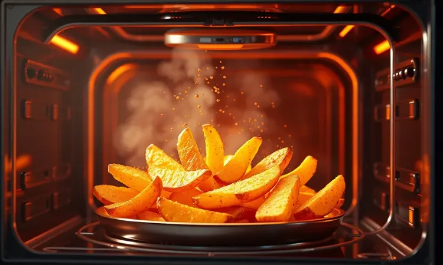

Quando você procura uma fritadeira elétrica, não está apenas atrás de um eletrodoméstico. Você busca liberdade na cozinha, tempo economizado e aquela satisfação de servir refeições saudáveis para quem você ama.

A WAP Airfryer Oven Digital aparece no radar prometendo tudo isso, mas será que ela realmente entrega o pacote completo para famílias maiores que precisam de versatilidade real?

Vamos além das especificações técnicas para descobrir como essa máquina de 12 litros se comporta na prática do dia a dia, desde a primeira impressão até o último pedaço de frango crocante.

<SummaryList products={frontmatter.top_products} />

## Construção e Design da WAP Oven Digital

<ProductBox 
  title={frontmatter.top_products[0].title} 
  image={frontmatter.top_products[0].image} 
  link={frontmatter.top_products[0].link} 
/>

A primeira coisa que chama atenção é como essa airfryer mescla o formato tradicional de forno com a acessibilidade moderna. A porta frontal faz toda a diferença: imagine não precisar mais puxar a gaveta e interromper o ciclo de cocção, perdendo calor e consistência.

Você simplesmente espia pelo visor transparente, com a luz interna esclarecendo cada detalhe, como se tivesse um controle de chef profissional sobre sua refeição.

A sensação ao tocar, porém, revela um equilíbrio entre custo e funcionalidade.

O exterior em plástico com acabamentos que imitam inox dá um visual elegante para sua bancada, mas se você espera o peso e a solidez de um forno de embutir, perceberá que a construção prioriza a leveza.

Os dois andares internos oferecem flexibilidade, permitindo assar batatas em uma bandeja enquanto grelha frango em outra, mas é preciso considerar que o espaço útil realmente fica um pouco abaixo dos 12 litros prometidos quando você utiliza todos os acessórios simultaneamente.

<CaixaProsContras>

**Prós:**

- Design moderno e funcional.

- Porta removível para fácil limpeza.

- Capacidade generosa de 12 litros.

- Painel digital intuitivo com várias funções.

**Contras:**

- A porta pode apresentar pequenas fugas de vapor.

- O espaço interno útil pode ser um pouco limitado em comparação com concorrentes.

</CaixaProsContras>

Então você tem uma máquina com visual bonito e portas fáceis de limpar, mas uma questão permanece: toda essa estrutura realmente traduz comida melhor na mesa? É aqui que a experiência vai além do que os olhos veem.

## Preparo de Alimentos e Desempenho Real

A verdadeira magia acontece quando você pressiona o primeiro botão. O sistema de circulação de ar quente não é apenas uma frase de marketing: ele transforma óleo em opcional, não em obrigação.

Pense na última vez que você preparou batatas fritas e ficou com aquela sensação pesada no estômago. Agora imagine o mesmo sabor crocante, a mesma douradura perfeita, mas sem o arrependimento pós-refeição.

A interface digital elimina o chute na cozinha. Em vez de ficar ajustando botões analógicos e rezando para dar certo, você seleciona temperatura e tempo com precisão cirúrgica. Quer assar um frango inteiro enquanto grelha legumes no andar de cima?

O painel intuitivo torna essa multitarefa acessível até para quem normalmente teme receitas mais elaboradas.

E quanto à promessa de versatilidade? Ela se materializa quando você percebe que não precisa mais de três eletrodomésticos diferentes ocupando espaço.

A compactação inteligente do design significa que você ganha uma fritadeira, um forno elétrico e uma grelha em um único equipamento que não domina sua bancada.

Para apartamentos menores ou cozinhas sem amplo espaço de armazenamento, essa economia de área física enquanto se expandem as possibilidades culinárias é o verdadeiro trunfo escondido.

## Conclusão

Depois de analisar construção, desempenho e impacto no dia a dia, fica claro que a WAP Airfryer Oven Digital não é apenas mais um eletrodoméstico. Ela representa uma mudança de mentalidade na cozinha.

Você deixa de ser refém dos processos tradicionais e ganha controle: sobre a saúde da sua família, sobre o tempo que passa preparando refeições e sobre a variedade do que pode servir sem complicação excessiva.

As pequenas concessões, como o espaço interno que exige um pouco mais de planejamento ou a construção que prioriza funcionalidade sobre luxo, são compensadas pela transformação que essa máquina traz para sua rotina.

Se você está cansado da dicotomia entre comida saborosa e comida saudável, se quer simplificar seus processos na cozinha sem abrir mão da qualidade, e se valoriza a praticidade de limpar componentes removíveis em vez de lutar com cantos inacessíveis, então sim, esse investimento vale cada centavo.

A pergunta final não é se a WAP Airfryer Oven Digital funciona bem tecnicamente, mas se você está pronto para abraçar uma nova forma de cozinhar.

Uma forma onde crocância não significa gordura, onde versatilidade não exige múltiplos aparelhos, e onde cada refeição se torna uma oportunidade de cuidar de quem você ama, sem complicações desnecessárias.

Sua próxima etapa é simples: imagine como seria sua semana com essa airfryer na sua cozinha, e dê o primeiro passo para tornar essa visão realidade.