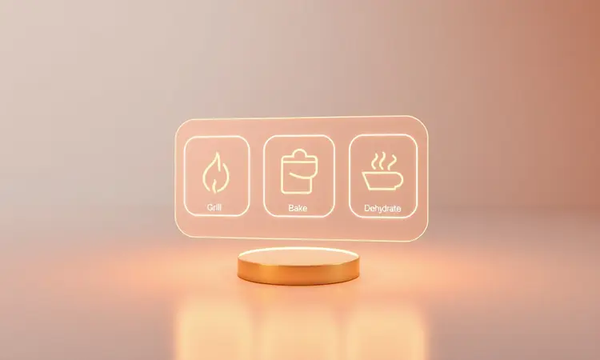
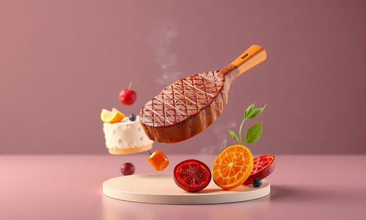

Se você já experimentou a sensação de fazer um churrasco perfeito dentro de casa, ou se simplesmente cansa da rotina de panelas e gordura, a experiência que essa fritadeira oferece vai mudar sua relação com a cozinha.

Mais do que um eletrodoméstico, ela é uma espécie de assistente culinário que promete resgatar aquele sabor defumado que só as grelhas profissionais conseguiam.

E para que você aproveite cada uma das 12 funcionalidades sem medo de errar, preparamos um guia que vai do primeiro passo à técnica avançada, tudo com o cuidado de quem conhece os segredos por trás de um bom preparo.

<SummaryList products={frontmatter.top_products} />

## O Que Torna a Air Fryer WAP Barbecue Diferente das Outras?

Imagine conseguir o sabor defumado de um churrasco de domingo sem precisar acender carvão. É exatamente essa magia que o sistema de aquecimento reproduz, criando uma crosta irresistível por fora enquanto mantém o interior suculento e macio.

A diferença começa na forma como o ar circula, atingindo cada canto do alimento para que o cozimento seja uniforme em minutos. E o design não é por acaso, ele foi pensado para que você tenha acesso rápido e prático, sem precisar virar cada pedaço manualmente.

Com funções pré-programadas, até quem nunca cozinhou na vida sente a confiança de preparar um jantar completo.

## Conheça as 12 Funções Digitais e Como Operar o Painel

O painel parece complicado à primeira vista, mas é como aprender a usar um smartphone novo, em poucos minutos você domina tudo. Cada uma das 12 funções foi idealizada para resolver uma necessidade específica. Quer fritar batatas sem óleo? Escolha a opção dedicada.

Precisa desidratar frutas para um lanche saudável? É só apertar um botão. Assar, grelhar, cozinhar no vapor, tudo com ajustes precisos de temperatura e tempo que garantem o ponto ideal.

A interface foi desenhada para conversar com você, então basta seguir sua intuição culinária.

## Acessórios Inclusos: Para que Serve Cada Item?

<ProductBox 
  title={frontmatter.top_products[0].title} 
  image={frontmatter.top_products[0].image} 
  link={frontmatter.top_products[0].link} 
/>

Quando você retira o aparelho da caixa, a quantidade de componentes pode parecer excessiva. Mas cada um tem uma função que, no conjunto, cria uma experiência completa.

O refratário de alumínio fundido é a peça-chave para assados que precisam de distribuição uniforme de calor, enquanto a tampa de vidro transparente deixa você acompanhar o cozimento a vapor sem interromper o processo.

O cesto para fritura é onde a mágica acontece, transformando alimentos em versões crocantes que desafiam qualquer receita tradicional. A grade para desidratar? Ela é perfeita para quem busca opções saudáveis, como legumes no vapor ou snacks naturais.

A chapa específica para a função Barbecue simula o contato direto com a grelha, criando aquelas marcas característics que tanto amamos. E sim, a escova de limpeza pode não ter glamour, mas é o aliado secreto para manter tudo como novo após cada uso.

## Primeiro Passo Obrigatório: Como Fazer a Cura da Air Fryer WAP Barbecue

Antes da primeira receita, existe um ritual de iniciação que poucos mencionam. A cura não é apenas uma recomendação, é o segredo por trás da durabilidade e do desempenho.

Comece lavando cesta e bandeja com um detergente neutro e água morna, usando apenas uma esponja macia para não arranhar a superfície.

Depois de secar completamente, aplique uma camada fina de óleo vegetal, como se estivesse preparando uma panela de ferro pela primeira vez.

O último passo é o pré-aquecimento a 200°C por aproximadamente 10 minutos com a cesta dentro. Esse processo remove qualquer resíduo da fabricação e cria uma película protetora que vai melhorar a aderência dos alimentos.

Quando terminar, sua air fryer estará preparada para entregar resultados consistentes desde o primeiro uso.

## Guia de Preparo: O que Fazer na Sua WAP Barbecue (Carnes, Bolos e Desidratação)

A verdadeira revolução começa quando você descobre que não precisa de múltiplos eletrodomésticos. Carnes ganham uma suculência que impressiona até amantes de churrasco tradicional.

Bolos crescem fofos, com aquela casquinha dourada que só o forno convencional costuma oferecer. E a função de desidratação abre um mundo de possibilidades para lanches saudáveis, desde bananas chips até tomates secos caseiros.

### Dicas de Especialista para um Grelhado com Gosto de Churrasco

O segredo do sabor defumado está na preparação antes do cozimento. Reserve pelo menos 30 minutos para marinar suas carnes, permitindo que os temperos penetrem profundamente e criem camadas de sabor.

Nunca pule o pré-aquecimento: ele é responsável por selar os sucos e formar aquela crosta irresistível que imita o contato com a grelha.

Use a função específica de grelhar e arrisque combinações de temperos. Chimichurri, molho barbecue ou até uma mistura caseira com alho e ervas fazem toda a diferença. Quando o tempo acabar, resista à tentação de servir imediatamente.

Deixe as carnes repousarem por alguns minutos para que os sucos se redistribuam, garantindo que cada mordida seja uma experiência à parte.

## Higienização Correta: Como Limpar sem Danificar a Tecnologia Antiaderente

Limpar deveria ser a parte mais fácil, mas é onde muitos erram. Comece sempre desconectando o aparelho e aguardando ele esfriar completamente. O choque térmico pode danificar não apenas o revestimento antiaderente, mas também componentes internos importantes.

Use apenas água morna com detergente neutro e uma esponja macia, evitando qualquer produto abrasivo que possa riscar a superfície. Se encontrar resíduos mais teimosos, deixe a cesta de molho em água quente por alguns minutos antes de tentar removê-los.

Depois da limpeza, seque bem todas as partes antes de guardar, evitando a formação de mofo ou odores desagradáveis.

## Erros Comuns que Você Deve Evitar ao Usar sua Fritadeira WAP

O pré-aquecimento não é opcional. Pular essa etapa resulta em alimentos que nunca atingem o crocante ideal, porque a temperatura não está distribuída uniformemente. Outro equívoco frequente é sobrecarregar a cesta.

Quando os alimentos estão muito apertados, o ar quente não circula adequadamente, criando áreas mal cozidas e outras queimadas.

Lembre-se de agitar ou virar os alimentos na metade do tempo de preparo. Essa simples ação garante que todos os lados recebam calor igualmente, entregando a textura perfeita em cada receita. São ajustes pequenos que fazem uma diferença enorme no resultado final.

## Vale a Pena Comprar a Air Fryer WAP Barbecue? Análise de Custo-Benefício

<ProductBox 
  title={frontmatter.top_products[1].title} 
  image={frontmatter.top_products[1].image} 
  link={frontmatter.top_products[1].link} 
/>

O investimento inicial pode parecer mais elevado comparado a modelos básicos, mas quando você analisa o que está adquirindo, a matemática muda completamente.

Doze funcionalidades em um só aparelho significam menos eletrodomésticos ocupando espaço na sua cozinha, menos gastos com energia e uma versatilidade que acompanha suas mudanças de hábito alimentar.

Com capacidade de atingir 230°C, o cozimento é rápido e eficiente, poupando tempo precioso do seu dia. Sim, ela exige um espaço considerável na bancada, mas quanto vale ter uma solução completa que substitui fritadeira, forno elétrico, grelha e até desidratador?

Para quem busca praticidade sem abrir mão do sabor, a resposta é clara.

## Perguntas Frequentes sobre a WAP Barbecue (FAQ)

Sim, ela realmente deixa os alimentos crocantes. A tecnologia de circulação de ar quente atua de forma tão eficiente que consegue replicar a textura da fritura tradicional, sem toda a gordura excessiva.

Quanto à limpeza, todas as peças são removíveis e vão direto para a pia, facilitando o processo pós-preparo.

Se você sente curiosidade sobre como potencializar seus pratos, explore as diversas receitas disponíveis online. A comunidade de usuários está sempre compartilhando novas combinações e técnicas que transformam ingredientes simples em refeições memoráveis.

## Conclusão

Ter uma Air Fryer WAP Barbecue na cozinha é como ganhar um atalho para refeições mais saborosas, saudáveis e práticas.

Ela desafia a ideia de que eletrodomésticos são ferramentas limitadas, demonstrando que versatilidade e qualidade podem coexistir em um único equipamento.

Desde o ritual inicial de cura até as técnicas avançadas de grelhado, cada etapa foi pensada para aproximar você do prazer de cozinhar.

Os erros comuns tornam-se aprendizados, as dúvidas transformam-se em confiança, e o que antes era uma refeição rotineira vira uma experiência culinária.

Se você busca otimizar tempo sem abrir mão do sabor autêntico, essa não é apenas uma compra, é um investimento na qualidade do seu dia a dia.

Comece pelo básico, experimente receitas novas e descubra como um único aparelho pode redesenhar completamente sua relação com a cozinha. O primeiro passo é o mais importante, e ele começa agora.