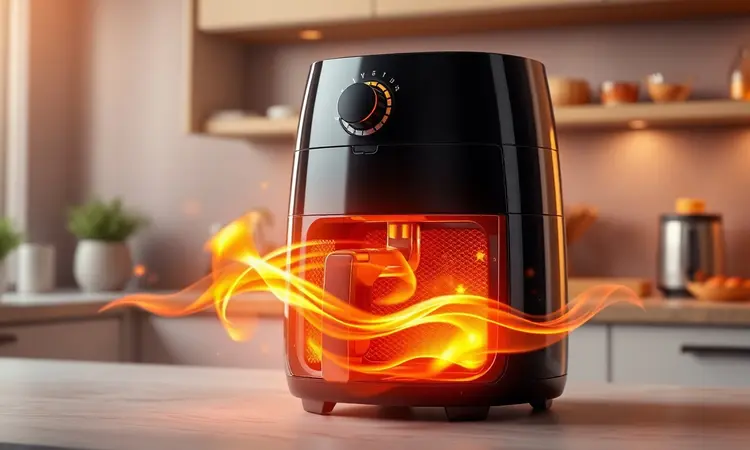

A WAP é uma marca que construiu sua história nos quintais brasileiros com lavadoras de alta pressão. Mas quando ela resolveu entrar na sua cozinha com as Air Fryers, uma pergunta natural surgiu: será que a tradição de qualidade se mantém no mundo dos eletroportáteis?

Com opções que vão do compacto ao robusto, a promessa é a mesma durabilidade que conquistou gerações. Neste artigo, vamos desvendar se essa confiança se traduz em resultados práticos na hora de preparar seu próximo jantar.

<SummaryList products={frontmatter.top_products} />

## Air Fryer WAP: Tudo o que você precisa saber antes de comprar

Imagine substituir a fritadeira tradicional por um aparelho que transforma óleo em ar quente. É exatamente isso que a Air Fryer WAP oferece: a possibilidade de saborear batatas crocantes ou frango dourado sem aquele peso na consciência (ou no estômago).

Mais do que um eletroportáteis, ela é seu aliado na busca por uma rotina mais prática e saudável, com múltiplas funções que vão além da fritura convencional.

O design moderno não é apenas estético, ele pensa na sua praticidade diária, ocupando o espaço certo na bancada e sendo intuitivo para qualquer membro da família.

## A marca WAP é boa? Reputação e Reclame Aqui

Quando você investe em um eletrodoméstico, não está comprando apenas um produto, mas também o compromisso por trás dele. A WAP carrega nas costas décadas de presença no mercado brasileiro, principalmente conhecida por produtos que resistem ao tempo.

No Reclame Aqui, os números falam por si: a marca mantém um índice de resolutividade que mostra o empenho em resolver questões, não apenas vender. Usuários frequentemente destacam a surpresa positiva com a durabilidade e a eficiência do atendimento pós-venda.

Claro, como qualquer empresa, existem críticas pontuais, mas o consenso geral aponta para uma experiência satisfatória que começa na loja e continua na cozinha por anos.

## Melhores modelos de Air Fryer da WAP no mercado

Mas como essa reputação sólida se materializa em produtos específicos? A linha da WAP é pensada para diferentes realidades culinárias, desde o solteiro que busca praticidade até famílias que transformam o jantar em um evento.

Cada modelo tem sua personalidade e propósito, unidos pela mesma filosofia: tornar o saudável simples e o saboroso possível.

### 1. Air Fryer WAP Family 4L (WAFF2)

<ProductBox 
  title={frontmatter.top_products[0].title} 
  image={frontmatter.top_products[0].image} 
  link={frontmatter.top_products[0].link} 
/>

Para aqueles que buscam o equilíbrio perfeito entre tamanho e funcionalidade, a Family 4L é como aquele amigo confiável que nunca te deixa na mão.

Com capacidade suficiente para alimentar até quatro pessoas, ela realiza a mágica da circulação de ar 360°, transformando ingredientes simples em refeições douradas e crocantes sem uma gota de óleo.

Os 1500W de potência são o segredo para você chegar em casa cansado e ter o jantar pronto em minutos, enquanto o design quadrado aproveita cada centímetro cúbico do cesto.

O controle preciso de temperatura (até 200°C) e o timer são seus aliados para explorar receitas que vão muito além da fritura tradicional.

<CaixaProsContras>

**Prós:**

- Tecnologia de circulação de ar 360° que garante cozimento uniforme.

- Capacidade ideal para famílias pequenas.

- Design que facilita a limpeza com cesto antiaderente.

- Versatilidade de preparos, incluindo fritura, assados e desidratação.

**Contras:**

- Capacidade pode ser limitada para famílias maiores.

- Não inclui muitos acessórios adicionais.

</CaixaProsContras>

### 2. Air Fryer WAP Grand Family 5,2L

<ProductBox 
  title={frontmatter.top_products[1].title} 
  image={frontmatter.top_products[1].image} 
  link={frontmatter.top_products[1].link} 
/>

Quando a família cresce ou os amigos começam a aparecer com mais frequência, os 5,2 litros da Grand Family se tornam um trunfo na cozinha. Este modelo entende que versatilidade não é apenas sobre funções, mas sobre adaptação à sua rotina.

Com a mesma tecnologia de circulação que garante crocância perfeita, ele oferece um controle de temperatura que vai dos 80°C (ideal para desidratar frutas) aos 200°C perfeitos para assar um frango inteiro.

O timer de 60 minutos com desligamento automático é aquele detalhe que permite você focar em outras coisas enquanto o jantar fica pronto sozinho. Apenas lembre-se: ela pede uma tomada exclusiva, como qualquer equipamento de alta potência que valoriza sua segurança.

<CaixaProsContras>

**Prós:**

- Grande capacidade para famílias pequenas a médias.

- Tecnologia de circulação de ar 360° para alimentos crocantes.

- Controle de temperatura versátil e timer prático.

- Design moderno que se adapta a diferentes ambientes.

**Contras:**

- Requer tomada exclusiva sem extensões.

- Pode ser considerada um pouco volumosa para cozinhas pequenas.

</CaixaProsContras>

### 3. Air Fryer WAP Mega Family 7L

<ProductBox 
  title={frontmatter.top_products[2].title} 
  image={frontmatter.top_products[2].image} 
  link={frontmatter.top_products[2].link} 
/>

Para os que acreditam que cozinhar é um ato de generosidade, a Mega Family 7L é praticamente uma declaração de amor.

Com 7,1 litros de capacidade, ela abraça a ideia de preparar porções generosas em uma única rodada, seja para uma família grande ou para aquela reunião especial.

Os 1700W de potência são a garantia de que todos serão servidos rapidamente, sem que ninguém precise esperar por segundas levas.

A tecnologia de circulação mantém seu padrão de excelência, enquanto as peças removíveis com revestimento antiaderente transformam a limpeza pós-festa em uma tarefa simples. Atenção apenas à voltagem (127V ou 220V), um detalhe técnico que evita surpresas na instalação.

<CaixaProsContras>

**Prós:**

- Alta capacidade, ótima para famílias grandes.

- Potência de 1700W para cozimento rápido.

- Tecnologia de circulação de ar para alimentos crocantes.

- Facilidade de limpeza com peças removíveis.

**Contras:**

- Não é bivolt, verifique a voltagem antes da compra.

- Laterais podem aquecer bastante durante o uso.

</CaixaProsContras>

### 4. Air Fryer WAP Oven Digital 12L

<ProductBox 
  title={frontmatter.top_products[3].title} 
  image={frontmatter.top_products[3].image} 
  link={frontmatter.top_products[3].link} 
/>

Quando uma air fryer decide ser também um forno elétrico, nasce a Oven Digital 12L. Este é o aparelho para quem não gosta de limites na cozinha, oferecendo 10 funções pré-programadas que vão da fritura sem óleo ao assado perfeito de um bolo.

O painel digital torna a experiência intuitiva, como se você tivesse um chef assistente sempre à disposição.

A capacidade total de 12 litros promete versatilidade, mas é importante notar que o cesto principal tem 4,5 litros, então planeje suas porções considerando este detalhe.

Para quem valoriza tecnologia e multifuncionalidade, ela representa a evolução do conceito de air fryer.

<CaixaProsContras>

**Prós:**

- Capacidade generosa de 12 litros, ideal para famílias.

- Várias funções pré-programadas para diferentes tipos de cozimento.

- Painel digital intuitivo facilita o uso.

- Tecnologia de circulação de ar garante cozimento uniforme.

**Contras:**

- Cesto principal é menor (4,5 litros) do que a capacidade total.

- Limpeza interna pode ser manual e mais trabalhosa em alguns pontos.

</CaixaProsContras>

### 5. Air Fryer WAP Barbecue Digital

<ProductBox 
  title={frontmatter.top_products[4].title} 
  image={frontmatter.top_products[4].image} 
  link={frontmatter.top_products[4].link} 
/>

Para os brasileiros que acreditam que churrasco é quase uma religião, a Barbecue Digital é a resposta tecnológica. Com função específica que simula uma churrasqueira e atinge até 230°C, ela traz o sabor do fim de semana para sua cozinha diária.

A tecnologia Smokeless é a cereja do bolo, reduzindo significativamente a fumaça e os odores, permitindo que você "faça churrasco" mesmo no apartamento.

As 12 funções incluídas transformam este aparelho em um verdadeiro centro culinário, embora seu tamanho generoso peça um espaço dedicado na bancada. É para quem não aceita concessões quando o assunto é sabor autêntico.

<CaixaProsContras>

**Prós:**

- Multifuncional com 12 maneiras de cozinhar.

- Função barbecue com 4 níveis de temperatura.

- Tecnologia Smokeless reduz fumaça e odores.

- Design elegante em inox com painel digital.

**Contras:**

- Tamanho grande pode ser inconveniente para espaços pequenos.

- Painel digital pode não ser intuitivo para todos os usuários.

</CaixaProsContras>

## Diferenciais das fritadeiras de ar da WAP

Agora que você conhece os personagens principais, vamos entender o que realmente une toda essa família. As Air Fryers WAP compartilham uma filosofia que vai além das especificações técnicas, focando na experiência real dentro da sua cozinha.

### Design e construção das cestas e painéis

Pegar uma Air Fryer WAP nas mãos é sentir a diferença entre um produto qualquer e algo feito para durar. As cestas não são apenas recipientes, são projetadas com revestimento antiaderente que transforma a limpeza em um simples enxágue.

Os painéis são pensados para a sua realidade: intuitivos, com controle de tempo e temperatura que não exigem manual de instruções.

A robustez da construção é a tradução física da reputação da marca, aquela sensação de que você está fazendo um investimento, não apenas uma compra.

### Usabilidade e facilidade de limpeza no dia a dia

Sabe aquela segunda-feira cansativa quando tudo que você quer é praticidade? As funções pré-programadas das Air Fryers WAP são sua rede de segurança nesses momentos.

Elas removem as dúvidas do processo, permitindo que você escolha entre fritar, assar ou grelhar com um toque.

E quando a refeição termina, a limpeza não se transforma em um trabalho extra, pois as peças removíveis muitas vezes são compatíveis com sua máquina de lavar louça. É a diferença entre gastar 20 minutos esfregando e simplesmente organizar para a próxima refeição.

### Voltagem: Air Fryer WAP 220V x 127V

Este é um daqueles detalhes técnicos que tem impacto real no seu dia a dia. Modelos 220V são como atletas de alta performance: aquecem mais rapidamente e mantêm a temperatura com mais estabilidade, ideal se sua rede elétrica suporta.

Já as versões 127V são a opção segura para a maioria das residências brasileiras, oferecendo desempenho sólido dentro dos padrões elétricos comuns.

A escolha não é sobre qual é melhor, mas sobre qual se harmoniza com a infraestrutura da sua casa, garantindo segurança e eficiência no longo prazo.

## Conclusão

No final dessa jornada, a resposta para a pergunta inicial "A Air Fryer WAP é boa mesmo?" se revela em camadas. Sim, ela é boa quando você valoriza durabilidade e confia em uma marca com história no mercado brasileiro.

É excelente quando busca praticidade no dia a dia sem abrir mão do sabor autêntico. E se torna indispensável quando percebe que investir em saúde não precisa ser sinônimo de complicação na cozinha.

Cada modelo da linha conversa com uma necessidade específica, mas todos compartilham o mesmo DNA: transformar o ato de cozinhar em uma experiência mais leve, saudável e prazerosa.

Seja para o solteiro que redescobre o prazer de preparar suas próprias refeições, seja para a família que transforma o jantar em momento de conexão, a Air Fryer WAP oferece mais do que um eletroportáteis, oferece uma nova possibilidade culinária.

A escolha final depende do tamanho da sua fome por mudança e do espaço disponível na sua bancada, mas uma coisa é certa: você estará investindo em qualidade que se mede em anos de uso satisfatório.