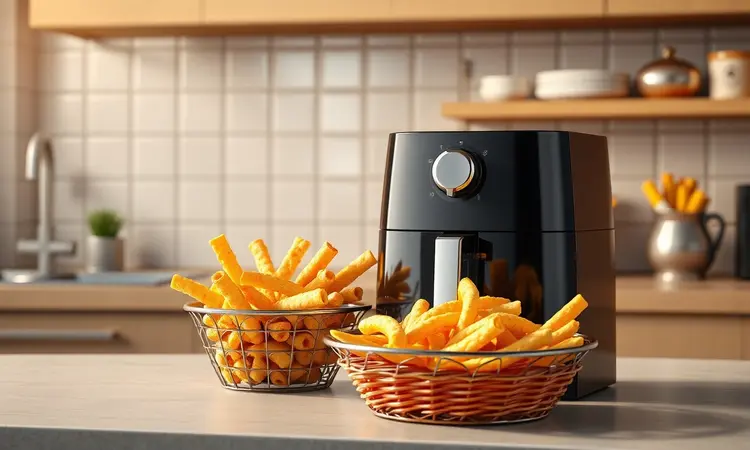

Se você está cansado daquele cheio de fritura que impregna na cozinha ou da sensação de culpa após uma refeição mais gordurosa, a Airfryer YQ-900 pode ser a solução que seu cotidiano precisa. Mas será que essa promessa de praticidade e saúde se sustenta na realidade?

Este guia vai além das especificações técnicas para mostrar como esse eletrodoméstico se comporta no dia a dia, para que você decida se ele merece um lugar em sua cozinha.

<SummaryList products={frontmatter.top_products} />

## Características da Fritadeira Elétrica Airfryer YQ-900

<ProductBox 
  title={frontmatter.top_products[0].title} 
  image={frontmatter.top_products[0].image} 
  link={frontmatter.top_products[0].link} 
/>

Imagine conseguir aquela batata frita crocante por fora e macia por dentro sem precisar mergulhá-la em um litro de óleo. É essa magia que a tecnologia de circulação de ar quente da YQ-900 realiza.

Um potente ventilador distribui calor intenso e uniforme ao redor dos alimentos, criando uma textura que engana até os paladares mais exigentes.

Com seus 10 litros de capacidade, ela é como ter um pequeno forno de convecção compacto. Pense na liberdade de preparar um frango inteiro para o almoço de domingo ou uma porção generosa de batatas para a família sem precisar fazer em lotes.

Essa versatilidade se estende aos modos de preparo: além de ‘fritar’ sem óleo, ela assa, tosta e até gratin, substituindo vários eletrodomésticos de uma vez.

O controle, seja no painel digital com ajustes precisos ou no modelo analógico mais simples, coloca você no comando da temperatura e do tempo. E quando a louça chama, a experiência continua fácil.

O cesto e as partes internas removíveis com revestimento antiaderente fazem com que a limpeza seja rápida, quase uma pausa entre uma receita e outra.

<CaixaProsContras>

**Prós:**

- Tecnologia que permite cozinhar com menos gordura.

- Grande capacidade ideal para famílias.

- Versatilidade para diferentes tipos de preparo.

- Facilidade na limpeza com partes removíveis.

**Contras:**

- Pode haver variações nas funcionalidades entre modelos.

- O painel digital pode ser um pouco confuso para quem prefere simplicidade.

</CaixaProsContras>

## Como Usar a Fritadeira Elétrica Airfryer YQ-900 Corretamente

Agora que você conhece o que ela é capaz, como extrair o melhor dela? Tudo começa com um simples pré-aquecimento de 3 a 5 minutos.

Esse passo fundamental garante que o ar já esteja na temperatura ideal quando sua comida entrar, resultando em um cozimento perfeito desde o primeiro minuto.

Evite a tentação de encher a cesta até a borda. O segredo da crocância está na circulação livre do ar. Um espaço generoso entre os alimentos permite que o calor envolva cada pedaço uniformemente.

Ajuste tempo e temperatura conforme o guia do manual ou sua receita favorita, e não se esqueça de dar uma sacudida ou virar os alimentos na metade do processo. Esse pequeno gesto garante que todos os lados recebam aquele dourado perfeito.

Ao final, enquanto espera os alimentos esfriarem um pouco, aproveite para limpar. Com as partes removíveis ainda mornas e o revestimento antiaderente, muitas vezes um pano úmido é suficiente. É a praticidade que não termina quando o timer apita.

## A Fritadeira Elétrica Airfryer YQ-900 Vale a Pena?

Diante de tantas opções no mercado, o que realmente faz a YQ-900 se destacar? Ela vai além da promessa básica de uma fritadeira sem óleo.

Entrega uma experiência culinária completa para famílias, unindo capacidade generosa a uma versatilidade que incentiva a criatividade na cozinha.

Para quem busca reduzir o consumo de gordura sem abrir mão do sabor e da textura, ela se torna mais do que um eletrodoméstico: é um aliado para hábitos mais saudáveis.

## Segurança e Cuidados Essenciais

Você já notou que o cabo do aparelho fica morno durante o uso prolongado? Essa é uma reação normal. A resistência interna trabalha em alta temperatura para gerar todo aquele ar quente, e parte desse calor se dissipa pelo fio.

No entanto, é importante saber a diferença entre um aquecimento esperado e um problema. Se o cabo estiver excessivamente quente ao toque, soltando cheiro de queimado ou apresentando qualquer sinal de derretimento, desligue o aparelho imediatamente.

Para um uso sempre seguro, conecte a airfryer diretamente na tomada, evitando extensões ou benjamins que não suportem sua potência. Certifique-se de que ela está sobre uma superfície plana, resistente ao calor e com boa ventilação ao redor.

Esses pequenos cuidados garantem que você aproveite apenas os benefícios do aparelho, com total tranquilidade.

## Conclusão

A Airfryer YQ-900 se apresenta não como um gadget passageiro, mas como uma ferramenta prática para transformar a rotina na cozinha.

Ela atende quem precisa de agilidade no dia a dia, quem prioriza uma alimentação mais consciente e, principalmente, quem valoriza a simplicidade.

Entre a promessa de alimentos mais crocantes com menos óleo e a realidade de uma capacidade que acomoda famílias inteiras, ela cumpre seu papel com eficiência.

Se o seu objetivo é unir saúde, praticidade e sabor em um único eletrodoméstico, a YQ-900 é um investimento que se paga em bem-estar e momentos ao redor da mesa. Agora é com você: está pronto para dar esse passo?