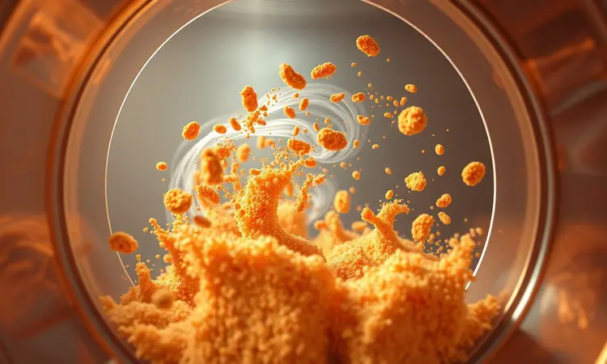

Imagine aquela frustração clássica: você tem na sua cozinha uma das airfryers mais avançadas do mercado, mas fica apenas no 'modo teste', girando botões e torcendo para acertar o ponto certo.

Se essa sensação de estar subaproveitando seu investimento soa familiar, respire fundo. Este guia vai transformar seu relacionamento com a Philips Walita de uma mera tentativa para um domínio completo.

Ao final, você não só entenderá cada função como sentirá confiança para criar receitas que impressionam sem aquele medo de 'será que vai dar certo?'.

Vamos começar do básico e evoluir até os segredos que transformam qualquer refeição em uma experiência gourmet, tudo usando menos óleo e mais inteligência.

<SummaryList products={frontmatter.top_products} />

## O que torna a Airfryer Philips Walita Diferente das Outras?

O segredo não está apenas na fritura sem óleo, mas na paz de espírito que vem com resultados consistentes. Enquanto outras marcas pedem que você seja um cientista da cozinha, ajustando cada variável, a Philips Walita traz tecnologia que já aprendeu com você.

A RapidAir não é só um nome bonito, é a garantia de que mesmo quem nunca usou uma airfryer vai conseguir aquela crocância perfeita que parece saída de um restaurante.

Mais do que um eletrodoméstico, ela se torna seu parceiro na cozinha, com limpeza que não exige esforço heroico e durabilidade que sobrevive aos anos de uso diário.

É essa combinação entre inovação e simplicidade que transforma uma compra em um investimento no seu bem-estar.

## Entendendo o Painel: O que são as Predefinições de Cozimento?

Essas predefinições são o seu atalho para esquecer as divagações sobre tempo e temperatura. Elas existem porque alguém já fez todos os testes por você, transformando ciência em simplicidade.

Quando você seleciona "batatas fritas", o aparelho não apenas aquece, ele aplica um conhecimento acumulado sobre como fazer o amido crocar sem queimar. Para frango, considera a espessura da carne e como manter o suco dentro enquanto a pele fica dourada.

Cada botão é como ter um chef especialista ao seu lado, sussurrando os segredos do ponto perfeito. E o melhor? Você não precisa de experiência culinária para acessar esse conhecimento, apenas um toque no painel. Isso não é automatização, é empoderamento culinário.

## Passo a Passo: Como Ativar e Usar as Funções Pré-programadas

Ligue o aparelho e deixe a ansiedade de lado. O processo é tão simples que se torna intuitivo após a primeira vez. Busque no painel digital o ícone que representa o que você vai preparar, seja batatas douradas, frango crocante ou peixe suculento.

A beleza está na falta de dúvida, não há "talvez seja essa temperatura". Ao pressionar iniciar, você pode literalmente se afastar e confiar que a máquina fará seu trabalho.

Aquele sinal sonoro ao final não é apenas um aviso, é um cumprimento: sua refeição está pronta, no ponto exato que você espera.

E se surgir alguma dúvida específica sobre uma receita diferente, o manual está ali não como um livro de regras complexas, mas como um guia de possibilidades a explorar.

## Como Personalizar as Predefinições nos Modelos Avançados (HD9285, NA32x, NA33x e NA34x)

Aqui é onde você deixa de seguir receitas para criar as suas. Esses modelos entendem que seu paladar é único, que sua família pode preferir batatas um pouco mais crocantes ou frango levemente mais suave.

Após selecionar uma predefinição, ajuste o tempo e a temperatura como um pintor ajusta suas cores. O verdadeiro poder surge quando você salva essas configurações, criando seus próprios "perfis de sabor" que estarão sempre a um toque de distância.

Experimente com diferentes cortes de carne, com vegetais que nunca tentou assar, e veja como o aparelho responde aos seus ajustes.

Essa flexibilidade transforma a airfryer de uma ferramenta padronizada em uma extensão da sua criatividade na cozinha, onde cada refeição carrega sua assinatura pessoal.

## Review: Airfryer Forno Philips Walita Série 5000 12L

<ProductBox 
  title={frontmatter.top_products[0].title} 
  image={frontmatter.top_products[0].image} 
  link={frontmatter.top_products[0].link} 
/>

Para famílias que transformam a cozinha no coração da casa, o modelo AI551 da Série 5000 é menos um eletrodoméstico e mais um centro culinário.

Com 12 litros de capacidade, ele permite que você prepare desde o assado de domingo até os lanches da semana, tudo em uma única sessão.

As 9 a 10 funções pré-programadas são seu passaporte para experimentar modos de cocção que você nem imaginava possíveis em casa, desde grelhar perfeito até fazer iogurte fresco.

O painel touchscreen responde ao toque como um smartphone, tornando a navegação algo natural, enquanto os acessórios removíveis garantem que o pós-refeição seja de descanso, não de trabalho árduo.

Se seu espaço permite, essa é a escolha que expande seus horizontes culinários sem limites.

## Review: Airfryer Philips Walita Série 1000 com Duplo Cesto

<ProductBox 
  title={frontmatter.top_products[1].title} 
  image={frontmatter.top_products[1].image} 
  link={frontmatter.top_products[1].link} 
/>

Quem disse que multitarefa não pode chegar à cozinha? A Série 1000 com Duplo Cesto reescreve as regras do preparo simultâneo.

Com 7,1 litros divididos estrategicamente, você pode ter batatas fritas crocantes em um compartimento enquanto o peixe cozinha suavemente no outro, cada um com sua temperatura e tempo ideais.

É como ter duas airfryers em uma, otimizando não apenas espaço na bancada, mas também seu tempo precioso. A tecnologia Rapid Air trabalha em ambos os cestos, garantindo que a qualidade não seja comprometida pela praticidade.

O controle digital mantém a simplicidade que você espera da marca, apesar de um manual que às vezes apela muito para o digital. No balanço final, o silêncio da operação e a facilidade de limpeza falam mais alto que qualquer ícone confuso.

## 5 Dicas de Especialista para Obter Melhores Resultados de Cozimento

Essas não são apenas dicas técnicas, são atalhos para resultados que parecem profissionalizados. Primeiro, aquele breve pré-aquecimento não é burocracia: ele cria o ambiente perfeito para que seus alimentos comecem a crocar instantaneamente.

Segundo, evite a tentação de encher a cesta além da conta; espaço entre os alimentos significa ar circulando livremente, que se traduz em cozimento uniforme em toda a superfície.

Terceiro, um leve spray de óleo não é trapaça, é o toque final que realça texturas sem contradizer o conceito saudável. Quarto, mexa ou vire na metade do tempo; isso garante que cada lado receba igual atenção do ar quente.

Finalmente, confie nas orientações específicas por alimento; elas foram desenvolvidas para eliminar o palpite, substituindo-o por certeza.

## Erros Comuns ao Usar sua Philips Walita e Como Evitá-los

O pré-aquecimento ignorado é o primeiro convite para resultados inconsistentes. Sem ele, seus alimentos começam a cozinhar em um ambiente que ainda está se estabilizando, criando desigualdades no ponto.

Sobrecarregar a cesta é o equivalente a tentar assar um bolo sem espaço para crescer; o ar precisa de passagem para fazer sua mágica. Outro equívoco comum é desprezar as predefinições específicas, tratando todas as receitas como se fossem iguais.

Cada alimento tem sua personalidade culinária e essas funções são como tradutores especializados que conhecem essa linguagem. Usá-las não é preguiça, é sabedoria aplicada.

Quando você respeita essas orientações, está basicamente deixando que anos de pesquisa trabalhem a seu favor, sem custo extra.

## Limpeza e Manutenção: Como Prolongar a Vida Útil do seu Aparelho

A relação com sua airfryer não termina quando a comida sai da cesta. Esse momento pós-refeição, quando tratado com cuidado, é o que garante anos de serviço fiel. Espere o aparelho esfriar completamente, um respeito mútuo entre você e a tecnologia.

Limpe cesto e bandeja com água morna e detergente neutro, evitando esponjas abrasivas que poderiam desgastar o revestimento que torna tudo mais fácil. Para o exterior, um pano úmido é suficiente, mantendo a estética que combina com sua cozinha.

Periodicamente, dê uma olhada no cabo e na tomada, prevenindo pequenos problemas antes que se tornem grandes. Esses minutos de atenção transformam um produto descartável em um companheiro de longa data na sua jornada culinária.

## Perguntas Frequentes (FAQ) sobre o Uso da Airfryer Philips

A dúvida sobre pré-aquecer surge porque parece um passo extra, mas pense nele como aquecer o forno antes de assar: não é obrigatório, mas faz toda diferença na textura final, especialmente para quem busca aquele crocante perfeito.

Sobre limpeza, a praticidade é intencional. Cesta e bandeja removíveis e laváveis na máquina não são acidente de design, são a compreensão de que seu tempo vale mais do que esfregar.

E para quem se preocupa com saúde, o uso reduzido de óleo não é apenas marketing; é uma mudança real na maneira como seus alimentos absorvem gordura, permitindo sabores intensos sem o peso da fritura tradicional.

Essas respostas não são apenas informações, são permissões para usar seu aparelho com menos hesitação e mais prazer.

## Conclusão

Dominar sua Airfryer Philips Walita é mais do que aprender funções, é redescobrir a confiança na cozinha. Cada predefinição que você usa sem medo, cada ajuste personalizado que cria, é um passo longe daquele cozinheiro inseguro que apenas 'testava' configurações.

Esta jornada transforma a preparação de refeições de uma obrigação nutricional em uma expressão criativa, onde alimentos crocantes e saudáveis deixam de ser exceção para se tornar padrão.

As reviews de modelos específicos mostram que existe uma versão perfeita para cada realidade familiar, do apartamento compacto à casa que ama receber.

As dicas práticas são seu guia para resultados consistentes, enquanto a manutenção adequada garante que esse relacionamento dure anos.

Agora, com este conhecimento em mãos, você não possui apenas uma airfryer, você detém a chave para uma rotina alimentar mais leve, saborosa e, acima de tudo, prazerosa.

O próximo passo é simples: escolha uma receita, confie no processo e prepare-se para surpreender-se com o chef que sempre esteve dentro de você, apenas esperando a ferramenta certa para se revelar.