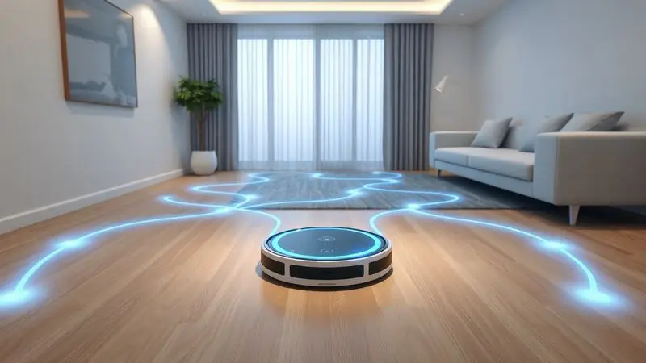
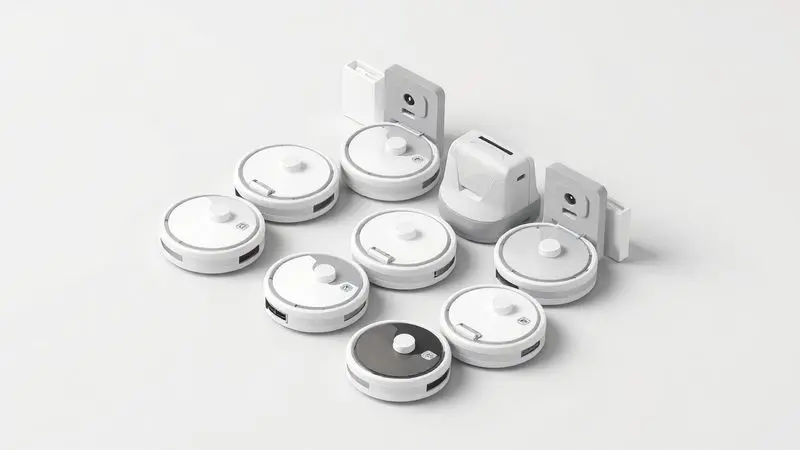

Ter um ajudante na limpeza doméstica é o sonho de muita gente, e o Aspirador de Pó Robô Britânia BAS03V com Função MOP surge como uma opção acessível e atrativa no mercado brasileiro.

No entanto, diante de tantas opções, surge a dúvida: será que um modelo de entrada realmente consegue aspirar e passar pano com eficiência? Muitas pessoas se perguntam se o Britânia BAS03V é bom ou se é apenas um aparelho simples demais para o dia a dia.

Vamos mergulhar nos detalhes para descobrir se ele pode ser o parceiro de limpeza que você precisa, sem promessas vazias.

<SummaryList products={frontmatter.top_products} />

## Ficha Técnica do Britânia BAS03V

<ProductBox 
  title={frontmatter.top_products[0].title} 
  image={frontmatter.top_products[0].image} 
  link={frontmatter.top_products[0].link} 
/>

Vamos começar pelos números e especificações. Esses detalhes técnicos são a base que nos ajuda a entender o que esperar na prática.

O Britânia BAS03V possui um reservatório de pó de 200ml, o que, em teoria, significa que você precisará esvaziá-lo com uma certa frequência, dependendo do tamanho do ambiente e da sujeira. A potência de 18W é modesta, projetada para eficiência energética.

A bateria de lítio de 14,8V promete até uma hora de trabalho contínuo, tempo suficiente para dar conta de um apartamento médio antes de precisar recarregar por cerca de 5 horas.

Entre seus diferenciais estão o filtro HEPA, que retém partículas minúsculas para um ar mais limpo, um controle remoto para comandos manuais e sensores que previnem quedas de degraus.

Com 1,73 kg, é realmente leve e compacto, mas atenção: ele não foi feito para aspirar líquidos, uma limitação importante a se considerar.

<CaixaProsContras>

**Prós:**

- Função MOP que combina aspiração e limpeza do chão.

- Controle remoto para fácil operação.

- Filtro HEPA que ajuda a manter o ar limpo.

- Design compacto e leve.

**Contras:**

- Não aspira líquidos.

- Capacidade do reservatório é relativamente pequena.

</CaixaProsContras>

## Destaques do Aspirador Robô Britânia

Para além das especificações, a verdadeira experiência de uso é moldada por como essas funcionalidades se encaixam na sua rotina. É aqui que a função MOP faz a diferença.

Imagine programar o robô para trabalhar de madrugada e acordar com os pisos não apenas livres de poeira, mas também limpos, sem aquelas marcas de chinelo ou pegadas. A combinação de aspiração e pano em uma única passada otimiza seu tempo de forma significativa.

A programação de horários se torna um aliado silencioso. Você pode agendar a limpeza para acontecer quando estiver no trabalho, voltando para um ambiente mais agradável. E os sensores?

Eles garantem que seu ajudante eletrônico navegue com segurança, evitando tombos em escadas e colisões com móveis, dando a você a tranquilidade de deixá-lo trabalhando sozinho.

## Modelos Similares para Comparar

Se você está avaliando diferentes opções no mercado, vale a pena olhar para alguns concorrentes diretos. Essa comparação ajuda a colocar o Britânia BAS03V no contexto certo.

O Roborock S5, por exemplo, oferece uma potência de sucção normalmente superior e um sistema de mop mais robusto, ideal para quem busca uma limpeza mais profunda, mas com um investimento maior.

O iRobot Roomba 671 é uma referência consolidada, com navegação inteligente e a mesma função de passar pano, porém em uma faixa de preço diferente. Já o Ecovacs Deebot Ozmo T8 representa o segmento premium, com mapeamento a laser e controle total via aplicativo.

Cada um atende a um perfil específico: robustez, tradição ou tecnologia de ponta.

## Conclusão

Então, o Aspirador Robô Britânia BAS03V vale o investimento? A resposta é: depende do que você prioriza.

Se você busca uma introdução acessível ao mundo dos robôs aspiradores, com a comodidade básica da aspiração e do pano em um aparelho simples de operar (principalmente com o controle remoto), ele é uma opção válida.

Sua simplicidade é tanto sua virtude quanto sua limitação. Ele não substituirá uma limpeza manual profunda em cantos difíceis, e a capacidade do reservatório exige atenção.

No entanto, para manter a limpeza do dia a dia em apartamentos ou casas menores, livrando você da poeira superficial e das marcas no piso, ele cumpre bem seu papel.

Se a sua necessidade é por um aliado prático para a manutenção, sem grandes complexidades, o Britânia BAS03V pode ser o parceiro certo. Avalie o tamanho do seu espaço e sua rotina para tomar a decisão mais acertada para a sua casa.

---

Ainda na dúvida sobre o ideal para sua casa? Confira nosso ranking completo dos [Melhores Robôs Aspiradores que Passam Pano em 2025](/melhor-aspirador-robo-que-aspira-lava-e-seca/).
