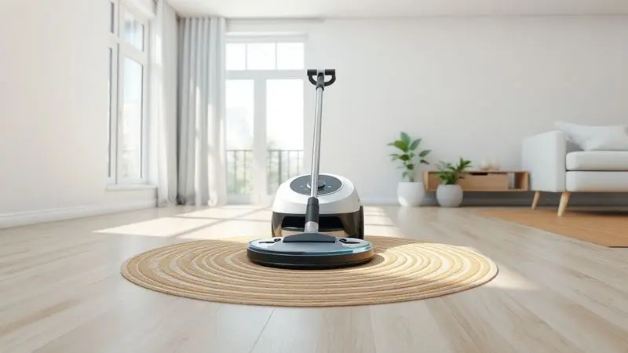
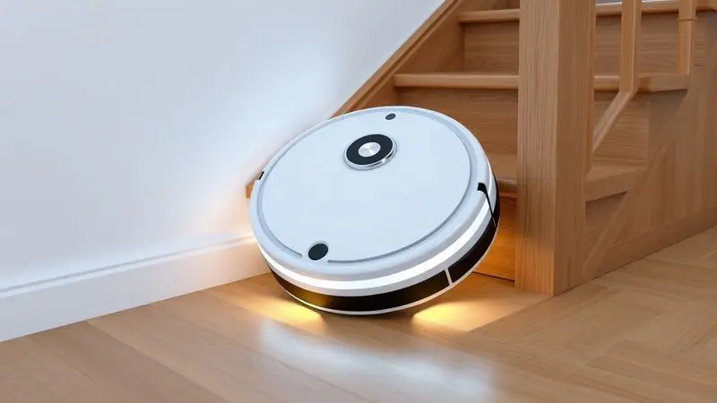
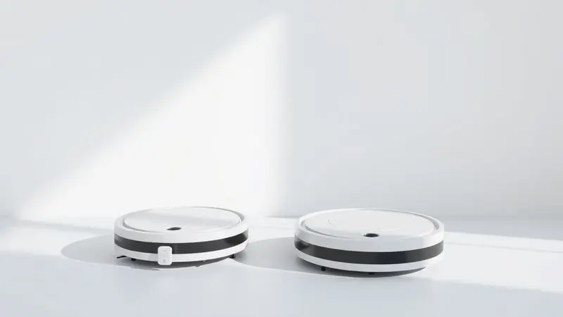

Imagine acordar e encontrar sua casa limpa sem você ter levantado um dedo. Essa é a promessa que o robô aspirador Multilaser HO041 traz para milhares de lares brasileiros, oferecendo automação da limpeza por um preço que não assusta o bolso.

Mas será que um modelo de entrada realmente entrega eficiência no dia a dia? Entre tantas opções no mercado, as dúvidas sobre pontência, durabilidade e capacidade de substituir a vassoura tradicional são naturais.

Nesta análise, vamos além das especificações técnicas para explorar como esse assistente robótico se comporta na vida real, ajudando você a decidir se ele merece um lugar na sua rotina.

<SummaryList products={frontmatter.top_products} />

## A marca Multilaser é boa?

Antes de mergulharmos no produto específico, vale entender quem está por trás da tecnologia. A Multilaser construiu sua reputação como uma marca brasileira que democratiza o acesso a produtos eletrônicos, equilibrando qualidade e preço acessível.

Ela está presente em lares de todo o país não apenas com robôs aspiradores, mas também com smartphones, acessórios de informática e outros itens essenciais do dia a dia.

Essa filosofia de tornar a tecnologia acessível se reflete diretamente no HO041, que vamos analisar agora.

## Análise do Robô Aspirador Multilaser Mars HO041

<ProductBox 
  title={frontmatter.top_products[0].title} 
  image={frontmatter.top_products[0].image} 
  link={frontmatter.top_products[0].link} 
/>

O HO041 é como aquele amigo confiável que nunca falta ao trabalho. Ele chega pontualmente, faz o que promete e não cobra caro pelo serviço.

Para quem quer mais comodidade sem complicações, ele entrega exatamente isso: limpeza prática com funções de varrer, aspirar e passar pano em um único ciclo.

Imagine deixar o apartamento pela manhã e voltar à tarde com os pisos limpos, sem precisar alternar entre vassoura e aspirador.

Sua melhor qualidade está nos sensores que garantem que ele nunca tente dar uma volta pelas escadas, oferecendo tranquilidade para você sair de casa sem supervisão.

A bateria, que dura cerca de duas horas, é suficiente para limpar ambientes médios sem interrupções frequentes.

No lado menos brilhante, o design é funcional mas simples, e o reservatório de sujeira pede esvaziamento regular, especialmente em casas com animais de estimação.

Se você busca um ajudante discreto e eficiente para a manutenção diária, sem esperar milagres em limpezas pesadas, encontrou seu candidato.

<CaixaProsContras>

**Prós:**

- Limpeza eficaz em tapetes e pelos de animais.

- Boa autonomia de bateria, até duas horas.

- Sensores anti-queda e para obstáculos.

- Compacto, alcança lugares difíceis.

**Contras:**

- Design simples e qualidade mediana.

- Reservatório pequeno que exige esvaziamento frequente.

</CaixaProsContras>

### Design e Construção do Aparelho

Menor que uma pizza média, o HO041 desliza com facilidade sob sofás, camas e móveis baixos, alcançando aqueles cantos onde a vassoura tradicional sempre deixa escapar alguma coisa.

Seu corpo arredondado e acabamento minimalista se camuflam em qualquer ambiente, discretamente cumprindo sua função sem chamar muita atenção.

A construção leve mas resistente significa que ele aguenta os tombos eventuais contra móveis, enquanto o compartimento de sujeira com fechamento fácil transforma o esvaziamento em uma tarefa de segundos.

### Funcionalidades e Modos de Limpeza

Aqui está onde a mágica acontece. Pense no HO041 como um assistente que entende diferentes situações. Precisou fazer uma festa e ficaram migalhas no chão? O modo spot concentra a limpeza em um raio específico. Quer que a casa esteja limpa quando você chegar do trabalho?

Programe o horário no painel e esqueça. O modo automático percorre o ambiente de forma inteligente, enquanto os sensores de obstáculos mantêm o robô seguro, evitando colisões com móveis e objetos.

### Desempenho da Bateria e Carregamento

Dois horas de autonomia significam tempo suficiente para limpar um apartamento de dois quartos ou uma casa pequena inteira em uma única sessão.

Quando a energia está acabando, o robô retorna sozinho para sua estação de carregamento, como um animal de estimação que sabe onde fica sua comida.

Você não precisa lembrar de colocá-lo para carregar ou se preocupar em encontrá-lo descarregado no meio da sala no dia seguinte.

### Sensores Anti-Quedas e Navegação

Esta é a feature que tira o peso da sua consciência. Os sensores anti-queda são como um sistema de proteção embutido que detecta desníveis e escadas, garantindo que seu investimento não termine em pedaços no térreo.

A navegação, embora não use mapeamento inteligente avançado, cobre a área de forma consistente, diminuindo as chances de cantos esquecidos. É a diferença entre supervisionar cada movimento e simplesmente apertar um botão e seguir com seu dia.

### Reservatório e Sistema Passa Pano

O sistema 2 em 1 permite que o HO041 aspire a sujeira seca enquanto um pano úmido dá aquele acabamento nos pisos. O reservatório de água, fácil de encher e limpar, transforma uma limpeza básica em algo mais completo.

Não espere que ele substitua uma lavagem tradicional de piso, mas para dar aquele brilho e remover a poeira superficial entre faxinas mais profundas, ele cumpre bem seu papel.

## Ficha Técnica do Multilaser HO041

Para os apaixonados por números, aqui estão os detalhes técnicos que sustentam a experiência.

O HO041 opera com uma potência de sucção ajustada para limpeza diária, vem com filtro que retém partículas para melhorar a qualidade do ar (especialmente útil para quem tem alergias), e pode ser programado para horários específicos através de seu painel intuitivo.

Seus 32cm de diâmetro e 7,6cm de altura garantem acesso a espaços apertados, enquanto a bateria de íons de lítio oferece recarga eficiente.

## Outros modelos conhecidos de Robô Aspirador Multilaser

A Multilaser não colocou todos os ovos na mesma cesta. Enquanto o HO041 é o modelo de entrada, a marca oferece alternativas para necessidades específicas, seja mais autonomia, conectividade ou funcionalidades extras.

Conhecer essas opções ajuda a entender onde o HO041 se posiciona no universo de possibilidades.

### Robô Aspirador Multilaser Orion HO042

<ProductBox 
  title={frontmatter.top_products[1].title} 
  image={frontmatter.top_products[1].image} 
  link={frontmatter.top_products[1].link} 
/>

Imagine o HO041 com superpoderes. O HO042 mantém a essência prática mas adiciona controle via aplicativo, permitindo que você monitore e programe a limpeza diretamente do smartphone, mesmo estando fora de casa.

A potência de sucção ligeiramente superior faz diferença em tapetes mais grossos, e o sistema de dupla filtragem captura 99,9% das impurezas. Para quem tem animais de estimação e busca um equilíbrio entre tecnologia e preço, ele representa um upgrade interessante.

<CaixaProsContras>

**Prós:**

- Eficaz na remoção de pelos de animais.

- Vários modos de limpeza adaptáveis.

- Sensores evitam quedas e obstáculos.

- Bom custo-benefício para uso em casas pequenas.

**Contras:**

- Dificuldade relatada na durabilidade da bateria.

- Problemas funcionais após pouco tempo de uso.

</CaixaProsContras>

### Robô Aspirador Multilaser Hydra

<ProductBox 
  title={frontmatter.top_products[2].title} 
  image={frontmatter.top_products[2].image} 
  link={frontmatter.top_products[2].link} 
/>

O Hydra é o multifuncional da família. Ele não apenas varre e aspira como também passa pano com mais eficiência que seus irmãos menores. Com autonomia que varia entre 1h30 e 1h45, ele consegue lidar com ambientes maiores sem pausas frequentes.

O aplicativo complementa a experiência com controle remoto e monitoramento em tempo real. A única ressalva fica com o reservatório de água, que alguns usuários consideram pequeno para limpezas mais extensas.

<CaixaProsContras>

**Prós:**

- Multifuncional: varre, aspira e passa pano.

- Eficiente na remoção de pelos de animais.

- Boa autonomia de bateria.

- Controle via aplicativo fácil e intuitivo.

**Contras:**

- Reservatório de água pequeno.

- Dificuldade em lidar com tapetes altos.

</CaixaProsContras>

### Robô Aspirador Multilaser ObaDuster

<ProductBox 
  title={frontmatter.top_products[3].title} 
  image={frontmatter.top_products[3].image} 
  link={frontmatter.top_products[3].link} 
/>

Pense no ObaDuster como o primo econômico que visita para ajudar nas tarefas leves. Com autonomia entre 45 minutos e 1h30, ele é ideal para apartamentos compactos ou como auxiliar de manutenção entre faxinas mais profundas.

A função 3 em 1 está presente, mas com limitações: o passa-pano serve mais como complemento do que substituto da limpeza tradicional. Para quem busca praticidade sem grandes expectativas, ele entrega o básico bem feito.

<CaixaProsContras>

**Prós:**

- Função 3 em 1, facilitando a rotina de limpeza.

- Sensores que evitam quedas e colisões.

- Leve e fácil de manusear.

- Ótimo custo-benefício para limpezas leves.

**Contras:**

- Pode não ser eficaz em limpezas profundas.

- A autonomia da bateria pode ser insuficiente para ambientes maiores.

</CaixaProsContras>

### Robô Aspirador Multi Eclipse HO410

<ProductBox 
  title={frontmatter.top_products[4].title} 
  image={frontmatter.top_products[4].image} 
  link={frontmatter.top_products[4].link} 
/>

O Eclipse HO410 flutua silenciosamente entre os móveis, operando com um ruído menor que uma conversa baixa. Essa característica o torna perfeito para apartamentos com vizinhos próximos ou para limpezas noturnas.

Seu design compacto garante acesso a praticamente qualquer espaço, enquanto os sensores antiquedas mantêm a segurança.

A função de passa-pano, assim como nos modelos similares, cumpre melhor o papel de manutenção do que de limpeza profunda, mas para o dia a dia de quem busca praticidade, ele é um companheiro discreto e eficiente.

<CaixaProsContras>

**Prós:**

- Função 3 em 1 (varre, aspira e passa pano)

- Sensores antiqueda para segurança

- Design compacto que entra em espaços pequenos

- Opera com baixo nível de ruído

**Contras:**

- Função de passar pano não substitui limpeza profunda

- Capacidade do reservatório de sujeira pode ser limitada

</CaixaProsContras>

## Qual a diferença entre o Aspirador Robô Multilaser HO041 e HO042?

Escolher entre o HO041 e o HO042 é como decidir entre um carro com ar-condicionado manual ou automático. Ambos refrescam, mas um oferece mais controle. O HO041 é o essencialista: faz a limpeza programada, evita obstáculos e cumpre sua função sem firulas.

O HO042 acrescenta o controle via aplicativo (que permite programação remota e monitoramento), tem sucção ligeiramente mais potente e um sistema de filtragem mais avançado.

A escolha depende de quanto você valoriza a conveniência do controle pelo smartphone versus economizar alguns reais.

## Conclusão

O robô aspirador Multilaser HO041 não pretende ser o melhor do mercado, mas sim o mais acessível que ainda entrega resultados confiáveis.

Ele é para quem quer experimentar a conveniência da automação doméstica sem comprometer o orçamento, para quem valoriza mais a praticidade do que features avançadas, e para quem entende que limpeza de manutenção diária é diferente de faxina profunda.

Se suas expectativas são realistas - um assistente para manter a casa organizada entre faxinas mais completas, com autonomia para limpar ambientes médios e sensibilidade para evitar acidentes - o HO041 cumpre sua promessa.

Mas se você busca mapeamento inteligente, controle por voz conectividade com ecossistemas smart home, precisará olhar para modelos mais avançados (e mais caros).

No balanço entre custo e benefício, o HO041 ocupa um espaço especial: oferece automação básica a um preço que não dói, democratizando um pouco daquele futuro high-tech que sempre imaginamos.

A decisão final depende de quanto valor você atribui ao seu tempo livre versus o investimento inicial. Para muitos brasileiros, essa equação tem se mostrado bastante favorável.

---

Ainda em dúvida sobre qual robô aspirador escolher? Confira nosso [ranking completo dos melhores de 2025](/melhores-robo-aspirador-2024/) e encontre a opção ideal para sua casa.
