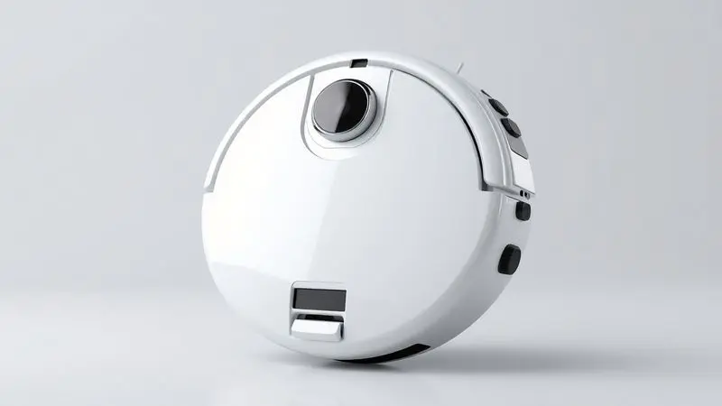
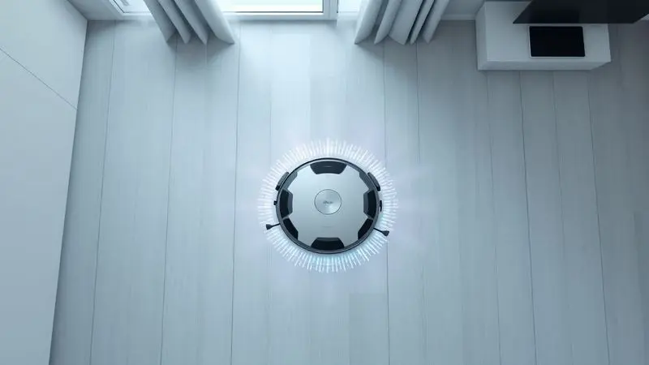
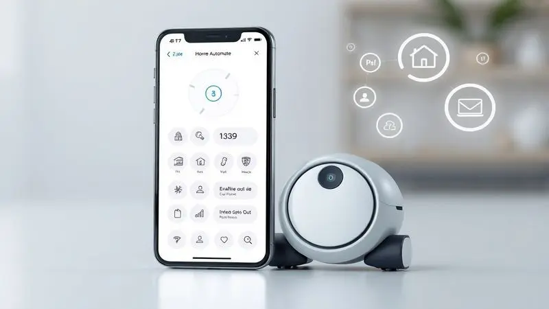
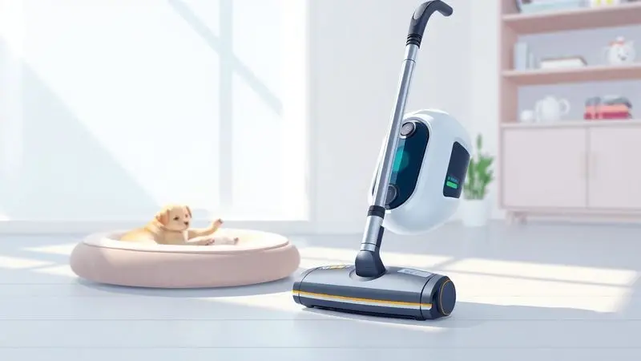

Manter a casa limpa sem esforço é o sonho de muitos, e os robôs aspiradores se tornaram a solução favorita para automatizar essa tarefa. Entre as opções mais populares e acessíveis do mercado brasileiro está o Wap W100.

Mas será que um robô aspirador de entrada realmente entrega uma limpeza eficiente ou acaba sendo apenas um "brinquedo" caro?

Nesta análise completa, mergulhamos na ficha técnica, avaliamos o desempenho da bateria, a inteligência dos sensores e o custo-benefício real do modelo.

Descubra se o Wap W100 é bom para a sua rotina ou se vale a pena investir um pouco mais em modelos superiores da marca.

<SummaryList products={frontmatter.top_products} />

## A marca WAP é boa e confiável?

Quando você investe em um eletrodoméstico, a confiança na marca é quase tão importante quanto o produto em si. A WAP já é uma companhia de longa estrada no Brasil, especialmente no segmento de equipamentos para limpeza e manutenção.

Sua trajetória é marcada pela durabilidade e eficiência dos produtos, o que transformou a marca em uma escolha comum para quem busca soluções práticas sem complicações.

Além de robôs aspiradores, a WAP oferece uma variedade que inclui aspiradores de pó e lavadoras, atendendo diferentes necessidades de limpeza.

O que realmente fortalece essa confiança é um bom suporte ao cliente e garantia sólida, criando aquela segurança que você precisa antes de apertar o "comprar".

## Ficha técnica do robô aspirador Wap Robot W100

<ProductBox 
  title={frontmatter.top_products[0].title} 
  image={frontmatter.top_products[0].image} 
  link={frontmatter.top_products[0].link} 
/>

Vamos decifrar o que esse pequeno ajudante traz na sua essência técnica. Com apenas 7,5 cm de altura, ele é um ninja que invade espaços secretos como embaixo da cama e cantos esquecidos. Sua missão é tripla: varrer, aspirar e passar pano.

A potência de 17W traduz-se em uma aspiração suficiente para lidar com a sujeira do dia-a-dia sem ser invasiva, enquanto o motor universal opera com um nível de ruído de 72 dB(A) - uma presença discreta que não compete com sua conversa ou música.

Ele carrega um depósito de pó de 250 ml, o que significa que consegue acumular o resultado de várias sessões antes de pedir sua atenção, e utiliza um filtro lavável que mantém a eficiência sem custos extras.

A bateria Li-Ion oferece uma autonomia que varia entre 1h40 e até 2h em condições ideais, com um tempo de carregamento entre 4 a 5 horas - perfeito para recarregar durante o trabalho ou enquanto você dorme.

Sensores inteligentes evitam quedas e colisões, e diferentes modos de limpeza adaptam-se aos seus espaços.

A realidade, entretanto, é que ele não possui conectividade com aplicativos ou controle remoto. Para alguns, essa ausência pode parecer uma limitação, mas para outros, é a simplicidade que torna a experiência mais direta.

<CaixaProsContras>

**Prós:**

- Design compacto que alcança locais difíceis.

- Funcionalidade 3 em 1 (varre, aspira e passa pano).

- Boa autonomia e tempos de carregamento razoáveis.

- Sensores eficazes que evitam quedas.

**Contras:**

- Não possui conectividade com aplicativo.

- Não aspira água.

</CaixaProsContras>

## Design e construção do Wap W100

O primeiro contato visual com o Wap W100 revela um design moderno e funcional, que parece feito para se integrar silenciosamente aos seus ambientes.

Com seu corpo compacto, ele é capaz de acessar locais difíceis, como embaixo de móveis e cantos que normalmente exigem que você se curve. A construção é robusta, utilizando materiais que garantem durabilidade ao aparelho mesmo após meses de uso frequente.

Os acabamentos em plásticos de qualidade não só conferem um visual elegante, mas também facilitam a limpeza do robô quando ele próprio precisa de cuidados.

Além disso, sua base de carregamento é prática e permite que ele retorne automaticamente quando a bateria está baixa, como um animal que sabe voltar para casa.

## Como funciona o Wap W100 no dia a dia?

Imagine acordar, tomar seu café, e enquanto você se prepara para o trabalho, um pequeno ajudante já está em movimento, cuidando dos detalhes que você normalmente teria que enfrentar depois.

O Wap W100 opera de forma autônoma, utilizando sensores para mapear o ambiente e identificar áreas sujas como um detective silencioso.

Você pode programar limpezas em horários específicos, criando uma rotina onde a casa se mantém limpa sem que você precise lembrar ou interromper seus momentos.

A potência de sucção é adequada para a remoção da sujeira comum e pelos de animais que insistem em se espalhar, e o modelo transita por diferentes tipos de piso - madeira, cerâmica, carpete - como um viajante adaptável.

O resultado é uma rotina onde você ganha tempo para outras atividades enquanto o trabalho de base acontece nas entrelinhas.

## Cobertura, bateria e autonomia de limpeza

E quando o assunto é a capacidade de cobrir seus espaços, o Wap W100 mostra que entende a missão.

Sua autonomia de bateria varia entre 90 a 120 minutos, o que permite que ele limpe áreas maiores sem precisar de recargas frequentes - perfeito para apartamentos médios ou casas com espaços conectados.

Com um sistema de navegação que se adapta aos obstáculos, ele consegue mapear o espaço e otimizar o tempo de limpeza, como um estrategista que conhece o terreno.

Em espaços muito grandes ou com muitas divisões, pode ser necessário programá-lo para mais de uma sessão, mas essa eficiência geral é adequada para a rotina da maioria das residências, onde o objetivo não é a perfeição, mas a consistência.

## Recursos, sensores e acessórios inclusos

Os recursos do Wap W100 são como um conjunto de ferramentas inteligentes que trabalham em conjunto. Equipado com sensores de detecção de obstáculos, ele navega com segurança pelos ambientes, evitando colisões e quedas como um motorista cuidadoso.

Além disso, possui diferentes modos de limpeza, como o modo casa e o modo spot, adaptando-se a diversas superfícies e necessidades específicas.

Os acessórios incluem um filtro HEPA que retém alérgenos e partículas finas, garantindo que o ar que você respira seja mais limpo após o trabalho dele.

Outro ponto interessante é a capacidade do tanque de poeira, que permite maior autonomia durante as limpezas sem exigir que você interrompa para esvaziá-lo constantemente.

## Aplicativo e conectividade: o Wap W100 tem Wi-Fi?

Esta é uma das perguntas que define expectativas: o Wap W100 tem conectividade via Wi-Fi? A resposta é não. Este modelo opera sem aplicativo ou controle remoto, focando na simplicidade do botão físico e programação direta no dispositivo.

Para alguns usuários, essa ausência pode ser vista como uma limitação, especialmente se você busca integração com smartphones ou assistentes de voz.

Para outros, essa falta de conectividade é precisamente o ponto positivo - menos complicação, menos dependência de apps que podem falhar, menos configurações.

Ele é o tipo de ajudante que funciona quando você programa e depois segue seu próprio caminho sem exigir intervenção constante.

Se a conectividade é essencial para você, modelos mais avançados da WAP oferecem essa funcionalidade, mas o W100 escolhe o caminho da operação direta e autônoma.

## Conheça outros modelos de robô aspirador da WAP

Se o W100 não parece perfeito para suas necessidades, a WAP oferece uma família de robôs aspiradores que podem atender diferentes expectativas.

Cada modelo tem características específicas, como potência e recursos de mapeamento, criando uma escalada de funcionalidades que pode corresponder ao que você busca.

### WAP Robot W90

<ProductBox 
  title={frontmatter.top_products[1].title} 
  image={frontmatter.top_products[1].image} 
  link={frontmatter.top_products[1].link} 
/>

O WAP Robot W90 é como um primo mais simples do W100, mantendo a essência da praticidade e eficiência para quem deseja facilitar a limpeza diária sem muitos requisitos.

Ele oferece funções de varrer, aspirar e passar pano com um design compacto que permite alcançar espaços menores, como embaixo de móveis. Com três modos de limpeza e sensores que evitam quedas e colisões, o W90 promove uma experiência tranquila e direta.

Sua bateria de íon de lítio garante aproximadamente 1 hora e 40 minutos de operação, o que é bastante satisfatório para uma limpeza rápida em espaços menores. Entretanto, com uma potência de 30W, ele é mais adequado para sujeiras leves, como pelos de animais e poeira.

Embora a função de passar pano seja funcional, ela não substitui uma limpeza mais profunda. Além disso, não possui mapeamento inteligente ou base de recarga automática, exigindo atenção do usuário para recolocação.

<CaixaProsContras>

**Prós:**

- Função 3 em 1 (varre, aspira e passa pano)

- Design compacto que alcança áreas difíceis

- Sensores de segurança que evitam quedas

- Boa autonomia da bateria

**Contras:**

- Potência limitada para sujeiras pesadas

- Não possui mapeamento inteligente

</CaixaProsContras>

### WAP Robot WSMART

<ProductBox 
  title={frontmatter.top_products[2].title} 
  image={frontmatter.top_products[2].image} 
  link={frontmatter.top_products[2].link} 
/>

O WAP Robot WSMART é um passo além na linha WAP, prometendo facilitar a limpeza da casa com varrição, aspiração e função de passar pano de forma automática.

Com um design slim, ele é capaz de acessar locais difíceis e conta com três modos de limpeza distintos: cantos, aleatório e em círculo. Um destaque é a função TURBO, que intensifica a sucção para áreas mais sujas, como uma resposta rápida para momentos específicos.

Ele possui um depósito de pó de 450 ml e um reservatório de água de 150 ml, além de um filtro HEPA que ajuda na redução de alérgenos.

Sua autonomia chega a até 2 horas, mas o tempo de recarga é de 5 a 6 horas - uma troca onde você ganha mais tempo de trabalho mas precisa planejar a recarga.

Embora alguns usuários mencionem que o retorno à base de carregamento pode ser um pouco instável, isso não compromete sua eficiência na limpeza. Para aqueles que buscam praticidade com um pouco mais de inteligência, o WSMART é uma ótima opção.

<CaixaProsContras>

**Prós:**

- Múltiplos modos de limpeza para diferentes necessidades.

- Design slim que alcança espaços apertados.

- Função TURBO para áreas mais sujas.

- Boa autonomia e filtro HEPA para alérgicos.

**Contras:**

- O retorno à base pode ser instável em algumas situações.

- Tempo de carregamento relativamente longo.

</CaixaProsContras>

### WAP Robot WCONNECT

<ProductBox 
  title={frontmatter.top_products[3].title} 
  image={frontmatter.top_products[3].image} 
  link={frontmatter.top_products[3].link} 
/>

O WAP Robot WCONNECT é onde a conectividade entra na história da WAP.

Com Wi-Fi integrado, ele é capaz de ser controlado via aplicativo e assistentes virtuais, como Amazon Alexa e Google Assistente, oferecendo aquela praticidade moderna onde você comanda com voz ou celular.

Além das funções de varrer e aspirar, ele também pode passar pano, com um reservatório de 150ml para água que umedece o mop durante a limpeza.

Outro destaque é sua autonomia de até 120 minutos de funcionamento e a recarga automática quando a bateria está baixa - o ajudante que sabe quando precisa se recompor.

O robô possui sensores infravermelhos que evitam quedas e colisões, além de ter um filtro HEPA que ajuda a reduzir alérgenos no ambiente. É uma boa opção para quem busca praticidade com controle remoto.

<CaixaProsContras>

**Prós:**

- Conectividade com assistentes virtuais e aplicativo para smartphone.

- Função de passar pano que agrega valor à limpeza.

- Autonomia de até 120 minutos com recarga automática.

- Filtro HEPA, ideal para quem tem alergias.

**Contras:**

- A rede Wi-Fi deve ser de 2.4 GHz, o que pode ser limitante para algumas pessoas.

- O tempo de carregamento é relativamente longo, cerca de 5 a 6 horas.

</CaixaProsContras>

### WAP Robot W4000

<ProductBox 
  title={frontmatter.top_products[4].title} 
  image={frontmatter.top_products[4].image} 
  link={frontmatter.top_products[4].link} 
/>

O WAP Robot W4000 é o membro mais avançado dessa família, oferecendo uma limpeza completa que combina funções de varrer, aspirar e passar pano com tecnologia de mapeamento a laser e navegação SLAM.

Ele cria mapas precisos do ambiente, otimizando suas rotas de limpeza e evitando a repetição desnecessária em áreas já limpas - como um arquiteto que conhece cada centímetro da sua casa.

Equipado com 29 sensores, esse modelo garante segurança e eficiência, sendo capaz de memorizar até cinco andares.

Entre suas características estão a base autolimpante, que reduz a necessidade de intervenção manual, e diversos modos de limpeza para atender diferentes necessidades.

A potência de 48W e a autonomia de até 2 horas tornam o W4000 ideal para pessoas com rotinas agitadas, além de ser especialmente útil para quem tem pets e precisa de uma limpeza mais robusta.

Embora alguns usuários notem que o acesso a áreas muito baixas pode ser dificultado por pequenos obstáculos, o robô ainda assim se destaca pela praticidade e inovação que oferece para o dia a dia.

<CaixaProsContras>

**Prós:**

- Limpeza 3 em 1 que economiza tempo e esforço.

- Navegação inteligente com mapeamento preciso.

- Controle fácil via aplicativo e assistentes de voz.

- Base autolimpante que diminui a manutenção.

**Contras:**

- Pode ter dificuldade em acessar áreas muito baixas.

- O preço pode ser considerado elevado em comparação com modelos simples.

</CaixaProsContras>

## Qual o melhor robô aspirador da WAP para comprar em 2024?

Ao procurar o melhor robô aspirador da WAP para 2024, a resposta depende menos do modelo e mais da sua rotina. O Wap W100 é uma opção que se destaca especialmente pela eficiência na limpeza e design intuitivo que não exige familiaridade com tecnologia.

Esse aspirador possui navegação adaptativa que se ajusta a diferentes superfícies, tornando-o ideal para quem busca praticidade sem complicações.

Se você vive em espaços maiores ou precisa de controle via smartphone, modelos como o WCONNECT ou W4000 podem ser mais adequados. A WAP é conhecida pela durabilidade de seus produtos, então independente do modelo, você está investindo em um ajudante que pretende durar.

## Perguntas frequentes sobre o WAP Robot W100

O WAP Robot W100 é um robô aspirador que promete facilitar a limpeza do dia a dia. Entre suas funcionalidades, destacam-se a capacidade de programar horários de limpeza e sensores de obstáculos, tornando-o prático para diversos ambientes.

### Ele é eficaz para quem tem animais de estimação?

Para quem convive com animais de estimação, a questão dos pelos é quase uma constante. O Wap W100 se destaca como uma opção interessante nesse cenário. Seu design e capacidade de sucção são projetados para lidar com pelos, que costumam ser um grande desafio em casa.

Além disso, ele possui tecnologia de sensores que ajudam a evitar obstáculos e a mapear o ambiente, garantindo uma limpeza mais eficaz onde os pets costumam deixar seus sinais.

Os filtros também são adequados para capturar alérgenos, o que pode beneficiar quem convive com animais e tem sensibilidades.

Portanto, se você está em busca de um amigo robô para manter sua casa livre de pelos sem exigir que você seja o responsável diário, o W100 pode ser uma boa escolha.

### Onde encontrar peças de reposição?

Para encontrar peças de reposição do robô aspirador Wap W100, você pode começar pela própria loja onde realizou a compra, pois muitas vezes elas oferecem itens de reposição como filtros e escovas.

Além disso, os sites especializados em eletrônicos e eletrodomésticos costumam ter uma seção dedicada a peças de reposição, criando uma rede de opções.

Não esqueça de verificar também nas plataformas de venda online, que muitas vezes possuem uma variedade de opções disponíveis de diferentes fornecedores.

Por fim, consultar o fabricante diretamente pode ajudar a garantir que você está adquirindo componentes compatíveis e de qualidade, mantendo o desempenho do seu ajudante.

### Como funciona o agendamento de limpeza?

O agendamento de limpeza em robôs aspiradores como o Wap W100 permite que você programe horários específicos para o equipamento iniciar seu trabalho.

Geralmente, essa funcionalidade é acessível através de um painel de controle no próprio robô - sem apps, sem complicações. Você pode definir dias da semana e horários, garantindo que o ambiente esteja sempre limpo sem que você precise estar presente ou lembrar.

Essa conveniência é ideal para manter a casa livre de poeira e pelos de animais, especialmente em rotinas corridas onde cada minuto é planejado. Além disso, essa programação direta cria uma rotina automática onde o W100 sabe quando começar e quando parar.

## Conclusão

O Wap W100 não é o robô aspirador mais avançado do mercado, mas essa simplicidade pode ser precisamente seu maior atributo.

Ele opera sem aplicativos, sem comandos de voz, sem mapeamento laser - apenas com sensores inteligentes, uma bateria que dura horas e uma capacidade de limpeza tripla que cuida dos detalhes enquanto você vive sua vida.

Para quem busca um ajudante silencioso que não exige configuração complexa, o W100 oferece uma experiência direta: programe, deixe-o trabalhar, e ele cuidará dos espaços que normalmente exigem seu tempo.

Sua altura compacta invade lugares secretos, sua potência suficiente para a sujeira do dia-a-dia, e sua ausência de conectividade pode ser vista como liberdade de complicações.

Se você valoriza a simplicidade acima da tecnologia, e precisa de um robô que funcione sem exigir que você seja seu supervisor constante, o Wap W100 vale o investimento.

Para necessidades mais complexas ou espaços maiores, os modelos superiores da WAP oferecem caminhos diferentes. Mas para a maioria das rotinas domésticas, este pequeno ninja da limpeza pode ser precisamente o que você precisa para transformar tarefas em automatismos.

---

Ainda em dúvida sobre o melhor da WAP? Veja nosso [ranking completo dos Melhores Robôs Aspiradores WAP de 2025](/robo-aspirador-wap-qual-o-melhor/).
