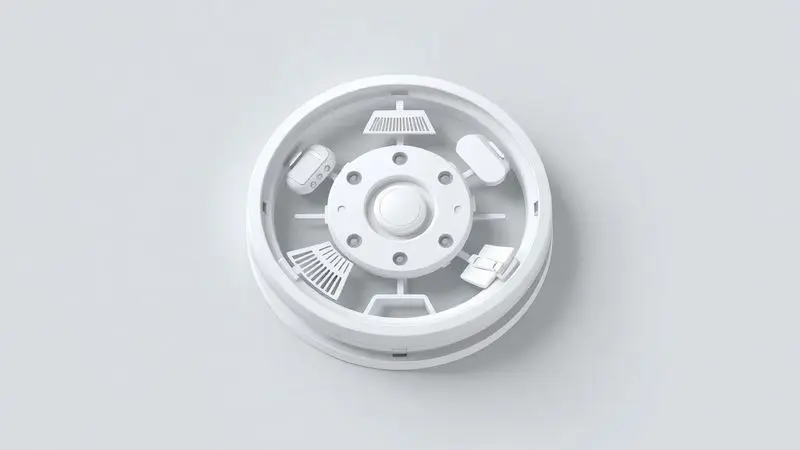
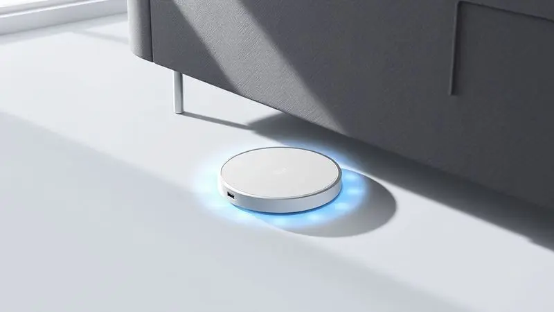
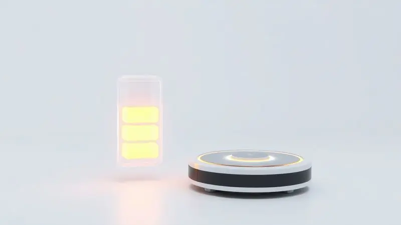

Imagine transformar aquela rotina interminável de varrer, aspirar e passar pano em algo que acontece quase por magia, enquanto você se dedica ao que realmente importa.

O Aspirador Robô Agratto Praticci promete exatamente isso: ser o ajudante silencioso que mantém sua casa limpa sem exigir grandes investimentos ou sacrifícios do seu tempo.

Mas será que essa promessa de praticidade se mantém na realidade do dia a dia? Descubra se esse companheiro 3 em 1 realmente entrega tudo o que promete e se ele se torna o aliado ideal para quem busca automatizar a limpeza sem complicações financeiras.

<SummaryList products={frontmatter.top_products} />

## Visão Geral do Aspirador Robô Agratto Praticci

<ProductBox 
  title={frontmatter.top_products[0].title} 
  image={frontmatter.top_products[0].image} 
  link={frontmatter.top_products[0].link} 
/>

Pense no Agratto Praticci como seu primeiro passo no mundo da limpeza automatizada.

Criado para quem busca simplicidade sem comprometer resultados, esse robô com apenas 7,1 cm de altura desliza por debaixo de móveis que normalmente acumulam poeira, transformando cantos esquecidos em áreas limpas com facilidade.

Seu verdadeiro diferencial está na combinação inteligente de funções: enquanto aspira, ele já prepara o pano para dar aquele acabamento que deixa pisos brilhando. E tudo isso acontece em silêncio suficiente para não interromper seu home office ou momentos de descanso.

A bateria oferece cerca de 90 minutos de trabalho livre, tempo suficiente para uma sessão minuciosa na maioria dos apartamentos e casas. Quando precisa recarregar, a base está pronta para recebê-lo, mantendo-o sempre disponível para o próximo serviço.

Para ambientes que não exigem uma limpeza industrial, mas sim uma manutenção consistente e eficiente, o Praticci se posiciona como uma escolha inteligente que equilibra funcionalidade com investimento consciente.

<CaixaProsContras>

**Prós:**

- Design compacto que alcança locais difíceis.

- Multifuncional: varre e passa pano.

- Boa autonomia de bateria para sessões longas.

- Baixo nível de ruído durante sua operação.

**Contras:**

- Potência inferior a modelos mais caros.

- Autonomia e tempo de recarga podem não agradar quem tem grandes áreas para limpar.

</CaixaProsContras>

## Alta Capacidade de Sucção e Desempenho na Limpeza

Quando o assunto é eficiência, o coração do Praticci bate forte na capacidade de sucção de 11W. Essas não são apenas siglas técnicas, mas a garantia de que poeira diária, pelos de animais e migalhas não resistem ao seu trabalho.

Graças ao seu sistema otimizado, ele navega inteligentemente por diferentes superfícies, adaptando-se a pisos frios e carpetes com a mesma determinação.

A experiência é de limpeza completa, sem aqueles cantinhos que sempre ficam para depois porque são difíceis de alcançar.

Essa eficiência inteligente significa menos passes sobre a mesma área e mais tempo livre para você. A sensação é de casa realmente limpa, não apenas "arrumada para inglês ver".

## Aspirador 3 em 1: Varre, Aspira e Passa Pano

Você já viveu a frustração de terminar de aspirar e perceber que ainda precisa passar o pano? O Praticci resolve esse problema na raiz, executando as três etapas em um único movimento fluido.

Imagine seu chão não apenas livre de partículas, mas também com aquele brilho característico de verdadeiramente limpo. A combinação de funções não é apenas conveniente, é uma redefinição de como você pode pensar sobre limpeza doméstica.

Com programação flexível, você define os horários que fazem sentido para sua rotina. Seja antes de você chegar do trabalho ou durante a madrugada, sua casa estará sempre pronta para receber você no melhor estado possível.

## Modo de Limpeza Zig Zag para Maior Cobertura

Há uma diferença sutil, mas crucial, entre um robô que perambula aleatoriamente e um que tem método. O modo Zig Zag do Praticci é a inteligência aplicada ao movimento, garantindo que cada centímetro do seu piso receba atenção.

Isso elimina aquelas áreas que sempre parecem escapar da limpeza mesmo quando você faz manualmente. O movimento ziguezague não é apenas tecnicamente eficiente, é a promessa cumprida de cobertura total sem superposições desnecessárias.

O resultado é tempo otimizado e a certeza de que, quando o Praticci termina seu trabalho, ele realmente terminou tudo o que precisava fazer.

## Design Super Slim: Facilidade de Acesso sob Móveis

Existe um mundo inteiro de poeira e sujeira escondido sob seus móveis, um território que aspiradores tradicionais nunca exploram. Com seus 7,1 cm de altura, o Praticci acessa esses espaços como um especialista em missões secretas.

Sofás, camas e armários baixos deixam de ser obstáculos para se tornarem áreas de atuação. Essa habilidade não apenas melhora a limpeza geral, mas também contribui para um ambiente mais saudável ao remover alérgenos de lugares tradicionalmente negligenciados.

Quando não está em serviço, ele se recolhe discreto, ocupando menos espaço que uma caixa de sapatos. Design inteligente é aquele que funciona quando precisa e desaparece quando não.

## Bateria de Alta Eficiência e Autonomia

Nada é mais frustrante do que um eletrodoméstico que desiste no meio do serviço. Com autonomia para cerca de 90 minutos, a bateria do Praticci é dimensionada para completar a maioria das sessões em uma única carga.

A inteligência vai além do tempo de uso: quando sente que precisa de energia, ele encontra sozinho o caminho de volta à base, garantindo que estará sempre pronto para quando você precisar dele novamente.

Essa autonomia confiável transforma o robô de um simples eletrodoméstico em um parceiro previsível, que cumpre horários e não deixa você na mão.

## Conclusão

O Aspirador Robô Agratto Praticci não é apenas um produto, é uma proposta de estilo de vida mais leve. Para quem vive o dilema entre tempo limitado e a vontade de manter um ambiente realmente limpo, ele emerge como uma solução elegante e acessível.

Sua beleza está no equilíbrio: potência suficiente para o dia a dia, inteligência para otimizar seu trabalho e um design que respeita seu espaço. É claro que, para ambientes extensíssimos ou situações de limpeza pesada, você ainda precisará de soluções complementares.

Mas se o que você busca é transformar a manutenção diária de uma obrigação cansativa em um processo automático e eficiente, o Praticci cumpre sua promessa com honestidade.

Ele não pretende ser o robô mais potente do mercado, mas sim o mais adequado para quem está dando os primeiros passos na automação doméstica inteligente.

A decisão final se resume a uma pergunta simples: você está disposto a trocar alguns minutos de configuração por horas de limpeza automatizada?

Se a resposta for sim, o Agratto Praticci está pronto para se tornar seu novo aliado na conquista de mais tempo e menos preocupações com limpeza.

---

Ainda em dúvida sobre o Aspirador Robô Agratto Praticci? Confira nosso ranking dos [melhores robôs aspiradores 3 em 1 de 2025](/robo-aspirador-3-em-1-qual-o-melhor/) e encontre a opção ideal para sua casa!
