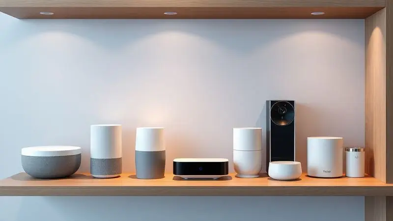
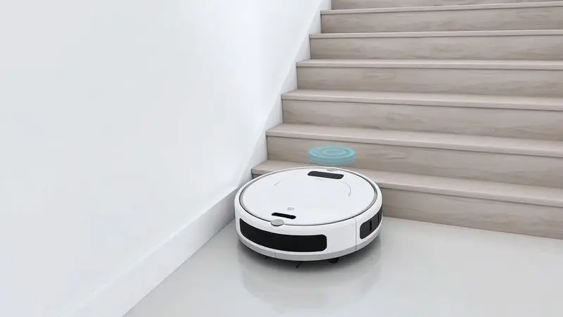
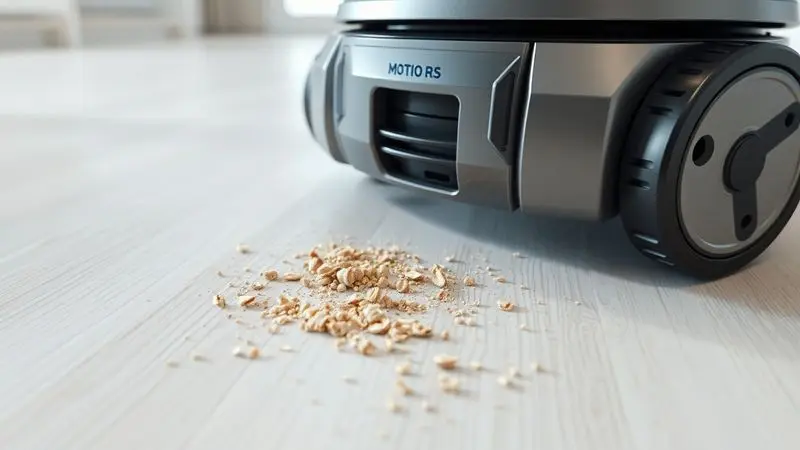
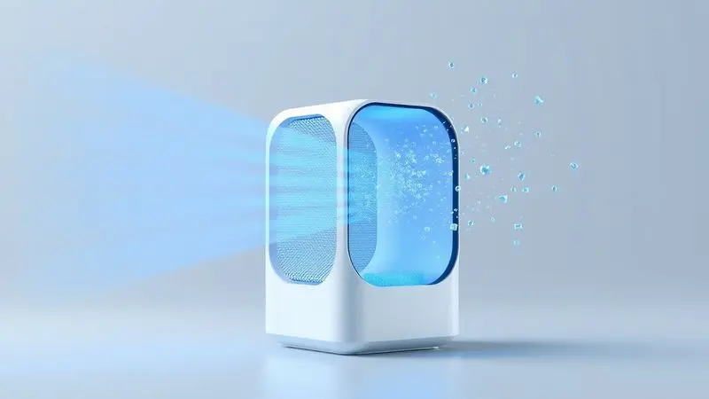

A rotina moderna exige cada vez mais praticidade, e os robôs aspiradores conquistaram um espaço especial nos lares brasileiros como verdadeiros aliados na limpeza.

Mas em meio a tantas opções disponíveis, surge uma dúvida natural: os aspiradores robôs da Multilaser realmente valem o investimento?

Conhecida por democratizar o acesso à tecnologia com preços acessíveis, a marca oferece uma linha variada que vai desde modelos simples até opções 3 em 1.

Nesse guia, exploramos de perto os cinco modelos mais populares, Mars HO041, Orion HO042, Hydra, Eclipse HO410 e ObaDuster, para ajudá-lo a encontrar o parceiro ideal para seu dia a dia.

<SummaryList products={frontmatter.top_products} />

## A marca Multilaser é boa?

Quando pensamos em eletrônicos acessíveis no Brasil, a Multilaser é uma das primeiras marcas que vêm à mente. Ela construiu sua reputação oferecendo produtos que equilibram funcionalidade e preço justo, e seus aspiradores robôs seguem essa mesma filosofia.

A empresa entende que o consumidor brasileiro busca praticidade sem complicações, e por isso desenvolve aparelhos que atendem às necessidades reais do dia a dia.

O que muitas pessoas apreciam na Multilaser é a transparência: você sabe exatamente o que está comprando. Os produtos são projetados para serem intuitivos, com manutenção simplificada que qualquer pessoa consegue fazer.

E quando surgem dúvidas ou necessidades, o suporte e a garantia dão aquela segurança extra que faz diferença na hora da decisão.

É verdade que alguns modelos não competem em sofisticação com marcas internacionais premium, mas também não precisam. Eles cumprem bem o propósito de tornar a limpeza mais leve e descomplicada, que é justamente o que a maioria das famílias brasileiras procura.

## Qual a diferença entre o Aspirador Robô Multilaser HO041 e HO042?

Essa é uma das dúvidas mais comuns, pois ambos são destaques da linha Multilaser. A escolha entre eles depende muito do seu estilo de vida e do tipo de ambiente que precisa ser limpo.

O HO041 é como aquele amigo confiável que chega sem alarde e resolve o serviço. Ideal para apartamentos menores ou casas com poucos cômodos, ele oferece o essencial: aspira, varre e passa pano com uma simplicidade encantadora. Você programa, ele executa.

Já o HO042 é para quem quer um nível acima de inteligência. Com mapeamento inteligente, ele aprende a planta da sua casa e traça rotas eficientes, como um verdadeiro planejador de limpeza.

Adicione controle via aplicativo, maior potência de sucção e um sistema de filtragem mais avançado, e você tem um robô que praticamente pensa por si só.

Em resumo: se você valoriza simplicidade direta, o HO041 é suficiente. Mas se quer tecnologia que acompanha sua rotina com mais autonomia e controle, o HO042 vale o investimento extra.

## 1. Aspirador Robô Multilaser Mars HO041

<ProductBox 
  title={frontmatter.top_products[0].title} 
  image={frontmatter.top_products[0].image} 
  link={frontmatter.top_products[0].link} 
/>

Imagine acordar sabendo que, enquanto você toma café, um assistente silencioso cuida da limpeza dos principais ambientes. É essa experiência que o Mars HO041 oferece.

Como um verdadeiro 3 em 1, ele varre, aspira e passa pano em uma única passagem, transformando uma tarefa chata em algo que acontece quase por magia.

Com autonomia para trabalhar por até 2 horas, ele cobre áreas generosas sem precisar de pausas, ideal para quem tem piso de madeira ou cerâmica.

Os sensores de obstáculos funcionam como seus olhos, prevenindo colisões com móveis, enquanto os anti-queda garantem que ele nunca dê um passo maior que a perna em escadas ou desníveis.

Quem convive com animais de estimação encontra nele um aliado especial. A remoção de pelos acontece de forma tão eficiente que você se surpreende com a quantidade que recolhe após cada ciclo.

A única ressalva é que o reservatório pode pedir esvaziamento mais frequente em ambientes muito movimentados, mas isso é compensado pela facilidade de limpeza: tanto o filtro quanto o compartimento de sujeira são laváveis à mão.

<CaixaProsContras>

**Prós:**

- Função 3 em 1: varre, aspira e passa pano.

- Sensores de obstáculos e antiqueda oferecem segurança na navegação.

- Boa autonomia de até 2 horas.

- Ideal para quem tem pets, removendo pelos com eficiência.

**Contras:**

- O reservatório de sujeira pode ser pequeno.

- Não possui controle remoto nem aplicativo para celular.

</CaixaProsContras>

### Design e Funcionalidades do HO041

O design arredondado do HO041 não é apenas uma questão estética. Ele permite que o robô alcance cantos que normalmente exigiriam seu esforço, deslizando sob sofás e camas baixas como quem dança.

Essa compactabilidade inteligente significa que poucos lugares ficam fora do alcance.

Os modos de limpeza programáveis são como ter diferentes personalidades para ocasiões distintas. Precisa de uma limpeza rápida antes de receber visitas? Há um modo para isso. Quer uma faxina mais profunda no fim de semana? Basta programar.

Essa flexibilidade transforma um eletrodoméstico em um parceiro que se adapta ao seu ritmo.

### Sensores Anti-Queda e Bateria

Os sensores anti-queda do HO041 funcionam como um sistema de proteção invisível. Eles criam uma espécie de mapa mental dos limites do ambiente, identificando desníveis antes mesmo de se aproximarem deles.

Essa tecnologia evita aqueles momentos de tensão quando um robô se aventura perto de escadas, dando a você a tranquilidade de deixá-lo trabalhar sem supervisão constante.

Já a bateria foi projetada para pensar como você pensa. Em vez de parar no meio de um cômodo, ela calcula o tempo restante e otimiza o percurso para maximizar a limpeza antes de precisar recarregar.

São esses pequenos detalhes que transformam uma especificação técnica ("até 2 horas de autonomia") em uma experiência prática do dia a dia.

### Teste de Limpeza: Detritos, Farelos e Pelos

Na prática, como o HO041 se sai com os desafios reais de uma casa? Em testes com os tipos mais comuns de sujeira doméstica, ele demonstrou uma competência que supera expectativas para sua categoria.

Farelos de pão no chão da cozinha desaparecem como por encanto. Detritos maiores, como migalhas de biscoito, são aspirados com eficiência.

Mas é com pelos de animais que ele realmente brilha, o sistema de sucção foi ajustado para capturar até fios mais finos que normalmente grudam em tapetes.

Superfícies duras são seu território favorito, mas mesmo em carpetes baixos ele mantém uma performance respeitável. O segredo está nos ajustes automáticos de potência, que aumentam a sucção quando detectam resistência maior.

## 2. Aspirador Robô Multilaser Orion HO042

<ProductBox 
  title={frontmatter.top_products[1].title} 
  image={frontmatter.top_products[1].image} 
  link={frontmatter.top_products[1].link} 
/>

Se o HO041 é o praticante dedicado, o Orion HO042 é o estrategista. Ele leva a experiência de limpeza automatizada para outro patamar, especialmente para quem vive em espaços maiores ou com layouts mais complexos.

O coração dessa evolução está no sistema de filtragem HEPA lavável. Para famílias com alergias ou sensibilidade respiratória, essa é uma diferença que se sente no ar literalmente.

O filtro retém 99,9% das impurezas e alérgenos, transformando a limpeza do chão em um cuidado com a qualidade do ar que todos respiram.

Com três modos de limpeza (automático, cantos e espiral), ele se adapta como um camaleão às necessidades de cada ambiente. Precisa de atenção especial nos cantos da sala? O modo dedicado a cantos faz um trabalho cirúrgico.

Quer garantir que uma área específica esteja impecável? A espiral cobre cada centímetro.

A autonomia de 90 minutos é suficiente para a maioria dos apartamentos e casas médias, e o retorno automático à base quando a bateria está fraca é aquela conveniência que você só percebe o valor quando experimenta.

Chega em casa com o robô já recarregado e pronto para o próximo ciclo.

<CaixaProsContras>

**Prós:**

- Sistema de filtragem HEPA eficaz para redução de alérgenos.

- Três modos de limpeza adaptáveis.

- Retorno automático à base quando a bateria está baixa.

- Boa performance em diferentes tipos de piso e pelos de animais.

**Contras:**

- Durabilidade da bateria pode ser uma preocupação depois de uso prolongado.

- Alguns usuários relatam problemas pontuais de funcionamento.

</CaixaProsContras>

### Diferenciais: Filtro HEPA e Maior Reservatório

O filtro HEPA do HO042 faz mais do que apenas coletar poeira. Ele trava uma batalha silenciosa contra partículas que normalmente circulariam pelo ar depois da limpeza.

Para quem sofre com rinites alérgicas ou tem crianças pequenas em casa, essa característica técnica se traduz em noites de sono mais tranquilas e menos espirros matinais.

Já o reservatório maior é um alívio para a rotina. Em vez de precisar esvaziá-lo após cada uso, ele acumula sujeira por múltiplos ciclos, especialmente em ambientes que não acumulam muita poeira diariamente.

Imagine só programar a limpeza para toda a semana e só precisar intervir no sábado. Essa é a praticidade que o reservatório ampliado oferece.

## 3. Aspirador Robô Multilaser Hydra

<ProductBox 
  title={frontmatter.top_products[2].title} 
  image={frontmatter.top_products[2].image} 
  link={frontmatter.top_products[2].link} 
/>

O Hydra chega com uma proposta clara: potência bruta aliada à autonomia. Com até 2 horas de operação contínua, ele é para quem tem áreas extensas para cobrir ou simplesmente não quer se preocupar com recargas frequentes.

A aspiração robusta faz dele um especialista em pelos de animais. Se você convive com gatos ou cachorros que soltam muito pelo, vai apreciar como ele transforma tapetes antes dominados por fios em superfícies limpas e convidativas.

A adaptação a diferentes pisos é quase intuitiva: do laminado sofisticado ao carpete aconchegante, ele ajusta a estratégia sem precisar de comandos.

O retorno automático à base é particularmente valioso em um robô com tanta autonomia. Quando finalmente decide que completou a missão (ou que precisa recarregar), ele encontra o caminho de volta sozinho, como um animal de estimação bem treinado retornando ao seu lugar.

A função de passar pano, entretanto, é mais básica. Serve para um acabamento leve, mas não substitui uma limpeza úmida tradicional em superfícies muito sujas.

E em móveis muito baixos, seu perfil pode encontrar limitações, vale medir a altura dos seus sofás e camas antes de decidir.

<CaixaProsContras>

**Prós:**

- Boa potência de aspiração, ideal para pelos de animais.

- Autonomia de até 2 horas, abrangendo áreas maiores.

- Retorno automático à base de carregamento.

- Navegação com sensores de obstáculos e antiquedas.

**Contras:**

- Função "passa pano" pode ser limitada para alguns usuários.

- Dificuldades com móveis muito baixos.

</CaixaProsContras>

## 4. Aspirador Robô Multilaser Eclipse HO410

<ProductBox 
  title={frontmatter.top_products[3].title} 
  image={frontmatter.top_products[3].image} 
  link={frontmatter.top_products[3].link} 
/>

O Eclipse HO410 é a prova de que multifuncionalidade não precisa ser complicada. Como um verdadeiro 3 em 1, ele executa três tarefas fundamentais na limpeza doméstica em um único dispositivo compacto.

O sistema anti-queda é especialmente bem implementado. Ele age com uma precaução que lembra a de um pai cuidadoso, detectando desníveis com antecedência e mudando de rumo antes que qualquer risco se concretize.

Essa segurança intrínseca permite que você o deixe trabalhar em ambientes com escadas sem aquela vigilância constante.

Com 1 hora e 30 minutos de autonomia, ele consegue cobrir apartamentos de tamanho médio em uma única carga. A eficiência na remoção de pelos de animais é notável, fazendo com que a convivência com pets seja mais limpa e menos trabalhosa.

A ausência de base de recarga automática significa que você precisará conectá-lo manualmente à tomada após cada uso. Para alguns, isso é um pequeno inconveniente; para outros, uma troca justa pelo preço mais acessível.

A limpeza interna exige atenção para não perder componentes pequenos, mas uma vez que você pega o jeito, torna-se parte rápida da rotina de manutenção.

<CaixaProsContras>

**Prós:**

- Funcionalidade 3 em 1 (varre, aspira e passa pano).

- Sistema anti-queda que evita acidentes.

- Boa autonomia de bateria para cobrir grandes áreas.

- Adequado para remover pelos de animais com eficiência.

**Contras:**

- Não possui base de recarga automática.

- A limpeza interna requer cuidado para não perder componentes.

</CaixaProsContras>

## 5. Robô Aspirador Multilaser ObaDuster

<ProductBox 
  title={frontmatter.top_products[4].title} 
  image={frontmatter.top_products[4].image} 
  link={frontmatter.top_products[4].link} 
/>

O ObaDuster é a porta de entrada perfeita para o mundo dos robôs aspiradores. Com seu design compacto e funcionalidades essenciais, ele demonstra que automatizar a limpeza não é privilégio de orçamentos elevados.

Como 3 em 1, ele oferece aquele pacote completo que torna a decisão mais fácil: por um investimento acessível, você ganha um assistente que varre, aspira e passa pano.

O sistema de sucção de 600 Pa é suficiente para sujeiras leves do dia a dia, especialmente poeira, migalhas e pelos de animais em quantidades moderadas.

Os sensores de obstáculos e anti-queda trabalham em harmonia para criar uma experiência sem sustos. Ele desvia de móveis com elegância e reconhece limites perigosos, dando a você a confiança de que não vai precisar resgatá-lo de situações complicadas.

A autonomia variável (de 45 a 100 minutos) se adapta ao tipo de limpeza escolhida. Para uma passada rápida na sala antes de receber visitas, 45 minutos são mais que suficientes.

Já para uma limpeza mais completa no fim de semana, ele se estende até onde a bateria permitir.

A limitação natural está em limpezas mais pesadas. Grãos maiores de ração ou acúmulos significativos de sujeira podem exigir sua intervenção. Mas para manter a casa apresentável entre faxinas mais profundas, ele é um companheiro valioso e econômico.

<CaixaProsContras>

**Prós:**

- Multifuncional: varre, aspira e passa pano.

- Sensores de obstáculos e antiqueda para segurança.

- Design compacto que alcança lugares baixos.

- Boa opção para quem busca limpeza leve e rápida.

**Contras:**

- Poder de sucção limitado para limpezas pesadas.

- Durabilidade da bateria pode ser questionável a longo prazo.

</CaixaProsContras>

## Afinal, robô aspirador Multilaser é bom e vale a pena?

Depois de explorar os cinco modelos principais, a resposta se desenha com clareza: sim, os robôs aspiradores Multilaser são uma escolha inteligente para a realidade brasileira.

Eles acertam no ponto mais sensível para a maioria das famílias, oferecer tecnologia útil por um preço que não assusta.

A linha Multilaser entende que praticidade tem diferentes caras. Para alguns, é um robô básico que faz o serviço sem complicações. Para outros, é um modelo com mapeamento inteligente que aprende os cantos da casa.

Para a maioria, é encontrar o equilíbrio perfeito entre funcionalidades que realmente importam e um investimento que cabe no orçamento.

Nenhum deles promete substituir completamente a faxina manual tradicional, especialmente em cantos difíceis ou limpezas profundas. Mas o que eles oferecem é algo talvez mais valioso: a libertação daquela limpeza diária que consome tempo e energia.

São os minutos que você ganha para tomar um café tranquilo, brincar com as crianças ou simplesmente descansar.

A decisão final depende do seu estilo de vida, do tamanho do seu espaço e das suas prioridades. Mas qualquer que seja sua escolha entre os modelos Multilaser, você estará investindo em mais qualidade de vida, e isso, definitivamente, vale cada centavo.

## Conclusão

A jornada pela linha de robôs aspiradores Multilaser revela uma filosofia consistente: tecnologia acessível que realmente melhora o dia a dia.

Dos modelos mais básicos aos mais sofisticados, o que une toda a linha é o entendimento de que automação doméstica deve ser simples, confiável e, acima de tudo, prática.

Cada robô tem sua personalidade. O HO041 é o trabalhador incansável, o HO042 é o estrategista inteligente, o Hydra é o potente, o Eclipse é o multifuncional compacto e o ObaDuster é o acessível.

A beleza está justamente nessa diversidade, existe uma opção que se encaixa perfeitamente nas necessidades específicas de diferentes tipos de lar.

Mais do que especificações técnicas, o que esses robôs oferecem é tempo. Tempo que você recupera das tarefas repetitivas para dedicar ao que realmente importa. São os minutos que somam horas, que somam dias ao longo do ano.

É a praticidade de chegar em casa e encontrar os ambientes limpos, mesmo depois de um dia corrido.

Se você está considerando dar o primeiro passo na automação da limpeza doméstica, a linha Multilaser oferece portas de entrada seguras e eficientes. Comece avaliando seu espaço, suas necessidades diárias e seu orçamento.

Qualquer que seja sua escolha, você estará investindo não apenas em um eletrodoméstico, mas em qualidade de vida, e esse é um retorno que se experimenta todos os dias.

---

Ainda na dúvida sobre aspiradores robô Multilaser? Confira nosso [ranking dos 11 Melhores Aspiradores Robô de 2025](/melhores-robos-aspiradores-2023/) e encontre o perfeito para sua casa.
