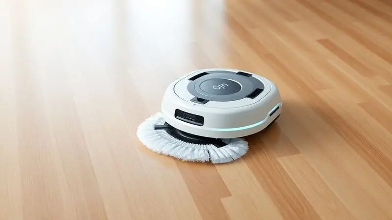
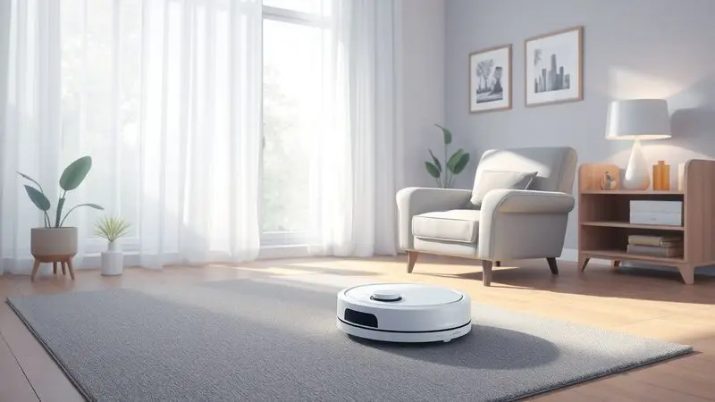
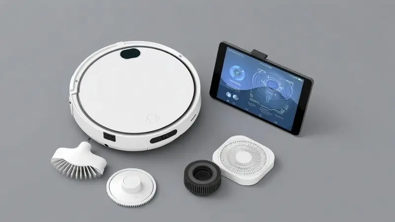

Manter a casa limpa diariamente pode ser uma tarefa exaustiva, e os robôs aspiradores surgiram como a solução definitiva para a praticidade doméstica. Entre as marcas mais populares no Brasil, a Mondial se destaca por oferecer modelos acessíveis e funcionais.

No entanto, surge a dúvida comum: o robô aspirador Mondial é bom de verdade ou o barato sai caro?

Neste artigo, analisamos profundamente os principais modelos da linha, como o RB-07, RB-03 e o RB-08, detalhando suas fichas técnicas, desempenho de bateria e recursos de limpeza para que você decida se vale a pena o investimento.

<SummaryList products={frontmatter.top_products} />

## A presença da Mondial no mercado de robôs aspiradores

Imaginar um robô aspirador costumava ser sinônimo de tecnologia inacessível e preços altíssimos. A Mondial chegou para mudar essa percepção, trazendo uma filosofia democrática ao segmento: automação doméstica para todos.

Não se trata apenas de colocar um motor e rodas numa caixa, mas de entender que praticidade não deveria ser privilégio.

No Brasil, onde o dia a dia já é corrido o suficiente, ter um aliado que cuida da limpeza enquanto você se dedica ao que realmente importa se tornou uma necessidade, não um luxo.

É nesse espaço que a marca se posiciona, oferecendo funcionalidades que resolvem problemas reais sem exigir conhecimentos técnicos ou orçamentos exorbitantes.

## Análise do Robô Aspirador Mondial RB-07 (Fast Clean Plus)

<ProductBox 
  title={frontmatter.top_products[0].title} 
  image={frontmatter.top_products[0].image} 
  link={frontmatter.top_products[0].link} 
/>

Essa filosofia se materializa claramente no RB-07, o Fast Clean Plus. Pense nele como seu primeiro assistente de limpeza: ele não promete milagres tecnológicos, mas cumpre exatamente o que um iniciante precisa.

Varre, aspira e passa pano numa operação única que transforma aquela meia hora diária de faxina em tempo livre.

A verdadeira magia está em como ele lida com os pequenos incômodos do cotidiano: pelos de animais que se acumulam em cantos, poeira que surge do nada, migalhas que escapam da cozinha.

Com cerca de 90 minutos de autonomia, ele cobre áreas consideráveis sem precisar da sua intervenção. A única ressalva fica por conta da recarga manual (4 a 6 horas) e da ausência de base automática, o que significa que você precisará lembrar de conectá-lo.

Mas para quem está dando os primeiros passos na automação doméstica, essa pequena tarefa parece insignificante perto da liberdade ganha.

Seu design ultrafino é um trunfo silencioso: ele desliza sob sofás, camas e armários, alcançando aqueles espaços que você normalmente ignora por serem difíceis de limpar.

<CaixaProsContras>

**Prós:**

- Prático e facilita a limpeza diária

- Boa eficiência em pisos frios e com pelos de animais

- Design compacto que atinge lugares difíceis

- Ótima opção custo-benefício para iniciantes

**Contras:**

- Autonomia limitada e recarga manual

- Capacidade do reservatório pequena

</CaixaProsContras>

### Ficha técnica do robô aspirador Mondial RB-07 30W

Os 30W de potência do motor explicam por que ele consegue capturar tanto pelos quanto poeira com eficiência. Não é a sucção mais poderosa do mercado, mas é inteligentemente dimensionada para o propósito: manutenção diária, não reformas.

Os sensores antiqueda funcionam como um sistema de proteção discreto, garantindo que ele não encare escadas como oportunidades de aventura.

A bateria recarregável oferece exatamente a autonomia prometida, enquanto o reservatório de 140ml, embora compacto, é fácil de esvaziar e limpar, tornando a manutenção parte da rotina sem complicações.

### Design e construção do modelo

Quando um robô aspirador vive na sua casa, ele precisa ser mais que uma ferramenta, precisa ser um bom companheiro de espaço.

O design arredondado do RB-07 não é apenas estético, é funcional: ele rola suavemente de um cômodo ao outro, contornando móveis sem deixar marcas ou se prender.

A construção em plástico resistente transmite durabilidade sem peso excessivo, e as rodas são projetadas para transições perfeitas entre piso frio e tapetes baixos. Você não percebe que ele está trabalhando até ver os resultados.

### Funcionamento: varrer, aspirar e passar pano

A tríade varrer-aspirar-passar pano funciona como um ciclo contínuo de limpeza. Primeiro, as escovas laterais varrem a sujeira para o centro. Depois, a sucção a captura no reservatório.

Por fim, se você acoplar o pano úmido, ele realiza um polimento final que remove marcas e impressões digitais.

A navegação, embora não seja de mapeamento inteligente, é eficiente: ele percorre o ambiente em padrões que garantem cobertura ampla, evitando obstáculos maiores.

O sistema de filtragem ajuda especialmente quem sofre com alergias, retendo partículas que normalmente ficariam suspensas no ar.

### Cobertura e autonomia da bateria

Os 90 minutos de bateria convertem-se em aproximadamente 70m² de cobertura contínua, dependendo do tipo de piso e quantidade de obstáculos. É suficiente para um apartamento de dois quartos ou uma casa pequena em uma única sessão.

A ausência de recarga automática significa que, após cumprir sua jornada, ele simplesmente para e aguarda sua intervenção. Para alguns, essa pausa estratégica é conveniente, permitindo esvaziar o reservatório antes do próximo ciclo.

Para outros que buscam automação total, representa um ponto de atenção.

## Robô Aspirador Mondial RB-03 (Fast Clean)

<ProductBox 
  title={frontmatter.top_products[1].title} 
  image={frontmatter.top_products[1].image} 
  link={frontmatter.top_products[1].link} 
/>

Se o RB-07 é o assistente básico, o RB-03 é a versão com controle remoto. E essa pequena diferença muda completamente a experiência. Imagine poder direcionar o robô para aquele canto específico onde as crianças deixaram migalhas sem precisar se levantar do sofá.

Essa função de teleguiar transforma o dispositivo de autônomo para semi-dirigido, dando a você o controle quando mais precisa.

A função 3-em-1 permanece, com o bônus do filtro HEPA que aprimora significativamente a qualidade do ar, capturando partículas microscópicas que aspiradores comuns deixam passar.

O design super slim é ainda mais pronunciado, permitindo acesso a espaços que parecem impossíveis.

A navegação aleatória, por outro lado, exige um ajuste de expectativas: ele não segue rotas predefinidas, mas cobre o terreno através de movimentos randômicos que, estatisticamente, alcançam toda a área.

<CaixaProsContras>

**Prós:**

- Função 3 em 1: varre, aspira e passa pano.

- Design slim que alcança espaços apertados.

- Controle remoto para maior praticidade.

- Filtro HEPA que melhora a qualidade do ar.

**Contras:**

- Locomoção aleatória pode causar colisões.

- Não possui reservatório de água dedicado para passar pano.

</CaixaProsContras>

### Destaques e diferenciais do RB-03

O controle remoto não é apenas um acessório, é a materialização da conveniência. Com ele, você seleciona entre modos programado, spot (limpeza concentrada) ou manual direcional.

Os sensores de obstáculos são sensíveis o suficiente para evitar danos a móveis, mas não tão conservadores que impeçam uma limpeza próxima às paredes.

A bateria mantém a mesma filosofia de autonomia prática, enquanto o funcionamento relativamente silencioso permite que ele trabalhe mesmo durante reuniões online ou momentos de descanso sem se tornar uma distração.

## Robô Aspirador Mondial RB-08

<ProductBox 
  title={frontmatter.top_products[2].title} 
  image={frontmatter.top_products[2].image} 
  link={frontmatter.top_products[2].link} 
/>

O RB-08, ou Fast Clean Easy, representa o equilíbrio entre funcionalidade e sofisticação acessível.

Com seus múltiplos modos de limpeza, ele se adapta às necessidades do dia: modo aleatório para manutenção geral, contorno de paredes para aquela limpeza perimetral perfeita, e função mop integrada que humidifica o pano durante a operação.

Os 30W de potência se mostram especialmente eficientes em carpetes baixos, onde a sucção precisa vencer a resistência dos fios. Os sensores antiqueda e anticolisão trabalham em conjunto para criar uma navegação mais fluida que a dos modelos anteriores.

A autonomia permanece em torno de 90 minutos, mas o que realmente impressiona é como esses minutos são utilizados de forma inteligente pelos diferentes modos programados.

<CaixaProsContras>

**Prós:**

- Vários modos de limpeza programada

- Função mop integrada

- Design slim que alcança locais difíceis

- Operação relativamente silenciosa

**Contras:**

- Relatos sobre a durabilidade do aparelho

- Tempo de recarga de até 6 horas

</CaixaProsContras>

### Especificações técnicas e desempenho do RB-08

A potência de sucção se traduz em performance visível: você consegue ver a diferença em pisos escuros, onde a poeira costuma se destacar. Os sensores não apenas evitam acidentes, mas aprendem com o ambiente, criando rotas mais eficientes com o tempo.

A bateria oferece consistência de desempenho do primeiro ao último minuto de operação, sem aquela perda gradual de potência que alguns modelos mais baratos apresentam.

O reservatório, com capacidade adequada para sessões completas, possui um sistema de encaixe que facilita a remoção sem espalhar sujeira.

## Experiência de uso: Nível de ruído e consumo de energia

O ruído dos modelos Mondial equivale aproximadamente a uma conversa em tom normal (55-65 dB), suficiente para notar que algo está trabalhando, mas não para atrapalhar uma ligação telefônica ou o sono de um bebê. É o som da produtividade discreta.

Quanto ao consumo, estamos falando de aproximadamente 30W durante operação, o que se traduz em menos de R$ 5,00 mensais mesmo com uso diário.

A economia vai além da conta de luz: é o tempo que você recupera, a energia mental que não gasta pensando em limpeza, a rotina que se simplifica.

## Recursos, acessórios e conectividade da linha Mondial

Além dos modelos individuais, o que realmente integra esses robôs à sua rotina são os recursos inteligentes. Os sensores não são apenas detectores de obstáculos, são mapeadores de ambiente que aprendem com cada sessão.

Os filtros HEPA substituíveis transformam o aspirador em um purificador de ar móvel. Os acessórios incluídos - escovas extras, panos de microfibra - garantem que a manutenção seja simples e barata.

A conectividade, quando presente, permite programar horários específicos via aplicativo, criando verdadeiros rituais de limpeza automática que acontecem enquanto você está fora.

## Principais concorrentes no mercado de entrada

No universo dos robôs aspiradores acessíveis, a Mondial encontra rivais interessantes. A Multilaser compete no mesmo território de custo-benefício básico. A Philco traz designs ainda mais compactos para espaços minimalistas.

A Xiaomi, num patamar ligeiramente superior, oferece conectividade avançada e aplicativos sofisticados.

A escolha entre eles se resume a uma questão: você prioriza o preço mais baixo possível (Multilaser), o design ultracompacto (Philco), a tecnologia conectada (Xiaomi) ou o equilíbrio inteligente entre funcionalidade e acessibilidade que a Mondial propõe?

## Opiniões dos usuários: O que diz quem já comprou?

Quem já levou um Mondial para casa costuma destacar um alívio surpreendente. 'Não imaginei que algo tão simples me daria tanto tempo livre', é um comentário comum. A eficiência em pisos diversos é amplamente confirmada, especialmente para manutenção diária.

As críticas geralmente giram em torno das limitações esperadas: navegação não inteligente, necessidade de intervenção para recarga, capacidade de reservatório modesta. Mas o consenso é claro: para o preço pago, a entrega de valor é significativa.

É aquela compra que não promete revolucionar sua vida, apenas torná-la um pouco mais fácil todos os dias.

## Conclusão

Então, o robô aspirador Mondial vale a pena? A resposta depende do que você busca.

Se você espera um dispositivo que opere com total autonomia, navegue com inteligência artificial e se integre perfeitamente a uma casa inteligente, talvez precise olhar para opções mais caras.

Mas se o que você precisa é de um aliado contra a poeira diária, algo que tire dos seus ombros aquela obrigação chata de varrer todos os dias, a Mondial entrega exatamente isso.

Os modelos RB-07, RB-03 e RB-08 representam degraus diferentes na mesma escada: da automação básica ao controle remoto, dos modos simples aos programados. Todos compartilham a mesma filosofia: tornar a vida mais prática sem complicá-la com tecnologia excessiva.

A bateria dura o suficiente para limpar sua casa enquanto você trabalha. O design alcança onde suas costas não alcançariam. A operação silenciosa não invade seus momentos de paz.

No fim, a pergunta não é se o barato sai caro, mas se o acessível entrega valor. E pelos depoimentos de quem já adotou esses robôs, a resposta parece ser sim.

Eles não fazem milagres, mas fazem exatamente o que prometem: transformam minutos de limpeza em minutos de vida. E no Brasil corrido de hoje, isso pode ser o melhor investimento doméstico que você faz neste ano.

---

Ainda na dúvida sobre o melhor robô aspirador para sua casa? Confira nosso [ranking completo dos melhores de 2025](/melhores-robo-aspirador-2024/) e encontre a opção ideal para você.
