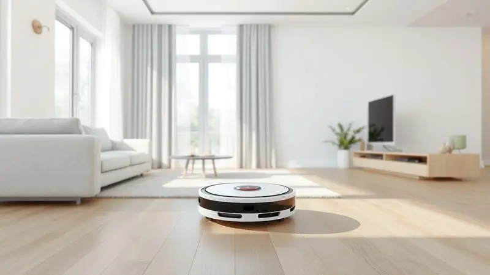
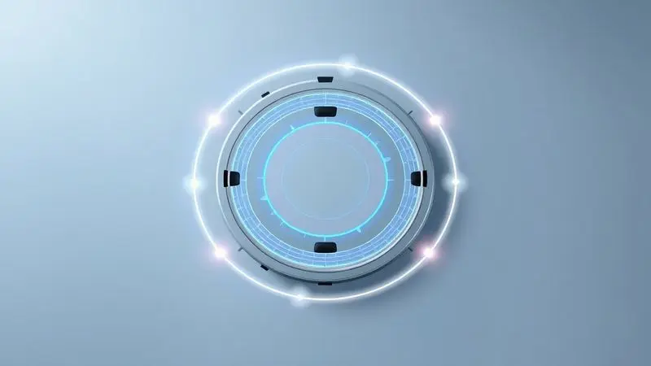
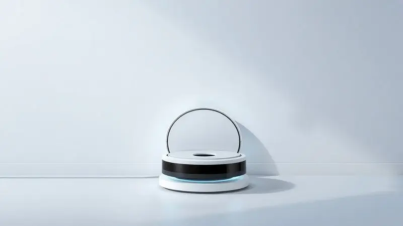
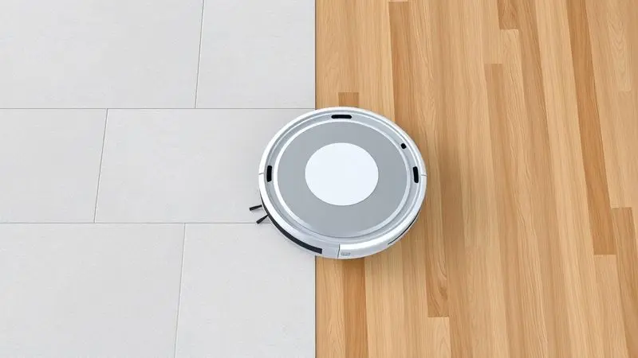

Manter a casa limpa sem esforço é o sonho de consumo de muitas pessoas, e os robôs aspiradores se tornaram os grandes aliados nessa missão.

Entre as opções de entrada que prometem bom custo-benefício, o Aspirador de Pó Robô Philco PAS08C ganha destaque nas prateleiras e lojas online. Mas será que ele realmente entrega uma limpeza eficiente em diferentes tipos de piso?

Com tantas opções no mercado, a dúvida se o Philco PAS08C é bom ou se vale mais a pena investir em um modelo superior é comum.

Nesta análise completa, vamos explorar as especificações técnicas, os modos de limpeza e o desempenho real deste aparelho para que você tome a melhor decisão de compra.

<SummaryList products={frontmatter.top_products} />

## Philco PAS08C é bom?

Imagine chegar em casa depois de um dia cansativo e encontrar o chão limpo sem que você precise ter levantado um dedo. É essa promessa que o Philco PAS08C traz para quem busca praticidade na limpeza doméstica.

Com um design compacto que se desliza facilmente sob sofás e camas, ele alcança até os cantos mais esquecidos da sua casa.

A programação permite que você agende limpezas automáticas enquanto está no trabalho, criando uma rotina onde a casa se mantém limpa sem você precisar pensar nisso.

Sua potência de sucção enfrenta bem a poeira diária e pelos de animais, embora confesse: sujeiras mais pesadas ou incrustadas ainda exigirão sua atenção manual ocasionalmente.

## Avaliação do Philco PAS08C

<ProductBox 
  title={frontmatter.top_products[0].title} 
  image={frontmatter.top_products[0].image} 
  link={frontmatter.top_products[0].link} 
/>

Quando você abre a caixa, já percebe que este não é apenas mais um acessório doméstico, mas uma ferramenta pensada para simplificar sua vida.

A capacidade de aspirar e passar pano simultaneamente é um daqueles detalhes que fazem diferença no dia a dia, especialmente em apartamentos e casas de pequeno porte.

Os modos Auto, Manual e Pontual dão flexibilidade. Precisa de uma limpeza geral? Coloque no Auto. Encontrou uma área específica suja? O modo Pontual resolve.

E o filtro HEPA é um cuidado silencioso que transforma a limpeza em um ato de cuidado com a saúde da sua família, retendo alérgenos enquanto trabalha.

Aqui, porém, chegamos ao ponto que merece sua atenção: a bateria. Com autonomia entre 60 a 90 minutos, ela atende bem ambientes menores, mas se sua casa for extensa, prepare-se para o robô fazer pausas para recarregar.

É como ter um ajudante dedicado, mas que precisa descansar com mais frequência do que você gostaria.

<CaixaProsContras>

**Prós:**

- Bom custo-benefício para limpezas rápidas

- Eficiente em pisos frios e laminados

- Operação silenciosa

- Função MOP que combina aspiração e passar pano

**Contras:**

- Autonomia da bateria pode ser insuficiente

- Navegação pode ser ineficiente em ambientes complicados

</CaixaProsContras>

### Ficha Técnica

Por trás da simplicidade aparente, o PAS08C esconde uma inteligência prática. Seu sistema de navegação reconhece o espaço, evitando batidas desnecessárias em móveis e paredes.

A potência de sucção se ajusta conforme a superfície, enquanto o compartimento de 600ml para sujeira significa que você não precisará esvaziá-lo a cada limpeza.

A função de agendamento é onde a mágica acontece: programe para segunda, quarta e sexta às 10h, e seu piso estará limpo quando você chegar do trabalho. É tecnologia servindo à sua rotina, não o contrário.

### O que vem com este robô aspirador

Na caixa, além do robô que será seu novo companheiro de limpeza, você encontra tudo para começar imediatamente: carregador, manual (que dificilmente precisará consultar), escovas laterais que alcançam os cantos que seus dedos não alcançam, e claro, o filtro HEPA.

Essa completade elimina aquela frustração de comprar um eletrônico e descobrir que precisa adquirir acessórios separadamente. Aqui, você desembala e já pode começar a transformar sua rotina.

### Capacidade do reservatório

O reservatório de 600ml pode não soar como muito, mas na prática significa limpezas completas em apartamentos de até 70m² sem precisar esvaziar. Pense na conveniência: o robô trabalha sozinho, você nem precisa lembrar que ele existe até ouvir o sinal de que está cheio.

Para famílias com animais, essa capacidade é especialmente valiosa. Os pelos que antes se acumulavam em cantos agora são coletados sistematicamente, sem que você precise ficar monitorando a cada 15 minutos.

### Outras características do robô aspirador

O design compacto não é só estética: é funcionalidade pura. Ele desliza sob aquele sofá baixo que sempre acumulava poeira, chegando onde seu aspirador tradicional nunca alcançou.

Os sensores evitam quedas de escadas, dando-lhe paz de mente para deixá-lo trabalhar sozinho.

E o filtro lavável? É economia que se soma à praticidade. Em vez de comprar refis regularmente, basta lavar, secar e reutilizar.

### Modos de limpeza

Três modos que cobrem todas as suas necessidades: Auto para quando você só quer apertar um botão e esquecer, Manual para quando precisa de controle preciso, e Pontual para aquelas manchas que aparecem após o jantar.

A versatilidade está na simplicidade: não há dezenas de configurações confusas, apenas o essencial funcionando bem.

### Bateria e recarga

Aqui está o equilíbrio do PAS08C: bateria suficiente para a maioria dos apartamentos e casas pequenas, com o bônus do retorno automático à base quando a carga está baixa.

Imagine sair para trabalhar e saber que, se o robô não terminar antes da bateria acabar, ele mesmo voltará para recarregar e continuar depois.

O tempo de recarga rápido significa que, mesmo em casas maiores, ele será eficiente, apenas com pausas estratégicas.

### Teste de ruídos

O zumbido suave é quase terapêutico: sinal de que sua casa está sendo cuidada sem perturbar sua concentração no home office ou o sono do bebê. É tão silencioso que você pode esquecer que ele está ligado, só percebendo pelo resultado visível.

## Teste de desempenho em diferentes superfícies

A verdadeira prova de um robô aspirador está em como ele se adapta à variedade de pisos que compõem uma casa real. Do frio do porcelanato ao aconchego do carpete, acompanhe como o PAS08C se sai em cada cenário.

### Teste de limpeza em porcelanato/cerâmica

Pisos frios são o habitat natural do PAS08C. Ele desliza suavemente, sem riscar o acabamento, enquanto sua sucção potente captura até a poeira mais fina que se acumula entre uma limpeza e outra.

Sensores ajustam a potência automaticamente, garantindo eficiência sem desperdício de energia.

### Teste em pisos laminados/vinílico/madeira

O respeito por superfícies delicadas é notável. Ele evita os arranhões que tanto preocupam quem investiu em pisos de madeira ou laminados, enquanto remove eficientemente a sujeira de áreas de alto tráfego como corredores e entrada da casa.

### Teste em tapetes baixo/carpete

Aqui a escova rotativa faz a diferença, desobstruindo fibras e removendo pelos incrustados. Para tapetes baixos e carpetes comuns, o desempenho é satisfatório, criando aquelas linhas perfeitas que dão sensação de limpeza profissional.

### Teste em tapete alto e outras características

Tapetes altos apresentam o limite do PAS08C. Enquanto ele tenta valentemente, a altura excessiva pode exigir que você o ajude manualmente em áreas específicas. É aquele momento em que você percebe que, embora avançado, ainda é um assistente, não um substituto completo.

## Preço e custo de manutenção

O investimento se paga na economia de tempo, não apenas de dinheiro. Sim, existem modelos mais baratos, mas quantos deles oferecem a combinação de aspiração e pano? O custo de manutenção é baixo: filtros laváveis e escovas de reposição acessíveis.

A longo prazo, a economia de energia frente a um aspirador tradicional é perceptível na conta de luz, enquanto o tempo recuperado para sua família ou hobbies... esse é incalculável.

## Destaques do modelo

Compacto sem ser frágil, silencioso sem ser ineficiente, inteligente sem ser complicado. O PAS08C acerta no equilíbrio entre features úteis e simplicidade de uso.

Sua navegação evita os obstáculos que antes faziam você correr para resgatá-lo, enquanto a operação silenciosa permite que ele trabalhe até enquanto você assiste TV.

## Modelos similares para comparar

Se está considerando alternativas, o Roborock S5 oferece navegação mais avançada por um preço maior. O iRobot Roomba 671 traz o prestígio da marca pioneira, com app de controle. Já o Ecovacs Deebot Ozmo 930 tem função mop mais elaborada, mas também custa mais.

O PAS08C ocupa um nicho claro: quem não precisa do último grito em tecnologia, mas sim de um assistente confiável que faça bem o básico, dia após dia.

## Conclusão

O Philco PAS08C não promete revolucionar sua vida, mas sim simplificar uma das tarefas mais repetitivas do seu dia.

É para quem cansa de passar o pano toda semana, para quem tem animais e está sempre combatendo pelos, para quem valoriza chegar em casa e encontrar o chão limpo sem ter feito esforço.

Suas limitações são honestas: bateria que pode exigir pausas em casas grandes, dificuldade com tapetes muito altos, navegação que às vezes se perde em ambientes muito complexos. Mas dentro do que promete, entrega consistentemente.

É como aquele funcionário dedicado que pode não ser o mais brilhante, mas aparece todo dia e faz bem seu trabalho.

Se você busca entrada no mundo da automação doméstica sem investir fortunas, quer praticidade real sem complicações desnecessárias, e está disposto a aceitar algumas limitações em troca de muito tempo recuperado, o PAS08C merece sua consideração.

Ele não substitui completamente a limpeza manual, mas transforma a manutenção diária de algo trabalhoso em algo que simplesmente acontece, enquanto você vive sua vida.

---

Ainda na dúvida? Confira nosso ranking completo dos [Melhores robô-aspirador custo-benefício em 2025](/robo-aspirador-qual-o-melhor/) e encontre a opção ideal para sua casa.
