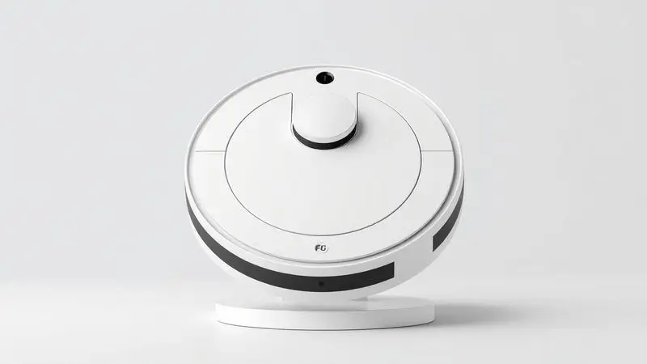
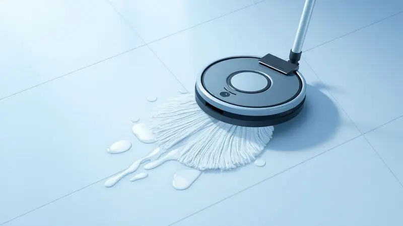
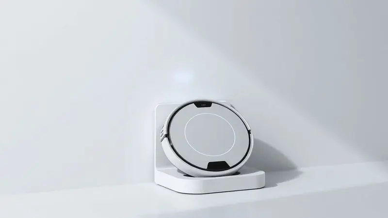

Imagine chegar em casa após um dia corrido e encontrar os pisos brilhando, sem precisar ter passado a vassoura. É essa promessa de praticidade que o Aspirador Robô Philco PAS09C traz.

Ele aspira e passa pano ao mesmo tempo, mas será que essa combinação funciona na vida real?

Nesta análise, vamos além do manual: testamos sua eficiência contra pelos de pets, avaliamos se a bateria dura mesmo o suficiente e reunimos o que os compradores realmente pensam.

Prepare-se para descobrir se este assistente automatizado vai simplificar sua rotina ou se é apenas mais um gadget na prateleira.

<SummaryList products={frontmatter.top_products} />

## Análise Detalhada do Philco PAS09C MOP

<ProductBox 
  title={frontmatter.top_products[0].title} 
  image={frontmatter.top_products[0].image} 
  link={frontmatter.top_products[0].link} 
/>

Aqui está o que esse robô realmente faz por você: ele une três tarefas em uma única passada. Enquanto varre, aspira também a poeira mais fina e, se você acoplar o pano úmido, dá aquele brilho final no piso.

Os sensores são seu maior aliado em ambientes movimentados, desviando de móveis e evitando quedas de degraus, ideal para quem tem crianças ou pets correndo por aí.

Com até 150 minutos de trabalho, ele cobre áreas generosas antes de, sozinho, retornar à base para recarregar.

No entanto, essa autonomia tem um porém. Sem um mapeamento inteligente que memorize o layout da sua casa, o trajeto pode ser um pouco errático, e o retorno à base nem sempre é eficiente.

Outro ponto de atenção é a função mop: alguns usuários relatam que o pano fica mais úmido que o desejado, então é bom testar primeiro em um cantinho. Em resumo, é um parceiro válido para a faxina diária, mas espere ajudas manuais para os cantos mais difíceis.

<CaixaProsContras>

**Prós:**

- Multifuncional: aspira e passa pano simultaneamente.

- Sensores inteligentes para evitar obstáculos.

- Boa autonomia de até 150 minutos.

- Ideal para quem possui animais de estimação.

**Contras:**

- Falta de mapeamento inteligente do espaço.

- A função mop pode deixar o pano excessivamente molhado.

</CaixaProsContras>

## Ficha Técnica e Especificações Completas

Vamos aos números que importam. O PAS09C opera com navegação por sensores (não por mapeamento a laser), possui um filtro HEPA para reter alérgenos e permite que você programe a limpeza via aplicativo.

A potência é ajustável, então você pode aumentar a sucção para o carpete e diminuir para o piso liso, economizando bateria. Essas especificações se traduzem em praticidade, mas como elas se comportam na sua sala de estar? É o que veremos a seguir.

### Design, Dimensões e Peso do Aparelho

Com menos de 10 cm de altura, ele desliza facilmente debaixo da sua cama ou do sofá, alcançando aquela poeira que a vassorra normal não toca.

As bordas arredondadas evitam que ele fique preso nos pés dos móveis, e o peso leve significa que você pode levá-lo de um cômodo a outro sem esforço.

O acabamento em plástico resistente aguenta pequenos encontros com rodapés, mantendo uma aparência discreta que não chama atenção no ambiente.

### Recursos Adicionais e Acessórios inclusos

Na caixa, você encontra tudo o que precisa para começar. O filtro HEPA é um diferencial silencioso: ele captura partículas microscópicas de poeira e pólen, beneficiando especialmente quem sofre com alergias.

O controle remoto facilita a ativação rápida sem precisar do celular, e as escovas laterais são as responsáveis por alcançar a sujeira grudada nos cantos das paredes. São detalhes que, juntos, transformam a limpeza de uma obrigação em uma tarefa automatizada.

## Desempenho e Funcionalidades na Limpeza

De nada adiantam especificações técnicas se o robô não conseguir lidar com os desafios reais da sua casa. Aqui analisamos como ele se sai contra migalhas no chão da cozinha, pelos de cachorro no tapete e aquela poeira fina que insiste em se acumular.

### Capacidade de Sucção e Eficiência de Limpeza

A sucção é suficiente para a maioria das situações cotidianas. Migalhas, terra solta e pelos de animais desaparecem do piso liso com facilidade.

Em tapetes de pile baixa, o desempenho ainda é bom, mas em carpetes mais fofos ou profundos, você pode notar que alguns fiapos ficam para trás.

É aqui que os sensores mostram seu valor: enquanto limpa, o robô manobra com cuidado ao redor de objetos, protegendo seus móveis e a si mesmo. O filtro HEPA complementa o trabalho, garantindo que o que foi aspirado não volte a circular no ar.

### Função MOP: Como funciona o reservatório de água?

Esta é a função que promete substituir o balde e o pano. Um tanque removível na parte traseira do robô é preenchido com água.

Conforme ele se move, um sistema de microfibras embebidas distribui a umidade de forma contínua, arrastando a sujeira superficial e dando um brilho leve ao piso. O resultado é eficaz para manutenção diária, removendo marcas de sapato e respingos de cozinha.

Para uma limpeza pesada ou gordura, entretanto, você ainda precisará da tradicional esfregada.

### Bateria, Autonomia e Tempo de Carregamento

A promessa é de até 150 minutos, mas na prática, com a função mop ativada e em superfícies que exigem mais potência, a autonomia real fica em torno de 90 minutos. Isso é suficiente para limpar um apartamento de tamanho médio em uma única sessão.

A recarga completa leva cerca de 5 horas, então o ideal é programá-lo para trabalhar enquanto você está fora ou dormindo.

A função de auto-recarga funciona: quando a bateria está fraca, ele tenta encontrar o caminho de volta à base, embora a falta de mapeamento possa fazer essa jornada ser um pouco mais longa algumas vezes.

## O que os usuários dizem? Resumo das avaliações online

Reunimos centenas de opiniões de quem já levou o PAS09C para casa. O consenso? Ele cumpre bem seu papel como assistente de limpeza leve e diária, mas tem limites claros que você precisa conhecer antes de comprar.

### Principais Elogios e Reclamações Comuns dos Consumidores

A facilidade de uso é o ponto mais comemorado. Muitos destacam como programar uma limpeza semanal via app trouxe uma sensação de "casa sempre arrumada" sem esforço. A capacidade de lidar com pelos de animais também recebe elogios frequentes.

Do lado das reclamações, o compartimento de pó poderia ser maior para quem tem áreas extensas, exigindo esvaziamento mais frequente.

Outra observação comum é sobre a navegação: em ambientes com muitos móveis ou obstáculos, ele às vezes fica preso ou repete áreas, deixando outras de lado.

## A marca Philco é confiável no mercado de aspiradores?

Com décadas de presença no Brasil, a Philco construiu uma reputação sólida em eletrodomésticos acessíveis.

No segmento de aspiradores, isso se traduz em produtos que entregam o básico bem feito, com uma rede de assistência técnica nacional que dá suporte em caso de problemas.

O PAS09C segue essa filosofia: não é o robô mais tecnológico do mercado, mas oferece confiabilidade e um custo de manutenção previsível. Para quem prioriza durabilidade e suporte local em vez de recursos de última geração, a marca é uma escolha segura.

## Preço e Custo-Benefício: O Philco PAS09C vale o investimento?

Quando você coloca na balança, o PAS09C se posiciona como uma opção de entrada inteligente no mundo da automação doméstica. Por um investimento acessível, você ganha um aliado que assume a parte mais monótona da limpeza: a manutenção diária dos pisos.

Ele não substitui uma faxina profunda mensal, mas reduz drasticamente a frequência com que você precisa pegar no aspirador tradicional.

A combinação de durabilidade da marca, filtro HEPA e a função mop básica cria um pacote coerente para quem busca praticidade sem complicações.

## Conclusão

O Aspirador Robô Philco PAS09C é como aquele colega de trabalho confiável: não vai surpreender com feitos extraordinários, mas cumpre sua parte com consistência.

Ele transforma a tarefa diária de varrer e passar pano em um processo automático, dando a você minutos preciosos de volta no seu dia.

A ausência de mapeamento inteligente e algumas limitações na navegação são compensadas pelo preço acessível e pela simplicidade de operação.

Se você busca um primeiro robô para lidar com a poeira e pelos no dia a dia, e está disposto a fazer um ajuste manual nos cantos mais difíceis de vez em quando, este modelo pode ser um excelente ponto de partida. Ele não promete magia, mas entrega praticidade real.

A pergunta final não é se ele limpa tudo perfeitamente, mas se a liberdade de ter seus pisos sempre apresentáveis, com quase zero esforço, vale o investimento para o seu estilo de vida. Para muitos lares, a resposta será um convincente "sim".

---

Ainda na dúvida sobre o Philco PAS09C? Confira nosso ranking dos melhores [robôs aspiradores 3 em 1](/robo-aspirador-3-em-1-qual-o-melhor/) para encontrar o ideal para sua casa.
