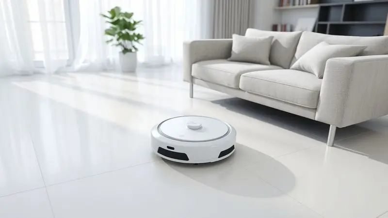
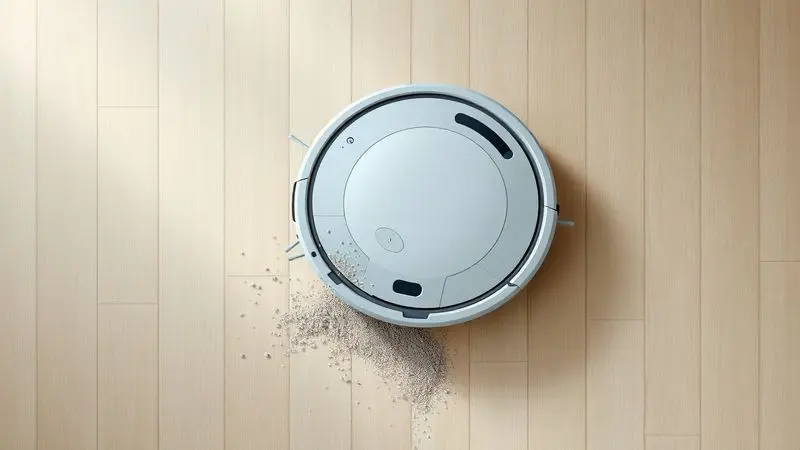
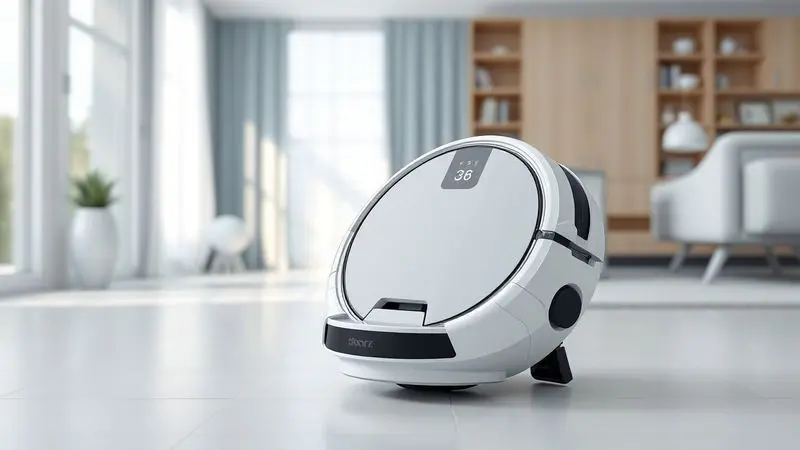

Manter a casa limpa exige tempo e esforço, por isso os aspiradores robô ganharam tanto espaço nos lares brasileiros.

Entre as opções de entrada com funções avançadas, o Aspirador Robô Philco PAS22P MOP Filtro Hepa Bivolt se destaca por prometer varrer, aspirar e passar pano em uma única passada.

Mas será que ele é realmente eficiente em diferentes tipos de piso e situações do dia a dia?

Nesta análise, exploramos a potência de sucção, a autonomia da bateria e a eficácia do filtro HEPA para responder se este modelo da Philco é bom e se realmente vale o investimento para a sua rotina.

<SummaryList products={frontmatter.top_products} />

## Características do Aspirador Robô Philco PAS22P

<ProductBox 
  title={frontmatter.top_products[0].title} 
  image={frontmatter.top_products[0].image} 
  link={frontmatter.top_products[0].link} 
/>

Imagine chegar em casa após um dia corrido e encontrar os pisos limpos sem ter levantado um dedo. Essa é a promessa do Aspirador Robô Philco PAS22P, uma solução prática que combina aspiração com pano seco para diferentes superfícies.

O grande trunfo aqui é o filtro HEPA, que captura 99,9% das impurezas do ar, transformando a limpeza em um aliado para quem sofre com alergias.

Com sensores que previnem quedas e detectam obstáculos, ele navega pela casa com segurança, evitando acidentes com escadas ou móveis.

Você pode escolher entre vários modos de limpeza, aproveitando até 100 minutos de autonomia com cerca de 2 horas para recarregar completamente.

Apesar do nível de ruído de 67 dBa (um pouco alto para alguns), ele ainda é considerado mais silencioso que muitos aspiradores tradicionais.

Mas como essas especificações se traduzem no dia a dia? Vamos aos testes.

<CaixaProsContras>

**Prós:**

- Filtro HEPA que melhora a qualidade do ar

- Sensores que previnem quedas e colisões

- Vários modos de limpeza disponíveis

- Design compacto e prático

**Contras:**

- Nível de ruído pode ser alto para alguns

- Tempo de carga inicial mais prolongado

</CaixaProsContras>

## Teste e Experiência Real

Colocamos o Philco PAS22P para trabalhar em um apartamento médio com pisos de cerâmica, madeira e áreas com carpete. A primeira surpresa? A navegação é realmente inteligente: ele contorna móveis com precisão e evita quedas sem precisar de barreiras físicas.

Nos pisos duros, a combinação de aspiração com o pano seco deixa uma sensação visível de limpeza completa, como se alguém tivesse varrido e passado pano manualmente.

Nos carpetes, o desempenho é satisfatório para a manutenção diária, removendo poeira e pelos de animais. A operação é suficientemente silenciosa para rodar enquanto você trabalha ou assiste TV sem grandes distrações.

A única ressalva fica para cantos muito apertados ou áreas com muitos fios soltos, onde qualquer robô precisaria de uma ajudinha extra.

## Resultados de Desempenho em Testes Reais

Após duas semanas de uso diário, o Philco PAS22P mostrou consistência na limpeza de rotina. Em ambientes de alta circulação como salas e corredores, ele elimina sujeiras superficiais e poeira com eficiência.

O modo mop funciona bem para remover manchas leves e marcas de pegadas em pisos lisos, dando aquela sensação de "piso recém-lavado".

Para sujeiras mais pesadas ou incrustadas, ele pode precisar de passadas extras ou intervenção manual. Mas para a manutenção diária que impede o acúmulo de sujeira, o desempenho é mais que suficiente.

Usuários relatam satisfação justamente por essa capacidade de manter a casa sempre apresentável sem esforço.

## Diferenciais Frente à Concorrência

O que faz o PAS22P se destacar em um mercado cheio de opções? Três pilares principais: primeiro, o sistema de filtragem HEPA que transforma a limpeza em um benefício para a saúde, especialmente para famílias com alérgicos.

Segundo, a função mop que vai além da simples aspiração, entregando uma limpeza mais completa. Terceiro, a versatilidade que permite transitar entre cerâmica, madeira e carpetes sem necessidade de ajustes manuais.

Essa combinação de saúde, completude e praticidade cria um valor difícil de encontrar em modelos de entrada. Enquanto muitos concorrentes focam apenas na aspiração, o Philco entende que limpeza de verdade vai além de apenas recolher poeira.

## Comparação entre Modelos Semelhantes

Para entender melhor onde o PAS22P se posiciona, vamos compará-lo com três concorrentes diretos. O Roborock E4 oferece navegação ligeiramente mais avançada e bateria de longa duração, mas geralmente custa mais.

O iRobot Roomba 681 brilha no suporte ao cliente e integração com assistentes como Alexa, porém não traz a função mop. Já o Xiaomi Mi Robot possui app mais robusto e poder de sucção elevado, mas seu filtro padrão não iguala a eficiência HEPA do Philco.

Cada modelo tem seu foco: o Roborock na tecnologia de navegação, o Roomba no ecossistema smart, e o Xiaomi no poder bruto. O Philco PAS22P encontra seu nicho justamente no equilíbrio entre filtragem avançada, função mop e preço acessível.

## Quem Deve Comprar Este Produto?

Este aspirador robô é ideal para você se: tem uma rotina agitada e pouco tempo para limpeza, mora em apartamento ou casa de tamanho pequeno a médio, convive com alérgicos ou animais de estimação, e valoriza a praticidade de uma limpeza completa (aspiração + pano) em um único aparelho.

Talvez ele não seja a melhor escolha se: sua casa é muito grande (acima de 100m² por andar), tem muitos ambientes com degraus ou desníveis, ou se você busca recursos premium como mapeamento a laser ou app com programação complexa.

Para essas necessidades, modelos mais avançados (e caros) seriam mais adequados.

## Dicas de Uso para Melhor Aproveitamento

Para extrair o máximo do seu Philco PAS22P, programe as limpezas para quando você estiver fora ou em horários mais tranquilos. Antes de cada ciclo, faça uma rápida "pré-limpeza" retirando objetos pequenos e enrolando fios soltos.

Mantenha os sensores limpos com um pano seco para garantir navegação precisa.

Use a função mop apenas em pisos duros (cerâmica, porcelanato, madeira) e evite em carpetes. Para áreas problemáticas com sujeira concentrada, use o modo spot cleaning ou direcione o robô manualmente para aquela região específica.

Esses pequenos ajustes fazem uma grande diferença no resultado final.

## Garantia e Pós-venda

A Philco oferece garantia contra defeitos de fabricação, com duração que varia conforme a política vigente no momento da compra. O serviço de assistência técnica pode ser acessado pelo site oficial ou central de atendimento.

A experiência geral de pós-venda é considerada satisfatória, com bom tempo de resposta para dúvidas e suporte.

Essa rede de segurança é importante porque, mesmo em produtos confiáveis, saber que há suporte disponível traz tranquilidade para o investimento. Verifique sempre os termos específicos da garantia no momento da aquisição.

## Conclusão

O Aspirador Robô Philco PAS22P entrega exatamente o que promete: praticidade na limpeza diária com um diferencial importante para a saúde familiar.

O filtro HEPA transforma uma tarefa doméstica em um benefício real para alérgicos, enquanto a função mop completa a limpeza de forma mais satisfatória que a simples aspiração.

Sim, ele tem limitações: não é o mais silencioso, pode precisar de ajuda em ambientes muito complexos, e não possui recursos avançados de mapeamento.

Mas pelo preço e pelo que oferece, representa uma excelente relação custo-benefício para quem busca automatizar a limpeza sem complicações.

Se você cansou de gastar tempo com vassoura e pano, e quer uma solução eficiente para a manutenção diária da casa, o PAS22P é um aliado que vale a pena considerar.

Ele não substitui uma limpeza pesada eventual, mas torna o dia a dia muito mais leve e sua casa, consistentemente mais limpa.

## Perguntas Frequentes (FAQ)

É fácil de usar?
Sim, o funcionamento é intuitivo. Basta carregar, ligar e ele começa a trabalhar. Não é necessário app para operações básicas, mas você pode programar horários se desejar.

Serve para quem tem alergia?
Perfeitamente. O filtro HEPA captura 99,9% das partículas alergênicas como ácaros, pólen e pelos de animais, melhorando significativamente a qualidade do ar.

Quanto tempo dura a bateria?
Entre 90 e 120 minutos, dependendo do modo de limpeza escolhido. Suficiente para limpar um apartamento médio completo em uma única carga.

Como faço a manutenção?
Simples: limpe o filtro HEPA a cada 2-3 semanas (basta bater para remover o pó) e as escovas principais conforme necessário. A caixa de poeira é fácil de esvaziar.

Funciona em todos os pisos?
Sim, em cerâmica, porcelanato, madeira, laminado e carpetes de até 1,5cm. A função mop deve ser usada apenas em pisos duros.

---

Ainda na dúvida sobre o ideal para sua casa? Confira nosso ranking atualizado dos [Robô Aspirador e Passa Pano: os 14 melhores em 2025](/melhor-robo-aspirador-e-passa-pano-2023/) e encontre a opção perfeita!
