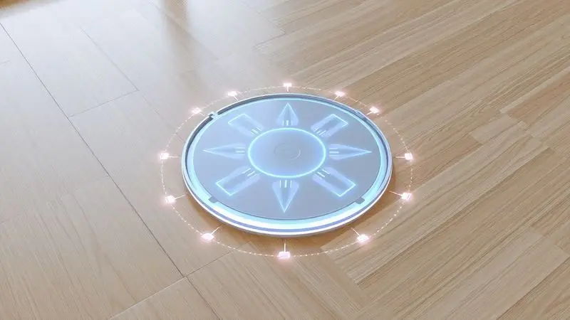
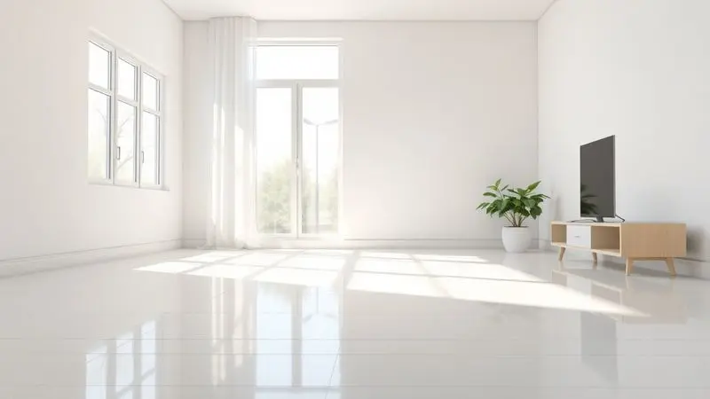
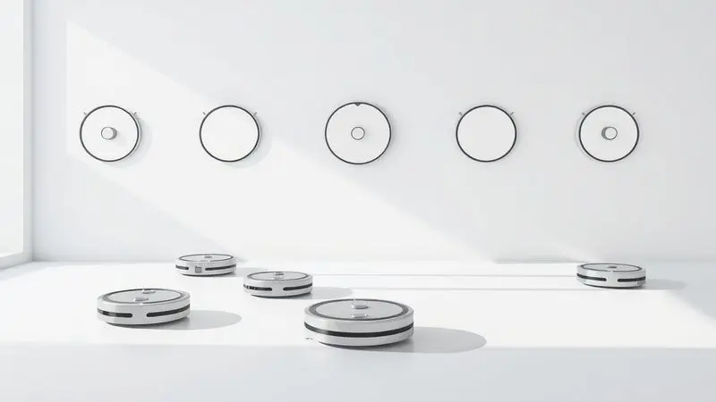

Imagine sair de casa pela manhã e voltar à noite para encontrar todos os cômodos limpos, sem ter movido um dedo. Esse é o desejo que o Philco PAS26P promete realizar, oferecendo automação residencial a um preço acessível.

Mas será que ele realmente cumpre essa promessa no cotidiano? Durante meses, testamos cada detalhe deste robô aspirador - desde a primeira instalação até sua capacidade de manter a casa limpa no dia a dia.

Se você está se perguntando se o PAS26P é bom e se vai se adaptar à sua rotina, acompanhe esta avaliação completa baseada em uso real.

<SummaryList products={frontmatter.top_products} />

## Por que eu decidi comprar um robô aspirador?

A resposta é simples: tempo. Com uma rotina cada vez mais corrida, dedicar horas à limpeza manual tornou-se um luxo que não podia mais pagar.

Um robô aspirador apareceu como a solução para manter os ambientes limpos sem sacrificar momentos preciosos com a família ou trabalho.

Além da conveniência, pensei na tecnologia que permite a essas máquinas navegar pela casa inteligentemente, evitando móveis e obstáculos enquanto limpam.

A possibilidade de programar limpezas em horários específicos foi o fator decisivo - perfeito para quem, como eu, tem animais de estimação que espalham pelos o dia todo.

## Instalação e primeiros usos do Philco PAS26P

<ProductBox 
  title={frontmatter.top_products[0].title} 
  image={frontmatter.top_products[0].image} 
  link={frontmatter.top_products[0].link} 
/>

A primeira impressão já revela o que torna este robô tão atrativo: simplicidade. A instalação começa com o carregamento completo da bateria (cerca de 5 horas), seguido pela montagem das escovas laterais - tudo tão intuitivo que você nem precisa do manual.

O segredo está na preparação do ambiente: retirar cabos soltos e objetos pequenos do chão faz toda diferença para o desempenho inicial.

Com o botão superior pressionado por 3 segundos, o PAS26P ganha vida. O controle remoto oferece acesso imediato aos diferentes modos, incluindo a função MOP que permite aspirar e passar pano simultaneamente.

Desde o primeiro uso, os sensores demonstram sua eficiência, evitando quedas e obstáculos com precisão. E quando a bateria fica baixa? Ele simplesmente encontra o caminho de volta à base sozinho.

Embora não conte com mapeamento inteligente avançado, para pisos frios e laminados ele se mostra uma solução prática e funcional.

<CaixaProsContras>

**Prós:**

- Instalação simples e rápida.

- Função MOP para limpeza prática.

- Sensores antiqueda que garantem segurança.

- Retorno automático à base quando a bateria está baixa.

**Contras:**

- Não possui mapeamento inteligente.

- Desempenho pode ser limitado em carpetes grossos.

</CaixaProsContras>

## Os quatro modos de limpeza oferecidos pelo PAS26P

Com o robô pronto para ação, descubra como suas quatro personalidades de limpeza se adaptam às suas necessidades. O modo automático funciona como seu assistente de confiança para a faxina geral, cobrindo a casa de forma metódica.

Quando encontra uma mancha específica ou área mais suja, o modo spot entra em cena, concentrando toda sua atenção onde você mais precisa.

Para aqueles cantos ao longo das paredes que sempre acumulam poeira, o modo borda revela sua precisão, garantindo que cada centímetro seja limpo.

Mas o verdadeiro diferencial vem com o modo programação: imagine definir horários específicos para a limpeza diária, acordando ou chegando em casa com os ambientes já organizados.

Essa versatilidade transforma o robô de um simples eletrodoméstico em um parceiro real da sua rotina.

## Critérios de comparação: o que observar antes da compra

Antes de decidir por qualquer modelo, alguns aspectos merecem sua atenção. A potência de sucção, por exemplo, determina se o robô vai apenas espalhar a poeira ou realmente removê-la - especialmente importante para quem tem pets ou muitos tapetes.

A autonomia da bateria define o tamanho da área que pode ser limpa em uma única sessão, enquanto a conectividade via aplicativo oferece aquela liberdade de controlar tudo pelo smartphone, mesmo quando você não está em casa.

Por fim, observe como o design se adapta ao seu espaço. Um robô muito grande pode não acessar embaixo dos móveis, enquanto um muito pequeno pode ter capacidade limitada.

O PAS26P encontra um equilíbrio interessante, combinando tamanho compacto com funcionalidades que atendem bem à maioria dos ambientes residenciais.

## Desempenho prático: Sensação de limpeza imediata e facilidade de uso

É na prática que o Philco PAS26P realmente brilha. Seu design compacto alcança lugares que você provavelmente negligenciaria na limpeza manual: aquele espaço embaixo da cama, o canto atrás do sofá, áreas que acumulam poeira por semanas.

Ao ser ativado, ele não apenas aspira - proporciona aquela sensação visível de limpeza imediata, como se alguém tivesse passado um pano úmido no chão.

A programação simplificada transforma a limpeza em uma tarefa que acontece no piloto automático. Configure horários específicos e esqueça que precisa lembrar de aspirar.

Os sensores anti-queda trabalham silenciosamente no fundo, oferecendo aquela paz de espírito para deixar o robô operando sozinho enquanto você cuida de outras coisas.

Essa combinação de eficiência prática e autonomia cria algo raro: um eletrodoméstico que realmente otimiza seu tempo em vez de consumi-lo.

## Autonomia da bateria e adaptação do robô nos cômodos

Com aproximadamente 90 minutos de operação contínua, a bateria do PAS26P se mostra suficiente para apartamentos e casas pequenas. Imagine uma faxina completa enquanto você trabalha em home office ou relaxa no fim de semana, sem precisar interromper para recarregar.

Para espaços maiores, essa autonomia pode exigir planejamento, mas a função de retorno automático à base garante que, quando necessário, ele recarregue e retome sozinho.

A adaptação aos diferentes cômodos é impressionante. O robô navega por desníveis sutis, contorna móveis com agilidade e encontra passagens que você nem imaginaria possíveis.

A tecnologia de sensores não apenas evita acidentes, mas otimiza o caminho, garantindo que cada metro quadrado receba atenção. É como ter um limpador profissional que conhece cada detalhe da sua casa.

## Análise técnica: Reservatório, limpeza do filtro e retorno à base

O reservatório de água integrado revela seu valor na limpeza úmida, especialmente em pisos que precisam daquele acabamento mais cuidadoso.

A manutenção do filtro segue a mesma filosofia de simplicidade: basta retirá-lo, lavar e recolocar, garantindo que a eficiência da aspiração se mantenha ao longo do tempo sem complicações.

O retorno automático à base é a cereja do bolo técnico. Você nunca precisará sair caçando o robô pela casa ou se preocupar em colocá-lo para carregar.

Ele simplesmente reconhece quando a energia está acabando e busca seu ponto de recarga, como um animal de estimação bem treinado voltando para sua casinha.

Esses detalhes técnicos, quando combinados, criam uma experiência de uso tão fluida que você quase esquece que está lidando com tecnologia complexa.

## Alternativas e modelos similares no mercado

Se o PAS26P não atende totalmente às suas expectativas, o mercado oferece caminhos diferentes. Modelos como o Xiaomi Roborock e Ecovacs Deebot trazem mapeamento inteligente e controle via aplicativo mais avançado, ideal para quem busca o máximo em automação.

Para orçamentos mais apertados, a linha Roomba apresenta opções básicas que cumprem bem seu papel essencial.

Quem convive com animais de estimação pode encontrar no Roborock E4 uma potência de sucção especializada para pelos.

A verdade é que cada modelo atende a um perfil específico: enquanto alguns focam em tecnologia de ponta, outros, como o PAS26P, priorizam o equilíbrio entre funcionalidade e acessibilidade.

Avaliar suas prioridades - seja autonomia, conectividade ou custo-benefício - é o primeiro passo para a escolha certa.

## Veredito: O Philco PAS26P realmente vale a pena?

Após meses de convivência diária, o Philco PAS26P se estabelece como um companheiro confiável na manutenção da limpeza. Sua eficiência de sucção surpreende para a categoria, e a programação de horários realmente libera você da necessidade de pensar na tarefa.

O design compacto revela-se um trunfo, alcançando espaços que normalmente ficariam negligenciados.

Algumas limitações merecem atenção: tapetes mais altos podem desafiar seu desempenho, e a capacidade do depósito de sujeira pode exigir esvaziamento frequente em ambientes muito movimentados.

Mas para apartamentos, casas pequenas ou como primeiro contato com a automação residencial, ele entrega exatamente o que promete: praticidade acessível.

## Conclusão

O Philco PAS26P representa mais do que um simples eletrodoméstico - é um facilitador de rotina que devolve horas preciosas do seu dia.

Ele transforma a limpeza de uma obrigação cansativa em um processo automático e eficiente, permitindo que você foque no que realmente importa.

A combinação de funções práticas como o modo MOP, sensores de segurança e retorno automático cria uma experiência de uso que rapidamente se torna indispensável.

Se você busca entrar no mundo da automação residencial sem comprometer o orçamento, ou se precisa de um assistente confiável para a manutenção diária de espaços moderados, o PAS26P oferece um equilíbrio difícil de encontrar no mercado.

Ele prova que tecnologia útil não precisa ser complicada ou excessivamente cara. Experimente e descubra como é viver em uma casa que se mantém limpa quase que por magia, enquanto você aproveita melhor seu tempo.

---

Ainda em dúvida sobre o Philco PAS26P? Confira nosso ranking completo e encontre o [melhor robô aspirador para comprar em 2025](/melhores-robo-aspirador-2024/).
