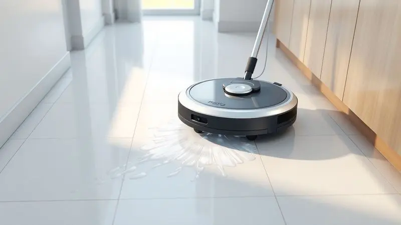
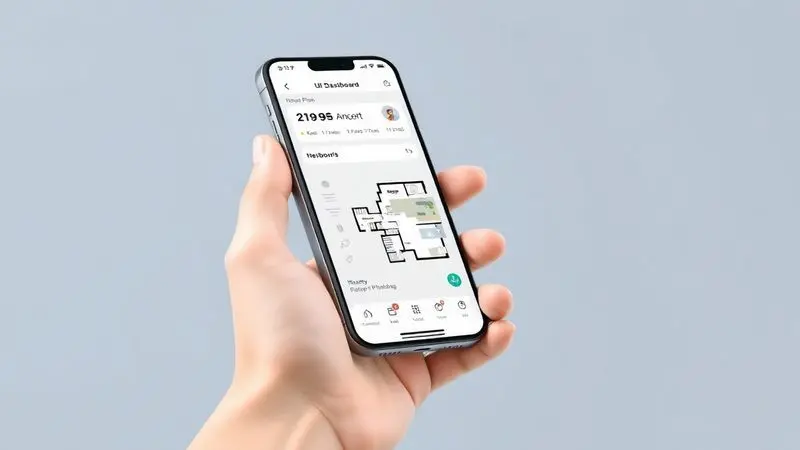
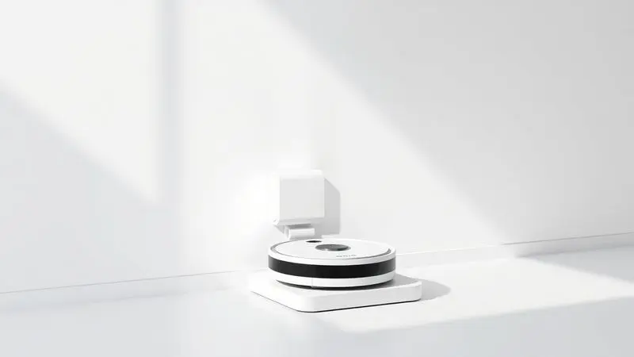

Manter a casa limpa pode ser um desafio diário, mas a tecnologia dos aspiradores robô chegou para transformar essa rotina.

O Philco PAS28P surge como uma das opções mais comentadas do mercado, prometendo não apenas aspirar, mas também passar pano com sua função MOP e oferecer controle total via aplicativo.

Mas será que o Aspirador Robô Philco PAS28P é bom mesmo ou é apenas mais um gadget barulhento?

Se você está em dúvida sobre o investimento, este review completo analisa desde a autonomia da bateria até a eficiência da filtragem HEPA, comparando-o também com outros modelos da marca para ajudar na sua escolha.

<SummaryList products={frontmatter.top_products} />

## Visão Geral do Aspirador Robô Philco PAS28P Função MOP Bivolt

<ProductBox 
  title={frontmatter.top_products[0].title} 
  image={frontmatter.top_products[0].image} 
  link={frontmatter.top_products[0].link} 
/>

Imagine acordar e encontrar sua casa limpa sem precisar mover um músculo. É exatamente essa promessa que o Philco PAS28P traz para sua rotina.

Além de aspirar com eficiência, ele oferece a função MOP, permitindo que você tenha pisos impecáveis tanto com pano seco quanto úmido.

A conexão com o aplicativo Smart Life Philco transforma seu celular em um controle remoto poderoso, enquanto a compatibilidade com Alexa e Google Assistant significa que você pode dar ordens de voz enquanto prepara o café.

Os sensores antiqueda garantem que seu investimento não vá parar escada abaixo, literalmente. Quando a bateria começa a fraquejar, o robô inteligentemente retorna à sua base sozinho.

Com até 110 minutos de trabalho contínuo, ele tem fôlego suficiente para cuidar de apartamentos médios sem interrupções. O filtro HEPA, que retém 99,5% das impurezas, é um aliado invisível para quem convive com pets ou tem alergias, mantendo o ar da sua casa mais puro.

A única ressalva? O carregamento completo leva cerca de 5 horas, então programe-se para deixá-lo na base durante a noite.

<CaixaProsContras>

**Prós:**

- Função MOP que combina aspiração e limpeza de pisos.

- Controle via aplicativo e compatibilidade com assistentes de voz.

- Sensores antiqueda garantem segurança durante o uso.

- Filtro HEPA que melhora a qualidade do ar.

**Contras:**

- Tempo de carregamento relativamente longo.

- A autonomia pode não ser suficiente para áreas muito grandes.

</CaixaProsContras>

## Benefícios da Função MOP

Você já precisou passar pano depois de aspirar? Com a função MOP do Philco PAS28P, essa etapa extra desaparece. Enquanto aspira, o robô simultaneamente limpa o chão com seu pano úmido ou seco, capturando aquela poeira fina que a sucção sozinha deixa passar.

Imagine manchas de café no piso da cozinha sendo tratadas enquanto você trabalha, ou pegadas de pets sendo apagadas antes mesmo de secarem.

Esta não é apenas uma questão de conveniência, mas de saúde. O pano úmido agarra alérgenos que flutuariam no ar, reduzindo crises em quem sofre com poeira.

Para famílias com crianças pequenas que brincam no chão, é a tranquilidade de saber que cada centímetro foi devidamente higienizado.

## Controle Intuitivo via Aplicativo

Quer programar uma faxina enquanto está no trânsito? O aplicativo Smart Life Philco transforma seu celular em um centro de comando.

Da tela do sofá, você pode agendar limpezas diárias, selecionar modos específicos para cada cômodo ou simplesmente dar início a uma sessão imediata.

A interface foi desenhada pensando em quem não é expert em tecnologia. Ícones claros, instruções simples e resposta rápida fazem com que até seus pais ou avós consigam operar sem precisar da sua ajuda.

A integração com assistentes de voz completa o pacote: diga "Alexa, limpe a sala" e veja a mágica acontecer.

## Autonomia e Retorno Automático à Base de Carregamento

90 minutos de trabalho ininterrupto significam que o Philco PAS28P pode cuidar de um apartamento de 70m² sem parar para respirar. Ele percorre cada centímetro com método, evitando áreas já limpas e concentrando-se nos pontos que mais precisam.

A cereja do bolo? O retorno automático à base. Quando a bateria chega a 15%, o robô encontra o caminho de volta sozinho, conecta-se ao carregador e aguarda sua próxima missão. Você nunca mais precisa se preocupar em procurá-lo embaixo da cama com a bateria morta.

## Filtragem Eficiente com Filtro HEPA

Respire fundo. O ar da sua casa está realmente limpo? O filtro HEPA do Philco PAS28P captura partículas microscópicas que escapariam de filtros convencionais: ácaros, esporos de mofo, pólen e até bactérias.

Para quem convive com alergias respiratórias, essa não é apenas uma função técnica, é um alívio diário.

A melhor parte? O filtro é lavável. A cada 2-3 meses, basta enxaguá-lo sob água corrente, deixar secar e reinstalar. Economia real no longo prazo e menos lixo indo para aterros.

## O que dizem os testes e usuários

Nas avaliações de quem já levou o PAS28P para casa, um padrão emerge: ele é confiável para a limpeza do dia a dia. Os usuários elogiam especialmente a facilidade do aplicativo e a navegação inteligente que evita ficar preso em fios ou tapetes.

Alguns apontam limitações: sujeiras muito grudadas ou tapetes de pelo alto podem exigir uma passada manual. Mas o consenso é claro: para manter a casa apresentável entre faxinas mais profundas, ele cumpre seu papel com louvor.

O custo-benefício é frequentemente citado como o principal motivo de satisfação.

## Comparativo de Outros Modelos Philco e Positivo

Se você está considerando outras opções dentro da mesma faixa, entender as diferenças pode poupar arrependimentos.

A Philco oferece uma linha completa com variações de preço e funcionalidades, enquanto a Positivo entra no jogo com modelos mais básicos mas ainda assim eficientes. Vamos às especificidades:

### 1. Aspirador Robô Philco PAS22P

<ProductBox 
  title={frontmatter.top_products[1].title} 
  image={frontmatter.top_products[1].image} 
  link={frontmatter.top_products[1].link} 
/>

Para quem busca o essencial sem firulas, o PAS22P é como um parceiro discreto e eficiente. Ele aspira, varre e passa pano seco com uma simplicidade que encanta.

Seu filtro HEPA de 99,9% de eficiência é ainda mais poderoso que o do PAS28P, ideal para lares com alérgicos severos.

Com 100 minutos de autonomia e apenas 2 horas de recarga, ele está sempre pronto para ação. A única concessão à simplicidade? Você precisará levá-lo até a base manualmente quando a bateria acabar.

<CaixaProsContras>

**Prós:**

- Excelente desempenho na captura de sujeira e pelos de animais.

- Filtro HEPA que melhora a qualidade do ar.

- Tem autonomia considerável com 100 minutos de uso.

- Design compacto que facilita a movimentação por áreas estreitas.

**Contras:**

- Não retorna automaticamente à base de carregamento.

- A função MOP é básica, sem reserva de água ou spray.

</CaixaProsContras>

### 2. Aspirador de pó robô Philco PAS26P Bivolt

<ProductBox 
  title={frontmatter.top_products[2].title} 
  image={frontmatter.top_products[2].image} 
  link={frontmatter.top_products[2].link} 
/>

Três funções em um só corpo: o PAS26P varre, aspira e passa pano com um reservatório dedicado para líquidos. Seus sensores são especialmente sensíveis, evitando até mesmo colisões leves com móveis delicados.

A autonomia de 110 minutos é generosa, mas o tempo de recarga de 5 horas pode testar sua paciência se você precisar de múltiplas sessões no mesmo dia. O controle remoto físico incluído é um diferencial para quem prefere não depender do celular.

<CaixaProsContras>

**Prós:**

- Função 3 em 1: varre, aspira e passa pano.

- Sensores que evitam quedas e colisões.

- Autonomia razoável de até 110 minutos.

- Contém controle remoto para modos de limpeza variados.

**Contras:**

- Potência de 35W pode não ser ideal para sujeiras mais pesadas.

- Tempo de recarga de aproximadamente 5 horas pode ser um pouco longo.

</CaixaProsContras>

### 3. Aspirador Robô Philco 3 em 1 Com MOP PAS23 Preto Bivolt

<ProductBox 
  title={frontmatter.top_products[3].title} 
  image={frontmatter.top_products[3].image} 
  link={frontmatter.top_products[3].link} 
/>

Compacto e ágil, o PAS23 é o mestre dos espaços apertados. Desliza sob sofás, camas e armários com apenas 7cm de altura, alcançando aqueles cantos que você sempre procrastina para limpar.

Seus 90 minutos de bateria são suficientes para apartamentos menores, e os sensores antiqueda funcionam tão bem quanto nos modelos mais caros.

Apenas esteja preparado para esvaziar seu reservatório de 400ml com certa frequência se sua família for grande ou se tiver pets que soltam muito pelo.

<CaixaProsContras>

**Prós:**

- Combina várias funções (varre, aspira e passa pano).

- Sensores que evitam quedas e colisões.

- Bivolt, adaptando-se a diferentes voltagens.

- Design compacto que alcança espaços estreitos.

**Contras:**

- Capacidade do reservatório pode necessitar esvaziamento frequente.

- Tempo de recarga pode ser considerado longo para alguns usuários.

</CaixaProsContras>

### 4. Robô aspirador Philco PAS09C

<ProductBox 
  title={frontmatter.top_products[4].title} 
  image={frontmatter.top_products[4].image} 
  link={frontmatter.top_products[4].link} 
/>

O veterano da linha, o PAS09C oferece a impressionante marca de 150 minutos de autonomia. Se você mora em uma casa grande ou simplesmente detesta a ideia de recarregar frequentemente, essa resistência é um trunfo valioso.

As escovas laterais são mais longas que a média, varrendo mais sujeira dos cantos antes que a sucção central a capture. O preço mais elevado reflete não apenas a bateria generosa, mas também uma construção robusta que promete anos de serviço fiel.

<CaixaProsContras>

**Prós:**

- Funções versáteis: varre, aspira e passa pano.

- Sensores antiqueda e de obstáculos para navegação segura.

- Filtragem eficiente com filtro HEPA.

- Boa autonomia de bateria.

**Contras:**

- Tempo de carga relativamente longo.

- Preço acima de outros modelos básicos.

</CaixaProsContras>

### 5. Smart Robô Aspirador Positivo PRA500

<ProductBox 
  title={frontmatter.top_products[5].title} 
  image={frontmatter.top_products[5].image} 
  link={frontmatter.top_products[5].link} 
/>

A Positivo entra na disputa com um modelo que não fica devendo em tecnologia. Sua sucção de 2000 Pa é a mais potente desta lista, capaz de lidar com migalhas mais persistentes e areia trazida da rua.

A integração com o ecossistema Positivo Casa Inteligente é seamless se você já tem outros dispositivos da marca. O filtro HEPA de 99,9% segue o padrão de excelência, mas o tempo de carregamento de 4-5 horas mantém-se como um ponto de atenção.

<CaixaProsContras>

**Prós:**

- Funções múltiplas (varre, aspira e passa pano)

- Conectividade com assistentes de voz

- Filtro HEPA para alérgicos

- Autonomia de até 100 minutos

**Contras:**

- Tempo de carregamento longo (4 a 5 horas)

- Capacidade média do reservatório

</CaixaProsContras>

## Perguntas Frequentes (FAQ)

### Quais são as principais funcionalidades do Aspirador Robô Philco PAS28P?

Pense no PAS28P como seu mordomo robótico. Ele navega sozinho pela sua casa, evitando obstáculos e quedas com inteligência. Você programa horários fixos de limpeza pelo aplicativo ou aciona na hora com um toque.

O filtro HEPA trabalha silenciosamente para capturar alérgenos, enquanto o design compacto garante que nenhum canto fique esquecido. É autossuficiente: quando termina ou precisa de energia, encontra o caminho de volta à base sozinho.

### Como o Aspirador Robô Philco PAS28P se compara a outras marcas como Xiaomi e Electrolux em termos de eficiência?

O PAS28P joga em uma liga intermediária inteligente. Enquanto robôs da Xiaomi investem em mapeamento a laser e apps ultra-sofisticados (com preços à altura), o Philco foca no que realmente importa: limpar bem sem complicações.

A Electrolux tradicionalmente cobra pela durabilidade e reputação, mas oferece funcionalidades similares. O diferencial do Philco está no equilíbrio: não é o mais barato, nem o mais tecnológico, mas entrega consistência onde mais importa - no chão limpo dia após dia.

### Qual a autonomia de bateria do Aspirador Robô Philco PAS28P e como isso afeta a limpeza de ambientes maiores?

Com aproximadamente 90 minutos, o PAS28P cobre confortavelmente apartamentos de até 80m² em uma única carga. Para casas maiores, a estratégia muda: programe sessões por cômodo ou andar.

A vantagem é que ele sempre retorna para recarregar sozinho, então você pode dividir a limpeza ao longo do dia sem intervenção. Em espaços abertos sem muitos móveis, sua eficiência aumenta significativamente, pois gasta menos energia desviando de obstáculos.

### Como é o desempenho do Aspirador Robô Philco PAS28P em superfícies diferentes, como carpetes e pisos frios?

Ele se adapta como um camaleão. Em carpetes, aumenta automaticamente a sucção para penetrar nas fibras e capturar pelos profundos. Em pisos frios como porcelanato ou laminado, reduz a potência para economizar bateria enquanto mantém a eficácia.

Os sensores detectam a transição entre superfícies e ajustam em milissegundos. Tapetes muito felpudos ou com franjas podem exigir que você os enrole temporariamente, mas para a maioria das situações domésticas, a transição é suave e eficiente.

## Conclusão

Depois de analisar cada aspecto do Philco PAS28P, fica claro que ele não é apenas mais um gadget, mas um parceiro genuíno na conquista de uma casa mais limpa e saudável.

Sua função MOP elimina a necessidade de passar pano separadamente, enquanto o controle via aplicativo devolve horas preciosas do seu dia. A filtragem HEPA transforma a limpeza superficial em um cuidado com a qualidade do ar que sua família respira.

Entre os modelos comparados, o PAS28P ocupa um espaço dourado: mais completo que os básicos como o PAS22P, mais acessível que os top de linha como o PAS09C.

Se você busca automação inteligente sem pagar por features desnecessárias, este robô entrega exatamente o que promete: praticidade mensurável.

O investimento se paga não apenas em tempo economizado, mas na tranquilidade de voltar para um ambiente impecável após um dia cansativo. Para apartamentos e casas de tamanho médio, com ou sem pets, ele é uma adição que rapidamente se torna indispensável.

A tecnologia já chegou para transformar suas tarefas domésticas - resta apenas decidir quando você vai abrir as portas para ela.

---

Ainda em dúvida sobre qual aspirador robô escolher? Confira nosso [Ranking Completo dos Melhores Robôs Aspiradores de 2025](/melhores-robo-aspirador-2024/) e encontre a opção ideal para sua casa!
