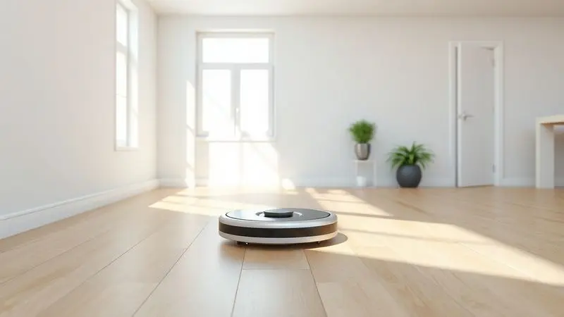
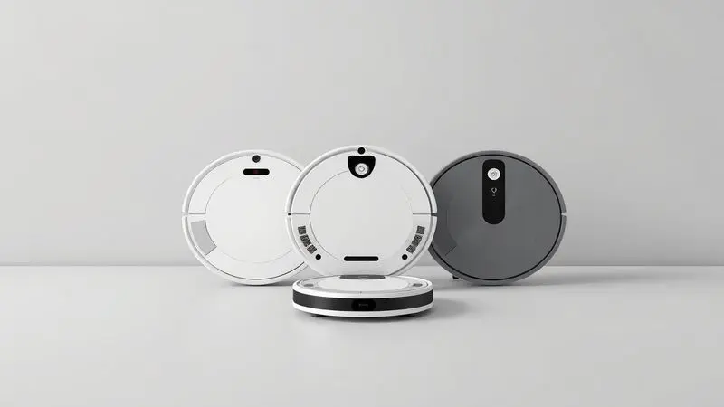

Imagine terminar seu dia de trabalho e encontrar sua casa limpa, sem ter gasto um minuto sequer com vassoura ou pano.

É essa promessa de liberdade que os robôs aspiradores oferecem, transformando uma tarefa diária em algo que simplesmente acontece no fundo, enquanto você vive sua vida.

No universo dos modelos de entrada, o Midea SmartBrush 1200 chama atenção com seu preço acessível e design diferenciado. Mas será que ele realmente entrega essa tranquilidade que você busca?

Analisamos cada detalhe deste robô, desde como ele se move pela sua casa até o que realmente sai do chão, para que você descubra se ele é o parceiro de limpeza ideal para o seu dia a dia.

<SummaryList products={frontmatter.top_products} />

## Design e construção

<ProductBox 
  title={frontmatter.top_products[0].title} 
  image={frontmatter.top_products[0].image} 
  link={frontmatter.top_products[0].link} 
/>

Ao contrário da maioria dos robôs aspiradores que você já viu, o SmartBrush 1200 não é redondo. Seu formato quadrado com bordas arredondadas não é apenas uma questão estética - é uma estratégia inteligente.

Enquanto modelos circulares deixam sujeira acumulada nos cantos das paredes, esse design permite que as escovas alcancem mais perto dos rodapés, prometendo uma limpeza mais completa sem aquelas faixas de poeira que sempre te irritam.

Na prática, essa construção se traduz em um robô que parece ter saído de um catálogo de design moderno. O acabamento "black piano" brilhante na parte superior dá um ar sofisticado, mas a verdadeira magia está embaixo.

Sensores espalhados ao redor do corpo e na parte inferior funcionam como seus olhos, ajudando-o a desviar de móveis e, mais importante, a parar antes de uma queda em escadas.

A tecnologia que a Midea chama de "Easy Climbing" significa que você não precisa ficar movendo tapetes ou se preocupar com pequenos desníveis entre os cômodos - o robô enfrenta obstáculos de até 20 mm sem hesitar.

<CaixaProsContras>

**Prós:**

- Design moderno e atraente com formato quadrado.

- Sensores que previnem colisões e quedas.

- Tecnologia "Easy Climbing" para superar obstáculos.

- Acessórios inclusos facilitam a manutenção.

**Contras:**

- Potência de 40W pode ser considerada baixa para alguns usuários.

- Durabilidade do acabamento brilhante pode variar com o uso.

</CaixaProsContras>

## Usabilidade e desempenho

De que adianta um robô bonito se ele não limpa direito? Aqui é onde o SmartBrush 1200 mostra seu valor no dia a dia. Com seus 40W de potência, ele não é o mais forte do mercado, mas é exatamente essa moderação que o torna perfeito para limpezas diárias de manutenção.

Pense nele como aquele funcionário dedicado que mantém tudo em ordem todos os dias, em vez do super-herói que você chama apenas para os desastres ocasionais.

### Modos de limpeza

Você tem piso laminado sensível na sala, cerâmica na cozinha e talvez um tapete felpudo no quarto? O SmartBrush 1200 entende que cada superfície pede um tratamento diferente.

No modo suave, ele passa delicadamente sobre pisos que podem riscar, enquanto no modo turbo ativa toda sua potência para sugar aquelas migalhas teimosas que caem debaixo da mesa de jantar.

E para aqueles dias em que você só precisa de uma passada rápida antes de receber visita, a função de limpeza rápida resolve em minutos. É como ter três robôs em um, cada um especializado para o momento certo.

### Controle remoto

Lembra quando precisávamos nos levantar para mudar o canal da TV? O controle remoto do SmartBrush 1200 traz essa mesma comodidade para a limpeza da casa.

Sentado no sofá, você pode alternar entre os modos, ajustar a potência ou, melhor ainda, programar horários fixos para que o robô trabalhe sozinho. Imagine agendar para ele começar às 10h, quando você já saiu para trabalhar, e chegar em casa com os pisos limpos.

A funcionalidade de agendamento transforma o robô de um eletrodoméstico em um verdadeiro assistente pessoal de limpeza.

## Destaques e diferenciais do Midea SmartBrush 1200

O que realmente faz o SmartBrush 1200 valer seu investimento? Primeiro, a combinação de design inteligente e navegação prática.

Enquanto muitos robôs de entrada parecem perdidos pela casa, batendo em tudo como insetos desorientados, este modelo usa seus sensores para mapear caminhos mais eficientes.

Segundo, o nível de ruído controlado - você pode assistir sua série favorita enquanto ele trabalha no mesmo cômodo, sem precisar aumentar o volume. E terceiro, a simplicidade: não há aplicativos complicados para aprender nem conexões que falham.

É plug-and-play na sua forma mais pura, ideal para quem quer resultados sem complicação.

## Outros modelos de robô aspirador Midea para conhecer

Se o SmartBrush 1200 parece quase perfeito para você, mas falta aquele "algo a mais", a Midea oferece alternativas que podem se encaixar melhor no seu estilo de vida.

Cada um desses modelos responde a uma pergunta diferente: você precisa apenas aspirar, ou também passar pano? Prefere controle total pelo celular, ou a simplicidade do controle remoto?

### Robô aspirador Midea SmartMop VRA31BB

<ProductBox 
  title={frontmatter.top_products[1].title} 
  image={frontmatter.top_products[1].image} 
  link={frontmatter.top_products[1].link} 
/>

Para quem sonha em acordar com pisos não apenas aspirados, mas também lustrados, o SmartMop VRA31BB é a resposta. Ele combina as duas funções em um único aparelho, usando um reservatório de água que umedece um pano enquanto aspira.

O filtro HEPA H13 é um diferencial importante se você ou alguém da família sofre com alergias - ele retém 99,9% das partículas, deixando o ar mais limpo. A autonomia de 120 minutos significa que ele consegue cuidar de apartamentos inteiros em uma única carga.

<CaixaProsContras>

**Prós:**

- Combina função de aspirar e passar pano simultaneamente.

- Filtro HEPA H13 para melhor qualidade do ar.

- Sensores que evitam colisões e quedas.

- Boa autonomia de bateria.

**Contras:**

- Desempenho inferior em carpetes altos.

- Reservatório pode encher rapidamente em áreas com muitos pelos.

</CaixaProsContras>

### Robô aspirador Midea SmartMop VRB81B

<ProductBox 
  title={frontmatter.top_products[2].title} 
  image={frontmatter.top_products[2].image} 
  link={frontmatter.top_products[2].link} 
/>

Se o orçamento é uma preocupação mas você não quer abrir mão da função 2 em 1, o VRB81B oferece o equilíbrio perfeito. Com cerca de 80 minutos de autonomia, ele cobre áreas de até 75m² - ideal para apartamentos de dois quartos ou casas pequenas.

A ausência de conectividade com aplicativo pode parecer uma limitação, mas para muitas pessoas é na verdade um alívio: menos coisas para configurar, menos atualizações para instalar, menos chances de algo dar errado com a conexão Wi-Fi.

O controle remoto inclusso dá todo o comando que você precisa.

<CaixaProsContras>

**Prós:**

- Função 2 em 1: aspira e passa pano simultaneamente.

- Sensores de navegação que evitam colisões e quedas.

- Boa autonomia para limpezas em ambientes pequenos.

- Acessórios inclusos para otimizar a experiência de uso.

**Contras:**

- Bateria pode não durar os prometidos 80 minutos em todas as situações.

- Falta de conectividade com aplicativo limita o controle avançado.

</CaixaProsContras>

### Robô aspirador Midea ConnectGyro i5C

<ProductBox 
  title={frontmatter.top_products[3].title} 
  image={frontmatter.top_products[3].image} 
  link={frontmatter.top_products[3].link} 
/>

Quando a tecnologia realmente importa, o ConnectGyro i5C mostra do que é capaz. Sua navegação por giroscópio é como dar um GPS para o robô - ele mapeia sua casa e evita passar duas vezes pelo mesmo lugar, economizando tempo e bateria.

Com 4000 Pa de sucção em sua potência máxima, ele lida com sujeiras mais pesadas, e o controle via aplicativo permite que você o acione de qualquer lugar.

A compatibilidade com Alexa e Google Assistente significa que você pode simplesmente dizer "Alexa, comece a limpeza na sala" enquanto prepara o café da manhã.

<CaixaProsContras>

**Prós:**

- Potência de sucção ajustável com três níveis

- Navegação eficiente que evita repetições

- Controle via aplicativo e compatível com assistentes de voz

- Função de passar pano com reservatório de água

**Contras:**

- Dificuldades relatadas no reconhecimento da base

- Acúmulo de sujeira molhada no coletor

</CaixaProsContras>

## Concorrentes diretos e similares no mercado

O SmartBrush 1200 não opera em um vácuo. No segmento de robôs aspiradores de entrada, ele encontra competição feroz de marcas como Mondial, Britânia e até dos populares modelos da Multilaser. O que diferencia o Midea?

Enquanto algumas marcas focam apenas no preço baixo, sacrificando durabilidade, e outras investem em recursos avançados que elevam o custo significativamente, o SmartBrush 1200 ocupa um espaço interessante: oferece construção robusta e navegação inteligente sem exigir um investimento que dói no bolso.

Para quem está dando os primeiros passos no mundo da automação doméstica, essa posição equilibrada pode ser exatamente o que procura.

## Conclusão

O Midea SmartBrush 1200 é aquele amigo confiável que nunca te deixa na mão. Ele pode não ter todos os truques tecnológicos dos modelos topo de linha, mas cumpre sua função principal com consistência: manter sua casa limpa com o mínimo de intervenção da sua parte.

Seu formato quadrado resolve o problema dos cantos sujos, seus sensores dão a tranquilidade de deixá-lo trabalhar sozinho, e o controle remoto oferece a praticidade que torna a automação real.

Para quem vive em apartamentos ou casas de tamanho médio, com pisos predominantemente lisos e uma rotina de sujeira cotidiana (poeira, migalhas, pelos de animais), ele é mais que suficiente.

As limitações aparecem apenas se você espera que ele substitua completamente uma limpeza pesada semanal ou se tem muitos carpetes altos. Nesse caso, vale considerar os modelos SmartMop da mesma marca ou até investir um pouco mais no ConnectGyro i5C.

No final, a pergunta não é se o SmartBrush 1200 é perfeito - é se ele é perfeito para você. E para a maioria das pessoas que apenas querem acordar com o chão limpo sem esforço, a resposta é um convincente sim.

Ele transforma a limpeza de uma tarefa em um hábito invisível, e é exatamente isso que você procura em um robô aspirador.

---

Ainda na dúvida sobre qual robô aspirador escolher? Confira nosso [ranking completo dos melhores robôs aspiradores de 2025](/melhores-robo-aspirador-2024/) e encontre a opção perfeita para sua casa.
