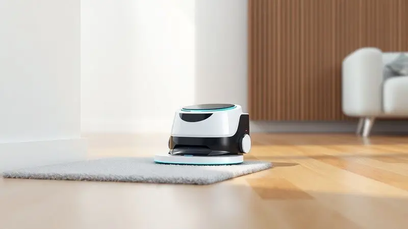
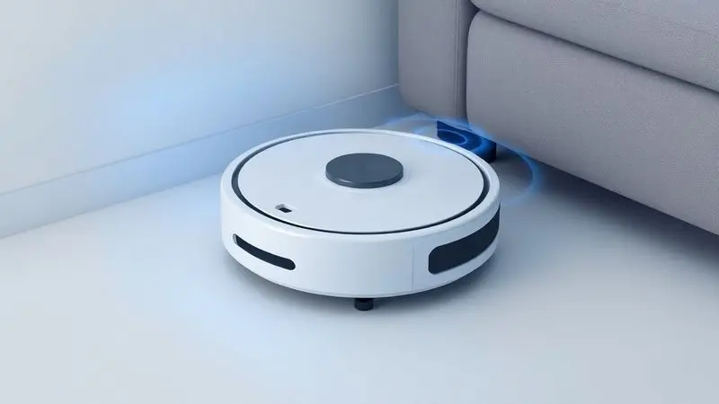
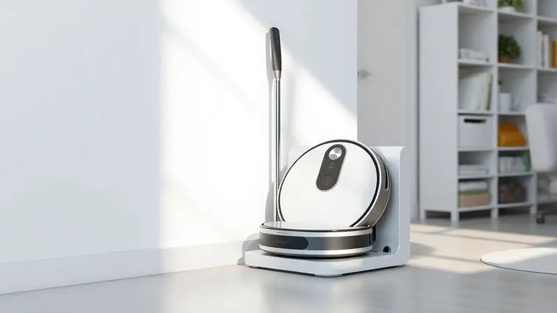
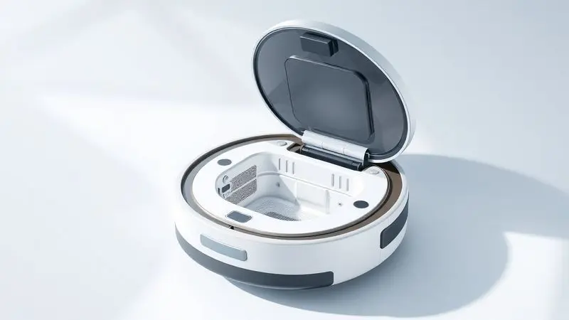

Imagine acordar com os raios de sol entrando pela janela e, em vez de se preocupar em passar o aspirador antes de começar seu dia, você simplesmente abre o aplicativo no celular e ativa seu assistente de limpeza.

É essa praticidade que o Robô Aspirador WAP W310 promete trazer para sua rotina, mas será que ele entrega mesmo o equilíbrio perfeito entre funcionalidade e custo?

Com tantos modelos da WAP no mercado, entender o que diferencia o W310 é essencial antes de tomar sua decisão. Vamos desvendar se este robô é o investimento certo para transformar a limpeza da sua casa de uma tarefa cansativa em uma simples rotina automatizada.

<SummaryList products={frontmatter.top_products} />

## Recursos e Especificações Técnicas do WAP W310

<ProductBox 
  title={frontmatter.top_products[0].title} 
  image={frontmatter.top_products[0].image} 
  link={frontmatter.top_products[0].link} 
/>

O W310 não é apenas mais um robô aspirador. É um verdadeiro assistente 3 em 1 que varre, aspira e ainda passa um pano de microfibra para dar aquele acabamento impecável no seu piso.

Com 1900 Pa de potência de sucção ajustável em três níveis, ele tem força suficiente para lidar desde a poeira do dia a dia até pelos de animais que insistem em se espalhar pela casa toda.

O que realmente impressiona é sua autonomia: até 2 horas e 10 minutos de trabalho contínuo, o suficiente para limpar apartamentos médios ou casas com vários cômodos sem precisar de pausas.

E quando a energia acaba, ele mesmo sabe que é hora de voltar para a base de carregamento, uma funcionalidade que transforma a experiência de uso de 'monitoramento constante' para 'simplesmente esquecer que ele existe'.

Seu design compacto de apenas 7,5 cm de altura é um detalhe que faz toda a diferença. Ele desliza sob sofás, camas e armários com facilidade, alcançando aqueles cantos que normalmente ficam esquecidos na limpeza manual.

Os sensores anti-queda e anti-colisão trabalham em silêncio para garantir que seu móvel favorito não seja arranhado e que o robô não tente 'explorar' as escadas da sua casa.

<CaixaProsContras>

**Prós:**

- Executa três funções simultaneamente: varre, aspira e passa pano

- Oferece múltiplos modos de limpeza adaptáveis

- Autonomia impressionante de até 2 horas e 10 minutos

- Design compacto que acessa áreas difíceis

**Contras:**

- Nível de ruído pode chegar a 75 dB

- Carregamento completo leva cerca de 4 horas

</CaixaProsContras>

### Design e Dimensões

A primeira coisa que você nota ao tirar o W310 da caixa é como ele parece feito para a sua casa. Com linhas modernas e acabamento elegante, ele se integra discretamente a qualquer decoração, longe da estética industrial de alguns eletrodomésticos.

Mas a beleza aqui é totalmente funcional: sua baixa estatura permite que ele explore territórios inacessíveis para aspiradores tradicionais, como aquele espaço entre o sofá e a parede que sempre acumula poeira.

### Modos de Limpeza e Versatilidade

Escolher como sua casa será limpa nunca foi tão simples. O W310 oferece desde o modo automático, que mapeia o ambiente e decide a melhor abordagem, até opções específicas para cantos ou limpeza em espiral para áreas com sujeira concentrada.

A transição entre pisos frios e carpetes acontece naturalmente, sem que você precise intervir ou se preocupar se o robô vai travar no tapete da sala.

### Filtração e Capacidade do Reservatório

Respirar bem em casa vai além de ter janelas abertas. O sistema de filtragem do W310 captura partículas microscópicas e alérgenos, fazendo uma diferença sensível para quem sofre com alergias ou convive com pets.

Seu reservatório de 450 ml é dimensionado para limpezas completas sem interrupções constantes para esvaziamento, ideal para quem valoriza praticidade acima de tudo.

### Sensores e Tecnologias de Navegação

A verdadeira inteligência do W310 está na forma como ele 'enxerga' sua casa. Combinando sensores infravermelhos e tecnologia de mapeamento, ele não apenas evita obstáculos, mas aprende o layout dos ambientes, otimizando suas rotas a cada uso.

O resultado é uma limpeza mais eficiente e um robô que parece desenvolver uma certa 'personalidade' conforme se familiariza com os espaços da sua casa.

### Poder de Sucção em Diferentes Superfícies

Da delicadeza necessária para o piso de madeira à potência exigida por um carpete felpudo, o W310 ajusta sua sucção automaticamente.

São 1900 Pa de força que traduzem para uma limpeza profundamente satisfatória, especialmente quando você encontra o reservatório cheio após uma sessão e percebe quanta sujeira invisível circulava pelo seu lar.

### Capacidade de Varrer e Aspirar Simultaneamente

Aqui está onde a mágica acontece: enquanto as escovas laterais desalojam a sujeira dos cantos, o sistema central aspira tudo em um movimento contínuo.

É como ter uma equipe de limpeza em miniatura trabalhando de forma coordenada, eliminando a necessidade de varrer antes de aspirar, um dos pequenos incômodos que o W310 resolve com elegância.

## Bateria e Autonomia do W310

A autonomia é onde o W310 brilha verdadeiramente. Com até 130 minutos de operação contínua (consolidando as informações do texto original), ele cobre áreas extensas sem precisar de recargas intermediárias.

Para a maioria das residências, significa limpar a casa inteira em uma única sessão, algo que transforma radicalmente a experiência de ter um robô aspirador.

### Duração da Bateria e Tempo de Carregamento

Duas horas de limpeza ininterrupta são mais do que suficientes para apartamentos de até 100m² ou casas com vários cômodos.

O tempo de carregamento de 4 horas pode parecer longo, mas quando você programa o robô para trabalhar à noite ou durante seu horário de trabalho, essa pausa se torna irrelevante. É sobre sincronizar a tecnologia com seu ritmo de vida, não o contrário.

### Retorno Automático à Base de Carregamento

Esta é a funcionalidade que transforma um eletrodoméstico em um verdadeiro assistente. Quando a bateria atinge 20%, o W310 interrompe o que está fazendo e traça o caminho mais eficiente de volta para sua base.

Você pode sair de casa pela manhã e voltar à noite encontrando não apenas os ambientes limpos, mas também o robô carregado e pronto para a próxima missão.

## Experiência do Usuário e Manutenção

O verdadeiro teste de qualquer eletrodoméstico inteligente não está nas especificações técnicas, mas em como ele se integra ao seu cotidiano. O W310 acerta nesse ponto crucial, oferecendo uma experiência que começa simples e permanece simples, mesmo após meses de uso.

### Facilidade de Uso e Configuração Inicial

Da caixa para o funcionamento em menos de 10 minutos. É isso que você pode esperar do W310. O aplicativo WAP guia você passo a passo na conexão Wi-Fi, e em instantes você já está agendando a primeira limpeza.

O painel físico com botões intuitivos é um bônus para quem prefere o controle direto, sem depender do smartphone.

### Nível de Ruído Durante a Operação

Com 75 dB no modo mais potente, o W310 não é exatamente silencioso, mas opera em um volume comparável a uma conversa animada. Na prática, você consegue assistir TV ou trabalhar no mesmo ambiente sem grandes incômodos.

Nos modos mais suaves, o ruído diminui consideravelmente, perfeito para limpezas noturnas enquanto a família dorme.

### Limpeza do Reservatório e Substituição de Peças

Manter o W310 em perfeito estado é tão simples quanto usá-lo. O reservatório se solta com um clique, pronto para ser esvaziado sob a torneira.

Filtros e escovas são projetados para durar meses de uso regular, e quando chega a hora da substituição, as peças são facilmente encontradas no site da WAP ou em lojas especializadas. É a simplicidade que prolonga a vida útil do investimento.

## Qual Robô Aspirador WAP Comprar? Comparativo da Linha

Diante de tantas opções WAP, a escolha pode parecer complicada. Mas quando você entende que cada modelo foi pensado para um perfil específico de usuário, a decisão se torna muito mais clara.

Vamos descomplicar essa escolha mostrando como o W310 se posiciona entre seus irmãos da linha.

### 1. Robô aspirador WAP Robot W90

<ProductBox 
  title={frontmatter.top_products[1].title} 
  image={frontmatter.top_products[1].image} 
  link={frontmatter.top_products[1].link} 
/>

Se você busca o essencial sem complicações, o W90 é seu candidato. Com 1h40 de autonomia e filtro HEPA lavável, ele entrega uma limpeza competente por um investimento mais acessível.

Ideal para apartamentos pequenos ou como primeiro contato com a automação doméstica, embora não tenha o retorno automático à base que facilita tanto a rotina no W310.

<CaixaProsContras>

**Prós:**

- Executa três funções simultaneamente

- Filtro HEPA que melhora a qualidade do ar

- Versátil em diferentes tipos de piso

- Escova lateral para limpeza de cantos

**Contras:**

- Não aspira líquidos

- Autonomia limitada para casas maiores

</CaixaProsContras>

### 2. Robô aspirador WAP Robot W100

<ProductBox 
  title={frontmatter.top_products[2].title} 
  image={frontmatter.top_products[2].image} 
  link={frontmatter.top_products[2].link} 
/>

O W100 é o primo compacto da família, perfeito para quem tem móveis baixos ou espaços apertados. Com a mesma tríade de funções (varrer, aspirar e passar pano), ele surpreende pela agilidade em ambientes menores.

A ausência de retorno automático à base significa que você precisará colocá-lo para carregar manualmente, um pequeno preço pela praticidade que oferece no dia a dia.

<CaixaProsContras>

**Prós:**

- Design compacto para áreas difíceis

- Função 3 em 1

- Sensores inteligentes de segurança

- Boa autonomia para espaços menores

**Contras:**

- Desempenho básico em sujeiras pesadas

- Carregamento manual sem base automática

</CaixaProsContras>

### 3. Robô aspirador WAP Robot W400

<ProductBox 
  title={frontmatter.top_products[3].title} 
  image={frontmatter.top_products[3].image} 
  link={frontmatter.top_products[3].link} 
/>

Com apenas 7,5 cm de altura e 1400 Pa de sucção, o W400 é o especialista em espaços confinados. Seu filtro HEPA triplo faz maravilhas para quem tem alergias, embora o ruído de 72 dB possa ser perceptível em ambientes muito silenciosos.

Uma escolha sólida se o acesso sob móveis é sua prioridade máxima.

<CaixaProsContras>

**Prós:**

- Design slim que alcança locais difíceis

- Sistema de filtragem HEPA potente

- Funções 3 em 1

- Compatível com assistentes de voz

**Contras:**

- Nível de ruído elevado

- Não possui mapeamento inteligente

</CaixaProsContras>

### 4. Robô aspirador WAP Robot WSmart

<ProductBox 
  title={frontmatter.top_products[4].title} 
  image={frontmatter.top_products[4].image} 
  link={frontmatter.top_products[4].link} 
/>

O WSmart vive up to seu nome com uma abordagem inteligente para limpeza. Sua função Turbo aumenta a potência quando detecta áreas mais sujas, e os 120 minutos de autonomia são generosos.

A ausência de aplicativo pode ser vista como simplicidade ou limitação, dependendo de quanto controle você deseja ter sobre o processo de limpeza.

<CaixaProsContras>

**Prós:**

- Limpeza 3 em 1 completa

- Sensores antiqueda eficientes

- Função Turbo para limpeza profunda

- Reservatório generoso de 450 ml

**Contras:**

- Sem conectividade com aplicativo

- Ruído de 73 dB pode incomodar

</CaixaProsContras>

### 5. Robô aspirador WAP Robot W1000

<ProductBox 
  title={frontmatter.top_products[5].title} 
  image={frontmatter.top_products[5].image} 
  link={frontmatter.top_products[5].link} 
/>

Para famílias com pets ou alergias, o W1000 é um aliado poderoso. Com 160 minutos de autonomia e filtro HEPA, ele mantém a casa limpa por mais tempo.

O mapeamento básico que não salva o layout é sua principal concessão para manter o preço acessível, uma troca que vale a pena se você não se importa em deixá-lo reexplorar a casa a cada uso.

<CaixaProsContras>

**Prós:**

- Eficiente na limpeza de pelos

- Sensores inteligentes anti-queda

- Autonomia extensa de 160 minutos

- Compatível com Alexa

**Contras:**

- Mapeamento não memoriza o ambiente

- Preço elevado para recursos básicos

</CaixaProsContras>

### 6. Robô aspirador WAP Robot W3000

<ProductBox 
  title={frontmatter.top_products[6].title} 
  image={frontmatter.top_products[6].image} 
  link={frontmatter.top_products[6].link} 
/>

No topo da linha, o W3000 é o mais inteligente da família. Seu mapeamento salva a planta da sua casa, permitindo que você defina áreas proibidas ou prioridades de limpeza via aplicativo.

A integração com Alexa e Google Assistente transforma comandos de voz em ação imediata. A tampa em vidro dá um toque premium, mas exige cuidado extra para evitar riscos.

<CaixaProsContras>

**Prós:**

- Mapeamento inteligente que otimiza trajetos

- Controle completo por aplicativo

- Boa autonomia com retorno automático

- Eficaz para lares com pets

**Contras:**

- Função MOP limitada para limpezas pesadas

- Acabamento em vidro susceptível a riscos

</CaixaProsContras>

## Perguntas Frequentes sobre o W310

Antes de fechar sua compra, é natural ter algumas dúvidas finais. Reunimos as perguntas mais comuns sobre o W310 para que você tome sua decisão com total confiança.

### O WAP W310 funciona em todos os tipos de piso?

Sim, e essa é uma das suas maiores virtudes. O W310 transita naturalmente entre pisos frios, madeira, laminados e carpetes de altura média.

Sua tecnologia de detecção de superfície ajusta automaticamente a potência e a altura das escovas, garantindo performance otimizada em cada ambiente.

Em tapetes muito altos ou felpudos, ele pode exigir passadas extras, mas na grande maioria dos cenários residenciais, sua adaptabilidade é impressionante.

### O robô aspirador W310 faz mapeamento da casa?

Absolutamente. O sistema de mapeamento do W310 é o que o diferencia dos modelos mais básicos. Ele cria um mapa virtual da sua casa durante a primeira limpeza, aprendendo a disposição dos móveis e as áreas de maior circulação.

Nas sessões seguintes, esse conhecimento se traduz em rotas mais eficientes e limpezas mais completas, sem deixar cantos esquecidos ou refazer áreas já limpas.

### Qual a garantia do produto e onde encontrar peças?

O W310 vem com garantia de 12 meses contra defeitos de fabricação, um período que cobre tranquilamente qualquer problema de adaptação. Guarde a nota fiscal e a embalagem original para facilitar eventuais procedimentos.

Peças de reposição como filtros, escovas e baterias estão disponíveis no site oficial da WAP e em marketplaces especializados, garantindo que seu investimento tenha vida longa com manutenção acessível.

## Conclusão

O Robô Aspirador WAP W310 não é apenas mais um produto na prateleira. É uma declaração de como a tecnologia pode simplificar aspectos fundamentais do nosso cotidiano.

Entre a linha WAP, ele ocupa um lugar especial: oferece a inteligência do mapeamento, a autonomia generosa e a versatilidade 3 em 1 que transformam a limpeza doméstica de obrigação para background task.

O que realmente define o W310 é seu equilíbrio. Não é o mais básico, mas também não exige um investimento estratosférico. Não é silencioso, mas opera em volume compatível com a vida em família.

Não substitui uma limpeza profunda manual, mas elimina completamente a necessidade da faxina diária.

Para quem busca um primeiro robô aspirador com cara de experiente ou quer atualizar um modelo mais simples sem entrar no território premium, o W310 é uma escolha que dificilmente decepciona.

Imagine chegar em casa após um dia corrido e encontrar os pisos impecáveis, sem ter feito nenhum esforço. É essa sensação de ter um assistente discreto cuidando dos detalhes que o W310 entrega consistentemente.

Se você está pronto para recuperar horas semanais que hoje são dedicadas à limpeza, este robô não é um gasto, mas um investimento em qualidade de vida que começa a pagar dividendos desde o primeiro dia de uso.

---

Ainda na dúvida sobre qual modelo WAP escolher? Confira nosso ranking completo dos [Melhores Robôs Aspiradores WAP de 2025](/robo-aspirador-wap-qual-o-melhor/).
