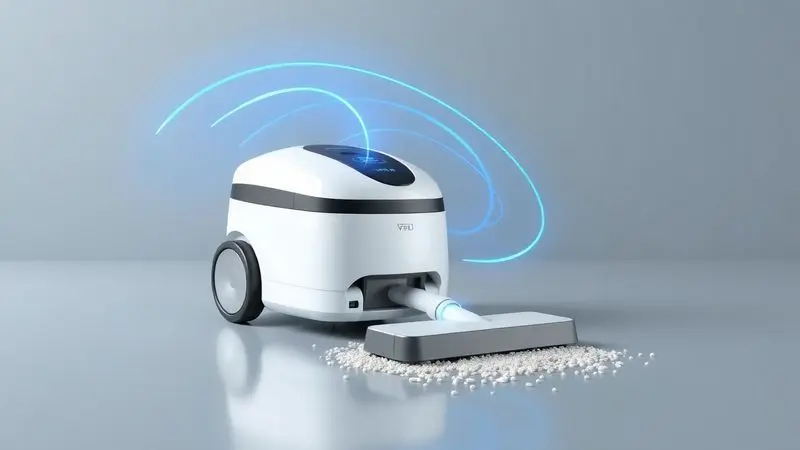
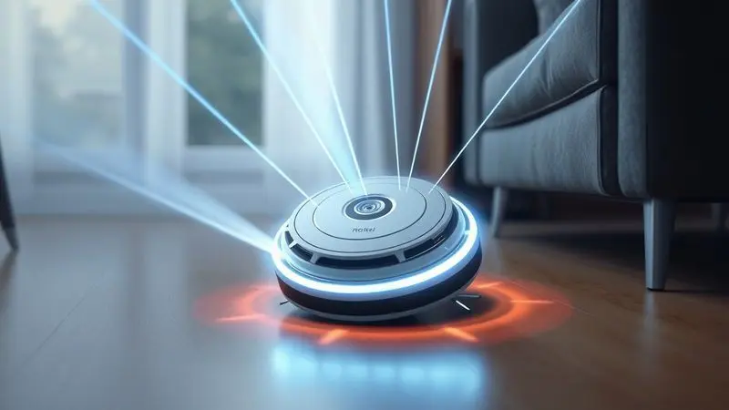
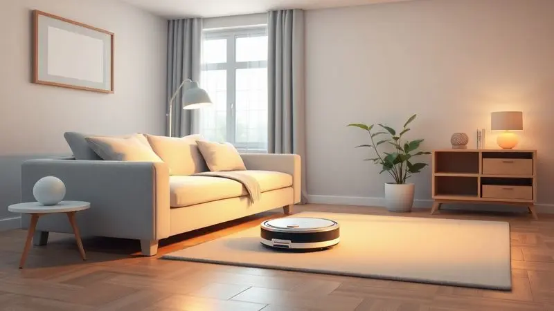

Imaginar sua casa limpa todos os dias sem você levantar um dedo parece um sonho distante? Hoje essa realidade está mais próxima do que você pensa.

O WAP Robot W95 promete justamente isso, transformar aquela tarefa tediosa da limpeza em um processo automático e silencioso. Mas será que ele entrega o que promete ou é mais um gadget que vai parar no fundo do armário depois de uma semana?

Descobrimos cada detalhe técnico, conversamos com especialistas e, mais importante, entendemos como ele realmente se comporta na rotina de quem precisa de praticidade sem abrir mão da eficiência.

<SummaryList products={frontmatter.top_products} />

## Desempenho e Funcionalidades do WAP Robot W95

<ProductBox 
  title={frontmatter.top_products[0].title} 
  image={frontmatter.top_products[0].image} 
  link={frontmatter.top_products[0].link} 
/>

Imagine chegar em casa após um dia cansativo e encontrar os pisos impecáveis, sem um fio de poeira ou pelo de pet. É essa sensação que o W95 busca entregar.

Ele não apenas aspira, mas também varre e passa pano, trabalhando de forma multifuncional para cobrir todas as etapas básicas da limpeza. Com duas escovas laterais que giram, ele alcança aqueles cantos esquecidos atrás dos móveis, onde a poeira adora se acumular.

A potência de 30W, traduzida em 400 Pa de força de sucção, significa que ele tem capacidade para remover desde partículas finas até os pelos mais teimosos do seu pet. O resultado é visível, sem aquela sensação de que você precisaria passar o aspirador comum depois.

Quando falamos em autonomia, ele se sai muito bem, com até 2 horas de trabalho contínuo após um carregamento completo.

Os sensores infravermelhos são seus olhos, evitando quedas de escadas e colisões com móveis, enquanto as rodas emborrachadas garantem estabilidade em qualquer superfície.

Seu design baixinho é uma vantagem, alcançando lugares onde aspiradores tradicionais nem sonham em chegar. A manutenção fica fácil com um coletor de pó lavável, embora seja importante notar a ausência do filtro HEPA, comum em modelos mais avançados.

<CaixaProsContras>

**Prós:**

- Limpeza multifuncional (varre, aspira e passa pano)

- Boa potência de sucção

- Longa autonomia da bateria

- Design compacto e que alcança áreas difíceis

**Contras:**

- Não possui filtro HEPA

- O tempo de carregamento pode ser longo

</CaixaProsContras>

### Poder de Sucção e Limpeza Eficiente

Mas o que realmente importa é o resultado, certo? Aquela sensação de andar descalço em um piso verdadeiramente limpo.

O W95 entrega isso com uma sucção que não apenas recolhe a sujeira visível, mas também aquela poeira fina que sempre reaparece algumas horas depois da limpeza.

A tecnologia por trás das escovas garante que cada movimento seja aproveitado ao máximo, direcionando a sujeira para o caminho de sucção. Para você que deseja praticidade sem abrir mão da qualidade, esse sistema significa menos retrabalho e mais tempo livre.

### Autonomia da Bateria e Tempo de Recarga

Dois horas de trabalho podem não parecer muito à primeira vista, mas na prática isso significa que enquanto você toma café da manhã, se arruma para o trabalho e responde alguns e-mails, o W95 percorre toda a sua casa sem interrupções.

É tempo suficiente para a maioria dos apartamentos e casas de tamanho médio.

Quando a bateria chega ao fim, o carregamento completo leva cerca de 4 horas, período em que você pode programá-lo para reiniciar automaticamente, mantendo um ciclo de limpeza contínuo que se adapta à sua rotina.

### Modos de Limpeza e Sensores Inteligentes

Cada ambiente da sua casa tem necessidades diferentes, e o W95 entende isso. Ele alterna automaticamente entre modos de limpeza conforme detecta o tipo de piso, aumentando a potência em carpetes onde a sujeira se esconde mais profundamente.

Os sensores não apenas evitam obstáculos, mas identificam áreas mais sujas, fazendo com que o robô passe mais tempo nesses pontos específicos.

É como ter um limpador que observa, analisa e adapta sua estratégia, garantindo que cada canto receba exatamente a atenção que precisa.

## Ficha Técnica Completa do WAP Robot W95

Agora que você conhece a experiência, vamos aos detalhes técnicos que fazem tudo isso acontecer.

O W95 é mais do que um simples aspirador autônomo, ele combina múltiplas funções em um único dispositivo compacto, com capacidade de limpeza a seco e úmido, mapeamento inteligente do ambiente e controle via aplicativo para quem gosta de comandar tudo pelo smartphone.

### Especificações de Potência e Capacidade

Aqui está o que realmente importa nos números: com 2000W de potência, ele tem força bruta suficiente para lidar com situações de limpeza mais desafiadoras.

O tanque de água de 20 litros permite sessões extensas sem necessidade de reabastecimento constante, enquanto a possibilidade de ajustar a pressão da água torna-o versátil para diferentes superfícies, desde pisos delicados até áreas que exigem uma limpeza mais intensa.

### Dimensões, Peso e Design

Com dimensões compactas, ele navega facilmente entre as pernas das cadeiras, embaixo das mesas e em outros espaços apertados onde a sujeira gosta de se esconder. O design moderno não chama atenção negativamente, integrando-se discretamente à decoração da sua casa.

Seu peso leve é uma vantagem dupla: facilita o transporte entre diferentes andares e garante que não danifique pisos mais sensíveis durante a movimentação.

Quando não está em uso, ocupa menos espaço do que uma caixa de sapatos, tornando o armazenamento uma preocupação do passado.

## Para Quem é o WAP Robot W95?

Se sua rotina é uma corrida contra o tempo entre trabalho, família e compromissos sociais, o W95 pode ser seu aliado secreto. Ele é perfeito para quem tem animais de estimação e já cansou de encontrar pelos espalhados por todos os cantos.

Para pessoas alérgicas, manter os ambientes livres de poeira não é mais uma tarefa hercúlea, mas sim um processo automático que acontece enquanto você vive sua vida.

Lembre-se apenas que, como todo robô aspirador, ele é um complemento para a manutenção diária, não substituindo completamente a limpeza profunda que você eventualmente precisará fazer.

## O Que Dizem os Usuários e Especialistas

A opinião de quem já testou na prática é o melhor termômetro para qualquer produto.

Especialistas reconhecem que o W95 entrega um bom desempenho nas tarefas básicas de limpeza, enquanto usuários reais destacam sua facilidade de uso, embora alguns desejem mais autonomia da bateria e uma navegação mais inteligente em ambientes complexos com muitos móveis.

### Avaliações dos Consumidores: Depoimentos Reais

"Depois que chegou, minha relação com a limpeza da casa mudou completamente", compartilha uma usuária de São Paulo. "Ele lida bem com os pelos dos meus dois gatos, algo que me tomava pelo menos 20 minutos diários".

Outro comentário frequente é sobre a praticidade: "Programo para limpar enquanto estou no trabalho e chego em casa com tudo pronto". As críticas geralmente giram em torno da bateria, com alguns usuários desejando mais tempo de autonomia para casas maiores.

A conclusão geral, porém, é positiva: considerando o custo-benefício, ele cumpre o que promete para quem busca automação sem complicações.

## Guia de Compra: Preço e Onde Encontrar o WAP W95

Encontrar o W95 é mais fácil do que você imagina. Ele está disponível nas principais lojas de eletrônicos, grandes redes varejistas e, é claro, nas plataformas de e-commerce onde você já costuma fazer compras.

Recomendamos comparar preços entre diferentes vendedores, pois promoções e condições de pagamento podem variar significativamente. Não se esqueça de verificar a reputação do vendedor, as condições de garantia e o suporte pós-venda.

Esses detalhes fazem toda a diferença quando você investe em um equipamento que pretende usar diariamente por anos.

## Perguntas Frequentes (FAQ)

As dúvidas mais comuns sobre o W95 geralmente giram em torno de sua durabilidade e facilidade de integração na rotina, pontos que as avaliações dos usuários confirmam como positivos.

### Quais tipos de piso o W95 limpa?

Desde cerâmicas brilhantes até pisos de madeira mais sensíveis, o W95 se adapta. Sua tecnologia de mapeamento reconhece automaticamente a superfície e ajusta tanto a potência de sucção quanto a intensidade da limpeza.

Isso significa proteção para seus pisos mais caros e eficiência máxima onde mais importa, tudo de forma automática.

### Ele retorna para a base de carregamento?

Sim, e essa é uma das funcionalidades mais apreciadas. Quando a bateria atinge um nível crítico, ele encontra o caminho de volta sozinho, conecta-se à base e recarrega completamente antes de retomar de onde parou.

Você nunca precisará resgatá-lo de algum canto da casa porque ficou sem energia no meio do trabalho.

### A manutenção é fácil?

Surpreendentemente simples. O coletor de pó é removível e lavável, as escovas podem ser limpas rapidamente e os sensores só precisam de uma passada de pano seco de vez em quando.

Seguindo as recomendações básicas do manual, você mantém o desempenho ideal sem precisar de conhecimentos técnicos ou ferramentas especiais.

## Conclusão

O WAP Robot W95 não é um produto revolucionário que vai transformar completamente sua vida, mas é um assistente confiável que remove uma tarefa tediosa da sua rotina. Para quem vive na correria dos dias atuais, ter pisos limpos sem esforço diário não tem preço.

Sua combinação de funcionalidades multifuncionais, autonomia adequada e navegação inteligente faz dele uma escolha sólida para a maioria dos lares.

Se você busca praticidade real, não apenas promessas vazias, e está disposto a investir em um aliado para a limpeza doméstica, o W95 merece sua consideração.

A verdadeira questão não é se você pode viver sem ele, mas por que continuaria fazendo manualmente algo que uma máquina pode fazer por você enquanto você aproveita melhor seu tempo.

---

Ainda em dúvida sobre o WAP Robot W95? Confira nosso ranking dos [Melhores Robô Aspirador Wap de 2025](/robo-aspirador-wap-qual-o-melhor/) e encontre o modelo perfeito para sua casa!
