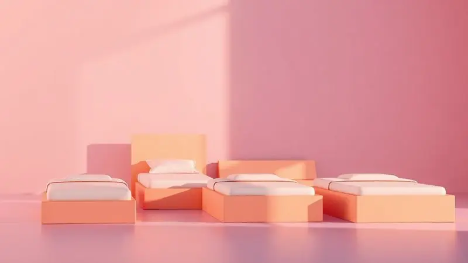
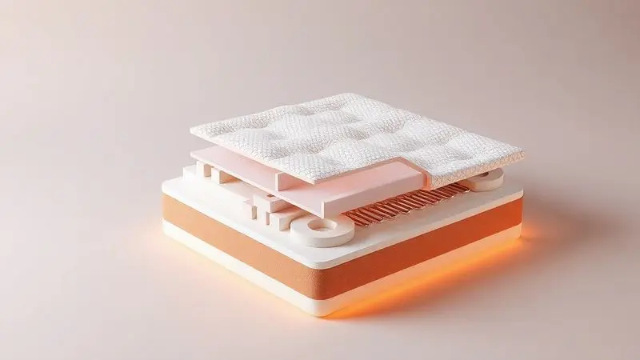
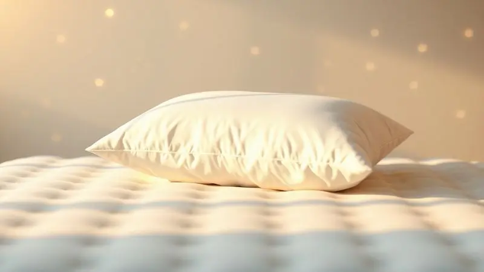

Se você está pesquisando colchões na internet, já deve ter se deparado com a marca BF Colchões em diversas lojas online.

Com preços competitivos e presença em todos os grandes e-commerces, ela naturalmente levanta uma questão importante: esses colchões são realmente bons e confiáveis, ou são apenas mais uma opção no mar de marcas disponíveis?

Neste artigo, vamos fazer mais do que listar especificações técnicas.

Vamos conversar sobre a história da empresa, entender sua reputação real entre consumidores e, principalmente, explorar os modelos mais populares de forma que você consiga visualizar qual deles se encaixa no seu dia a dia.

Nosso objetivo é transformar dados técnicos em informações que realmente façam sentido para suas noites de sono, ajudando você a tomar uma decisão sem arrependimentos.

<SummaryList products={frontmatter.top_products} />

## BF Colchões é Bom?

Quando você pensa em um bom colchão, provavelmente imagina um equilíbrio perfeito entre conforto que acolhe e suporte que sustenta. É exatamente nesse ponto que os colchões BF constroem sua reputação.

Muitos consumidores os veem como uma opção viável não apenas pelo preço, mas pela diversidade real de modelos. Existem opções desde as tradicionais espumas até tecnologias mais modernas com molas ensacadas, cada uma pensada para necessidades específicas.

Imagine alguém que precisa de suporte ortopédico firme ao lado de outra pessoa que prioriza o alívio imediato da pressão nos ombros. A marca tenta atender a ambos.

Os materiais, como espumas de alta densidade, são frequentemente elogiados por sua durabilidade, e a sensação de adaptação ao corpo é um ponto positivo constante nos relatos.

Somado a isso, a empresa mantém uma estrutura de garantias e um atendimento ao cliente que, na maioria dos casos, funciona para construir confiança.

No fim das contas, eles representam uma escolha sólida para quem busca qualidade dentro de uma faixa de investimento acessível, sem abrir mão de tecnologias reconhecidas no mercado.

## História e Certificações da BF Colchões

Para entender se uma marca é confiável, é preciso olhar para sua trajetória. A BF Colchões não surgiu ontem. Fundada em 1983, a empresa acumula mais de quatro décadas de experiência no mercado brasileiro de sono.

Esse tempo todo no setor não é apenas um número, mas um indicador de investimento constante em pesquisa e desenvolvimento. A marca passou por várias fases do mercado, viu tendências chegarem e irem embora, e se adaptou.

Esse histórico se traduz em um know-how aplicado diretamente nos produtos. Além da experiência, há um selo de confiança tangível: as certificações. O selo do INMETRO, por exemplo, não é dado a qualquer produto.

Ele atesta que os colchões passaram por rigorosos testes de segurança, durabilidade e desempenho. Para você, consumidor, isso significa que há um órgão independente garantindo que o produto entregará o que promete.

Esses elementos juntos, história e certificação, mostram um compromisso que vai além do vender. Mostram uma preocupação em oferecer soluções que priorizam a saúde e o bem-estar de quem vai deitar sobre eles todas as noites.

## Avaliação da Marca no Reclame Aqui

E na vida real, como a marca se sai? O Reclame Aqui funciona como um termômetro valioso da experiência prática dos consumidores. A BF Colchões tem uma presença significativa na plataforma, com um volume considerável de avaliações.

O panorama que emerge é misto, como costuma acontecer com marcas de grande volume de vendas. Por um lado, muitos usuários são enfáticos ao elogiar a qualidade dos produtos e o conforto proporcionado, detalhando melhoras reais na qualidade do sono.

Por outro, existem relatos consistentes sobre dificuldades no pós-venda, principalmente na hora de resolver problemas de entrega, troca ou comunicação com o atendimento. O que chama a atenção, contudo, é a taxa de resposta da empresa.

Um número considerável dessas reclamações é respondido e, em muitos casos, resolvido. Isso indica um esforço ativo, ainda que nem sempre perfeito, em ouvir o consumidor.

Portanto, antes de clicar no botão de comprar, vale dedicar alguns minutos para ler as avaliações mais recentes.

Essa prática não vai revelar uma verdade absoluta, mas vai dar a você uma perspectiva muito mais rica e realista do que esperar, ajudando a tomar uma decisão com os olhos bem abertos.

## Comparativo dos Melhores Colchões BF 2026

Chegamos ao cerne da questão: qual modelo escolher? A BF oferece um leque tão variado que pode confundir.

Para clarear as ideias, vamos analisar os modelos mais vendidos e comentados, não apenas listando specs, mas tentando descobrir para qual estilo de vida e necessidade cada um foi verdadeiramente pensado.

### Colchão Infinity BF

<ProductBox 
  title={frontmatter.top_products[0].title} 
  image={frontmatter.top_products[0].image} 
  link={frontmatter.top_products[0].link} 
/>

Pense em um colchão que tenta ser um equilíbrio perfeito. O Infinity BF (ou Infinity Premium) é aquele modelo que você escolhe quando não quer nem o extremo firme nem o extremamente macio.

Seu coração são as molas ensacadas individualmente, que trabalham de forma independente. Na prática, isso se traduz em duas coisas: um suporte preciso para sua coluna e aquele alívio maravilhoso de não sentir cada movimento do seu parceiro.

Ele suporta até 130 kg por pessoa, sendo uma opção robusta para a maioria dos casais. A experiência de conforto é construída em camadas.

Logo acima das molas, a espuma viscoelástica age como um abraço, se moldando às suas curvas e aliviando pontos de pressão nos ombros e quadris. Depois, vem a espuma BF Max Flowing®, pensada para equilibrar o peso e manter uma sensação de frescor.

Tudo isso é envolvido por uma Malha Belga Premium, com um toque suave e propriedades hipoalergênicas, ideal para quem espirra com poeira. Uma observação prática: ele é de uso unilateral.

Você não pode virá-lo, mas precisa girá-lo de cabeceira para pé periodicamente para um desgaste uniforme. É um investimento maior, mas que se justifica pelos materiais e pela construção pensada para durar.

<CaixaProsContras>

**Prós:**

- Molas ensacadas que oferecem estabilidade e conforto

- Camadas de espumas premium para alívio de pressão

- Revestimento hipoalergênico ideal para alérgicos

- Entrega embalada a vácuo para proteção do produto

**Contras:**

- Uso de apenas um lado pode limitar a durabilidade

- Preço relativamente alto em comparação com modelos básicos

</CaixaProsContras>

### Colchão Sport Pro

<ProductBox 
  title={frontmatter.top_products[1].title} 
  image={frontmatter.top_products[1].image} 
  link={frontmatter.top_products[1].link} 
/>

Você pratica esportes, corre, levanta peso ou simplesmente tem um dia fisicamente desgastante? O Sport Pro foi feito pensando na sua recuperação. A proposta aqui vai além do conforto básico.

Ele incorpora a tecnologia DeepZen®, que utiliza uma malha belga com fios de carbono. A ideia é ajudar a dissipar o excesso de cortisol, o hormônio do estresse, do seu corpo, promovendo um sono verdadeiramente reparador.

As molas são do tipo PHP e são ensacadas, oferecendo um suporte individualizado tão preciso que isola completamente os movimentos. Se seu parceiro é um ‘agitador noturno’, isso deixa de ser um problema.

A espuma HR Premium completa o pacote, adaptando-se ao seu corpo para melhorar a circulação de ar e aliviar a pressão muscular pós-treino. Com 25 cm de altura e capacidade para 140 kg por pessoa, ele é um colchão imponente.

Essa altura, contudo, pode não agradar a todos, especialmente quem prefere camas mais baixas. Se o seu objetivo é acordar revigorado, com o corpo recuperado da rotina ativa, ele é uma das apostas mais interessantes do catálogo.

<CaixaProsContras>

**Prós:**

- Tecnologia DeepZen® que ajuda na recuperação muscular.

- Molas ensacadas proporcionam suporte individualizado.

- Espuma HR Premium oferece conforto e alívio de pressão.

- Hipoalergênico, adequado para pessoas sensíveis.

**Contras:**

- Altura de 25 cm pode não agradar a todos.

- Não é o modelo mais acessível no mercado.

</CaixaProsContras>

### Colchão Light Antistress

<ProductBox 
  title={frontmatter.top_products[2].title} 
  image={frontmatter.top_products[2].image} 
  link={frontmatter.top_products[2].link} 
/>

Se a sua maior inimiga à noite se chama ‘estresse’ ou ‘ansiedade’, este modelo merece sua atenção. O Light Antistress tem uma missão clara: transformar seu momento de deitar em um ritual de desaceleração.

Ele possui uma densidade D33, que resulta em uma sensação intermediária, um meio-termo confortável que agrada quem foge dos extremos.

A grande estrela é sua camada de pillow top de 7cm em espuma Soft Light, que oferece aquele afundamento suave e aconchegante, aliviando pontos de pressão de forma imediata. Mas o diferencial mesmo está na tecnologia Deep Zen.

Ela utiliza fios de carbono para dissipar a eletricidade estática que nosso corpo acumula durante o dia. A teoria é que essa dissipação ajuda a reduzir a tensão física e promover relaxamento.

Com suporte para até 110 kg por pessoa, é uma opção muito competente para casais. Só não espere dele a maciez de uma nuvem ou a firmeza de uma tábua. Ele é, por definição, o equilíbrio.

<CaixaProsContras>

**Prós:**

- Conforto intermediário, atende uma ampla gama de preferências.

- Tecnologia Deep Zen que ajuda na redução do estresse.

- Camada de pillow top proporciona alívio dos pontos de pressão.

- Boa durabilidade e suporte para diferentes pesos.

**Contras:**

- Não é recomendado para quem prefere colchões muito macios ou firmes.

- Pode ser considerado básico em termos de recursos adicionais.

</CaixaProsContras>

### Colchão Sensation

<ProductBox 
  title={frontmatter.top_products[3].title} 
  image={frontmatter.top_products[3].image} 
  link={frontmatter.top_products[3].link} 
/>

Já se perguntou como deve ser o colchão daqueles hotéis de luxo onde você dorme profundamente e acorda sem uma dor sequer? O Sensation tenta replicar exatamente essa experiência. Ele é, por definição, um colchão macio.

Suas molas ensacadas individualmente garantem que você e seu parceiro tenham ilhas de conforto independentes, sem transferência de movimento.

A sensação de hotelaria vem principalmente do seu pillow top duplo, que combina a maciez fofinha da espuma BF Hiper Soft® com a adaptabilidade da BF Viscoelástica®.

Essa combinação cria um ninho que se molda ao seu corpo, aliviando especialmente a pressão em ombros e quadris. O revestimento é hipoalergênico e resistente, e o produto carrega a certificação INER, um selo de qualidade.

É importante ter em mente: se você é do time que acha colchão macio ‘sem coluna’, esse não é para você. Mas se o seu sonho é afundar em um conforto que acolhe e relaxa cada músculo, o Sensation é um convite difícil de recusar.

<CaixaProsContras>

**Prós:**

- Conforto macio ideal para noites relaxantes.

- Molas ensacadas que oferecem suporte ortopédico.

- Pillow top duplo com espumas de alta qualidade.

- Tratamento hipoalergênico que reduz alérgenos.

**Contras:**

- Pode não atender quem busca um colchão mais firme.

- Entregue em formato original, não enrolado a vácuo.

</CaixaProsContras>

### Colchão Power Sleep

<ProductBox 
  title={frontmatter.top_products[4].title} 
  image={frontmatter.top_products[4].image} 
  link={frontmatter.top_products[4].link} 
/>

Precisa de firmeza, mas sem abrir mão de um pouco de aconchego? O Power Sleep pode ser essa solução híbrida. Ele é construído sobre uma base de molas ensacadas, o que já resolve a questão do isolamento de movimento para casais.

A espuma utilizada é a D33 certificada, conhecida por oferecer uma firmeza consistente e boa durabilidade, ajudando a manter o alinhamento da coluna.

Para quebrar um pouco essa firmeza e trazer conforto direto ao corpo, ele conta com um pillow top em espuma viscoelástica. Essa camada superior é responsável por se adaptar e aliviar a pressão, oferecendo uma sensação mais acolhedora do que a base firme sugeriria.

O tecido é hipoalergênico, criando uma barreira contra ácaros e alérgenos.

Um ponto de atenção é o design de uso unilateral (apenas um lado utilizável), que alguns veem como uma limitação na durabilidade, enquanto outros apreciam pela praticidade de não precisar virar um colchão pesado.

<CaixaProsContras>

**Prós:**

- Molas ensacadas que evitam a transferência de movimento.

- Espuma D33 que garante firmeza e durabilidade.

- Camada de conforto em espuma viscoelástica que alivia pressão.

- Tecido hipoalergênico que mantém o ambiente livre de alergias.

**Contras:**

- Projetado para uso apenas em um lado.

- Limite de peso pode não atender a todos os biotipos.

</CaixaProsContras>

### Colchão Astronasa

<ProductBox 
  title={frontmatter.top_products[5].title} 
  image={frontmatter.top_products[5].image} 
  link={frontmatter.top_products[5].link} 
/>

O nome não é por acaso. O Astronasa apela para a imagem da tecnologia espacial, incorporando a chamada ‘espuma da NASA’ (viscoelástica) em seu pillow top. Esse é um modelo de perfil ortopédico, que oferece uma sensação que vai do intermediário ao firme.

A base é formada por molas ensacadas individuais, que garantem suporte pontual e eliminam a transferência de movimento.

Sobre elas, a espuma de alta densidade D33 dá estrutura, e por cima de tudo, a camada de viscoelástica proporciona o famoso ‘efeito memória’, moldando-se ao corpo e aliviando a pressão. Com capacidade para 130 kg por pessoa, é uma opção robusta.

Um ponto logístico importante: verifique as condições de entrega da BF na sua região, pois há limitações para locais de difícil acesso. Para quem busca um colchão com pegada ortopédica, mas que não seja uma tábua completa, o Astronasa apresenta um argumento forte.

<CaixaProsContras>

**Prós:**

- Molas ensacadas proporcionam excelente suporte.

- Camada de espuma viscoelástica para conforto superior.

- Indicado para pessoas com alergias devido ao tratamento hipoalergênico.

- Boa durabilidade com materiais de qualidade.

**Contras:**

- Limitações na entrega em áreas de difícil acesso.

- O preço pode ser um pouco elevado em relação a modelos básicos.

</CaixaProsContras>

### Colchão de Espuma D33 e D45 a Vácuo

<ProductBox 
  title={frontmatter.top_products[6].title} 
  image={frontmatter.top_products[6].image} 
  link={frontmatter.top_products[6].link} 
/>

Para quem valoriza praticidade acima de tudo, os modelos a vácuo são a resposta. Eles resolvem a dor de cabeça de transportar um colchão enorme por escadas e portas. A BF oferece duas densidades principais nesse formato. O D33 (33 kg/m³) é o mais versátil.

Ele oferece um conforto intermediário, aquele meio-termo que agrada a maioria, e é indicado para pessoas de até 100 kg. É o tipo de colchão que você compra para um quarto de visitas ou para seu primeiro apartamento, sem medo de errar.

Já o D45 (45 kg/m³) é o irmão mais forte. Com densidade maior, ele é visivelmente mais firme e foi projetado para suportar pesos acima de 100 kg com muito mais resistência e durabilidade.

A grande vantagem dos dois é a embalagem a vácuo: o colchão chega enrolado e compactado, e depois de aberto, se expande para o tamanho normal em poucas horas.

A contrapartida é que o D45, por usar mais material, tem um custo mais elevado, mas sua vida útil tende a ser proporcionalmente maior.

<CaixaProsContras>

**Prós:**

- Disponível em duas densidades para atender diferentes perfis de peso.

- Conforto equilibrado no modelo D33, ideal para uso geral.

- Maior firmeza no D45, adequado para suportar pesos mais elevados.

- Embalagem a vácuo facilita o transporte e armazenamento.

**Contras:**

- O modelo D45 tende a ser mais caro.

- O D33 pode não oferecer suporte suficiente para pessoas acima de 100 kg.

</CaixaProsContras>

### Colchão Casal Molas Ensacadas com Pillow Top Extra Conforto

<ProductBox 
  title={frontmatter.top_products[7].title} 
  image={frontmatter.top_products[7].image} 
  link={frontmatter.top_products[7].link} 
/>

Este modelo tem um nome que é praticamente uma descrição completa. Ele é feito para casais, usa molas ensacadas e tem um pillow top focado em conforto extra. A ideia é simples: oferecer o melhor dos dois mundos.

As molas ensacadas garantem o suporte individualizado e o isolamento de movimento essencial para duas pessoas dividirem a cama sem se perturbarem. O pillow top, feito com espuma D28 Max Flowing, é a camada de indulgência.

Ele adiciona uma maciez extra que alivia os pontos de pressão imediatamente ao deitar, criando uma sensação acolhedora. O visual também é cuidado, com tecido em malha belga que dá um ar mais sofisticado ao quarto.

A estrutura em EPS (isopor) nas laterais garante uma borda firme, evitando aquela sensação de estar caindo da cama. Fique atento ao limite de peso de 120 kg por pessoa, que pode ser uma restrição para alguns.

Se o seu objetivo é um colchão de casal que seja confortável desde o primeiro minuto, sem sustos, este é um candidato direto.

<CaixaProsContras>

**Prós:**

- Molas ensacadas que proporcionam ótimo suporte.

- Pillow top macio para maior conforto.

- Tecido em malha belga que agrega estética.

- Garantia de 1 ano, atestando qualidade.

**Contras:**

- Capacidade de peso limitada a 120 kg por pessoa.

- O conforto pode variar dependendo da preferência pessoal.

</CaixaProsContras>

## Como escolher o colchão BF ideal para você?

Depois de conhecer os modelos, a pergunta que fica é: como traduzir essa informação para a sua realidade? Escolher um colchão é uma decisão pessoal, quase íntima. Não basta olhar para a ficha técnica. Você precisa se perguntar: Como eu durmo?

De lado, de barriga para cima, de bruços? Tenho dores específicas? Preciso de mais firmeza ou mais aconchego? O orçamento é flexível? Ao responder essas questões, os nomes e tecnologias começam a fazer sentido prático.

O próximo passo é considerar o investimento a longo prazo. Um colchão dura anos. Avaliar a qualidade dos materiais e a reputação da marca sobre durabilidade não é ser detalhista, é ser inteligente com seu dinheiro.

### Diferença entre os tamanhos: Solteiro, Casal, Queen e King Size

O tamanho é a primeira decisão física e impacta diretamente seu conforto. Vamos simplificar:

- **Solteiro (88x188 cm):** Espaço suficiente para uma pessoa dormir confortavelmente. Ideal para quartos individuais ou de adolescente.

- **Casal (138x188 cm):** O padrão para duas pessoas. Oferece espaço, mas em uma cama queen você percebe a diferença.

- **Queen Size (158x198 cm):** Este é o upgrade de conforto para casais. Os 20 cm extras de largura fazem uma diferença enorme na sensação de espaço pessoal. O comprimento maior também é ótimo para pessoas mais altas.

- **King Size (193x203 cm):** O luxo do espaço. É quase como ter duas camas de solteiro lado a lado. Perfeito para quem não tolera nenhum tipo de aperto ou para famílias com crianças pequenas que frequentemente invadem a cama dos pais.

Escolha sempre o maior tamanho que o seu quarto e orçamento permitirem. A diferença na qualidade do sono é perceptível.

### Colchão Ortopédico vs Molas Ensacadas: Qual escolher?

Essa é uma dúvida clássica, mas a resposta não é ‘um ou outro’. Eles são tecnologias diferentes que podem, inclusive, andar juntas (como no modelo Astronasa). A questão é o que cada um prioriza.

O termo ‘ortopédico’ está mais relacionado ao nível de suporte firme que o colchão oferece para manter a coluna alinhada. É a escolha indicada se você tem problemas posturais, dores lombares ou simplesmente prefere uma superfície mais sólida para dormir.

Já as molas ensacadas são um sistema de construção que proporciona conforto adaptável e isolamento de movimento.

Elas moldam-se ao seu corpo de forma individual (cada mola trabalha sozinha) e o grande trunfo é que, em uma cama de casal, o movimento de um lado praticamente não é transmitido para o outro. Então, a pergunta certa não é ‘qual é melhor?’, mas ‘o que eu preciso mais?’.

Se sua prioridade número um é suporte firme para a coluna, foque em modelos com perfil ortopédico. Se você dorme com alguém e quer conforto adaptável e paz noturna, as molas ensacadas são quase obrigatórias. Muitos colchões BF, felizmente, combinam as duas coisas.

## FAQ: Perguntas frequentes sobre a BF Colchões

Algumas dúvidas são tão comuns que merecem um espaço próprio. Vamos direto ao ponto nas questões que mais tiram o sono dos futuros compradores.

### Colchão BF é bom para coluna?

Sim, a linha de colchões BF é desenvolvida com um foco claro em ergonomia e suporte.

A marca oferece diversas tecnologias que beneficiam a saúde da coluna, como espumas viscoelásticas que se moldam às curvas do corpo para distribuir o peso de forma uniforme, e sistemas de molas ensacadas que oferecem suporte pontual e evitam que a coluna fique em posições inadequadas durante a noite.

O segredo está em escolher o modelo correto para o seu biótipo e posição de dormir.

Uma pessoa mais pesada que dorme de lado pode precisar de um modelo mais firme (como um D45 ou um com molas), enquanto uma pessoa mais leve que dorme de barriga para cima pode se dar melhor com um intermediário-macio. A variedade da BF permite esse ajuste fino.

Muitos usuários relatam redução significativa de dores nas costas após a troca, mas o resultado ideal sempre dependerá da combinação certa entre suas características físicas e o colchão escolhido.

### Quanto tempo dura um colchão BF?

Um colchão BF, quando usado e cuidado adequadamente, tem uma expectativa de vida útil na casa de 7 a 10 anos. Esse é o padrão da indústria para colchões de qualidade média/alta. Obviamente, esse número não é uma garantia fixa.

Ele é influenciado por fatores práticos: o peso dos usuários (pessoas acima do peso podem desgastar o material mais rápido), a frequência de manutenção e a qualidade do ambiente.

Para esticar ao máximo essa vida útil, dois cuidados são fundamentais: 1) Girar o colchão periodicamente (se ele for de uso bilateral), alternando a cabeceira com os pés, para que o desgaste seja uniforme. 2) Usar um protetor de colchão impermeável.

Ele evita manchas de suor, derramamentos e a penetração de ácaros, que degradam os materiais internos. Seguindo essas dicas simples, você pode garantir que seu investimento dure muitos anos, mantendo o conforto e o suporte.

### Colchão BF afunda muito?

A sensação de ‘afundamento’ é subjetiva e varia dramaticamente entre os modelos. Colchões mais macios, como o Sensation, foram projetados para oferecer um afundamento acolhedor e adaptativo, que é justamente sua proposta de conforto.

Em modelos mais firmes, como os de espuma D45 ou os ortopédicos, essa sensação é mínima. O que pode ser considerado um problema é o afundamento *excessivo* ou *localizado* com o tempo, formando uma depressão no local onde você sempre dorme.

Isso é um sinal de desgaste do material e, em colchões de qualidade como os da BF, não deve acontecer antes dos anos de uso esperados. A dica de ouro para evitar surpresas é sempre checar a densidade da espuma (D33, D45) e o limite de peso do modelo.

Se você está no limite superior do peso suportado, é natural que o afundamento seja um pouco mais perceptível. Escolher um modelo com capacidade adequada ao seu biótipo é a melhor prevenção.

### BF Colchões tem garantia?

Sim, este é um dos pontos fortes da marca. A BF Colchões oferece garantia em todos os seus produtos, e essa cobertura costuma ser generosa. A duração varia conforme o modelo, podendo chegar a até 10 anos para algumas linhas premium.

É crucial entender o que a garantia cobre: normalmente, ela protege contra defeitos de fabricação, como afundamentos anormais que excedam uma certa medida (geralmente definida em centímetros), quebra de molas ou problemas estruturais que comprometam o uso.

Ela não cobre desgaste normal, manchas ou danos causados pelo uso inadequado (sem protetor, por exemplo). A existência de uma garantia longa é um sinal de confiança da marca na durabilidade de seus materiais.

Antes de comprar, reserve um minuto para ler os termos específicos da garantia do modelo que você escolheu. Essa informação traz uma tranquilidade valiosa, sabendo que você está protegido em caso de um problema de fabricação.

## Conclusão: Vale a pena investir em um Colchão BF?

Após mergulhar na história, reputação e nos detalhes de cada modelo, chegamos ao veredito final. Investir em um colchão BF pode ser, sim, uma decisão muito acertada, mas com alguns poréns que você precisa considerar.

A marca se sustenta sobre uma base sólida: décadas de experiência, certificações importantes e um catálogo diversificado que realmente tenta atender a diferentes necessidades e bolsos.

Para quem busca um equilíbrio honesto entre custo e benefício, fugindo tanto dos produtos muito básicos quanto do luxo inacessível, os colchões BF ocupam um espaço interessante.

Eles entregam tecnologias reconhecidas, como molas ensacadas e espumas viscoelásticas, a preços competitivos. O ponto de atenção fica no pós-venda.

As experiências no Reclame Aqui mostram que, embora a qualidade do produto seja geralmente elogiada, o suporte ao cliente pode ter altos e baixos.

Portanto, a recomendação é clara: se você encontrou um modelo BF que te parece perfeito para seu peso, posição de sono e orçamento, é uma aposta segura. Aproveite a diversidade da linha para fazer a escolha técnica correta.

E, como sempre com qualquer compra online, leia as avaliações recentes de outros compradores para ter expectativas realistas sobre a entrega e o atendimento. No fim, um colchão é um investimento em um terço da sua vida.

Escolher uma marca consolidada como a BF, com os devidos cuidados de pesquisa, é um caminho que leva a noites de sono mais tranquilas e revigorantes, sem sustos no bolso.