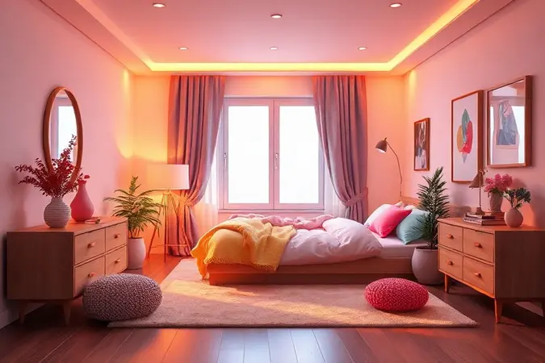
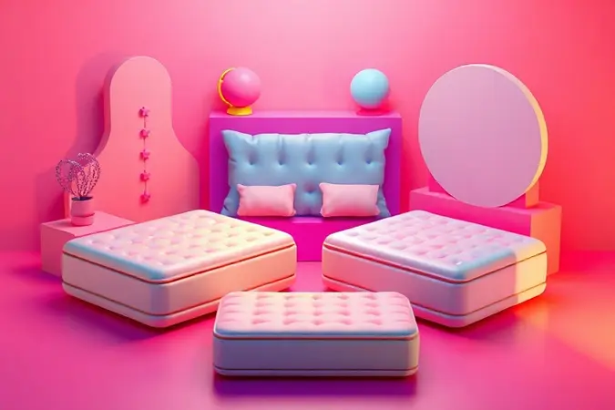

Escolher a cama box ideal parece simples até você se deparar com um mar de tecnologias: molas pocket, espumas viscoelásticas, sistemas magnéticos e mais. Essa confusão tem um preço caro: noites mal dormidas que afetam sua produtividade, humor e saúde.

O que realmente vale a pena investir para transformar seu quarto em um santuário do descanso? Analisamos profundamente os 10 melhores conjuntos do mercado para trazer uma resposta sincera, baseada em marcas consagradas como Castor, Herval e Ortobom.

Prepare-se para descobrir não apenas especificações técnicas, mas o que cada modelo pode fazer pelo seu sono.

<SummaryList products={frontmatter.top_products} />

## Melhores Camas Box: Análise dos Top 10 Modelos de 2024

Imagine acordar realmente revigorado, sem aquela dor nas costas que persiste há semanas. As camas box modernas fazem mais do que apenas suportar seu corpo - elas se adaptam a você.

Nossa análise dos 10 modelos mais relevantes de 2024 vai além das especificações para revelar como cada combinação pode transformar suas noites, considerando desde o conforto imediato até a durabilidade que justifica o investimento.

### 1. Conjunto Box: Colchão Castor de Molas Pocket Viategel SLX + Cama Courino White

<ProductBox 
  title={frontmatter.top_products[0].title} 
  image={frontmatter.top_products[0].image} 
  link={frontmatter.top_products[0].link} 
/>

Se você busca o equilíbrio perfeito entre tecnologia térmica e praticidade, esse conjunto tem algo especial. As molas pocket trabalham individualmente para que seu parceiro possa se virar à noite sem que você precise acordar junto.

Mas o verdadeiro diferencial está na sensação ao deitar: a tecnologia Feran ICE® mantém a superfície fresca mesmo nas noites mais quentes, enquanto o ViscoGel distribui seu peso de forma inteligente.

A Cama Courino White completa a experiência com um design que não exige manutenção - basta passar um pano para mantê-la impecável. O baú integrado resolve aquele problema clássico de onde guardar edredons e cobertores fora de temporada.

Sim, ela tem peso considerável, mas pense nisso como estabilidade: uma base que não balança nem faz barulho com cada movimento.

<CaixaProsContras>

**Prós:**

- Molas pocket que garantem suporte e conforto.

- Tecnologia Feran ICE® para controle térmico.

- Opção de baú para armazenamento extra.

- Design moderno com revestimento em courino.

**Contras:**

- Pode ser pesada para mover.

- O preço tende a ser mais elevado devido à qualidade.

</CaixaProsContras>

### 2. Conjunto Box: Colchão Castor Pocket Gold Star SLX Vitagel Max + Cama Nobuck Cinza

<ProductBox 
  title={frontmatter.top_products[1].title} 
  image={frontmatter.top_products[1].image} 
  link={frontmatter.top_products[1].link} 
/>

Após falarmos de controle térmico, que tal um modelo que cuida também da sua saúde respiratória? Este conjunto traz uma combinação poderosa: conforto adaptativo e proteção contra alergias.

As molas ensacadas criam zonas independentes de suporte, perfeito para casais com diferenças de peso significativas. Enquanto isso, o tratamento antiácaro e antifúngico funciona silenciosamente para tornar seu ambiente de sono mais saudável.

O tecido nobuck cinza não é apenas uma escolha estética - tem uma textura aveludada que convida ao toque e cria uma atmosfera aconchegante.

A firmeza média pode ser uma vantagem para quem busca um meio-termo: nem muito macio a ponto de afundar, nem tão firme que parece dormir no chão.

<CaixaProsContras>

**Prós:**

- Molas ensacadas proporcionam bom suporte e conforto.

- Tecnologias de controle de temperatura aumentam o conforto.

- Estrutura resistente e tratamento antiácaro.

- Acabamento elegante que valoriza o ambiente.

**Contras:**

- Classificação de firmeza média pode não ser ideal para todos.

- Opções de tamanho e altura podem ser limitadas.

</CaixaProsContras>

### 3. Conjunto Box: Colchão Herval de Molas MasterPocket Eruditto c/ Massagem + Cama Nobuck Bege Crema

<ProductBox 
  title={frontmatter.top_products[2].title} 
  image={frontmatter.top_products[2].image} 
  link={frontmatter.top_products[2].link} 
/>

E se sua cama pudesse oferecer uma sessão de relaxamento antes de dormir? Este conjunto transforma seu quarto em um spa pessoal.

O sistema de massagem integrado não é um mero acessório - imagine chegar em casa depois de um dia estressante e poder ativar vibrações suaves que aliviam a tensão muscular enquanto você lê ou assiste TV na cama.

As molas MasterPocket garantem que essa experiência de relaxamento não seja interrompida pelo movimento do parceiro. Já a camada Euro Pillow funciona como um abraço suave, envolvendo seu corpo sem pressioná-lo.

O nobuck bege crema traz um tom neutro que combina com qualquer decoração, criando um ambiente sereno propício ao descanso profundo.

<CaixaProsContras>

**Prós:**

- Tecnologia de molas ensacadas para suporte otimizado.

- Sistema de massagem para relaxamento.

- Camada extra de conforto (Euro Pillow).

- Design elegante em nobuck bege crema.

**Contras:**

- O investimento pode ser alto para alguns orçamentos.

- Pode não ser ideal para quem prefere colchões mais firmes.

</CaixaProsContras>

### 4. Conjunto Box: Colchão Anjos Espuma Ortopédica Confort Magnético + Cama Courino White

<ProductBox 
  title={frontmatter.top_products[3].title} 
  image={frontmatter.top_products[3].image} 
  link={frontmatter.top_products[3].link} 
/>

Para quem prioriza o alívio de dores acima de tudo, essa combinação traz uma abordagem diferente.

As pastilhas magnéticas e a tecnologia infravermelha não são apenas jargões de marketing - trabalham para melhorar a circulação sanguínea enquanto você dorme, potencializando a capacidade natural de recuperação do seu corpo.

O extra firme pode assustar inicialmente, mas para quem sofre com dores lombares ou precisa de apoio máximo, essa firmeza é justamente o que trará alívio.

O tratamento triplo (antiácaro, antibacteriano e antifúngico) transforma o colchão em uma fortaleza contra alergias, ideal para quem espirra ao primeiro sinal de poeira.

<CaixaProsContras>

**Prós:**

- Tecnologia magnética que pode beneficiar a saúde.

- Tratamento antiácaro, antibacteriano e antifúngico.

- Design moderno e fácil de limpar.

- Estrutura firme que suporta até 120 kg por pessoa.

**Contras:**

- Falta de espaço de armazenamento interno.

- O aspecto firme do colchão pode não agradar a todos.

</CaixaProsContras>

### 5. Conjunto Box: Colchão Orthocrin SuperPocket Bellagio + Cama Box Nobuck Bege Crema

<ProductBox 
  title={frontmatter.top_products[4].title} 
  image={frontmatter.top_products[4].image} 
  link={frontmatter.top_products[4].link} 
/>

Se isolamento de movimento é sua prioridade absoluta, este conjunto eleva esse conceito a outro nível. As molas SuperPocket trabalham com tal independência que você pode literalmente pular em um lado da cama sem que o outro lado perceba.

Para casais onde um é muito mais ativo durante o sono, isso significa noites realmente ininterruptas.

A superfície hipoalergênica complementa essa experiência de sono isolado, criando uma bolha de conforto e proteção. O nobuck bege crema mantém essa sensação premium, com um tecido que respira bem e não acumula calor.

Sim, o investimento é significativo, mas quantas noites de sono reparador isso representa ao longo dos anos?

<CaixaProsContras>

**Prós:**

- Molas ensacadas para maior conforto e menor transferência de movimento.

- Propriedades hipoalergênicas e antiácaro.

- Acabamento elegante em nobuck.

- Boa durabilidade e suporte ortopédico.

**Contras:**

- Preço pode ser considerado elevado.

- Pode haver um tempo de adaptação necessário ao colchão.

</CaixaProsContras>

### 6. Conjunto Box: Colchão Herval MasterPocket Imperatore + Cama Box Nobuck Cinza

<ProductBox 
  title={frontmatter.top_products[5].title} 
  image={frontmatter.top_products[5].image} 
  link={frontmatter.top_products[5].link} 
/>

Desenvolvida pela NASA para astronautas, a espuma viscoelástica deste colchão tem uma missão terrestre: adaptar-se perfeitamente ao seu corpo. Ao deitar, ela se molda lentamente, distribuindo a pressão de forma tão uniforme que você quase sente estar flutuando.

Com 34 cm de altura, oferece camadas generosas de conforto que isolam você completamente da base.

A estrutura em eucalipto da cama box é a base sólida que essa experiência premium exige. Enquanto o nobuck cinza mantém a elegância discreta, a madeira de reflorestamento garante que seu investimento seja também uma escolha consciente.

A ausência de baú pode ser contornada com soluções criativas de armazenamento, mas a estabilidade proporcionada compensa essa limitação.

<CaixaProsContras>

**Prós:**

- Conforto excepcional com espuma viscoelástica.

- Molas ensacadas proporcionam bom suporte.

- Design elegante da cama box em tecido nobuck cinza.

- Disponível em vários tamanhos para adequação ao seu espaço.

**Contras:**

- A cama box pode não ter opções de armazenamento.

- Pode ser considerada um investimento mais elevado devido à qualidade.

</CaixaProsContras>

### 7. Conjunto Box: Colchão Sealy de Molas Posturepedic Doux Comfort + Cama Nobuck Rosolare Café

<ProductBox 
  title={frontmatter.top_products[6].title} 
  image={frontmatter.top_products[6].image} 
  link={frontmatter.top_products[6].link} 
/>

Algumas marcas se especializam em criar tradição, e a Sealy traz décadas de pesquisa em suporte postural.

O sistema Posturepedic não é apenas um nome bonito - é uma engenharia pensada para manter sua coluna alinhada naturalmente, mesmo quando você dorme de lado, barriga para cima ou em posições mais incomuns.

O Pillow Top Americano adiciona uma camada de conforto que parece um abraço, enquanto o reforço nas bordas significa que você pode sentar na beirada da cama para calçar os sapatos sem sentir que vai cair.

O baú com sistema basculante é a cereja do bolo: prático sem comprometer a elegância do nobuck rosolare café, uma cor que traz calor ao ambiente sem ser opressiva.

<CaixaProsContras>

**Prós:**

- Conforto elevado com Pillow Top e tecnologia Posturepedic.

- Reforço nas bordas para maior durabilidade do colchão.

- Tratamento antiácaro e antifungo no revestimento.

- Base box com acesso facilitado ao baú.

**Contras:**

- Suporte de peso pode ser limitado para casais mais pesados.

- A estrutura da cama box pode não ser ideal para todos os estilos de decoração.

</CaixaProsContras>

### 8. Conjunto Box: Colchão Ortobom SuperPocket Freedom + Cama Courino White

<ProductBox 
  title={frontmatter.top_products[7].title} 
  image={frontmatter.top_products[7].image} 
  link={frontmatter.top_products[7].link} 
/>

Liberdade é a palavra-chave deste conjunto. Liberdade para se mover sem perturbar. Liberdade para seu corpo encontrar sua posição ideal sem pontos de pressão.

O pillow top em espuma viscoelástica funciona como um amortecedor inteligente, cedendo exatamente onde precisa para aliviar quadris e ombros, áreas que mais sofrem durante o sono.

O courino branco mantém a sensação de leveza e amplitude visual, ideal para quartos menores que precisam parecer maiores.

Quando o baú está disponível, ele se integra tão discretamente que você quase esquece que está lá - até precisar guardar aqueles cobertores pesados de inverno.

<CaixaProsContras>

**Prós:**

- Molas Superpocket que reduzem a transferência de movimento.

- Pillow top em espuma viscoelástica para maior conforto.

- Revestimento em courino white traz sofisticação.

- Opções de baú para armazenamento adicional.

**Contras:**

- Algumas versões da base podem ser pesadas para manusear.

- Não é uma opção mais compacta para espaços pequenos.

</CaixaProsContras>

### 9. Conjunto Box: Colchão Castor Pocket Gold Star Green + Cama Courino White

<ProductBox 
  title={frontmatter.top_products[8].title} 
  image={frontmatter.top_products[8].image} 
  link={frontmatter.top_products[8].link} 
/>

Tecnologias como Niponpedic® e Celliant Sleep® podem soar futuristas, mas seu propósito é simples: melhorar a qualidade do seu sono a nível celular.

Enquanto você descansa, essas tecnologias trabalham na recuperação muscular e na circulação sanguínea, para que você acorde não apenas descansado, mas verdadeiramente revigorado.

As diferentes densidades de espuma criam um mapa de conforto: áreas mais firmes para a região lombar, mais macias para os ombros. O courino branco complementa essa sensação de frescor e limpeza, criando um ambiente que parece renovado a cada manhã.

A altura de 33 cm pode exigir um step para pessoas mais baixas, mas oferece em troca camadas generosas de conforto.

<CaixaProsContras>

**Prós:**

- Conforto com molas ensacadas individualmente.

- Tecnologias que melhoram a circulação e conforto.

- Estilo moderno com revestimento em courino.

- Opção de armazenamento em baú disponível.

**Contras:**

- O preço pode ser elevado em comparação a outras opções no mercado.

- A altura do colchão pode ser considerada excessiva para alguns usuários.

</CaixaProsContras>

### 10. Conjunto Box: Colchão Herval Molas Ensacadas MasterPocket Versatto + Cama Nobuck Rosolare Café

<ProductBox 
  title={frontmatter.top_products[9].title} 
  image={frontmatter.top_products[9].image} 
  link={frontmatter.top_products[9].link} 
/>

Para fechar nossa lista com chave de ouro, um conjunto que une tudo o que discutimos: isolamento de movimento perfeito, conforto premium e design que transforma o quarto.

O Pillow Top Europeu tem uma construção diferente do americano - mais refinada, com camadas que trabalham em harmonia para suporte e maciez simultâneos.

O nobuck rosolare café tem um tom terroso que transmite estabilidade e aconchego, perfeito para criar um refúgio do mundo exterior. O suporte de 110 kg por pessoa garante que o investimento dure anos, mantendo suas propriedades mesmo com uso intensivo.

Quando o estilo e a funcionalidade precisam coexistir em harmonia, este conjunto mostra como fazer isso com maestria.

<CaixaProsContras>

**Prós:**

- Molas ensacadas que garantem conforto e independência de movimentos.

- Material de alta qualidade com tratamento antiácaro.

- Design elegante que se destaca na decoração.

- Suporte de peso significativo, garantindo durabilidade.

**Contras:**

- O preço pode ser elevado em comparação a opções mais simples.

- Pode não ser ideal para quem prefere colchões mais firmes.

</CaixaProsContras>

## Guia de Compra: Como escolher a cama box ideal para suas necessidades

Depois de explorar os 10 melhores modelos, como transformar essa informação em uma decisão inteligente?

Escolher sua cama box vai além de comparar especificações - é sobre entender como você dorme, como seu corpo responde ao apoio e que tipo de experiência transformará suas noites.

### Diferença entre o tamanho dos colchões: Solteiro, Casal, Queen e King

Pense no tamanho como espaço para viver, não apenas para dormir. Um solteiro (88x188 cm) é funcional para crianças ou quartos de hóspedes, mas limite-se quando o conforto é prioridade.

O casal tradicional (138x188 cm) funciona, mas será que é suficiente quando você quer esticar os braços sem tocar no parceiro?

É aqui que Queen (158x198 cm) e King (193x203 cm) fazem a diferença. Esses centímetros extras representam liberdade: espaço para cada um ter seu lado da cama de verdade, para não brigar por cobertor, para não acordar quando o outro se vira.

Se seu quarto permite, invista no maior tamanho possível - seu relacionamento com o sono agradece.

### Qual é o melhor colchão para a coluna?

Sua coluna não quer firmeza absoluta nem uma nuvem macia. Ela busca apoio inteligente que mantenha sua curvatura natural em qualquer posição.

Espumas viscoelásticas e látex são especialistas nisso: cedem nos pontos de pressão (quadris, ombros) enquanto sustentam a região lombar.

O segredo está no equilíbrio. Muito firme e suas articulações sofrem; muito macio e sua coluna perde o apoio. Pense no seu peso: pessoas mais pesadas geralmente precisam de mais firmeza para evitar afundamento excessivo.

Lembre-se do que vimos nos modelos analisados - tecnologias como molas pocket com zonas diferenciadas podem ser a resposta para um apoio personalizado.

### O que são molas bonnel e molas pocket (ensacadas)?

Imagine duas filosofias de suporte. As molas bonnel trabalham em conjunto, como uma equipe que se move uniformemente. São eficientes, acessíveis e oferecem firmeza consistente. Perfeitas para quem prefere sensação tradicional e orçamento mais controlado.

Agora, as molas pocket são solistas em uma orquestra. Cada uma trabalha independentemente, respondendo apenas à pressão que recebe. Essa independência significa que seu quadril afunda enquanto seus ombros recebem apoio diferente, tudo adaptado à sua forma única.

Para casais, essa tecnologia é revolucionária: o movimento de um lado não se propaga para o outro. Depois de experimentar, dificilmente você voltará atrás.

### Como escolher o colchão ideal para pessoas com mais de 100 kg?

Peso não é problema quando o colchão é projetado para lidar com ele. O segredo está na densidade: busque números acima de 28D para espumas, que indicam maior resistência e durabilidade.

Molas ensacadas são aliadas naturais, pois distribuem a pressão de forma mais inteligente que sistemas tradicionais.

Firmeza média-alta costuma funcionar melhor, prevenindo que o colchão ceda excessivamente com o tempo. Observe também a garantia - marcas sérias oferecem cobertura mais longa para modelos projetados para pesos maiores.

Dos que analisamos, vários suportam 120 kg ou mais por pessoa, projetados justamente para essa realidade.

### Cama Box Conjugada ou Separada: Qual a melhor opção?

A resposta depende do que você valoriza mais: praticidade imediata ou flexibilidade futura. Conjugadas entregam instalação rápida e visual integrado, perfeito para quem quer solução completa sem complicações.

Separadas, por outro lado, dão opções interessantes: você pode substituir apenas o colchão quando necessário, ajustar a altura combinando diferentes bases e, para casais com preferências opostas, ter firmezas diferentes em cada lado.

O transporte também fica mais simples - peças menores cabem em elevadores e escadas apertadas.

## Conclusão

Escolher sua cama box não é sobre buscar o modelo tecnicamente perfeito, mas sim aquele que dialoga com suas necessidades únicas de sono.

Ao longo desta análise, você viu como tecnologias aparentemente complexas - molas pocket, controle térmico, sistemas de massagem - traduzem-se em benefícios concretos: noites sem interrupções, acordar sem dores, um ambiente que convida ao descanso profundo.

Cada um dos 10 modelos apresentados tem sua personalidade: alguns brilham no isolamento de movimento, outros no alívio de dores, outros ainda na integração com sua decoração.

O investimento pode parecer significativo, mas divida o valor pelo número de noites de sono reparador que você terá nos próximos anos - o custo por noite torna-se irrisório quando comparado ao valor de acordar revigorado todos os dias.

Sua próxima decisão não é apenas qual cama comprar, mas que qualidade de vida você deseja ter todas as manhãs. Qual desses conjuntos conversa com as noites que você merece ter?