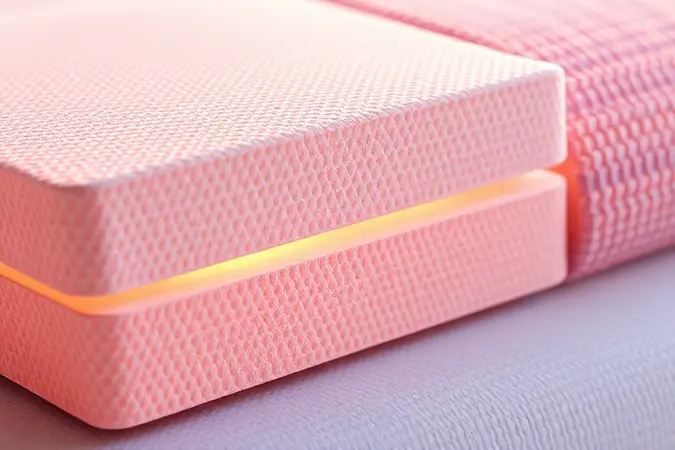
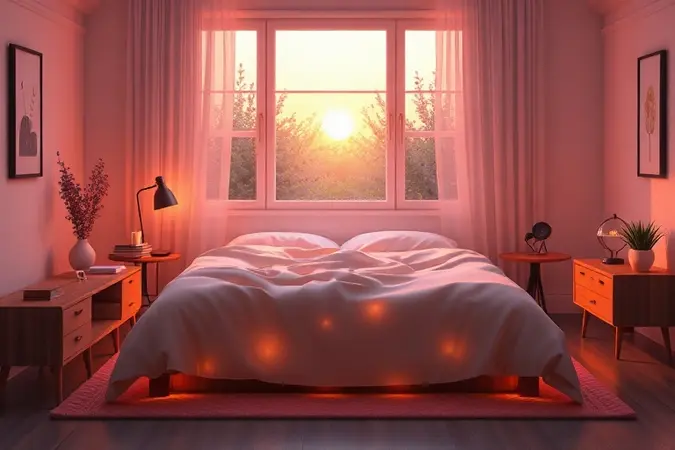

Está em dúvida se o conjunto box Reconflex é bom e se vale o investimento para suas noites de sono? Escolher o colchão ideal envolve analisar desde a densidade da espuma até o tipo de molejo, e a Reconflex é uma marca que desperta curiosidade pelo seu custo-benefício.

Neste artigo, vamos mergulhar nas especificações técnicas dos modelos mais vendidos, como o Rubi Pro e o Chess, além de verificar a reputação da marca no Reclame Aqui.

Prepare-se para uma análise sincera que ajudará você a decidir se a Reconflex é a escolha certa para o seu descanso.

<SummaryList products={frontmatter.top_products} />

## Análise da Marca: A Cama Reconflex é Boa?

Imagine encontrar uma marca que realmente entende que cada corpo dorme de um jeito diferente. A Reconflex constrói essa experiência no DNA de seus produtos, combinando tecnologia avançada com uma compreensão profunda do que significa descansar de verdade.

Eles não apenas oferecem opções que variam do firme ao suave, mas criam soluções que mantêm sua qualidade intacta ano após ano.

O segredo está em como eles traduzem materiais técnicos em conforto palpável, pensando tanto em quem precisa de suporte para a coluna quanto em quem busca aquele abraço macio ao deitar.

Antes de mergulharmos nos modelos específicos, entenda: essa marca nasceu para resolver problemas reais do sono, não apenas para vender colchões.

## Análise dos Melhores Modelos de Cama Reconflex

Quando você encontra o modelo certo, algo mágico acontece: você para de pensar na cama e simplesmente dorme. A Reconflex oferece essa experiência através de três caminhos principais, cada um com sua personalidade única.

### Cama Box Reconflex Chess Molas Ensacadas

<ProductBox 
  title={frontmatter.top_products[0].title} 
  image={frontmatter.top_products[0].image} 
  link={frontmatter.top_products[0].link} 
/>

Este é o clássico que transforma noites compartilhadas em momentos de paz individual.

As molas ensacadas funcionam como pequenos sistemas independentes que entendem exatamente onde seu corpo precisa de apoio, criando uma barreira invisível contra a transferência de movimentos.

Você já sabe aquele momento em que seu parceiro vira na cama e você sente tudo? Com o Chess, isso simplesmente deixa de existir.

A estrutura em madeira de reflorestamento traz robustez sem pesar na consciência, enquanto o revestimento com propriedades antiácaro e antifungos cria um ambiente que respira saúde.

Com aproximadamente 52 cm de altura total, ele se adapta com elegância ao seu quarto, oferecendo um suporte que varia entre 90 kg e 120 kg por pessoa.

<CaixaProsContras>

**Prós:**

- Conforto excepcional com suporte anatômico.

- Molas ensacadas que reduzem a transferência de movimentos.

- Revestimento com propriedades antiácaro e antifungos.

- Estrutura robusta em madeira de reflorestamento.

**Contras:**

- Suporte de peso pode não atender pessoas muito pesadas.

- Algumas variações podem ter diferenças significativas nas especificações.

</CaixaProsContras>

### Cama Box Reconflex Rubi Pro

<ProductBox 
  title={frontmatter.top_products[1].title} 
  image={frontmatter.top_products[1].image} 
  link={frontmatter.top_products[1].link} 
/>

Se você busca praticidade sem abrir mão da qualidade, o Rubi Pro é aquele amigo que entrega tudo prometido.

A integração perfeita entre box e colchão elimina aquela dor de cabeça de combinar peças separadas, enquanto a espuma D28 garante uma firmeza que respeita suas curvas sem ceder ao primeiro sinal de uso.

A certificação do INMETRO não é apenas um selo na embalagem, é a garantia de que cada noite será apoiada por materiais testados e aprovados.

A capacidade entre 80 kg e 100 kg por pessoa abraça a maioria dos perfis, e a estrutura em madeira de reflorestamento combinada com tecido poliéster cria uma dupla durável que enfrenta o tempo com dignidade.

<CaixaProsContras>

**Prós:**

- Conforto avançado com espumas de alta densidade.

- Certificação do INMETRO garantindo qualidade.

- Estrutura robusta em madeira de reflorestamento.

- Boa capacidade de peso para diferentes usuários.

**Contras:**

- Pode não ser a melhor opção para quem busca um colchão mais macio.

- Dimensões variadas podem não atender todos os tipos de espaço.

</CaixaProsContras>

### Colchão Reconflex Prisma Molas Ensacadas

<ProductBox 
  title={frontmatter.top_products[2].title} 
  image={frontmatter.top_products[2].image} 
  link={frontmatter.top_products[2].link} 
/>

Para quem prefere a liberdade de escolher sua base separadamente, o Prisma traz as mesmas molas ensacadas do Chess em um formato independente.

A tecnologia pillow top funciona como aquele abraço extra que alivia a pressão nos ombros e quadris, enquanto o tecido em malha mantém sua temperatura regulada mesmo nas noites mais quentes.

Imagine deitar e sentir seu corpo afundar levemente, apenas o suficiente para esquecer que existe um mundo lá fora. É essa sensação que o Prisma oferece, com bordas reforçadas que garantem que o conforto não termine onde a cama começa.

<CaixaProsContras>

**Prós:**

- Molas ensacadas que reduzem a transferência de movimento.

- Camada pillow top para maior conforto.

- Tecido em malha suave que melhora a sensação térmica.

- Ótima durabilidade com reforço nas bordas.

**Contras:**

- Possibilidade de afundamento após cerca de um ano de uso.

- Pode ser menor que a base da cama box em alguns casos.

</CaixaProsContras>

## Tecnologia de Espuma e Tecidos Especiais

O que diferencia uma noite comum de um verdadeiro descanso está nos detalhes que você não vê.

A tecnologia de espuma da Reconflex funciona como um mapa tridimensional do seu corpo, moldando-se para distribuir o peso de forma inteligente e aliviar pontos de pressão que nem sabia que existiam.

Mas o verdadeiro segredo está na combinação: espumas que entendem sua anatomia com tecidos que respiram junto com você.

Essa sinergia mantém a temperatura ideal, evitando aquela sensação de calor abafado que rouba o sono profundo.

É como se o colchão soubesse quando você precisa de frescor e quando precisa de aconchego, adaptando-se não apenas ao seu corpo, mas também ao clima da sua noite.

## Tecnologia de Mola da Reconflex

As molas ensacadas são a alma dos modelos Chess e Prisma, e entender como elas funcionam explica por que tantas pessoas dormem melhor com a Reconflex.

Cada mola vive em seu próprio compartimento, trabalhando de forma independente para oferecer um suporte personalizado que acompanha cada movimento do seu corpo durante a noite.

Isso significa que seu quadril recebe exatamente a firmeza que precisa, enquanto seus ombros encontram o acolhimento perfeito, tudo ao mesmo tempo.

E o melhor: quando você se mexe, apenas as molas envolvidas naquele movimento respondem, mantendo o resto da cama em paz perfeita.

Para casais, é a solução para noites inteiras sem interrupções, onde cada um dorme como se estivesse sozinho, mas com o calor de estar junto.

## Como Escolher o Colchão Ideal para Você

Escolher um colchão é como encontrar um par de sapatos perfeito: precisa se ajustar ao seu jeito único de ser. Comece observando como você dorme. Se você é daqueles que dorme de lado, imagine seu corpo precisando de um abraço mais generoso nos ombros e quadris.

Já quem dorme de costas ou de barriga para cima geralmente busca uma superfície que mantenha a coluna em perfeito alinhamento, sem curvas indesejadas.

O teste na loja é essencial, mas vá além dos cinco minutos tradicionais. Deite-se na posição que dorme, fique quieto por um tempo e preste atenção: seu corpo sente apoio ou resistência? A sensação é de conforto ou estranheza?

Materiais como viscoelástico e látex oferecem abraços diferentes, enquanto as molas trazem uma estrutura mais definida.

E não se esqueça de perguntar sobre a garantia, porque um bom investimento em sono é aquele que acompanha você por muitos anos, não apenas algumas noites.

## A Reputação da Reconflex no Reclame Aqui é Boa?

Antes de confiar seu sono a qualquer marca, é natural querer saber o que outras pessoas já viveram. No Reclame Aqui, a Reconflex constrói sua reputação não apenas com produtos, mas com respostas.

A maioria dos relatos celebra a qualidade que encontrou, enquanto eventuais problemas com prazos de entrega costumam encontrar soluções rápidas.

O que mais impressiona é a consistência: a empresa não apenas aparece quando algo dá errado, mas mantém um diálogo aberto com seus clientes, transformando feedback em melhorias reais.

Essa atitude proativa mostra uma marca que não vende apenas colchões, mas assume responsabilidade pelo descanso que promete entregar.

## Conclusão

No final de tudo, a pergunta não é apenas se a Reconflex é boa, mas se ela é boa para você.

Os modelos Chess e Rubi Pro provam que é possível unir tecnologia inteligente com um conforto que se adapta ao seu corpo, enquanto o Prisma oferece liberdade de escolha sem abrir mão da qualidade.

As tecnologias de espuma e molas ensacadas não são apenas especificações técnicas, são promessas cumpridas de noites mais tranquilas.

A reputação positiva no Reclame Aqui e o compromisso com materiais sustentáveis completam um quadro de marca que entende que investir em sono é investir em qualidade de vida.

Se você busca um equilíbrio entre custo-benefício, durabilidade e aquele conforto que faz diferença ao acordar, a Reconflex merece seu teste pessoal. Visite uma loja, sinta cada modelo e descubra qual deles conversa com o seu jeito de dormir.

Porque no final das contas, a melhor cama não é a mais cara ou a mais tecnológica, é aquela que faz você esquecer que está deitado nela.