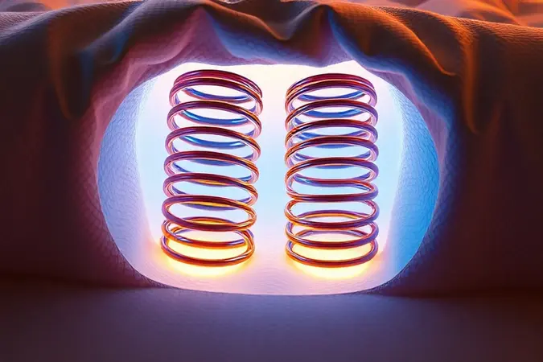
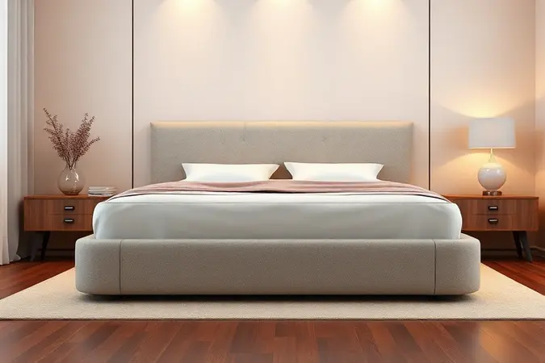

Você já se perguntou como seria dormir sem precisar se preocupar se seu movimento vai acordar seu companheiro? Ou sonha com uma cama que ofereça suporte firme sem sacrificar o conforto?

A escolha de uma cama queen-size é mais que uma simples compra: é um investimento em noites de sono verdadeiramente reparadoras, e entender se a Cama Box Queen Plumatex Turim Maxx vale a pena passa justamente por esses detalhes que transformam o descanso.

Em meio a tantas opções no mercado, surgem dúvidas naturais: o suporte é realmente firme o suficiente para aliviar dores nas costas? O sistema de molas ensacadas faz diferença real na prática?

E será que a proteção contra ácaros funciona de verdade para quem tem alergias? Nesta análise sincera, desmontamos cada aspecto técnico deste modelo da Plumatex não apenas com dados, mas com a perspectiva de quem vive todas essas perguntas no dia a dia.

<SummaryList products={frontmatter.top_products} />

## O que é a Cama Box Queen Plumatex Turim Maxx?

<ProductBox 
  title={frontmatter.top_products[0].title} 
  image={frontmatter.top_products[0].image} 
  link={frontmatter.top_products[0].link} 
/>

Imagine um colchão que entende que cada pessoa na cama tem necessidades diferentes.

Isso é exatamente o que a Plumatex Turim Maxx traz: molas ensacadas individualmente que trabalham como pequenos sistemas de apoio independentes, adaptando-se ao seu corpo enquanto garantem que o movimento do seu lado não chegue ao outro lado da cama.

Com 65cm de altura total, considerando o box,  ela se apresenta com uma firmeza que agrada quem busca suporte consistente para a coluna.

O diferencial prático vem com a tecnologia No Turn One-Side, que elimina aquela tarefa chata de virar o colchão a cada seis meses.

Enquanto isso, o revestimento em malha Kronos oferece uma sensação suave ao toque, e a base em madeira usinada de pinus assegura que nada balance ou range durante a noite.

Para completar, ele suporta até 120kg por pessoa e traz proteção especial contra ácaros, fungos e bactérias, uma combinação que promete facilitar sua vida e proteger sua saúde.

É verdade que alguns usuários encontram essa firmeza mais acentuada do que gostariam. Mas se você sempre priorizou um apoio robusto que mantém a postura alinhada durante o sono, pode considerar essa característica uma vantagem, não um problema.

<CaixaProsContras>

**Prós:**

- Molas ensacadas oferecem bom conforto e suporte.

- Tecnologia No Turn facilita a manutenção.

- Boa proteção contra ácaros, fungos e bactérias.

- Estrutura robusta com suporte para até 120kg por pessoa.

**Contras:**

- Pode ser considerado duro por alguns usuários.

- Não possui camada espessa de espuma, dependendo da apreciação individual.

</CaixaProsContras>

## Ficha Técnica: Cama Box Queen Plumatex Turim Maxx

Por trás do nome técnico está uma estrutura pensada para durar. A base em madeira usinada oferece a estabilidade que evita aqueles rangidos desagradáveis no meio da noite, enquanto as espumas de alta densidade trabalham para distribuir seu peso de forma uniforme.

O revestimento não é apenas um detalhe estético: vem com tratamento antiácaro e antialérgico que transforma seu quarto num ambiente mais seguro para respirar profundamente.

Nas dimensões queen size, há espaço suficiente para casais que valorizam sua liberdade de movimento, sem que um invada o espaço do outro.

E apesar de toda essa funcionalidade, o design contemporâneo se encaixa naturalmente em diferentes estilos de decoração, prova de que praticidade e estética podem, sim, caminhar juntas.

## Molas Ensacadas Individualmente: o diferencial para casais

Você já foi acordado porque seu parceiro se virou na cama? Ou sentiu a cama balançar a cada movimento?

As molas ensacadas individualmente resolvem exatamente isso: cada unidade opera de forma independente, como pequenos sistemas de amortecimento que contêm o movimento dentro do seu próprio espaço.

Isso significa que você pode mudar de lado durante a noite sem que seu companheiro perceba, uma verdadeira revolução na dinâmica de sono a dois.

Mas os benefícios vão além da tranquilidade noturna: esse sistema também oferece suporte pontual onde seu corpo mais precisa, ajudando a manter a coluna alinhada independentemente da posição em que você dorme.

Para casais com ritmos diferentes de descanso, essa tecnologia não é apenas um detalhe técnico: é o que permite que ambos encontrem seu próprio conforto sem negociar o sono um do outro.

## Sistema No Turn One-Side: praticidade sem virar o colchão

Lembra daquela recomendação de virar o colchão regularmente que quase ninguém segue? Com o sistema No Turn One-Side, você pode esquecer completamente essa obrigação.

O colchão foi projetado para manter sua forma e suporte sempre do mesmo lado, eliminando a necessidade de virá-lo periodicamente.

Imagine a praticidade: sem precisar desmontar a cama, pedir ajuda ou tentar equilibrar um colchão pesado em espaços apertados.

Essa não é apenas uma questão de conveniência, o sistema foi desenvolvido para prolongar a vida útil do produto, mantendo suas propriedades de conforto por mais tempo.

Para quem valoriza tempo e simplicidade, esta tecnologia representa um alívio concreto na rotina de cuidados com a casa.

## Proteção Antiácaro, Antifungo e Antibactérias: saúde no sono

Respirar melhor durante a noite pode fazer toda a diferença na qualidade do seu descanso, e na sua energia ao acordar.

A proteção integrada da Turim Maxx contra ácaros, fungos e bactérias cria uma barreira invisível que transforma seu colchão num ambiente mais seguro para seu sono.

Para quem convive com alergias ou sensibilidade respiratória, esse tratamento especial não é um luxo, mas uma necessidade.

Os alérgenos que se acumulam em colchões tradicionais podem desencadear espirros, coceiras e noites mal dormidas, mesmo que você não perceba conscientemente.

Aqui, a tecnologia funciona de forma preventiva: ao inibir o desenvolvimento desses agentes, o colchão mantém suas propriedades higiênicas por mais tempo, protegendo tanto sua saúde quanto seu investimento a longo prazo.

## 65cm de Altura: ergonomia e design para o quarto

Há uma diferença sutil entre simplesmente deitar numa cama e sentir que está entrando num espaço de descanso próprio.

Os 65cm de altura da Turim Maxx criam exatamente essa sensação: uma presença elegante no quarto que facilita o acesso sem exigir esforço para entrar ou sair.

Para pessoas com mobilidade reduzida ou quem simplesmente não gosta de se abaixar muito, essa altura representa independência.

Mas não se engane: além da ergonomia, há uma consciência estética que faz com que a cama dialogue naturalmente com diferentes estilos de decoração, do contemporâneo ao mais clássico.

A combinação entre forma e função aqui é calculada: você ganha beleza visual sem abrir mão da praticidade no dia a dia.

## Plumatex Turim Maxx vs principais concorrentes

Quando olhamos para o mercado, o que realmente diferencia a Turim Maxx não é apenas uma característica isolada, mas como ela equilibra vários aspectos.

Enquanto algumas marcas focam em materiais premium que elevam o preço, a Plumatex mantém um custo-benefício que não sacrifica durabilidade.

A construção robusta evita rangidos que podem incomodar em outros modelos, e o sistema de molas ensacadas oferece isolamento de movimento comparável a opções mais caras.

É importante notar que concorrentes diretos podem oferecer camadas extras de conforto, mas a Turim Maxx responde com uma firmeza consistente que muitos buscam especificamente para alívio de dores nas costas.

No fim, trata-se de uma opção que sabe seu lugar: não tenta ser o colchão mais luxuoso do mercado, mas entrega confiabilidade e funcionalidade onde realmente importa.

## Vale a Pena Comprar a Cama Box Queen Plumatex Turim Maxx em 2026?

Decidir se esse modelo faz sentido para você depende menos de especificações técnicas e mais do que você busca num espaço de descanso.

Se você prioriza firmeza consistente que apoia a coluna, se valoriza não acordar com cada movimento do seu parceiro, e se quer praticidade na manutenção sem precisar virar o colchão, a Turim Maxx apresenta argumentos convincentes.

A proteção contra alérgenos é um diferencial real para famílias com crianças ou quem sofre com alergias, e a altura de 65cm entrega ergonomia que faz diferença no dia a dia.

Entretanto, se seu conceito de conforto inclui colchões mais macios com sinking-in profundo, pode sentir que a proposta foca mais no suporte que no aconchego.

Como sempre, experimentar antes de comprar revela mais do que qualquer análise, especialmente quando se trata da intimidade do sono.

## Perguntas Frequentes sobre a Cama Box Queen Plumatex Turim Maxx

A dúvida mais comum gira em torno do nível de conforto: será que é realmente firme demais? A resposta varia com suas preferências, mas usuários que buscam alívio para dores nas costas frequentemente elogiam justamente essa característica.

Sobre durabilidade, a estrutura robusta e o sistema No Turn One-Side trabalham a favor da longevidade, mas como qualquer produto, depende de cuidados básicos como usar um protetor de colchão e manter o ambiente ventilado.

A montagem surpreende pela simplicidade, a maioria das pessoas consegue finalizar o processo sem ajuda profissional ou ferramentas especiais.

E para quem se preocupa com estética, as opções de cores e tecidos permitem personalizar o visual para combinar com qualquer quarto.

## Conclusão

Escolher uma cama é sempre uma decisão íntima, envolve seu corpo, seus hábitos de sono e a forma como você quer começar cada dia.

A Cama Box Queen Plumatex Turim Maxx se posiciona como uma alternativa inteligente para quem valoriza suporte firme, praticidade na manutenção e proteção contra alérgenos, tudo dentro de um custo-benefício equilibrado.

Se você já cansou de colchões que cedem rápido, ou se cansa de negociar espaço e movimento com seu parceiro, essa pode ser a solução que procurava.

As molas ensacadas oferecem isolamento real de movimento, a tecnologia No Turn One-Side elimina uma tarefa doméstica chata, e a proteção antiácaro cria um ambiente mais seguro para seu descanso.

No entanto, se sua busca é por um afundamento mais profundo ou um toque mais acolhedor imediato, vale experimentar antes de decidir.

O que importa, no fim, é encontrar o equilíbrio certo entre suas necessidades físicas, seu estilo de vida e seu orçamento, e a Turim Maxx oferece argumentos sólidos para entrar nessa conversa.