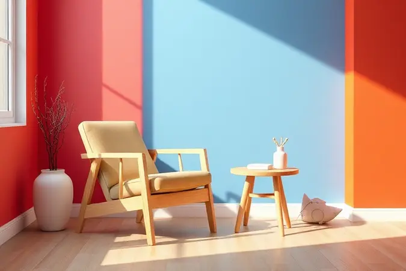
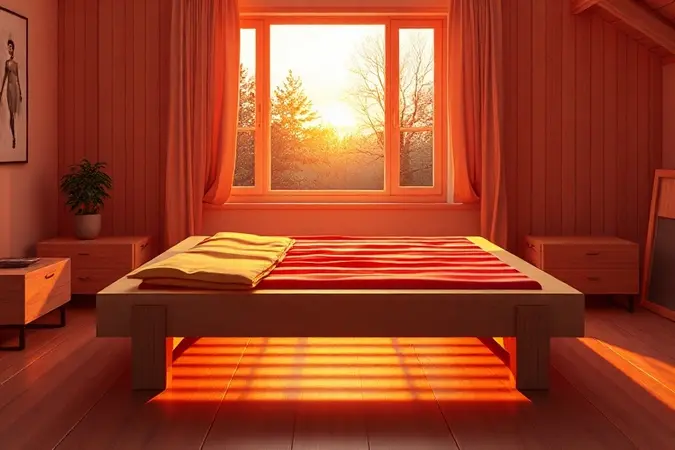
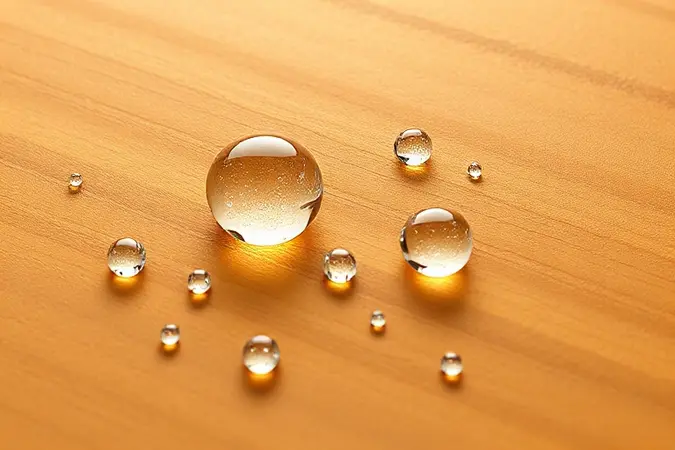
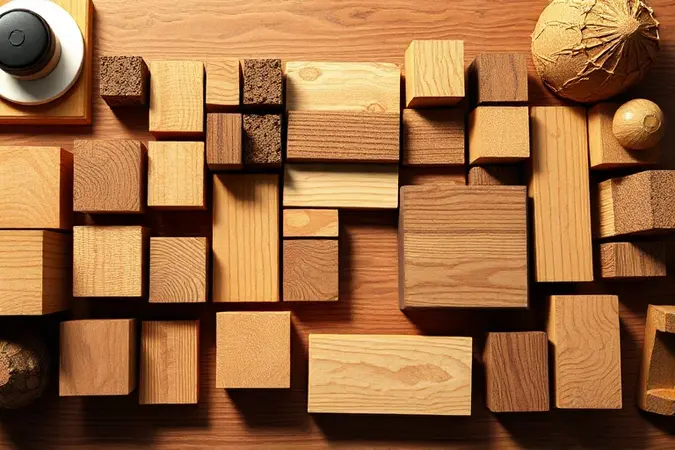

A madeira pinus conquistou seu espaço no mercado de mobiliário brasileiro, especialmente em móveis modulares e decorações de estilo industrial ou escandinavo. Mas, diante de tanta oferta, surge aquela dúvida sincera: o pinus é realmente bom ou apenas barato?

Vamos mergulhar nas características desse material, avaliar sua resistência para itens pesados como camas e compará-lo com o eucalipto.

Se você está planejando comprar ou mesmo fabricar seus próprios móveis, descubra aqui se o pinus é a escolha certa para seu projeto e quais cuidados garantem que ele acompanhe você por muitos anos.

<SummaryList products={frontmatter.top_products} />

## O que é madeira pinus e por que ela é uma tendência?

<ProductBox 
  title={frontmatter.top_products[0].title} 
  image={frontmatter.top_products[0].image} 
  link={frontmatter.top_products[0].link} 
/>

Originária das árvores do gênero Pinus, essa madeira ganhou destaque não apenas pela estética. Com sua cor clara e textura fina, ela se transforma em projeto de forma quase intuitiva, tornando-a a companheira ideal para quem gosta de colocar a mão na massa.

Imagine poder criar peças que combinam perfeitamente com seu estilo, seja ele industrial, escandinavo ou algo totalmente seu.

A sustentabilidade é outro ponto forte: muitas espécies vêm de reflorestamento, oferecendo baixo impacto ambiental. E aqui está a vantagem que realmente faz diferença no dia a dia: o custo-benefício, que permite ter qualidade sem comprometer o orçamento.

Quando tratada adequadamente, a madeira de pinus pode durar entre 15 a 50 anos, dependendo do ambiente. Mas atenção: esse tratamento não é só uma recomendação, é essencial para proteger contra pragas e umidade.

Pense nisso como um investimento que rende anos de beleza e funcionalidade.

<CaixaProsContras>

**Prós:**

1. Sustentável e com baixo impacto ambiental.

2. Custo-benefício acessível.

3. Fácil manuseio e versatilidade de uso.

4. Estética agradável, combinando com diversos estilos.

**Contras:**

1. Requer tratamentos regulares contra pragas e umidade.

2. Pode apresentar nós e fissuras, características naturais que podem não agradar a todos.

</CaixaProsContras>

## Quais são as vantagens de usar madeira pinus em móveis?

Pense na última vez que você tentou mover um móvel pesado. Agora imagine uma alternativa que torna essa tarefa simples. O pinus oferece precisamente isso: leveza que se transforma em praticidade no dia a dia, aliada a uma estética natural que se adapta ao seu estilo.

### Baixo investimento e excelente custo-benefício

Escolher pinus significa liberdade financeira para criar. É aquela sensação de poder renovar seu espaço sem passar semanas calculando cada centavo. Essa economia inicial não compromete a qualidade: quando bem cuidada, ela oferece durabilidade que surpreende pelo preço.

A versatilidade é outro trunfo: como pode ser moldada com facilidade, você não fica preso a designs prontos. Ela se adapta à sua visão, permitindo projetos personalizados que refletem sua personalidade.

### Sustentabilidade e procedência de reflorestamento

Cada peça de pinus que você escolhe carrega uma história positiva. Muitas florestas são cultivadas em projetos certificados, transformando áreas degradadas em pulmões verdes.

Saber que seu móvel contribui para a biodiversidade oferece uma satisfação que vai além da estética.

Ao optar por madeiras com certificação adequada, você vira protagonista de um ciclo sustentável, onde o consumo consciente apoia práticas que respeitam o futuro do planeta.

### Versatilidade e facilidade de manuseio

Já imaginou criar uma estante no fim de semana sem precisar de ferramentas profissionais? Com o pinus, isso se torna realidade. Sua leveza elimina aquela batalha contra o peso, permitindo que tanto experientes quanto iniciantes transformem ideias em objetos concretos.

Essa acessibilidade técnica se traduz em liberdade criativa: corte, molde e trate conforme sua visão, alternando entre acabamentos rústicos e modernos com a mesma base. É a praticidade que inspira criação.

### Alta durabilidade em ambientes internos

Dentro de casa, o pinus revela sua resistência surpreendente. Tratado adequadamente, ele enfrenta pragas e fungos com eficiência, garantindo que sua mobília permaneça intacta por anos.

A estabilidade dimensional é outro superpoder: mudanças de temperatura e umidade não a deformam facilmente, mantendo alinhamentos perfeitos.

Para potencializar essa longevidade, vernizes ou selantes funcionam como escudos invisíveis, protegendo a beleza natural enquanto entregam funcionalidade duradoura.

## Madeira pinus é boa para cama?

Acredite: dormir bem também começa pela estrutura que suporta seu colchão. O pinus é uma escolha popular para camas não por acaso.

Sua leveza facilita montagens e mudanças, enquanto o custo-benefício permite investir em um colchão de qualidade sem extrapolar o orçamento total.

O acabamento suave oferece aquele toque rústico e acolhedor que transforma o quarto em refúgio. Porém, reconhecemos sua característica mais macia: ela pode registrar histórias na forma de pequenos arranhões.

Mas esses 
"marcos" não são problemas, são prevenidos com cuidados simples: manter afastada da umidade excessiva e usar protetores adequados. Essas pequenas atenções garantem que sua cama pinus seja testemunha de muitas noites de descanso revitalizante.

## Qual é mais resistente: pinus ou eucalipto?

A escolha entre pinus e eucalipto depende do que você prioriza. O pinus conquista pela leveza e maleabilidade, ideal para quem valoriza facilidade de trabalho e orçamento mais flexível.

Já o eucalipto apresenta densidade superior, oferecendo robustez que brilha em estruturas que exigem máxima durabilidade, especialmente em ambientes externos.

Pense assim: se você busca praticidade e custo acessível para projetos internos, o pinus é seu aliado. Se precisa de resistência extra para suportar intempéries ou cargas pesadas, o eucalipto assume a dianteira.

Independente da escolha, o tratamento adequado transforma ambas em companheiras de longa data.

## Tabela comparativa: madeira pinus vs eucalipto para cama

Para visualizar a diferença de forma prática:

| Característica | Pinus | Eucalipto |
|----------------|-------|-----------|
| Peso | Leve | Moderado a pesado |
| Densidade | Menor | Maior |
| Custo | Mais acessível | Geralmente mais caro |
| Durabilidade | Boa com tratamento | Muito boa |
| Facilidade de trabalho | Alta | Média |
| Ideal para | Orçamento controlado e projetos internos | Durabilidade máxima e uso externo |

O pinus oferece o equilíbrio perfeito entre leveza e custo, enquanto o eucalipto entrega resistência superior para quem prioriza longevidade acima de tudo.

Ambos aceitam tratamentos contra insetos e umidade, mas a densidade do eucalipto lhe confere vantagem natural nessa proteção.

## Quais são os cuidados essenciais que a madeira pinus exige?

Cuidar do pinus é como manter uma planta: atenção regular garante vitalidade prolongada. Tratamentos com fungicidas não são burocracia, são investimentos em anos extras de beleza. Imagine proteger seu móvel como protege sua saúde: com prevenção inteligente.

### Impermeabilização e tratamento com fungicida

A impermeabilização é o guarda-chuva invisível do seu pinus. Ela bloqueia a absorção de água, impedindo que mofo e deterioração roubem a vitalidade da madeira. Já o fungicida atua como sistema imunológico, afastando fungos e insetos antes que causem danos.

Aplicar esses produtos regularmente, especialmente sob variações climáticas, transforma manutenção em garantia de durabilidade. É a diferença entre um móvel que envelhece e um que amadurece com elegância.

### Proteção contra exposição ao sol e umidade

Sol e umidade são os maiores desafios para qualquer madeira. Para o pinus, a proteção começa com acabamentos específicos: vernizes ou tintas que criam barreiras protetoras.

Essa camada extra não só preserva a cor natural, evitando desbotamentos indesejados, como também bloqueia o apodrecimento precoce. Manutenção regular, incluindo limpeza suave e reaplicação periódica, mantém essas defesas sempre ativas.

Pense nisso como um ritual de carinho que seu móvel retorna em anos de serviço fiel.

## Como escolher madeira para móveis: checklist prático

Transformar a escolha da madeira em decisão certeira envolve cinco passos simples:

1.  **Identifique seu estilo:** O pinus brilha em ambientes industriais e escandinavos, mas também se adapta a outras estéticas com o acabamento certo.

2.  **Avalie o uso:** Para móveis internos de uso moderado, o pinus oferece excelente equilíbrio. Para peças externas ou de muito desgaste, considere madeiras mais densas.

3.  **Verifique procedência:** Certificações de sustentabilidade garantem que sua escolha respeita o meio ambiente.

4.  **Planeje o tratamento:** Inclua no orçamento os produtos de impermeabilização e proteção como parte essencial do projeto.

5.  **Visualize o conjunto:** A madeira deve conversar com outros elementos do ambiente, criando harmonia visual e funcional.

## Conclusão

O pinus não é apenas uma madeira barata: é a alternativa inteligente para quem valoriza praticidade, sustentabilidade e orçamento consciente.

Sua leveza transforma projetos em experiências acessíveis, enquanto seu custo-benefício libera recursos para outros detalhes que tornam seu espaço único.

A chave para extrair seu máximo potencial está nos cuidados preventivos: tratamentos regulares que funcionam como seguro contra o tempo.

Para camas, oferece a base perfeita para noites de descanso, combinando funcionalidade com estética acolhedora. Comparado ao eucalipto, apresenta uma proposta diferente: não compete em densidade, mas brilha em versatilidade e relação custo-efetiva.

Cada nó e textura contam a história natural de seu crescimento, transformando imperfeições em personalidade.

Se você busca um material que equilibra responsabilidade ambiental, praticidade de uso e beleza natural, o pinus merece sua consideração séria.

Comece com um projeto pequeno, aplique os cuidados recomendados e descubra como essa madeira pode se tornar parte significativa da sua história em casa.

## Perguntas frequentes sobre madeira para cama e móveis de pinus

O pinus realmente dura pouco?
Ao contrário da crença popular, quando tratado adequadamente, o pinus oferece durabilidade surpreendente: até 50 anos em ambientes internos. O segredo está na manutenção preventiva.

Preciso ser marceneiro para trabalhar com pinus?
Absolutamente não! Sua leveza e facilidade de corte a tornam ideal para iniciantes. Muitos projetos DIY começam exatamente com essa madeira.

Como limpar móveis de pinus sem danificar?
Use pano seco ou levemente umedecido com água. Evite produtos químicos agressivos que podem remover a proteção aplicada.

O pinus é realmente sustentável?
Sim, especialmente quando vem de florestas plantadas com certificação. Escolher fornecedores responsáveis é sua garantia de estar fazendo uma escolha ecológica.

Posso usar pinus em ambientes externos?
Pode, mas exige tratamento específico e manutenção mais frequente. Para áreas muito expostas, considere madeiras naturalmente mais resistentes à umidade.